# CKK 使用設計（業務フロー × システム）

[業務フロー](./業務フロー.md) を業務工程単位でスイムレーンに分割したもの。製造工程の詳細は [製造詳細](./manufacturing_details.md) を参照。

## フロー全体像

全工程を一枚で示す。**矩形＝人の操作**（部門別色）、**スタジアム形＝システム自動処理**（灰・破線）、**菱形＝判断分岐**。各 § の詳細は後続のスイムレーンを参照。製造工程の依存・同期設定は [製造詳細](./manufacturing_details.md) を参照。

```mermaid
flowchart TD
  classDef deptSales    fill:#DBEAFE,stroke:#2563EB,color:#1E3A8A;
  classDef deptExternal fill:#FEF9C3,stroke:#D97706,color:#92400E;
  classDef deptSupport  fill:#FEF3C7,stroke:#D97706,color:#92400E;
  classDef deptProd     fill:#D1FAE5,stroke:#059669,color:#065F46;
  classDef deptMfg      fill:#CCFBF1,stroke:#0D9488,color:#134E4A;
  classDef deptApproval fill:#EDE9FE,stroke:#7C3AED,color:#4C1D95;
  classDef sys          fill:#F3F4F6,stroke:#6B7280,color:#374151,stroke-dasharray:5 4;
  classDef decision     fill:#FDF4FF,stroke:#9333EA,color:#6B21A8;

  subgraph s1["§1 価格・見積"]
    P1[価格表登録]
    P2[見積発行]
  end

  subgraph s2["§2 注文受付・価格差異"]
    O1[注文書受領]
    O2[注文受諾書作成]
    D1{価格差異？}
    O3[価格調整]
  end

  subgraph s3["§3 受注書・指示書"]
    S1[受注書作成]
    S2[指示書作成]
  end

  subgraph s4["§4 製品在庫照合"]
    D2{①在庫あり？}
    D3{②数量足りる？}
    W1[指示書発行・在庫]
    W2[分割指示書作成]
  end

  subgraph s5["§5 素材判断・素材在庫"]
    M1[素材決定]
    M2[素材在庫確認]
    D4{リブ母材必要？}
    M3[リブ母材先行製作]
    M4[指示書確定]
  end

  subgraph s6["§6 生産判断・部門承認"]
    A1[承認申請]
    A2[第一承認]
    A3[第二承認]
    F0[製造開始]
  end

  subgraph s7["§7 製造ワークフロー"]
    F1[工程実行]
    F2[不良・検査記録]
    F3([在庫予約])
    D5{キャンセル？}
    F4[巻き戻し]
    F5([実在庫移動])
    F6[全工程完了]
  end

  subgraph s8["§8 出荷・納品"]
    E1[出荷書作成]
    D6{出荷形態}
    E2[在庫保管]
    E3[発送記録]
    E4[納品書作成]
    D7{配送方法}
    E5[ユーザー直送]
    E6[通常納品]
  end

  subgraph s9["§9 会計・請求"]
    R1([やよい会計連携])
    R2([請求書出力])
    R3[請求書送付]
  end

  subgraph s10["§10 設計依頼（任意）"]
    X1[設計依頼書起票]
    X2[設計図作成]
  end

  %% ── 接続 ────────────────────────────────────────────────
  P1 --> P2
  P2 --> O1 --> O2 --> D1
  D1 -->|あり| O3 --> O2
  D1 -->|なし| S1 --> S2 --> D2
  D2 -->|ない| M1
  D2 -->|ある| D3
  D3 -->|足りる| W1 --> E1
  D3 -->|足りない| W2
  W2 --> W1
  W2 --> M1
  M1 --> M2 --> D4
  D4 -->|必要| M3 --> M4
  D4 -->|不要| M4
  M4 --> A1 --> A2 --> A3 --> F0
  F0 --> F1 --> F2 --> F3 --> D5
  D5 -->|キャンセル| F4 --> F1
  D5 -->|完了| F5 --> F6 --> E1
  E1 --> D6
  D6 -->|在庫保管| E2
  D6 -->|発送| E3
  E3 --> R1 --> R2 --> R3
  E3 --> E4 --> D7
  D7 -->|ユーザー直送| E5
  D7 -->|通常納品| E6

  %% 任意フロー
  P2 -.->|設計図なし| X1
  S1 -.->|設計図なし| X1
  X1 --> X2

  %% 色
  class P1,P2 deptSales;
  class O1 deptExternal;
  class O2,O3,S1,S2,W1,W2,M4,A1 deptSupport;
  class M1,M2,E1,E3,E4,E5,E6,E2,R3 deptProd;
  class M3,F0,F1,F2,F4,F6,X1,X2 deptMfg;
  class A2,A3 deptApproval;
  class F3,F5,R1,R2 sys;
  class D1,D2,D3,D4,D5,D6,D7 decision;
```



### ノード詳細

| § | ID | ノード | 担当 | 主な文書 | 内容 |
|---|-----|--------|------|----------|------|
| §1 | P1 | 価格表登録 | 社内営業 | 価格表 | 顧客＋製品＋注文種別＋本数＝単価。有効日で管理 |
| §1 | P2 | 見積発行 | 社内営業 | 見積書、価格表 | 価格表に基づき作成・発行 |
| §2 | O1 | 注文書受領 | 社外（顧客） | 注文書 | FAX / PDF で受領 |
| §2 | O2 | 注文受諾書作成 | 社内営業補助 | 注文受諾書、注文書 | 合計金額は受注書から自動計算 |
| §2 | D1 | 価格差異？ | — | — | 顧客注文価格と見積価格の照合判断 |
| §2 | O3 | 価格調整 | 社内営業 | 見積書 | 差異あり時に見積・価格を再調整し O2 へ戻る |
| §3 | S1 | 受注書作成 | 社内営業補助 | 受注書 | 製品ごと。ロット番号・本数必須。定尺材は伝票コード |
| §3 | S2 | 指示書作成 | 社内営業補助 | 指示書、受注書 | 在庫／製作に分け、工程をワークフロー形式で指示。計画本数を入力 |
| §4 | D2 | ①在庫あり？ | 生産管理 | 在庫台帳、受注書 | 製品在庫の有無を確認 |
| §4 | D3 | ②数量足りる？ | 生産管理 | 在庫台帳 | 在庫ありの場合に受注数量と在庫数を比較 |
| §4 | W1 | 指示書発行・在庫 | 社内営業補助 | 指示書 | 在庫分のみで足りる場合に発行 → §8 へ |
| §4 | W2 | 分割指示書作成 | 社内営業補助 | 指示書、在庫台帳 | 在庫不足時に在庫分＋製造分の指示書を作成 |
| §5 | M1 | 素材決定 | 生産管理 | 受注書 | 受注書に基づき使用素材を決定 |
| §5 | M2 | 素材在庫確認 | 生産管理 | 在庫台帳 | 素材・仕掛品の在庫を確認 |
| §5 | D4 | リブ母材必要？ | — | — | リブ母材在庫の有無による判断 |
| §5 | M3 | リブ母材先行製作 | 製造 | — | 在庫なし時のみ先行製作 |
| §5 | M4 | 指示書確定 | 社内営業補助 | 指示書 | 製造分の指示書を確定 |
| §6 | A1 | 承認申請 | 社内営業補助 | 指示書 | 承認依頼中は受注数量・製品品目をロック |
| §6 | A2 | 第一承認 | 工場長・部長クラス | 承認ログ、指示書 | 負荷・日程・設備の判断。期間限定代理可 |
| §6 | A3 | 第二承認 | 部長クラス | 承認ログ | コスト・優先度の判断。期間限定代理可 |
| §6 | F0 | 製造開始 | 製造 | 指示書 | 承認済み指示書をもとに製造を開始 |
| §7 | F1 | 工程実行 | 製造 | 指示書、監査証跡 | 順番通りのみ実行可。同一工程で同時セッション不可。自社工場 or 外注を工程ごとに指定 |
| §7 | F2 | 不良・検査記録 | 製造 | 監査証跡 | 不良種類（ドロップダウン）＋詳細（テキスト）。検査表テンプレートに基づき記録 |
| §7 | F3 | 在庫予約 | システム | 在庫台帳 | 全工程完了まで実在庫は移動しない |
| §7 | D5 | キャンセル？ | — | — | 工程取消・再実行の判断 |
| §7 | F4 | 巻き戻し | 製造 | 監査証跡 | 実行済み工程を取消し F1 へ戻る |
| §7 | F5 | 実在庫移動 | システム | 在庫台帳 | 全工程完了時に在庫を確定 |
| §7 | F6 | 全工程完了 | 製造 | 指示書、監査証跡 | 指示書上の全工程を完了 |
| §8 | E1 | 出荷書作成 | 生産管理 | 出荷書 | 在庫分・製造完了分の出荷書を作成 |
| §8 | D6 | 出荷形態 | — | — | 在庫保管 or 発送の判断 |
| §8 | E2 | 在庫保管 | 生産管理 | 在庫台帳 | 予備製作分。請求フロー外 |
| §8 | E3 | 発送記録 | 生産管理 | 出荷書 | 発送内容を記録。会計連携のトリガ |
| §8 | E4 | 納品書作成 | 生産管理 | 納品書、出荷書 | 配送方法に応じて作成 |
| §8 | D7 | 配送方法 | — | — | ユーザー直送 or 通常納品の判断 |
| §8 | E5 | ユーザー直送 | 生産管理 | — | 配送完了書に価格記載なし。納品書は別送 |
| §8 | E6 | 通常納品 | 生産管理 | 納品書、出荷書 | 受注先へ発送。納品書同梱 |
| §9 | R1 | やよい会計連携 | システム | 出荷書 | 締日処理で自動連携 |
| §9 | R2 | 請求書出力 | システム | 請求書 | 請求書を自動出力 |
| §9 | R3 | 請求書送付 | 生産管理 | 請求書 | 受注先へ送付 |
| §10 | X1 | 設計依頼書起票 | 社内営業（見積時）/ 社内営業補助（受注時） | 設計依頼書 | 設計図がない場合に任意で起票 |
| §10 | X2 | 設計図作成 | 製造 | 設計依頼書 | 設計依頼書に基づき作成 |

## フロー間の接続

| § | 主な出口 | 次に進む § | 備考 |
|---|----------|------------|------|
| 1 | 見積発行 | 2 | 価格表を基準に商談 |
| 2 | 価格差異なし → 受注処理 | 3 | 差異ありは見積へ戻る（§2 内分岐） |
| 3 | 指示書（製造分）作成 | 4 | 受注書確定後 |
| 4 | 在庫なし / 不足分 | 5 | 素材判断へ |
| 4 | 在庫のみで足りる | 8 | 指示書（在庫分）→ 出荷 |
| 5 | 指示書（製造分）確定 | 6 | リブ母材は製造が先行 |
| 6 | 部門承認完了 | 7 | 承認済み指示書で製造 |
| 7 | 全工程完了 | 8 | キャンセル時は巻き戻し後に再実行 |
| 8 | 発送（在庫保管以外） | 9 | 会計連携トリガ |
| 8 | 在庫保管 | — | 請求フロー外（予備製作分） |
| 9 | 請求書送付 | — | フロー終端 |
| 10 | 設計図作成 | 1 or 3 | 見積前・受注前の任意タイミング |

## 凡例

### レーン（role）

レーン ID は `role_` + 役割名（英語）。下表の業務レーンのみを定義する。

| ID | 用途 |
|----|------|
| `role_partner` | 社外（顧客） |
| `role_sales` | 社内営業 |
| `role_support` | 社内営業補助 |
| `role_prod` | 生産管理 |
| `role_mfg` | 製造 |
| `role_approver` | 承認・判断（第一：工場長・部長クラス ／ 第二：部長クラス） |
| `role_system` | 外部システム（やよい会計・連携） |

```kai-swimlane
@kai-swimlane
/role/

<role_partner>
label: 社外（顧客）;
text-color: #92400e;
background-color: #fffbeb;
icon: #mail;

<role_sales>
label: 社内営業;
text-color: #1e293b;
background-color: #dbeafe;

<role_support>
label: 社内営業補助;
text-color: #92400e;
background-color: #fef3c7;

<role_prod>
label: 生産管理;
text-color: #065f46;
background-color: #d1fae5;

<role_mfg>
label: 製造;
text-color: #134e4a;
background-color: #ccfbf1;

<role_approver>
label: 承認・判断;
text-color: #166534;
background-color: #f0fdf4;

<role_system>
label: システム;
text-color: #3730a3;
background-color: #eef2ff;
icon: #database;

@end
```

### ブロック（block）

```kai-swimlane-parts
/block/

<block_neutral>
background-color: #f8fafc;
text-color: #334155;
border-color: #64748b;
shape: rounded;

<block_apply>
background-color: #dbeafe;
text-color: #1e40af;
border-color: #2563eb;
shape: rounded;
icon: #zap;

<block_approve>
background-color: #dcfce7;
text-color: #166534;
border-color: #16a34a;
shape: rounded;
icon: #circle-check;

<block_condition>
background-color: #f3e8ff;
text-color: #6b21a8;
border-color: #9333ea;
shape: subroutine;
icon: #git-branch;

<block_system>
background-color: #e0e7ff;
text-color: #3730a3;
border-color: #4f46e5;
shape: rect;
icon: #database;

<block_notify>
background-color: #e0f2fe;
text-color: #075985;
border-color: #0284c7;
shape: rect;
icon: #send;

<block_reject>
background-color: #fee2e2;
text-color: #991b1b;
border-color: #dc2626;
shape: hex;
icon: #alert-triangle;

<block_memo>
background-color: #fef3c7;
text-color: #92400e;
border-color: #d97706;
shape: note;
icon: #file-text;

<block_wait>
background-color: #f4f4f5;
text-color: #52525b;
border-color: #71717a;
shape: hex;
icon: #clock;
```

### 文書チップ（prop）

```kai-swimlane-parts
/prop/

<PRICE_LIST>
label: 価格表;
side: right;
title: 顧客＋製品＋注文種別＋本数＝単価。有効日で管理;

<QUOTE>
label: 見積書;
side: right;
background-color: #f0f9ff;
border-color: #2563eb;
text-color: #1e40af;

<ORDER_DOC>
label: 注文書;
side: left;
title: 顧客送付（FAX/PDF）;

<ORDER_ACCEPT>
label: 注文受諾書;
side: right;
background-color: #fef3c7;
border-color: #d97706;
text-color: #92400e;

<SALES_ORDER>
label: 受注書;
side: right;
title: ロット番号・本数必須。定尺材は伝票コード;

<WORK_ORDER>
label: 指示書;
side: right;
background-color: #f0fdf4;
border-color: #16a34a;
text-color: #166534;
title: 在庫/製作・ワークフロー形式;

<SHIPPING>
label: 出荷書;
side: right;

<DELIVERY>
label: 納品書;
side: right;

<INVOICE>
label: 請求書;
side: right;
background-color: #eff6ff;
border-color: #1e40af;
text-color: #1e40af;

<DESIGN_REQ>
label: 設計依頼書;
side: right;
background-color: #faf5ff;
border-color: #a855f7;
text-color: #6b21a8;

<MASTER>
label: 在庫台帳;
side: left;
background-color: #f0fdf4;
border-color: #16a34a;
text-color: #166534;

<APPR_LOG>
label: 承認ログ;
side: left;
background-color: #f8fafc;
border-color: #64748b;
text-color: #334155;
title: 誰がいつ承認・差し戻ししたかの記録;

<AUDIT>
label: 監査証跡;
side: left;
background-color: #fff7ed;
border-color: #ea580c;
text-color: #9a3412;
title: 操作者・日時・変更内容を記録したログ;
```

## 業務ルール・制約

### 顧客・注文

| ルール | 内容 |
|--------|------|
| 顧客階層 | 2階層（企業名 → 支店名）。担当者は別管理。 |
| 受注元・需要家 | 受注元（注文を出す企業）と最終需要家（ユーザー）は別管理。ユーザーは任意項目（大口顧客のみ登録）。 |
| 注文種別 | 本番 / テスト / サンプル（金額 0） / その他 の4種。 |
| 注文受諾書 金額 | 合計金額は受注書の合計から自動計算。 |
| 半製品（外部調達） | 中国等から調達した半製品は指示書なし。素材として受け入れ処理のみ。 |
| 製造フロー コピー | 受注元と製品が一致する最新の指示書があればコピー可能。バージョン変更時は警告を表示する。 |

### 承認フロー（§6）

| ルール | 内容 |
|--------|------|
| 承認グループ | 第一：工場長・部長クラス（生産判断 — 負荷・日程・設備）。第二：部長クラス（部門承認 — コスト・優先度）。期間限定の代理設定可能。 |
| 承認依頼中のロック | 「承認依頼中」状態では受注数量・製品品目を変更不可。 |
| 進行中フロー変更 | 製造ワークフロー変更は即時反映するが、変更専用の承認グループによる承認が必要。 |
| 承認階層参考 | 主任 → 係長 → 課長（工場長） → 部長 → 社長 |

### 製造ワークフロー（§7）

| ルール | 内容 |
|--------|------|
| ステップ順序 | 順番通りにしか実行できない（前工程未完了時は次工程不可）。 |
| 同時実行制限 | 同一工程で同時セッションは不可。 |
| 不良記録 | 各ステップに不良理由の記録欄あり（種類：ドロップダウン ／ 詳細：テキスト、必須）。 |
| 実施場所 | 各ステップで自社工場 or 外注（企業別）を指定。 |
| 同期工程 | 一部工程は同期工程として同時実施・同時記録が可能。同期可否は工程ごとに設定。詳細工程リストは [製造詳細](./manufacturing_details.md) を参照。 |
| 検査表 | 各注文に複数の検査表テンプレートを紐付け可能。許容値はテンプレートごとに設定し、記録は検査表ごとにまとめる。 |
| 計画本数 | ワークフロー作成時に計画本数を入力する。 |
| 在庫タイミング | 全工程完了後に実在庫を移動（それまでは予約状態）。 |

---

## 1. 価格・見積

価格表マスタ、見積作成。フロー起点。

```kai-swimlane
@kai-swimlane

/title/
1. 価格・見積

/role/

<role_sales>
label: 社内営業;
text-color: #1e293b;
background-color: #dbeafe;

<role_system>
label: システム;
text-color: #3730a3;
background-color: #eef2ff;
icon: #database;

/block/

<block_neutral>
background-color: #f8fafc;
text-color: #334155;
border-color: #64748b;
shape: rounded;

<block_apply>
background-color: #dbeafe;
text-color: #1e40af;
border-color: #2563eb;
shape: rounded;
icon: #zap;

<block_approve>
background-color: #dcfce7;
text-color: #166534;
border-color: #16a34a;
shape: rounded;
icon: #circle-check;

<block_condition>
background-color: #f3e8ff;
text-color: #6b21a8;
border-color: #9333ea;
shape: subroutine;
icon: #git-branch;

<block_system>
background-color: #e0e7ff;
text-color: #3730a3;
border-color: #4f46e5;
shape: rect;
icon: #database;

<block_notify>
background-color: #e0f2fe;
text-color: #075985;
border-color: #0284c7;
shape: rect;
icon: #send;

<block_reject>
background-color: #fee2e2;
text-color: #991b1b;
border-color: #dc2626;
shape: hex;
icon: #alert-triangle;

<block_memo>
background-color: #fef3c7;
text-color: #92400e;
border-color: #d97706;
shape: note;
icon: #file-text;

<block_wait>
background-color: #f4f4f5;
text-color: #52525b;
border-color: #71717a;
shape: hex;
icon: #clock;

/prop/

<PRICE_LIST>
label: 価格表;
side: right;
title: 顧客＋製品＋注文種別＋本数＝単価。有効日で管理;

<QUOTE>
label: 見積書;
side: right;
background-color: #f0f9ff;
border-color: #2563eb;
text-color: #1e40af;

/line/

[role_sales: 価格表を登録・改訂] <block_apply>
label: 価格表登録;
props: PRICE_LIST;
desc: 顧客＋製品コード＋注文種別（本番/テスト/サンプル/その他）＋本数＝単価。有効日で管理。;
[role_system: 価格データを DB に保存] <block_system>
label: 価格保存;
props: PRICE_LIST;
desc: 登録・改訂された価格データをデータベースへ保存。有効日・改訂履歴を管理。;
[role_sales: 見積内容を入力・確認] <block_apply>
label: 見積作成;
props: QUOTE,PRICE_LIST;
desc: 価格表に基づき顧客・製品・数量・単価を入力して見積を作成。;
[role_system: 見積書 PDF を生成・採番] <block_system>
label: 見積 PDF 生成;
props: QUOTE;
desc: Gotenberg で見積書 PDF を自動生成。見積番号（QOT-YYYYMM-NNNNN）を採番してデータベースへ保存。;
[role_sales: 見積書を顧客へ発行] <block_notify>
label: 見積発行;
props: QUOTE;
desc: 生成した PDF を顧客へ発行（メール・FAX 等）。;

@end
```

---

## 2. 注文受付・価格差異

注文受諾、価格照合。§1 の見積を前提に顧客注文を受ける。顧客は企業・支店の2階層。注文種別：本番 / テスト / サンプル（金額0） / その他。

```kai-swimlane
@kai-swimlane

/title/
2. 注文受付・価格差異

/role/

<role_sales>
label: 社内営業;
text-color: #1e293b;
background-color: #dbeafe;

<role_partner>
label: 社外（顧客）;
text-color: #92400e;
background-color: #fffbeb;
icon: #mail;

<role_support>
label: 社内営業補助;
text-color: #92400e;
background-color: #fef3c7;

<role_system>
label: システム;
text-color: #3730a3;
background-color: #eef2ff;
icon: #database;

/block/

<block_neutral>
background-color: #f8fafc;
text-color: #334155;
border-color: #64748b;
shape: rounded;

<block_apply>
background-color: #dbeafe;
text-color: #1e40af;
border-color: #2563eb;
shape: rounded;
icon: #zap;

<block_approve>
background-color: #dcfce7;
text-color: #166534;
border-color: #16a34a;
shape: rounded;
icon: #circle-check;

<block_condition>
background-color: #f3e8ff;
text-color: #6b21a8;
border-color: #9333ea;
shape: subroutine;
icon: #git-branch;

<block_system>
background-color: #e0e7ff;
text-color: #3730a3;
border-color: #4f46e5;
shape: rect;
icon: #database;

<block_notify>
background-color: #e0f2fe;
text-color: #075985;
border-color: #0284c7;
shape: rect;
icon: #send;

<block_reject>
background-color: #fee2e2;
text-color: #991b1b;
border-color: #dc2626;
shape: hex;
icon: #alert-triangle;

<block_memo>
background-color: #fef3c7;
text-color: #92400e;
border-color: #d97706;
shape: note;
icon: #file-text;

<block_wait>
background-color: #f4f4f5;
text-color: #52525b;
border-color: #71717a;
shape: hex;
icon: #clock;

/prop/

<QUOTE>
label: 見積書;
side: right;
background-color: #f0f9ff;
border-color: #2563eb;
text-color: #1e40af;

<ORDER_DOC>
label: 注文書;
side: left;
title: 顧客送付（FAX/PDF）;

<ORDER_ACCEPT>
label: 注文受諾書;
side: right;
background-color: #fef3c7;
border-color: #d97706;
text-color: #92400e;

/line/

[role_sales: 見積書を顧客へ提示] <block_apply>
label: 見積提示;
props: QUOTE;
desc: 顧客に見積書を提示。;
[role_partner: 注文書を送付（FAX/PDF）] <block_neutral>
label: 注文受領;
props: ORDER_DOC;
desc: 顧客からの注文書を FAX または PDF で受領。;
[role_support: 注文受諾書を作成] <block_apply>
label: 受諾書作成;
props: ORDER_ACCEPT,ORDER_DOC;
desc: 顧客への注文受諾を記録。製品・数量・納期を転記。;
[role_system: 合計金額を自動計算] <block_system>
label: 金額計算;
props: ORDER_ACCEPT;
desc: 受注書の製品・本数・単価から合計金額を自動計算して受諾書へ反映。;
[role_system: 注文価格と見積価格を照合] <block_system>
label: 価格照合;
props: ORDER_ACCEPT,QUOTE;
desc: 顧客注文価格と登録見積価格を自動比較。差異を検出した場合は担当者へ通知。;
if (価格差異) is (あり) than #orange
  [role_sales: 見積・価格を再調整] <block_condition>
  label: 価格調整;
  props: QUOTE;
  desc: 差異あり時に見積・価格を再調整し受諾書作成へ戻る。;
else
  [role_support: 受注処理へ進む] <block_neutral>
  label: §3へ;
  desc: 価格差異なし。受注処理（§3）へ進む。;
endif

@end
```

---

## 3. 受注書・指示書（製造分）

受注書、指示書（ワークフロー形式）。§2 で価格差異が解消された後。同一受注元・製品の最新指示書があればコピー可能（バージョン変更時は警告）。外部調達の半製品は指示書なし。

```kai-swimlane
@kai-swimlane

/title/
3. 受注書・指示書

/role/

<role_support>
label: 社内営業補助;
text-color: #92400e;
background-color: #fef3c7;

<role_system>
label: システム;
text-color: #3730a3;
background-color: #eef2ff;
icon: #database;

/block/

<block_neutral>
background-color: #f8fafc;
text-color: #334155;
border-color: #64748b;
shape: rounded;

<block_apply>
background-color: #dbeafe;
text-color: #1e40af;
border-color: #2563eb;
shape: rounded;
icon: #zap;

<block_approve>
background-color: #dcfce7;
text-color: #166534;
border-color: #16a34a;
shape: rounded;
icon: #circle-check;

<block_condition>
background-color: #f3e8ff;
text-color: #6b21a8;
border-color: #9333ea;
shape: subroutine;
icon: #git-branch;

<block_system>
background-color: #e0e7ff;
text-color: #3730a3;
border-color: #4f46e5;
shape: rect;
icon: #database;

<block_notify>
background-color: #e0f2fe;
text-color: #075985;
border-color: #0284c7;
shape: rect;
icon: #send;

<block_reject>
background-color: #fee2e2;
text-color: #991b1b;
border-color: #dc2626;
shape: hex;
icon: #alert-triangle;

<block_memo>
background-color: #fef3c7;
text-color: #92400e;
border-color: #d97706;
shape: note;
icon: #file-text;

<block_wait>
background-color: #f4f4f5;
text-color: #52525b;
border-color: #71717a;
shape: hex;
icon: #clock;

/prop/

<SALES_ORDER>
label: 受注書;
side: right;
title: ロット番号・本数必須。定尺材は伝票コード;

<WORK_ORDER>
label: 指示書;
side: right;
background-color: #f0fdf4;
border-color: #16a34a;
text-color: #166534;
title: 在庫/製作・ワークフロー形式;

/line/

[role_support: 受注書を入力（製品ごと）] <block_apply>
label: 受注書入力;
props: SALES_ORDER;
desc: ロット番号・本数必須。定尺材は伝票コード入力。製品ごとに1行。;
[role_system: 受注番号を自動採番・保存] <block_system>
label: 受注番号採番;
props: SALES_ORDER;
desc: 受注書を保存し受注番号（ORD-YYYYMM-NNNNN）を採番。受注書 PDF を生成。;
[role_support: 指示書（製造分）を入力] <block_apply>
label: 指示書入力;
props: WORK_ORDER,SALES_ORDER;
desc: 在庫/製作に分け、工程をワークフロー形式で指示。計画本数・実施場所を入力。同一受注元・製品の最新指示書があればコピー可。;
[role_system: 指示書番号を自動採番・保存] <block_system>
label: 指示書番号採番;
props: WORK_ORDER;
desc: 指示書を保存し指示書番号（通し連番）を採番。ロット番号も同時に付与。;

@end
```

---

## 4. 製品在庫照合（2段階）

受注書に基づく製品在庫照合。①有無 → ②数量。在庫のみ足りる場合は §8 へ直行。

```kai-swimlane
@kai-swimlane

/title/
4. 製品在庫照合

/role/

<role_support>
label: 社内営業補助;
text-color: #92400e;
background-color: #fef3c7;

<role_prod>
label: 生産管理;
text-color: #065f46;
background-color: #d1fae5;

<role_system>
label: システム;
text-color: #3730a3;
background-color: #eef2ff;
icon: #database;

/block/

<block_neutral>
background-color: #f8fafc;
text-color: #334155;
border-color: #64748b;
shape: rounded;

<block_apply>
background-color: #dbeafe;
text-color: #1e40af;
border-color: #2563eb;
shape: rounded;
icon: #zap;

<block_approve>
background-color: #dcfce7;
text-color: #166534;
border-color: #16a34a;
shape: rounded;
icon: #circle-check;

<block_condition>
background-color: #f3e8ff;
text-color: #6b21a8;
border-color: #9333ea;
shape: subroutine;
icon: #git-branch;

<block_system>
background-color: #e0e7ff;
text-color: #3730a3;
border-color: #4f46e5;
shape: rect;
icon: #database;

<block_notify>
background-color: #e0f2fe;
text-color: #075985;
border-color: #0284c7;
shape: rect;
icon: #send;

<block_reject>
background-color: #fee2e2;
text-color: #991b1b;
border-color: #dc2626;
shape: hex;
icon: #alert-triangle;

<block_memo>
background-color: #fef3c7;
text-color: #92400e;
border-color: #d97706;
shape: note;
icon: #file-text;

<block_wait>
background-color: #f4f4f5;
text-color: #52525b;
border-color: #71717a;
shape: hex;
icon: #clock;

/prop/

<SALES_ORDER>
label: 受注書;
side: right;
title: ロット番号・本数必須。定尺材は伝票コード;

<WORK_ORDER>
label: 指示書;
side: right;
background-color: #f0fdf4;
border-color: #16a34a;
text-color: #166534;
title: 在庫/製作・ワークフロー形式;

<MASTER>
label: 在庫台帳;
side: left;
background-color: #f0fdf4;
border-color: #16a34a;
text-color: #166534;

/line/

[role_support: 受注書を最終確認・確定] <block_apply>
label: 受注確定;
props: SALES_ORDER;
desc: 受注書の内容を最終確認し確定。;
[role_system: 在庫台帳を照合（①有無）] <block_system>
label: 在庫照合①;
props: MASTER,SALES_ORDER;
desc: 受注製品の在庫台帳を自動照合。在庫レコードの有無を判定。;
if (在庫) is (ない) than #blue
  [role_prod: 素材判断へ] <block_condition>
  label: §5へ;
  desc: 在庫なし。素材判断（§5）へ進む。;
elseif (ある) than #green
  [role_system: 在庫台帳を照合（②数量）] <block_system>
  label: 在庫照合②;
  props: MASTER;
  desc: 在庫数量と受注数量を比較。充足か不足かを判定。;
  if (数量) is (足りる) than
    [role_system: 在庫を引当予約] <block_system>
    label: 在庫引当;
    props: MASTER;
    desc: 受注分の在庫を引当予約。他受注での重複割当を防止。;
    [role_support: 指示書（在庫分）を発行し出荷へ] <block_neutral>
    label: §8へ;
    props: WORK_ORDER;
    desc: 在庫のみで充足。指示書発行後、出荷（§8）へ直行。;
  else
    [role_system: 在庫を引当予約（充足分のみ）] <block_system>
    label: 在庫引当（部分）;
    props: MASTER;
    desc: 充足分のみ引当予約。不足分は製造へ回す。;
    [role_support: 在庫＋製造の分割指示書を作成] <block_apply>
    label: 分割指示;
    props: WORK_ORDER,MASTER;
    desc: 在庫不足。在庫分＋製造分に分割した指示書を作成。;
    [role_prod: 素材判断へ] <block_condition>
    label: §5へ;
    desc: 製造分の素材判断（§5）へ進む。;
    [role_support: 指示書（在庫分）→ 出荷へ] <block_neutral>
    label: §8へ;
    props: WORK_ORDER;
    desc: 在庫分の指示書は出荷（§8）へ。;
  endif
endif

@end
```

---

## 5. 素材判断・素材在庫

素材決定、素材／仕掛品在庫、リブ母材。§4 から在庫不足・製造分岐時に進入。

```kai-swimlane
@kai-swimlane

/title/
5. 素材判断・素材在庫

/role/

<role_support>
label: 社内営業補助;
text-color: #92400e;
background-color: #fef3c7;

<role_prod>
label: 生産管理;
text-color: #065f46;
background-color: #d1fae5;

<role_mfg>
label: 製造;
text-color: #134e4a;
background-color: #ccfbf1;

<role_system>
label: システム;
text-color: #3730a3;
background-color: #eef2ff;
icon: #database;

/block/

<block_neutral>
background-color: #f8fafc;
text-color: #334155;
border-color: #64748b;
shape: rounded;

<block_apply>
background-color: #dbeafe;
text-color: #1e40af;
border-color: #2563eb;
shape: rounded;
icon: #zap;

<block_approve>
background-color: #dcfce7;
text-color: #166534;
border-color: #16a34a;
shape: rounded;
icon: #circle-check;

<block_condition>
background-color: #f3e8ff;
text-color: #6b21a8;
border-color: #9333ea;
shape: subroutine;
icon: #git-branch;

<block_system>
background-color: #e0e7ff;
text-color: #3730a3;
border-color: #4f46e5;
shape: rect;
icon: #database;

<block_notify>
background-color: #e0f2fe;
text-color: #075985;
border-color: #0284c7;
shape: rect;
icon: #send;

<block_reject>
background-color: #fee2e2;
text-color: #991b1b;
border-color: #dc2626;
shape: hex;
icon: #alert-triangle;

<block_memo>
background-color: #fef3c7;
text-color: #92400e;
border-color: #d97706;
shape: note;
icon: #file-text;

<block_wait>
background-color: #f4f4f5;
text-color: #52525b;
border-color: #71717a;
shape: hex;
icon: #clock;

/prop/

<SALES_ORDER>
label: 受注書;
side: right;
title: ロット番号・本数必須。定尺材は伝票コード;

<WORK_ORDER>
label: 指示書;
side: right;
background-color: #f0fdf4;
border-color: #16a34a;
text-color: #166534;
title: 在庫/製作・ワークフロー形式;

<MASTER>
label: 在庫台帳;
side: left;
background-color: #f0fdf4;
border-color: #16a34a;
text-color: #166534;

/line/

[role_prod: 受注書に基づき使用素材を決定] <block_neutral>
label: 素材決定;
props: SALES_ORDER;
desc: 受注書に基づき使用素材・仕掛品の種類を決定。リブ母材使用の有無も確認。;
[role_system: 素材・仕掛品の在庫を照合] <block_system>
label: 素材在庫照合;
props: MASTER;
desc: 必要素材・仕掛品の在庫を在庫台帳で自動照合。リブ母材の有無も確認。;
if (リブ母材) is (必要) than #purple
  [role_mfg: リブ母材を先行製作] <block_condition>
  label: 先行製作;
  desc: リブ母材在庫なし時のみ先行製作。完了後に指示確定へ進む。;
  [role_support: 指示書（製造分）を入力・確定] <block_apply>
  label: 指示確定;
  props: WORK_ORDER;
  desc: 製造分の指示書を確定。;
  [role_system: 指示書を確定保存・承認フローへ] <block_system>
  label: 指示書保存;
  props: WORK_ORDER;
  desc: 確定した指示書をデータベースに保存。承認フロー（§6）へ自動送付。;
else
  [role_support: 指示書（製造分）を入力・確定] <block_apply>
  label: 指示確定;
  props: WORK_ORDER;
  desc: 製造分の指示書を確定。;
  [role_system: 指示書を確定保存・承認フローへ] <block_system>
  label: 指示書保存;
  props: WORK_ORDER;
  desc: 確定した指示書をデータベースに保存。承認フロー（§6）へ自動送付。;
endif

@end
```

---

## 6. 生産判断・部門承認

2段階承認チェーン。§5 で確定した指示書を承認する。承認依頼中は受注数量・製品品目がロックされる。

```kai-swimlane
@kai-swimlane

/title/
6. 生産判断・部門承認

/role/

<role_support>
label: 社内営業補助;
text-color: #92400e;
background-color: #fef3c7;

<role_mfg>
label: 製造;
text-color: #134e4a;
background-color: #ccfbf1;

<role_approver>
label: 承認・判断;
text-color: #166534;
background-color: #f0fdf4;

<role_system>
label: システム;
text-color: #3730a3;
background-color: #eef2ff;
icon: #database;

/block/

<block_neutral>
background-color: #f8fafc;
text-color: #334155;
border-color: #64748b;
shape: rounded;

<block_apply>
background-color: #dbeafe;
text-color: #1e40af;
border-color: #2563eb;
shape: rounded;
icon: #zap;

<block_approve>
background-color: #dcfce7;
text-color: #166534;
border-color: #16a34a;
shape: rounded;
icon: #circle-check;

<block_condition>
background-color: #f3e8ff;
text-color: #6b21a8;
border-color: #9333ea;
shape: subroutine;
icon: #git-branch;

<block_system>
background-color: #e0e7ff;
text-color: #3730a3;
border-color: #4f46e5;
shape: rect;
icon: #database;

<block_notify>
background-color: #e0f2fe;
text-color: #075985;
border-color: #0284c7;
shape: rect;
icon: #send;

<block_reject>
background-color: #fee2e2;
text-color: #991b1b;
border-color: #dc2626;
shape: hex;
icon: #alert-triangle;

<block_memo>
background-color: #fef3c7;
text-color: #92400e;
border-color: #d97706;
shape: note;
icon: #file-text;

<block_wait>
background-color: #f4f4f5;
text-color: #52525b;
border-color: #71717a;
shape: hex;
icon: #clock;

/prop/

<WORK_ORDER>
label: 指示書;
side: right;
background-color: #f0fdf4;
border-color: #16a34a;
text-color: #166534;
title: 在庫/製作・ワークフロー形式;

<APPR_LOG>
label: 承認ログ;
side: left;
background-color: #f8fafc;
border-color: #64748b;
text-color: #334155;
title: 誰がいつ承認・差し戻ししたかの記録;

/line/

[role_support: 指示書を承認フローへ送付] <block_apply>
label: 承認申請;
props: WORK_ORDER;
desc: 確定済み指示書を承認フローへ送付。;
[role_system: 項目ロック・第一承認者へ通知] <block_system>
label: ロック＋通知①;
props: WORK_ORDER;
desc: 承認依頼と同時に受注数量・製品品目をロック（変更不可）。第一承認者へ承認依頼通知を送信。;
[role_approver: 第一承認（工場長・部長クラス）] <block_approve>
label: 生産判断;
props: APPR_LOG,WORK_ORDER;
desc: 負荷・日程・設備の判断。期間限定代理設定可能。;
[role_system: 承認ログ①記録・第二承認者へ通知] <block_system>
label: ログ①＋通知②;
props: APPR_LOG;
desc: 第一承認の結果（承認者・日時・コメント）をログへ記録。第二承認者へ通知送信。;
[role_approver: 第二承認（部長クラス）] <block_approve>
label: 部門承認;
props: APPR_LOG;
desc: コスト・優先度の判断。期間限定代理設定可能。;
[role_system: 承認完了処理（ログ②記録・ロック解除）] <block_system>
label: 承認完了処理;
props: APPR_LOG,WORK_ORDER;
desc: 第二承認ログを記録。受注数量・製品品目のロックを解除。指示書を承認済みステータスへ更新。;
[role_mfg: 承認済み指示書で製造を開始] <block_approve>
label: 製造開始;
props: WORK_ORDER;
desc: 承認済み指示書をもとに製造を開始。;
[role_system: 製造開始通知を送信] <block_notify>
label: 製造開始通知;
props: WORK_ORDER;
desc: 製造担当・生産管理へ製造開始の通知を送信。製造ワークフロー（§7）へ遷移。;

@end
```

---

## 7. 製造ワークフロー実行

現場での工程実行。ステップは順番通りのみ、同一工程で同時セッション不可。各ステップで不良記録（種類＋詳細）必須。工程依存・同期設定の詳細は [製造詳細](./manufacturing_details.md) を参照。

```kai-swimlane
@kai-swimlane

/title/
7. 製造ワークフロー実行

/role/

<role_prod>
label: 生産管理;
text-color: #065f46;
background-color: #d1fae5;

<role_mfg>
label: 製造;
text-color: #134e4a;
background-color: #ccfbf1;

<role_system>
label: システム;
text-color: #3730a3;
background-color: #eef2ff;
icon: #database;

/block/

<block_neutral>
background-color: #f8fafc;
text-color: #334155;
border-color: #64748b;
shape: rounded;

<block_apply>
background-color: #dbeafe;
text-color: #1e40af;
border-color: #2563eb;
shape: rounded;
icon: #zap;

<block_approve>
background-color: #dcfce7;
text-color: #166534;
border-color: #16a34a;
shape: rounded;
icon: #circle-check;

<block_condition>
background-color: #f3e8ff;
text-color: #6b21a8;
border-color: #9333ea;
shape: subroutine;
icon: #git-branch;

<block_system>
background-color: #e0e7ff;
text-color: #3730a3;
border-color: #4f46e5;
shape: rect;
icon: #database;

<block_notify>
background-color: #e0f2fe;
text-color: #075985;
border-color: #0284c7;
shape: rect;
icon: #send;

<block_reject>
background-color: #fee2e2;
text-color: #991b1b;
border-color: #dc2626;
shape: hex;
icon: #alert-triangle;

<block_memo>
background-color: #fef3c7;
text-color: #92400e;
border-color: #d97706;
shape: note;
icon: #file-text;

<block_wait>
background-color: #f4f4f5;
text-color: #52525b;
border-color: #71717a;
shape: hex;
icon: #clock;

/prop/

<WORK_ORDER>
label: 指示書;
side: right;
background-color: #f0fdf4;
border-color: #16a34a;
text-color: #166534;
title: 在庫/製作・ワークフロー形式;

<MASTER>
label: 在庫台帳;
side: left;
background-color: #f0fdf4;
border-color: #16a34a;
text-color: #166534;

<AUDIT>
label: 監査証跡;
side: left;
background-color: #fff7ed;
border-color: #ea580c;
text-color: #9a3412;
title: 操作者・日時・変更内容を記録したログ;

/line/

[role_mfg: 工程を選択して開始操作] <block_apply>
label: 工程開始;
props: WORK_ORDER;
desc: 担当者が工程を選択して開始操作。実施場所（自社工場 or 外注企業）を指定。前工程が未完了の場合は開始不可。;
[role_system: セッションロック（同時実行防止）] <block_system>
label: セッションロック;
props: WORK_ORDER;
desc: 同一工程の同時セッションを防止するため排他ロックを取得。;
[role_mfg: 加工・コーティング等を実施] <block_neutral>
label: 工程実行;
props: WORK_ORDER,AUDIT;
desc: 実際の加工・コーティング等を実施。同期設定ありの工程は複数工程を同時進行可。開始担当者と完了担当者が異なる場合あり。詳細工程リストは製造詳細を参照。;
[role_mfg: 不良種類・詳細を記録] <block_memo>
label: 不良記録;
props: AUDIT;
desc: 各ステップで不良種類（ドロップダウン）＋詳細（テキスト）を記録。任意項目。;
[role_mfg: 検査表テンプレートに基づき記録] <block_memo>
label: 検査表記録;
props: AUDIT;
desc: 注文に紐付いた検査表テンプレートに基づき記録。許容値との照合。;
[role_mfg: 工程完了を報告] <block_approve>
label: 工程完了;
props: WORK_ORDER;
desc: 工程完了を入力。完了操作者を記録。;
[role_system: 完了ログ記録・セッションロック解除] <block_system>
label: 完了ログ;
props: AUDIT,WORK_ORDER;
desc: 工程完了を監査ログへ記録（操作者・日時・変更内容）。セッションロックを解除。;
[role_system: 在庫予約を維持（自動）] <block_system>
label: 在庫予約;
props: MASTER;
desc: 全工程完了まで実在庫は移動しない。製造進行中は自動で予約状態を維持。;
if (処理) is (キャンセル) than #red
  [role_mfg: 実行済み工程を取消] <block_reject>
  label: 巻き戻し;
  props: AUDIT;
  desc: 実行済み工程の取消操作。;
  [role_system: 取消ログを記録] <block_system>
  label: 取消ログ;
  props: AUDIT;
  desc: 工程取消の理由・操作者・日時を監査ログへ記録。;
  [role_mfg: 工程を再実行] <block_neutral>
  label: 再実行;
  props: WORK_ORDER;
  desc: 巻き戻し後、工程開始から再実行。;
else
  [role_system: 実在庫を確定移動（自動）] <block_system>
  label: 実在庫移動;
  props: MASTER;
  desc: 全工程完了時にシステムが実在庫を確定移動。予約状態を解除。;
  [role_mfg: 全工程完了を確認] <block_approve>
  label: 全工程完了;
  props: WORK_ORDER,AUDIT;
  desc: 指示書上の全工程が完了。;
  [role_system: 製造完了通知を送信] <block_notify>
  label: 完了通知;
  props: WORK_ORDER;
  desc: 全工程完了を生産管理・営業補助へ通知。出荷フロー（§8）へ遷移。;
endif

@end
```

---

## 8. 出荷・納品

出荷書、納品書、配送パターン。§4 在庫分または §7 製造完了後。

```kai-swimlane
@kai-swimlane

/title/
8. 出荷・納品

/role/

<role_prod>
label: 生産管理;
text-color: #065f46;
background-color: #d1fae5;

<role_system>
label: システム;
text-color: #3730a3;
background-color: #eef2ff;
icon: #database;

/block/

<block_neutral>
background-color: #f8fafc;
text-color: #334155;
border-color: #64748b;
shape: rounded;

<block_apply>
background-color: #dbeafe;
text-color: #1e40af;
border-color: #2563eb;
shape: rounded;
icon: #zap;

<block_approve>
background-color: #dcfce7;
text-color: #166534;
border-color: #16a34a;
shape: rounded;
icon: #circle-check;

<block_condition>
background-color: #f3e8ff;
text-color: #6b21a8;
border-color: #9333ea;
shape: subroutine;
icon: #git-branch;

<block_system>
background-color: #e0e7ff;
text-color: #3730a3;
border-color: #4f46e5;
shape: rect;
icon: #database;

<block_notify>
background-color: #e0f2fe;
text-color: #075985;
border-color: #0284c7;
shape: rect;
icon: #send;

<block_reject>
background-color: #fee2e2;
text-color: #991b1b;
border-color: #dc2626;
shape: hex;
icon: #alert-triangle;

<block_memo>
background-color: #fef3c7;
text-color: #92400e;
border-color: #d97706;
shape: note;
icon: #file-text;

<block_wait>
background-color: #f4f4f5;
text-color: #52525b;
border-color: #71717a;
shape: hex;
icon: #clock;

/prop/

<SHIPPING>
label: 出荷書;
side: right;

<DELIVERY>
label: 納品書;
side: right;

<MASTER>
label: 在庫台帳;
side: left;
background-color: #f0fdf4;
border-color: #16a34a;
text-color: #166534;

/line/

[role_prod: 出荷書を入力・作成] <block_apply>
label: 出荷書入力;
props: SHIPPING;
desc: 在庫分・製造完了分の品目・数量・出荷先を入力して出荷書を作成。;
[role_system: 出荷書を保存・番号採番] <block_system>
label: 出荷書保存;
props: SHIPPING;
desc: 出荷書を保存し出荷番号を採番。在庫台帳の出荷予定状態を更新。;
if (出荷) is (在庫保管) than #gray
  [role_prod: 在庫として保管（予備製作分）] <block_condition>
  label: 在庫保管;
  props: MASTER;
  desc: 予備製作分を在庫として保管。請求フロー外。;
  [role_system: 在庫台帳を更新（保管確定）] <block_system>
  label: 在庫台帳更新;
  props: MASTER;
  desc: 保管分の在庫台帳を確定更新。引当予約を正規在庫へ変更。;
else
  [role_prod: 梱包・送り状を作成] <block_neutral>
  label: 発送手続き;
  props: SHIPPING;
  desc: 梱包・送り状作成・発送処理。;
  [role_system: 在庫台帳を更新（出荷確定）] <block_system>
  label: 在庫台帳更新;
  props: MASTER;
  desc: 出荷分の在庫台帳を確定更新。会計連携（§9）へのトリガを発行。;
  [role_prod: 納品書を入力・作成] <block_apply>
  label: 納品書入力;
  props: DELIVERY,SHIPPING;
  desc: 出荷書に基づき納品書を入力。配送方法により内容を分岐。;
  [role_system: 納品書 PDF を生成・採番] <block_system>
  label: 納品書 PDF 生成;
  props: DELIVERY;
  desc: Gotenberg で納品書 PDF を自動生成。納品書番号（DRN-YYYYMM-NNNNN）を採番。;
  if (配送) is (ユーザー直送) than #blue
    [role_prod: エンドユーザーへ直送] <block_condition>
    label: 直送;
    desc: 配送完了書に価格記載なし。;
    [role_prod: 納品書のみ受注先経由で別送] <block_neutral>
    label: 納品書別送;
    props: DELIVERY;
    desc: 納品書は受注先経由で別送。;
  elseif (通常納品) than #green
    [role_prod: 受注先へ発送（納品書同梱）] <block_neutral>
    label: 通常納品;
    props: DELIVERY,SHIPPING;
    desc: 受注先へ発送。納品書を同梱。;
  endif
endif

@end
```

---

## 9. 会計・請求

やよい会計連携。§8 で発送した案件の締日・請求。

```kai-swimlane
@kai-swimlane

/title/
9. 会計・請求

/role/

<role_prod>
label: 生産管理;
text-color: #065f46;
background-color: #d1fae5;

<role_system>
label: システム;
text-color: #3730a3;
background-color: #eef2ff;
icon: #database;

/block/

<block_neutral>
background-color: #f8fafc;
text-color: #334155;
border-color: #64748b;
shape: rounded;

<block_apply>
background-color: #dbeafe;
text-color: #1e40af;
border-color: #2563eb;
shape: rounded;
icon: #zap;

<block_approve>
background-color: #dcfce7;
text-color: #166534;
border-color: #16a34a;
shape: rounded;
icon: #circle-check;

<block_condition>
background-color: #f3e8ff;
text-color: #6b21a8;
border-color: #9333ea;
shape: subroutine;
icon: #git-branch;

<block_system>
background-color: #e0e7ff;
text-color: #3730a3;
border-color: #4f46e5;
shape: rect;
icon: #database;

<block_notify>
background-color: #e0f2fe;
text-color: #075985;
border-color: #0284c7;
shape: rect;
icon: #send;

<block_reject>
background-color: #fee2e2;
text-color: #991b1b;
border-color: #dc2626;
shape: hex;
icon: #alert-triangle;

<block_memo>
background-color: #fef3c7;
text-color: #92400e;
border-color: #d97706;
shape: note;
icon: #file-text;

<block_wait>
background-color: #f4f4f5;
text-color: #52525b;
border-color: #71717a;
shape: hex;
icon: #clock;

/prop/

<SHIPPING>
label: 出荷書;
side: right;

<INVOICE>
label: 請求書;
side: right;
background-color: #eff6ff;
border-color: #1e40af;
text-color: #1e40af;

/line/

[role_prod: 発送内容・日時を記録] <block_neutral>
label: 発送記録;
props: SHIPPING;
desc: 発送内容・日時・数量を出荷書に記録。;
[role_system: 締日処理を自動実行] <block_system>
label: 締日処理;
props: SHIPPING;
desc: 月次締日に自動実行。対象発送レコードを集計して請求データを生成。;
[role_system: やよい会計 Next へ連携（CSV エクスポート）] <block_system>
label: 会計連携;
desc: 生成した請求データをやよい会計 Next へ弥生形式 CSV でエクスポート。lib/csv-export.ts が生成。;
[role_system: 請求書 PDF を自動生成・採番] <block_system>
label: 請求書生成;
props: INVOICE;
desc: Gotenberg で請求書 PDF を自動生成。請求書番号（INV-YYYYMM-NNNNN）を採番してデータベースへ保存。;
[role_prod: 請求書を受注先へ送付] <block_notify>
label: 請求送付;
props: INVOICE;
desc: 受注先へ請求書を送付（メール・郵送等）。;
[role_system: 送付ログを記録] <block_system>
label: 送付ログ;
props: INVOICE;
desc: 請求書送付の記録（送付先・日時・手段）をシステムへ保存。;

@end
```

---

## 10. 設計依頼（任意）

見積時・受注時に設計図が無い場合に §1 または §3 と並行して起票可能。

```kai-swimlane
@kai-swimlane

/title/
10. 設計依頼（任意）

/role/

<role_sales>
label: 社内営業;
text-color: #1e293b;
background-color: #dbeafe;

<role_support>
label: 社内営業補助;
text-color: #92400e;
background-color: #fef3c7;

<role_mfg>
label: 製造;
text-color: #134e4a;
background-color: #ccfbf1;

<role_system>
label: システム;
text-color: #3730a3;
background-color: #eef2ff;
icon: #database;

/block/

<block_neutral>
background-color: #f8fafc;
text-color: #334155;
border-color: #64748b;
shape: rounded;

<block_apply>
background-color: #dbeafe;
text-color: #1e40af;
border-color: #2563eb;
shape: rounded;
icon: #zap;

<block_approve>
background-color: #dcfce7;
text-color: #166534;
border-color: #16a34a;
shape: rounded;
icon: #circle-check;

<block_condition>
background-color: #f3e8ff;
text-color: #6b21a8;
border-color: #9333ea;
shape: subroutine;
icon: #git-branch;

<block_system>
background-color: #e0e7ff;
text-color: #3730a3;
border-color: #4f46e5;
shape: rect;
icon: #database;

<block_notify>
background-color: #e0f2fe;
text-color: #075985;
border-color: #0284c7;
shape: rect;
icon: #send;

<block_reject>
background-color: #fee2e2;
text-color: #991b1b;
border-color: #dc2626;
shape: hex;
icon: #alert-triangle;

<block_memo>
background-color: #fef3c7;
text-color: #92400e;
border-color: #d97706;
shape: note;
icon: #file-text;

<block_wait>
background-color: #f4f4f5;
text-color: #52525b;
border-color: #71717a;
shape: hex;
icon: #clock;

/prop/

<DESIGN_REQ>
label: 設計依頼書;
side: right;
background-color: #faf5ff;
border-color: #a855f7;
text-color: #6b21a8;

/line/

if (設計図) is (なし_見積) than #blue
  [role_sales: 設計依頼書を起票（見積時）] <block_apply>
  label: 見積時起票;
  props: DESIGN_REQ;
  desc: 設計図がない場合に §1 と並行して起票。;
  [role_system: 依頼通知を製造担当へ送信] <block_notify>
  label: 依頼通知;
  props: DESIGN_REQ;
  desc: 製造担当へ設計依頼の通知を送信。依頼書をデータベースへ保存。;
elseif (なし_受注) than #green
  [role_support: 設計依頼書を起票（受注時）] <block_apply>
  label: 受注時起票;
  props: DESIGN_REQ;
  desc: 設計図がない場合に §3 と並行して起票。;
  [role_system: 依頼通知を製造担当へ送信] <block_notify>
  label: 依頼通知;
  props: DESIGN_REQ;
  desc: 製造担当へ設計依頼の通知を送信。依頼書をデータベースへ保存。;
endif
[role_mfg: 設計依頼書に基づき設計図を作成] <block_approve>
label: 設計完了;
props: DESIGN_REQ;
desc: 設計依頼書に基づき設計図を作成。;
[role_system: 設計図を保存・完了通知を送信] <block_system>
label: 設計図保存;
props: DESIGN_REQ;
desc: 完成した設計図をファイルストレージ（SeaweedFS）へ保存。営業・営業補助へ完了通知を送信。§1 または §3 へ反映。;

@end
```

---

## フロー対応表

| § | 業務ドキュメント | 主担当レーン | 主な prop |
|---|------------------|--------------|-----------|
| 1 | 価格表・見積書 | role_sales | PRICE_LIST, QUOTE |
| 2 | 注文書・注文受諾・価格差異 | role_partner, role_support, role_sales | QUOTE, ORDER_DOC, ORDER_ACCEPT |
| 3 | 受注書・指示書（製造分） | role_support | SALES_ORDER, WORK_ORDER |
| 4 | 製品在庫 ①② | role_prod, role_support | SALES_ORDER, WORK_ORDER, MASTER |
| 5 | 素材判断・リブ母材 | role_prod, role_mfg, role_support | SALES_ORDER, WORK_ORDER, MASTER |
| 6 | 生産判断・部門承認 | role_support, role_approver, role_mfg | WORK_ORDER, APPR_LOG |
| 7 | 製造ワークフロー | role_mfg, role_prod | WORK_ORDER, MASTER, AUDIT |
| 8 | 出荷・納品 | role_prod, role_system | SHIPPING, DELIVERY, MASTER |
| 9 | 請求 | role_prod, role_system | INVOICE, SHIPPING |
| 10 | 設計依頼（任意） | role_sales, role_support, role_mfg | DESIGN_REQ |

## 採番ルール

| ドキュメント | 形式 | 例 |
|--------------|------|----|
| 材種コード | `[A-Z][0-9]{2}[A-Z][0-9]{4}` | `A01A0001` |
| 素材コード | `[材種コード]-[A-C][0-9]{3}-[0-9]{3}` | `A01A0001-A001-001` |
| 製品コード | `PRD-[年4桁][月2桁]-[連番4桁]` | `PRD-2601-0001` |
| 見積書 | `QOT-[年4桁][月2桁]-[連番5桁]` | `QOT-2601-00001` |
| 注文受取書 | `ORD-[年4桁][月2桁]-[連番5桁]` | `ORD-2601-00001` |
| 受注書 | `[注文受取書コード]-[連番2桁]` | `ORD-2601-00001-01` |
| 指示書番号 | 通し番号（連番） | `1031` |
| ロット番号 | 通し番号（連番） | `1031` |
| 納品書 | `DRN-[年4桁][月2桁]-[連番5桁]` | `DRN-2601-00001` |
| 請求書 | `INV-[年4桁][月2桁]-[連番5桁]` | `INV-2601-00001` |

## 関連ドキュメント

| ドキュメント | 内容 |
|--------------|------|
| [業務フロー.md](./業務フロー.md) | 全部署を一枚にした Mermaid フロー |
| [manufacturing_details.md](./manufacturing_details.md) | 指示書ワークフロー・工程一覧・依存関係・動的順序 |