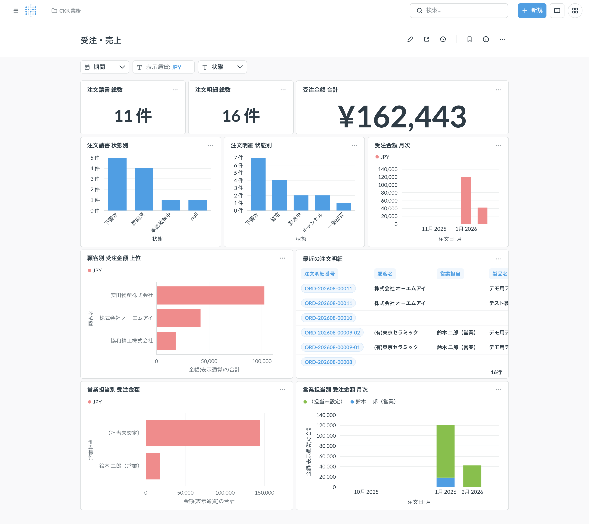
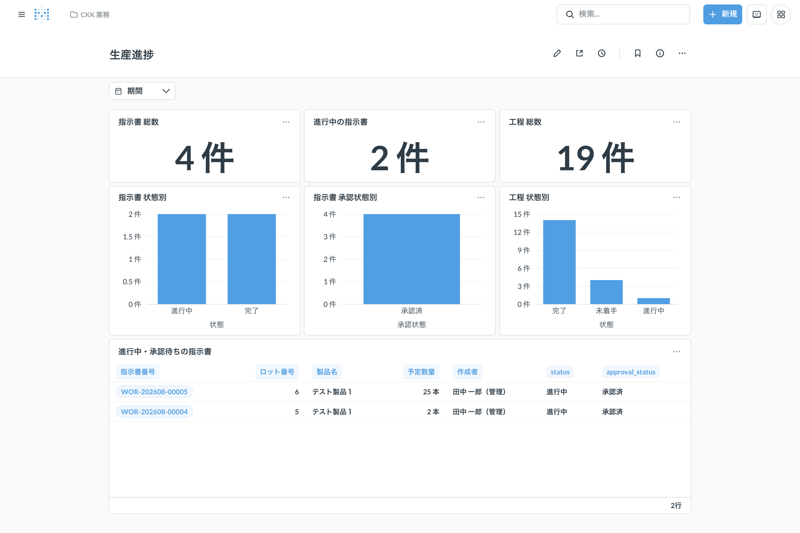
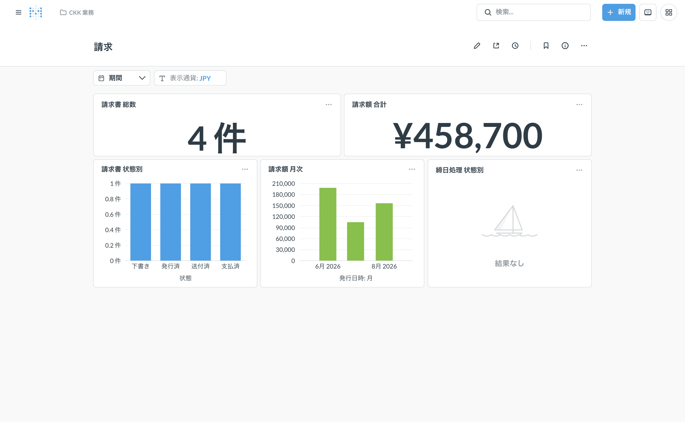
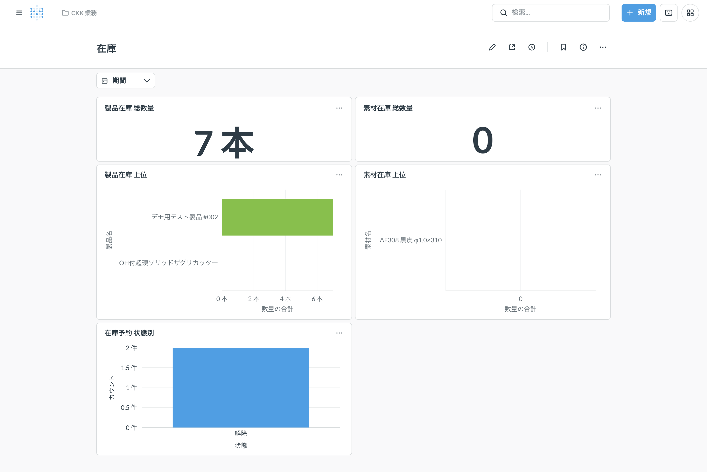
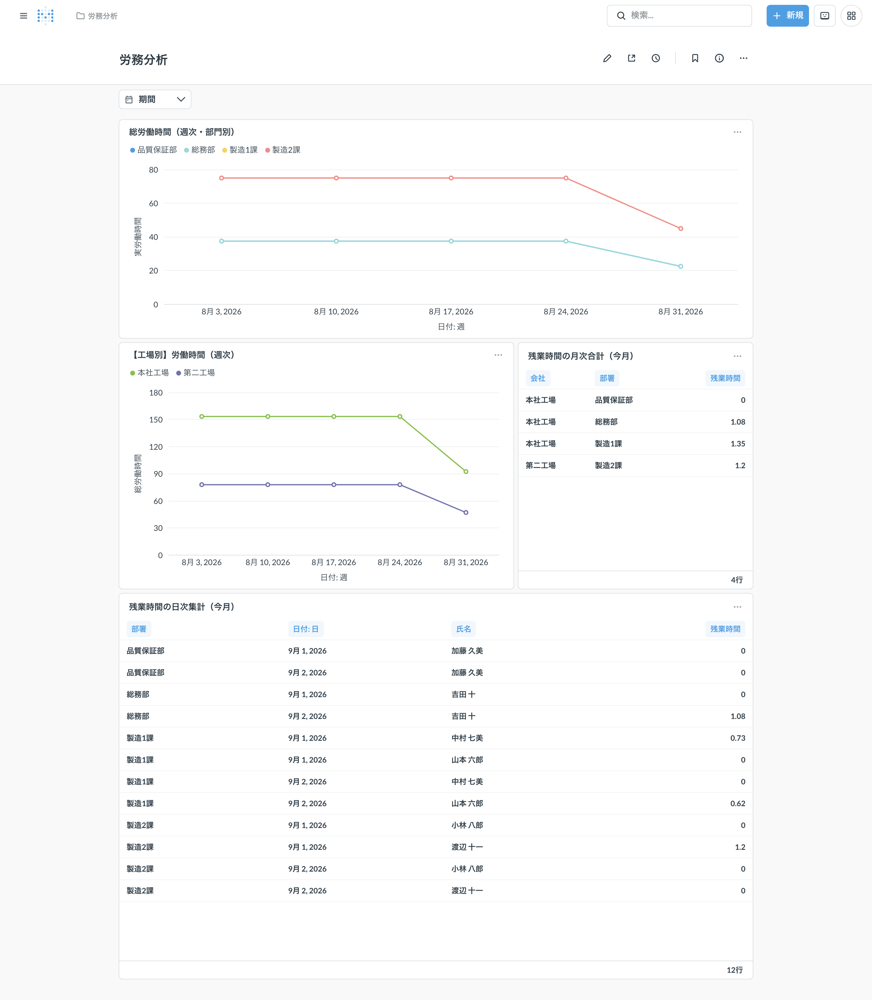

How to use **Metabase**, the analytics tool that turns the data in the business management system into charts and tables you can browse at a glance. It is a separate tool from the main app (the rest of this manual) — it reads the same data and presents it.

> 💡 The screenshots on this page were taken with sample data for illustration. The real screens show your company's actual data. Metabase's own interface (search box, menus, and other chrome outside the content) is in Japanese too.

## What you can do here

- See sales, production, billing, and inventory status together as charts and tables.
- See attendance trends (work hours, overtime) by department or site.
- Filter by date range or status.
- Hover over a chart to see the exact value.

You cannot create new charts or change what you're allowed to see — visibility is managed by Metabase's own permission settings. If you cannot open it, or the data you need is missing, ask a system administrator.

## Opening it

Go to `https://bi.ckk-tool.co.jp` and sign in with your company email address and the same company account password you use elsewhere.

Once signed in, the folder icon at the top left opens two collections:

- **CKK 業務 (Business)** — four dashboards: 受注・売上 (Sales), 生産進捗 (Production), 請求 (Billing), 在庫 (Inventory)
- **労務分析 (Labor analysis)** — one attendance dashboard

## Common controls

### Filtering by period

Every dashboard has a **期間 (Period)** filter at the top. Open it to choose today, this week, this month, the last N days, or a specific date range. Every chart and table below updates to match. Leave it unset to see all periods.

### Switching display currency

受注・売上 (Sales) and 請求 (Billing) have a **表示通貨 (Display currency)** filter. It defaults to JPY. Switching to USD converts the totals using the currency master's exchange rate and shows the dollar-denominated amount instead.

### Filtering by status

受注・売上 (Sales) has two separate filters: **状態（明細） (Line status)** and **状態（請書） (Acceptance status)**. The first is the status of each order line; the second is the status of the order acceptance (the order as received). They are independent, so you can filter on either one on its own.

## 受注・売上 (Sales)

Quote and order performance.

- **注文請書 総数 / 注文明細 総数 (Order acceptance / order line totals)** — counts.
- **受注金額 合計 (Total order amount)** — the total in the selected display currency (cancelled orders excluded).
- **注文請書 状態別 / 注文明細 状態別 (By status)** — counts per status.
- **受注金額 月次 (Monthly order amount)** — the monthly trend.
- **顧客別 受注金額 上位 (Top customers by order amount)**.
- **最近の注文明細 (Recent order lines)** — a table of recent order lines. Clicking an order line number opens its detail page in the main app.
- **営業担当別 受注金額 / 営業担当別 受注金額 月次 (By sales rep, and its monthly trend)**.

## 生産進捗 (Production)

How work orders and their steps are progressing.

- **指示書 総数 / 進行中の指示書 / 工程 総数 (Work order / in-progress / step totals)** — counts.
- **指示書 状態別 / 指示書 承認状態別 / 工程 状態別 (By status)** — counts per status.
- **進行中・承認待ちの指示書 (Active work orders)** — a list of work orders currently in progress or awaiting approval. Clicking a work order number opens its detail page.

## 請求 (Billing)

Invoices and monthly closing status.

- **請求書 総数 / 請求額 合計 (Invoice total / total amount)** — counts and the total in the selected display currency.
- **請求書 状態別 / 締日処理 状態別 (By status)** — counts per status.
- **請求額 月次 (Monthly invoice amount)** — the monthly trend.

## 在庫 (Inventory)

Product and material stock, and reservation status.

- **製品在庫 総数量 / 素材在庫 総数量 (Total product / material quantity)** — summed across every site.
- **製品在庫 上位 / 素材在庫 上位 (Top products / materials by quantity)**.
- **在庫予約 状態別 (By reservation status)** — counts per status.

## 労務分析 (Labor analysis)

Attendance trends (work hours, overtime).

- **総労働時間（週次・部門別） (Total work hours, weekly by department)** — weekly trend per department.
- **【工場別】労働時間（週次） (Work hours, weekly by factory)** — weekly trend per site.
- **残業時間の月次合計（今月） (Monthly overtime total, this month)** — overtime summed per site and department.
- **残業時間の日次集計（今月） (Daily overtime, this month)** — overtime per department, employee, and day. Unlike the other charts here, this one shows individual names, so who can see it is restricted.

This dashboard is the only one where some charts always show "this month" regardless of the filter. The 期間 (Period) filter only affects the two weekly charts (total work hours, by factory).
