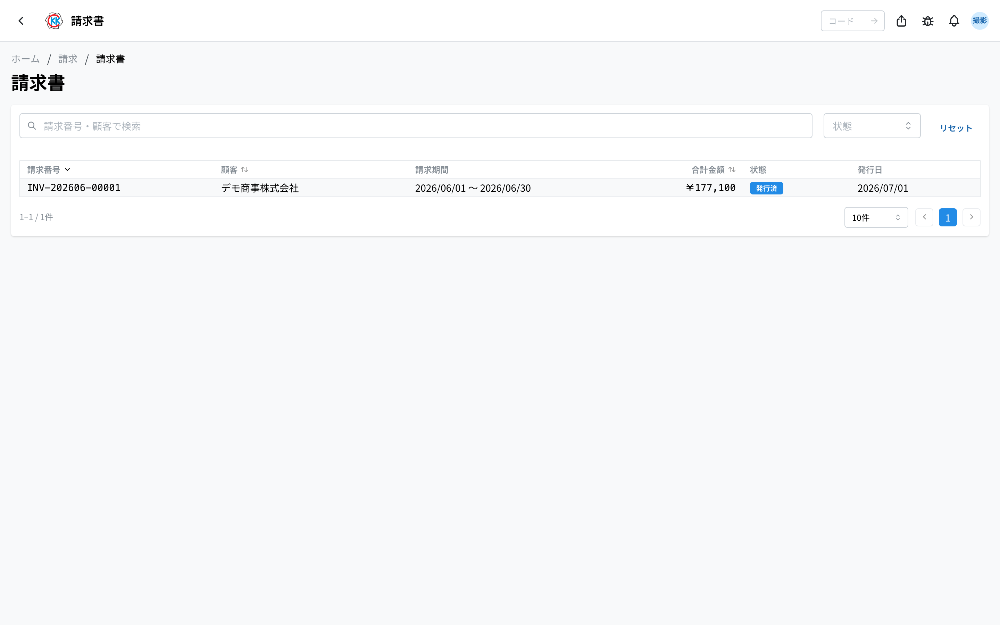
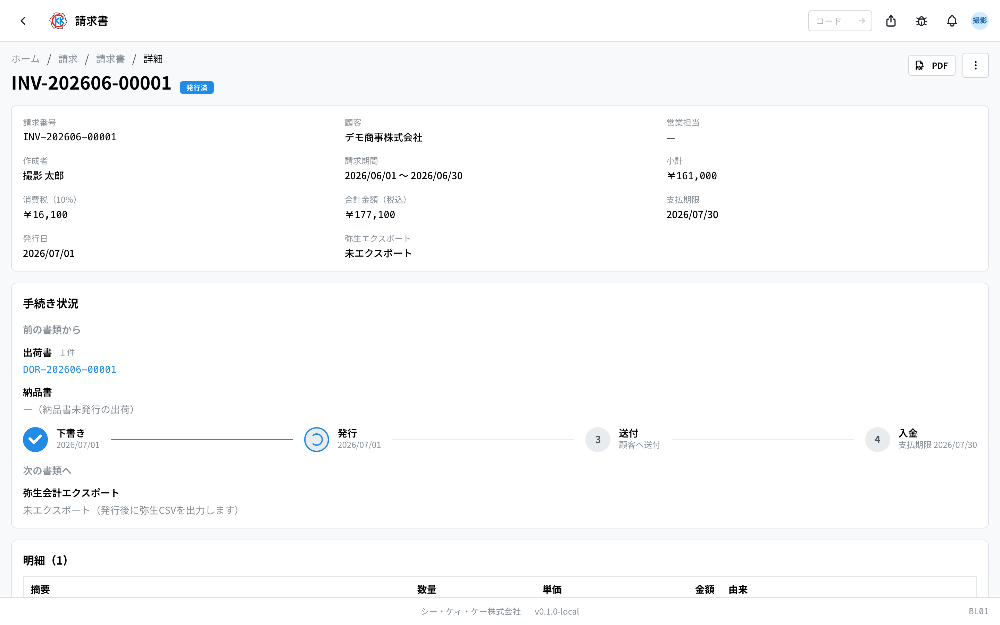
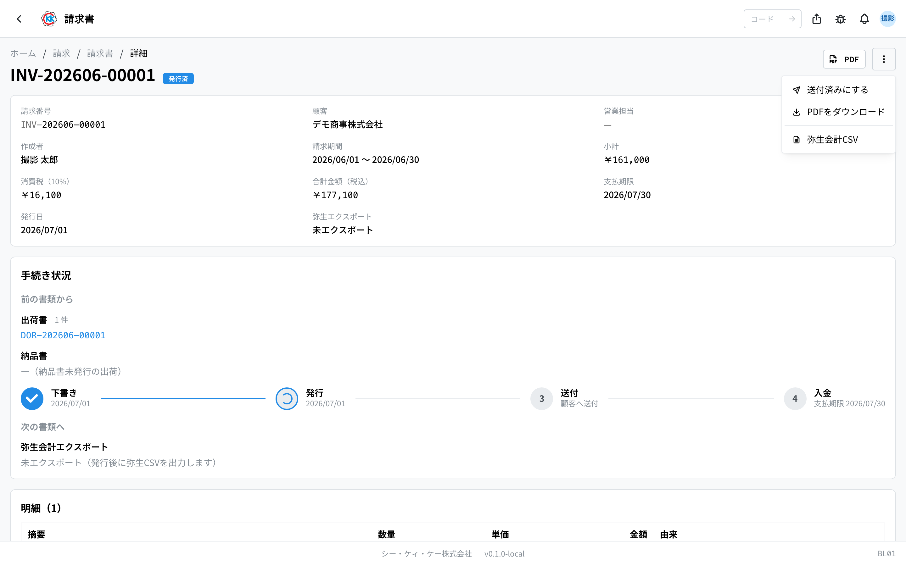
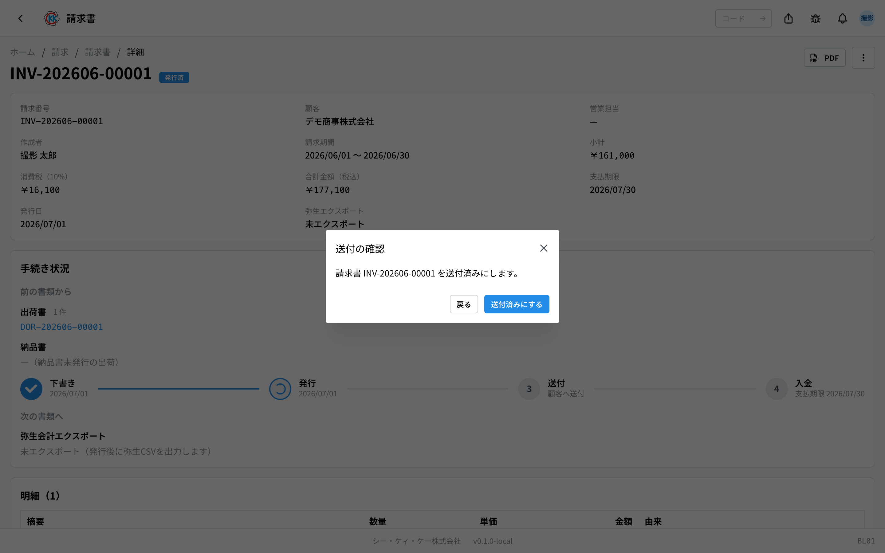

用来确认向客户请款的 **发票**（請求書），并记录发行、寄送、收款全过程的应用。操作代码是 `BL01`。

> ⚠️ 本应用还在准备中。正式启用之前，界面和步骤可能会有变化。

## 本应用能做什么

- 可以确认发票的内容（请款的是什么、多少、多少钱）。
- 可以把发票转成 **PDF**，打印出来或用邮件发出。
- 可以依次记录「已发行」「已寄送」「已收款」。
- 可以下载给会计软件读入的文件。

本应用里没有「新規作成」（新建）按钮。发票是由[结算截止处理](/manual/zh/operations/billing/billing-closing/user)自动做出来的。

## 本页出现的词

- **請求期間（请款期间）** … 把「从什么时候到什么时候发出的部分」合在一起请款，这段期间就是请款期间。
- **小計（小计）** … 加消费税之前的金额。
- **消費税（消费税）** … 对小计征收的税。会按每个客户的规定自动计算。
- **合計金額（税込）（合计金额（含税））** … 小计加上消费税，也就是客户实际支付的金额。
- **支払期限（付款期限）** … 客户应该在什么时候之前付款的日期。
- **由来（来源）** … 表示这一行是从哪张[出货单](/manual/zh/operations/shipping/delivery-order/user)或[送货单](/manual/zh/operations/shipping/delivery-note/user)来的。

## 开始之前

- 发票不能在本应用里做。请先在[结算截止处理](/manual/zh/operations/billing/billing-closing/user)里点「請求書を生成」（生成发票）。
- 发行发票或推进记录，需要发票权限。
- 下载给会计软件用的文件，还需要结算截止处理的导出权限。如果不能用，请联系管理员。

## 界面怎么看

打开应用后，会看到之前做出的发票一览。

- **請求番号（发票号）** … 以 `INV-` 开头的编号，由系统自动编。
- **状態（状态）** … 灰色是「下書き」（草稿），蓝色是「発行済」（已发行），紫色是「送付済」（已寄送），绿色是「支払済」（已付款）。
- 上面的搜索框里可以输入发票号或客户名称来筛选。
- 点一行就能打开这张发票的详细界面。
- 一张都还没有时，会显示「**請求書がありません（締日処理から生成します）**」（没有发票 — 请从结算截止处理生成）。

## 确认内容

上方会显示发票号、客户、请款期间、小计、消费税、合计金额（含税）、付款期限、发行日。

- **支払期限（付款期限）** … 自动填入结算截止日之后、与该客户约定的天数（没有约定时是 30 天）后的日期。
- **弥生エクスポート（弥生导出）** … 做出会计软件用文件的日期时间。还没做时显示「**未エクスポート**」（未导出）。

下面的「明細」（明细）里逐行列出要请款的内容。

- **摘要（摘要）** … 产品名称和批次号。
- **由来（来源）** … 点蓝色文字，可以打开作为依据的[出货单](/manual/zh/operations/shipping/delivery-order/user)或[送货单](/manual/zh/operations/shipping/delivery-note/user)。
- 最下面会显示小计、消费税、合计金额（含税）。

明细下面有四个标签页。「**概要**」（概要）可以看寄给客户的日期时间和备注，「**PDF**」可以看发行后的请求书 PDF，「**メモ**」（备忘）可以留公司内部的共享备忘，「**履歴**」（历史）可以看谁在什么时候推进了这张发票。

> 💡 想确认金额对不对时，从「由来」（来源）的链接打开原来的出货单，就能当场确认什么时候发了多少支。

> 💡 消费税栏会显示适用于该客户的税率：「**消費税（10%）**」（消费税 10%）、「**消費税（8%）**」（8%）或「**消費税（非課税）**」（免税）。税率由客户的登记内容决定。

## 从发行到收款的记录

发票按「下書き」（草稿）→「発行済」（已发行）→「送付済」（已寄送）→「支払済」（已付款）四个阶段推进。这个界面没有编辑功能，操作都在右上角的「**…**」（三个点的按钮）里进行。

### 1. 发行

1. 点「**…**」。
2. 选「**発行**」（发行）。
3. 弹出「発行の確認」（发行确认）后，点「**発行**」（发行）。

当天的日期会记为 **発行日（发行日）**。

### 2. 寄给客户之后

1. 点「**…**」。
2. 选「**送付済みにする**」（标记为已寄送）。
3. 弹出确认界面后，点「**送付済みにする**」（标记为已寄送）。

### 3. 确认收到款之后

1. 点「**…**」。
2. 选「**入金済みにする**」（标记为已收款）。
3. 弹出确认界面后，点「**入金済みにする**」（标记为已收款）。

状态变成「**支払済**」（已付款），这张发票就完成了。

## 打印（PDF）

能看到 PDF 的是 **发行之后**。草稿期间 PDF 还没有生成，「**PDF**」标签页会显示「発行後に PDF を閲覧できます。」（发行后即可查看 PDF）。

发行后，点界面右上角的「**PDF**」，请求书的 PDF 会在新标签页里打开，可以从那里打印或保存。在「**PDF**」标签页里也可以直接在画面中查看。

## 做出会计软件用的文件

可以下载给财务读入会计软件（弥生会計 Next）的文件。

1. 在发票界面点右上角的「**…**」。
2. 选「**弥生会計CSV**」（弥生会计 CSV）。
3. 文件会下载下来，请读入会计软件。

做出之后，详细界面的「**弥生エクスポート**」（弥生导出）栏里会显示日期时间。

## 输入项

本画面没有输入框。请求书**由结算日处理统一生成**，因此无需手动输入金额或明细。

| 操作 | 会发生什么 |
|------|-----------|
| [发行](#field-issue) | 请求书的内容确定下来 |
| [标记为已送付](#field-sent) | 记录已发送给客户 |
| [标记为已收款](#field-paid) | 记录已收到付款 |

### 发行 [#field-issue]

确认内容后确定请求书。请求编号在结算日处理生成请求书时就已经编好。**发行后内容即确定，将无法更改。** 若发现错误，请追溯至原发货或结算日处理进行修正。

### 标记为已送付 [#field-sent]

记录已发送给客户。发送方式（邮件・传真・邮寄）按客户预先设定。

### 标记为已收款 [#field-paid]

记录已收到付款，便于查找未收款的请求书。

金额明细**自动从发货单（已变为「出荷済」的「発送」部分）汇总**。送货单会作为各行的「由来」链接附上。金额不一致时，请确认发货一侧而非本画面。

## 常见问题与困扰

**Q. 找不到「新規作成」（新建）按钮。**
A. 发票不在这个界面做。请打开[结算截止处理](/manual/zh/operations/billing/billing-closing/user)，在对应的行上点「請求書を生成」（生成发票）。

**Q. 想改金额，却没有编辑界面。**
A. 发票不能直接改。应该是作为依据的[出货单](/manual/zh/operations/shipping/delivery-order/user)的内容有问题，请联系财务或营业的负责人。

**Q. 出现「下書きの請求書のみ発行できます」（只有草稿状态的发票才能发行）。**
A. 这张发票已经发行过了。把界面关掉再打开，就能看到现在的状态。

**Q. 出现「発行済みの請求書のみ送付済みにできます」（只有已发行的发票才能标记为已寄送）。**
A. 跳过了步骤。请按「発行（发行）→ 送付済みにする（标记为已寄送）→ 入金済みにする（标记为已收款）」的顺序推进。

**Q. 消费税好像不是按 10% 算的。**
A. 消费税是按每个客户的规定计算的。适用轻减税率的客户是 8%，免税客户是 0%。想改规定时，请修改[客户](/manual/zh/operations/masters/business-partner/user)的登记内容。

**Q. 点了「弥生会計CSV」，文件却没出来。**
A. 可能是没有导出权限。请联系管理员。

<!-- permissions:start -->
## 所需权限

使用本画面需要 **请款单**（`invoice`）权限。

| 想做的事 | 所需权限 |
| --- | --- |
| 打开画面、查看列表与明细 | 请款单 — 查看 |
| 新增・变更・删除 | 请款单 — 创建 / 更新 / 删除 |

仅查看有「查看」即可。画面中若有新增、变更或删除的操作，则分别需要对应的权限。

权限通过角色授予。若不足，请与管理员联系。

权限的整体说明请参见「[权限与角色](../../../permissions)」。
<!-- permissions:end -->
