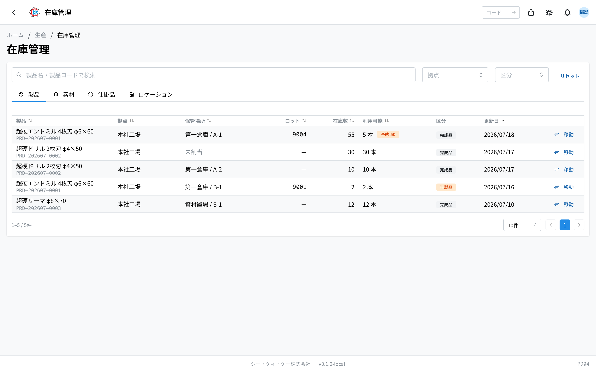
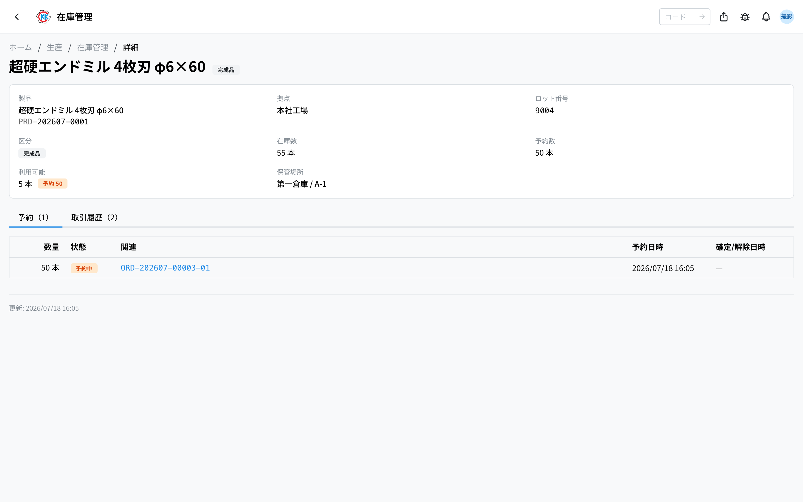
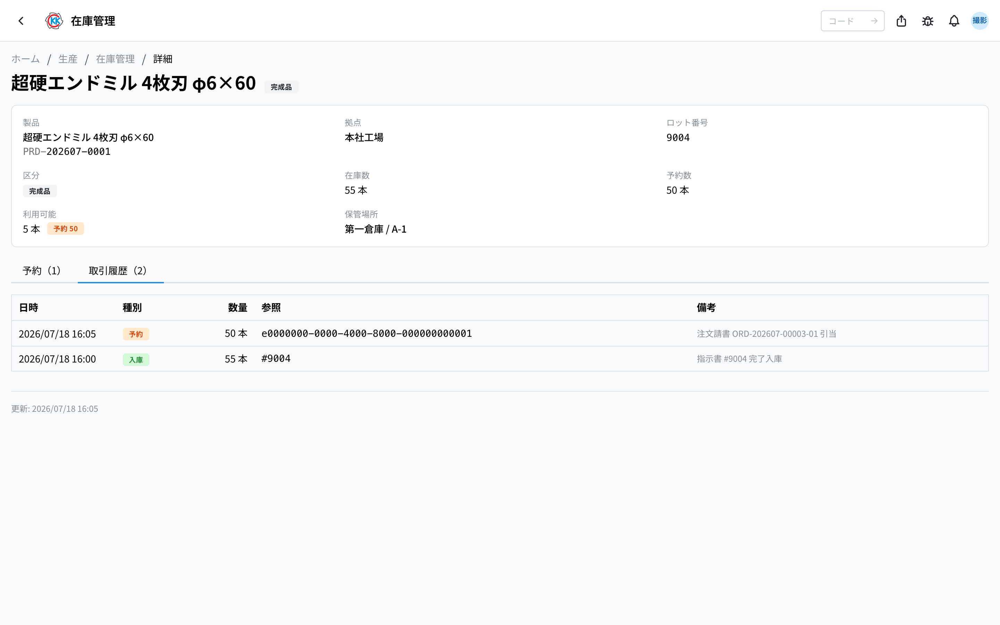
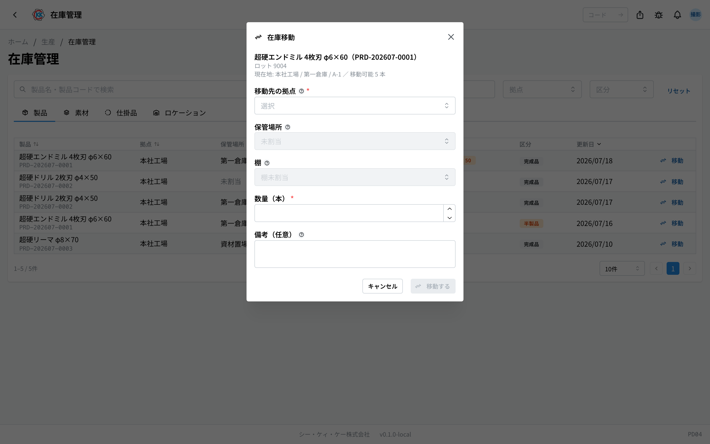
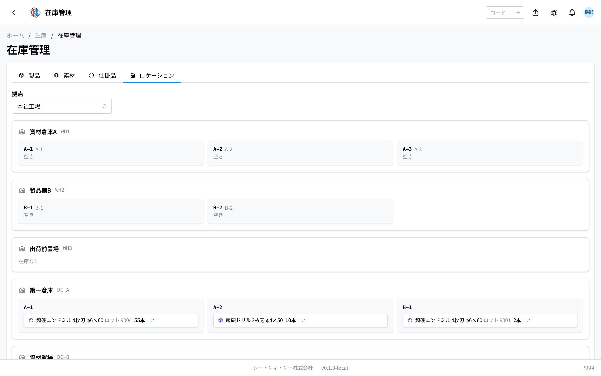

用于确认产品・材料 **在哪些地方各有多少库存** 的应用。变更存放位置时也在这里记录。操作码是 `ST01`。

> ⚠️ 本应用目前 **仅在测试环境** 中可用。在正式投入使用之前，画面和操作步骤可能会有变化。

> 本应用所属的流程……[生产流程](/manual/zh/process/production)

## 本应用可以做什么

- 可以确认已完成的产品・材料，分别在哪个据点的哪个货架上有多少。
- 可以分开确认已预留（占用）的部分和仍可自由使用的部分。
- 材料还可以确认已下单的部分 **何时・会到货多少**。
- 可以确认目前有多少正处于哪张工单的哪道工序中（在制品）。
- 把物品移到别的货架或别的仓库时，可以记录下来。
- 之后可以查看库存变动的记录（何时・什么・多少）。

画面分为 4 个标签。

- **製品**（产品）… 已完成产品和半成品的库存。
- **素材**（材料）… 材料的库存。
- **仕掛品**（在制品）… 目前正在制作中的数量。
- **ロケーション**（位置）… 按 据点 → 存放位置 → 货架 的顺序查看「哪里有什么」的画面。

> 💡 库存数量无法在此直接修改。数量会随日常业务 **自动变动**。此画面能手动进行的操作只有「**在庫移動**」（库存调拨，变更存放位置）。想纠正误差时，请用[棚卸](/manual/zh/operations/inventory/stock-takes/user)（ST05）重新盘点。

> 💡 想从「场所」（据点・货架）的角度以一览表查看「哪里有什么」时，使用[在庫一覧](/manual/zh/operations/inventory/stock-overview/user)（ST02）；想从「品目」的角度按时间顺序查看「这个品目是否够用」时，使用[在庫・所要量](/manual/zh/operations/inventory/stock-requirements/user)（ST03）。这些应用看起来会与本应用重叠，但各自查看的方向不同。

## 术语（本页出现的词语）

- **拠点**（据点）… 工厂或仓库等大范围的场所单位。
- **保管場所 / 棚**（存放位置 / 货架）… 据点内的存放位置。按两层管理，例如「第一仓库」的「A-1」货架。
- **ロット**（批次）… 一批集中制作的产品所带的编号。与工单编号相同。
- **予約（取り置き）**（预留 / 占用）… 为特定订单保留的部分，不能用于其他订单。
- **利用可能**（可用）… 库存中尚未被预留的部分，即实际可用的数量。
- **半製品**（半成品）… 尚未完成阶段就返回库存的物品。
- **仕掛品**（在制品）… 正在制作中的物品，仍处于工序中，尚未成为库存。
- **次回入荷**（下次到货）… 已下单的材料，预计下次到货的日期。

## 库存从哪里增加或减少

库存不是在此画面手动变动的，而是随日常业务操作自动变动。每一次变动都会记录为一张[入出庫伝票](/manual/zh/operations/inventory/inventory-movements/user)（ST04）。

- **产品入库** … [工单](/manual/zh/operations/production/work-order/user)的所有工序完成后，良品会连同批次号一并入库。分配为「半成品」的部分会作为半成品入库。
- **材料入库** … 在[材料到货](/manual/zh/operations/purchasing/material-receipt/user)（PU03）登记到货后，到货据点的库存会增加。
- **被预留** … 在订单明细画面执行「**库存核对**」，或「制造分」的工单获得批准时，所需的部分（产品・材料）会为该订单・工单预留。
- **材料减少** … 该工单的所有工序完成后，预留的材料会作为已使用而减少。
- **产品出库** … 通过[出货单](/manual/zh/operations/shipping/delivery-order/user)出货后，会从库存中扣除，预留也会解除。

## 产品标签的查看方式

- **製品**（产品）… 产品名称和产品编号。
- **拠点**（据点）… 位于哪个据点。
- **保管場所**（存放位置）… 以「场所名 / 货架编号」的形式显示。尚未确定存放位置的显示为「**未割当**」（未分配）。
- **ロット**（批次）… 该库存的批次号。
- **在庫数**（库存数）… 实际拥有的数量。
- **利用可能**（可用）… 其中可自由使用的数量。有预留时会附带「予約 50」（预留 50）之类的徽章。
- **区分**（类别）… 「**完成品**」（成品）或「**半製品**」（半成品）。
- **移動**（移动）… 变更存放位置时按的按钮。
- 可在上方搜索栏中输入产品名或产品编号进行查找，也可用「**拠点**」「**区分**」缩小范围。
- 点击行即可打开该库存的详情画面。

### 查看产品的详情画面

点击行即可打开该库存 1 条记录的详情画面。

上方会并列显示产品・据点・批次号・类别・库存数・预留数・可用数・存放位置。若为半成品，还会显示「**発生工程**」（产生工序，即来自哪张工单的哪道工序）。

下方有 2 个标签：

- **予約**（预留）… 占用该库存的订单一览。状态按「**予約中**」（预留中）→「**確定**」（已确定）→「**解除**」（已解除）推进。也可确认相关的订单明细编号・工单编号。
- **取引履歴**（交易历史）… 库存变动的记录（参见下方「交易历史」）。

## 材料标签的查看方式

- **素材**（材料）… 材料编号和名称。
- **拠点**（据点）… 位于哪个据点。
- **保管場所**（存放位置）… 以「场所名 / 货架编号」的形式显示。尚未确定的显示为「**未割当**」（未分配）。
- **在庫数**（库存数）… 实际拥有的数量（附带单位显示）。
- **利用可能**（可用）… 其中未被预留、实际可用的数量。
- **次回入荷**（下次到货）… 已下单材料预计下次到货的日期。
- **移動**（移动）… 变更存放位置时按的按钮。
- 可在上方搜索栏中输入材料编号或材料名进行查找，也可用「**拠点**」缩小范围。
- 点击行即可打开该材料库存的详情画面。

### 查看材料的详情画面

点击行即可打开该材料 1 条记录的详情画面。上方会显示材料・据点・库存数・预留数・可用数・下次到货・存放位置・备注。

下方有 2 个标签：

- **ATP タイムライン**（ATP 时间轴）… 从「现在能用多少」出发，逐步加上预计到货量，按日期顺序排列，展示 **何时能用多少** 的表格。
  - **時点**（时点）… 最上面一行是「**現時点**」（当前）。下面是预计到货日期。未确定到货日的显示为「**未定**」。
  - **入荷量**（到货量）… 当天预计到货的数量。
  - **利用可能**（可用）… 该日之后可用的数量（累加此前的到货量）。
  - **参照**（参照）… 来源的订购单编号。

  某一天的「利用可能」显示为 **红色（负数）** 时，表示到那个时点为止数量不够 —— 已预留的部分超过了现有库存加预计到货量之和，可作为考虑下单的提示。想更详细地了解「这个材料何时会不够用」，可在[在庫・所要量](/manual/zh/operations/inventory/stock-requirements/user)（ST03）中查看包含过往历史的同类表格。
- **取引履歴**（交易历史）… 材料变动的记录（参见下方「交易历史」）。

## 在制品标签的查看方式

按工单和工序排列，展示目前正在制作中的数量的画面。

- 按产品汇总，会显示「計 51」（合计 51）之类的合计数。
- 下方并列显示「**指示書番号**」（工单编号）「**工程**」（工序）「**仕掛数**」（在制数）。
- 点击工单编号即可打开该[工单](/manual/zh/operations/production/work-order/user)的画面。
- 没有进行中的工单时，会显示「**進行中の仕掛品はありません**」（没有进行中的在制品）。

> ⚠️ 在制品尚不是库存。只有当工单的所有工序都完成后，才会实际计入库存。产品标签中不会显示在制品。

## 交易历史

产品和材料的详情画面都有「取引履歴」（交易历史）标签，列出库存变动的记录（日期时间・种类・数量・参照・备注）。

「**種別**」（种类）共有以下 5 种：

- **入庫**（入库）… 库存增加时。
- **出庫**（出库）… 库存减少时。
- **予約**（预留）… 为订单而被占用时。
- **予約解除**（解除预留）… 占用被解除时。
- **棚卸調整**（盘点调整）… 因盘点而调整数量时。

进行库存调拨时，会留下移出方的「出库」和移入方的「入库」两行记录，从中都能追溯到所属的[入出庫伝票](/manual/zh/operations/inventory/inventory-movements/user)（ST04）。

## 变更存放位置（库存调拨）

把物品移到别的货架或别的仓库时，用此操作记录。产品和材料的步骤相同。

1. 按下一览行右侧的「**移動**」（移动）按钮（也可以从位置标签中的库存标签处按下）。
2. 会打开「库存调拨」画面，上方显示「现所在地」和「可移动」的数量。
3. 选择「**移動先の拠点**」（移动目标据点）。
4. 选择「**保管場所**」（存放位置）。
5. 选择「**棚**」（货架）。
6. 在「**数量**」中输入要移动的数量。
7. 如有需要，填写「**備考**」（备注）。
8. 按下「**移動する**」（执行移动）。

> ⚠️ 已预留的部分无法调拨。可输入的数量上限为「利用可能」（可用）的数量。产品数量不能输入小数。

此操作不会自动发生 —— 与[手動入出庫](/manual/zh/operations/inventory/goods-movement/user)（ST06）一样，是少数需要由人在现场选择执行的操作之一（库存调拨是无需选择移动类型的专用入口）。

## 位置标签的查看方式

以「场所」形式查看「哪里有什么」的画面。

- 在上方选择「**拠点**」（据点）后，会并列显示该据点的 **存放位置卡片**（名称和编号）。
- 卡片中并列着 **货架格子**，显示其中的物品和数量。空货架显示为「**空き**」（空）。
- 已确定存放位置但未确定货架的库存会归入「**棚未割当**」（货架未分配）框中，连存放位置都未确定的库存会归入「**未割当（保管場所なし）**」（未分配・无存放位置）框中。
- 若该据点已登记楼层地图（据点平面图）并放置了存放位置的图钉，还会显示 **楼层地图**。点击图钉，画面会滚动并高亮显示对应的卡片。
- 该据点没有任何内容时，会显示「この拠点には保管場所も在庫もありません」（该据点没有存放位置也没有库存）。

存放位置和货架本身的登记在[保管場所](/manual/zh/operations/masters/storage-location/user)中进行。

使用本应用需要库存权限。

## 输入项目

库存管理基本上是**用于查看的画面**，只有在把库存移到别处时才需要输入。

| 项目 | 必填 | 填什么 |
|------|------|--------|
| [移动目标据点](#field-plant) | 必填 | 移到哪里 |
| [存放位置 / 货架](#field-location) | 选填 | 放在据点内的哪个位置 |
| [数量](#field-quantity) | 必填 | 要移动的数量 |
| [备注](#field-notes) | 选填 | 移动的原因等 |

### 移动目标据点 [#field-plant]

要移到哪个据点。**移出方的库存会减少，移入方的库存会增加。**

### 存放位置 / 货架 [#field-location]

在移动目标据点内放在哪个位置。事先确定好，之后更容易找到实物。

### 数量 [#field-quantity]

要移动的数量。不能超过移出方现有的数量。

### 备注 [#field-notes]

用于记录移动原因等信息的栏位。移动记录会保留在历史中。

## 常见问题・遇到困难时

**Q. 我想手动修正库存数量。**
A. 此画面能做的只有「库存调拨」（变更存放位置）。数量出现偏差时，需要用[棚卸](/manual/zh/operations/inventory/stock-takes/user)（ST05）重新盘点并调整。

**Q.「利用可能」（可用）显示为 0，但「在庫数」（库存数）有数值。**
A. 那部分正被预留（占用）给其他订单。打开「予約」（预留）标签即可确认被预留给了哪个订单。

**Q. 预留数比库存数还多，这不是有问题吗？**
A. 并非异常。即使库存不足，工单也可以获得批准，此时会预留所需的数量。数量不足正是「需要下单」的信号。可在材料详情画面的 ATP 时间轴中确认到货后是否够用。

**Q. 尝试调拨库存时，无法输入想要的数量。**
A. 只能调拨到「利用可能」（可用）的数量为止。已预留的部分无法移动。

**Q. 存放位置显示为「未割当」（未分配）。**
A. 因工单完成等原因自动入库的库存，一开始存放位置是未确定的。实际放到货架上后，请用「移动」记录位置。

**Q. 正在制作中的产品没有出现在「製品」（产品）标签中。**
A. 正在制造中的数量尚未成为库存，可在「**仕掛品**」（在制品）标签中确认。所有工序完成后才会计入库存。

**Q.「次回入荷」（下次到货）一栏为空。**
A. 该材料没有已下单的材料订购单。未下单的情况下不会显示预计到货信息。

**Q. 位置标签中什么都没显示。**
A. 该据点尚未登记存放位置，或没有库存。存放位置的登记请咨询管理员。

**Q. 本应用与[在庫一覧](/manual/zh/operations/inventory/stock-overview/user)（ST02）有什么区别？**
A. 两者查看的是同样的库存，只是方向不同。本应用按物品种类（产品・材料・在制品・位置）分开查看，库存一览则以一张一览表按「哪里有什么」来查看。想跨场所快速清点时，请使用库存一览。

## 库存的其他应用

本画面用于查看「现在什么东西在哪里」。重新计数、手动移动、追溯移动记录都是别的应用。

- [在庫一覧](/manual/zh/operations/inventory/stock-overview/user)（`ST02`）… 从据点・存放位置・货架的角度查看的一览表。寄存在外协的部分也在这里查看。
- [在庫・所要量](/manual/zh/operations/inventory/stock-requirements/user)（`ST03`）… 按时间顺序查看单个品目「即将增加・减少」的数量。
- [入出庫伝票](/manual/zh/operations/inventory/inventory-movements/user)（`ST04`）… 库存变动的记录。可以追溯何时・什么・移动了多少。
- [棚卸](/manual/zh/operations/inventory/stock-takes/user)（`ST05`）… 重新盘点并与账面数对齐。
- [手動入出庫](/manual/zh/operations/inventory/goods-movement/user)（`ST06`）… 人工入库・出库・移动。
- [移動タイプ](/manual/zh/operations/inventory/movement-types/user)（`ST09`）… 管理手动出入库中选择的分类。

> 💡 **库存一旦变动，就一定会生成一张[入出庫伝票](/manual/zh/operations/inventory/inventory-movements/user)。** 本画面的「移动」也是一样，每次移动都会留下记录。

> ⚠️ **寄存在外协的部分不计入本画面的数量。** 不在手头的东西不算作自己的库存。寄存的部分请从[在庫一覧](/manual/zh/operations/inventory/stock-overview/user)的「寄存方」中确认。

<!-- permissions:start -->
## 所需权限

使用本画面需要 **库存**（`inventory`）权限。

| 想做的事 | 所需权限 |
| --- | --- |
| 打开画面、查看列表与明细 | 库存 — 查看 |
| 新增・变更・删除 | 库存 — 创建 / 更新 / 删除 |

仅查看有「查看」即可。画面中若有新增、变更或删除的操作，则分别需要对应的权限。

权限通过角色授予。若不足，请与管理员联系。

权限的整体说明请参见「[权限与角色](../../../permissions)」。
<!-- permissions:end -->
