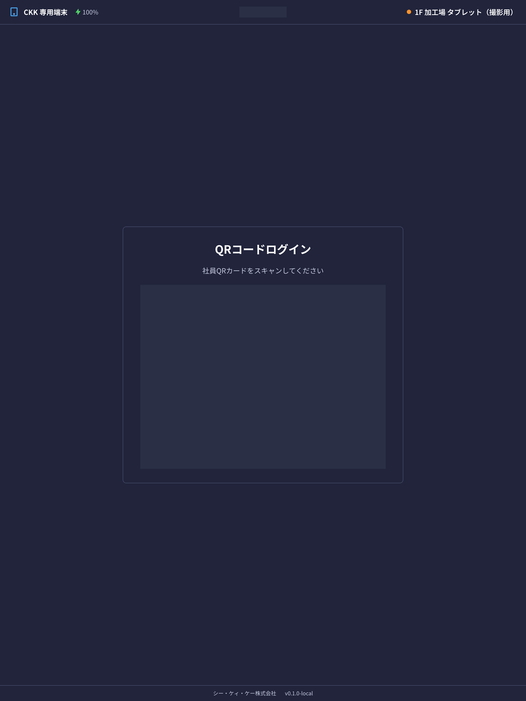
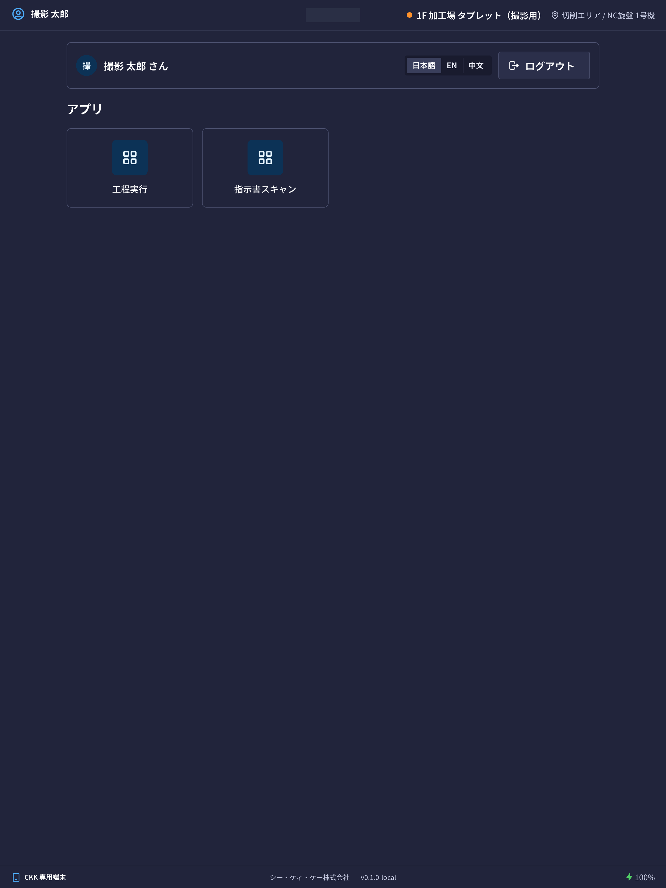

这里介绍放在工厂里的 **共用平板**（现场终端）的使用方法。不是电脑，而是固定放在作业现场的平板。

## 这台平板能做什么

- 可以确认分配给自己的 **今天的作业（工序）**。
- 可以扫描指示书上的二维码，打开该指示书的工序。
- 可以记录作业的 **开始、暂停、完成**。
- 可以输入做了几根、出了几根不良品。
- 可以留下检查记录。

电脑上的画面（报价单、库存等）不会在这里出现。这是只用于现场作业记录的画面。

## 本页出现的词语

- **QRカード**（QR 卡）… 类似员工证的卡片。刷这张卡登录。
- **PIN**（密码）… 只有自己知道的 4 位以上的密码。
- **端末**（终端）… 指平板本体。只有管理员登记过的平板才能使用。
- **工程**（工序）… 「切断」「段加工」「检查」等作业的一个步骤。

## 开始之前

- 需要 **自己的 QR 卡**。没有的话，请让管理员发放。
- 只能使用 **管理员登记过的** 平板。画面上出现「この端末は登録されていません」（本终端未登记）时，请联系管理员。
- 第一次使用时，要 **自己设定并登记 PIN**（在下面的步骤中会有提示）。

准备全新平板的步骤（安装应用、登记用 QR 码）在面向管理员的[内部文档](/admin-manual/zh/system/kiosk-device-setup)中（需要登录并具有权限才能阅读）。

## 登录

1. 确认平板画面上显示「**社員QRカードをスキャンしてください**」（请扫描员工 QR 卡）。
2. 把卡上的 QR 码对准画面上的框。稍微拿远一点、在明亮的地方刷卡更容易读取。

3. 卡被读取后，会切换到 **PIN 输入画面**。用画面上的数字按钮输入 PIN。
4. 第一次使用这张卡时，要新设定一个 PIN 并输入两次（为了确认，需要再输入一次相同的数字）。

登录成功后，会显示可以使用的应用列表。

> 💡 如果是平时常用的平板，在一段时间内只刷卡就能登录。但是 **第一次使用的平板一定会要求输入 PIN**。另外，即使一直在使用，**每 2 周也需要输入一次 PIN**。

> ⚠️ **连续输错 5 次 PIN**，这张卡会 **15 分钟** 无法使用。请过一段时间再试。着急时可以请管理员重置 PIN。

## 画面的看法

最上方的横条会显示以下内容。

- 左侧 … 这台平板的名称（例如「1F 加工場 タブレット」）和剩余电量。
- 中间 … 当前的日期和时间。
- 右侧 … 通信状态。显示橙色或红色时，可能是信号没有连上。

在应用列表画面，可以在右上角切换**画面语言**（日本語 / English / 中文）。切换语言不会改变记录的内容。

## 开始作业

应用列表中有以下 2 个应用。

- 「**工程実行**」（工序执行）… 打开分配给自己的作业列表。使用方法请参见[工序记录](/manual/zh/operations/kiosk/steps/user)。
- 「**指示書スキャン**」（指示书扫描）… 用摄像头读取印在指示书上的二维码（也可以手动输入编号），该指示书的 **全部工序** 会按工序顺序显示出来。选择某道工序，就会打开与「工程実行」相同的记录画面。分配给其他人的工序会显示「**他の担当者の工程です**」（这是其他负责人的工序），只有那个人才能操作。

## 使用结束后

- 点击应用列表画面右上角的「**ログアウト**」（退出登录）。
- 即使忘记点击，**一段时间不操作后也会自动退出登录**。请下一个人用自己的卡登录。

> ⚠️ 这是共用的平板。**自己的作业结束后请退出登录**。如果一直保持登录状态，下一个人的作业会被记录成你的名字。

## 输入项

| 项目 | 必填 | 填什么 |
|------|------|--------|
| [QR 卡片](#field-card) | 必填 | 出示本人的卡片 |
| [密码（PIN）](#field-pin) | 条件必填 | 本人设定的数字 |
| [语言](#field-language) | — | 画面显示的语言 |

### QR 卡片 [#field-card]

将本人的卡片贴近平板的摄像头。卡片**按人发放**，请勿使用他人的卡片 — 记录会留在该人名下。

### 密码（PIN） [#field-pin]

本人设定的数字。以下情况必定会被询问。

- 在**该设备上首次**使用卡片时
- 距上次输入 PIN 已过 **2 周**时

若均不适用，仅贴近卡片即可进入。**连续输错 5 次将锁定 15 分钟。** 若遗忘，请让管理员重置。

### 语言 [#field-language]

画面显示的语言，可选日语、英语、中文。

## 常见问题・遇到困难时

**Q. 刷卡没有反应。**
A. 请确认 QR 码是否有污渍、是否进入了画面上的框内。在昏暗的地方可能不容易读取。如果仍然不行，可能是卡已过期或已停用，请与管理员确认。

**Q. 出现「カードが無効です。管理者に確認してください。」（卡无效，请与管理员确认）。**
A. 该卡已被停用，或者还没有分配给任何人。请联系管理员。

**Q. 忘记 PIN 了。**
A. 自己无法找回。请让管理员重置 PIN。重置后，下次登录时可以设定新的 PIN。

**Q. 每次都要求输入 PIN。**
A. 第一次使用该平板时、有一段时间（超过 48 小时）没有使用该平板时、距离上次输入 PIN 已超过 2 周时，都需要输入 PIN。

**Q. 别人一直保持着登录状态。**
A. 等一段时间会自动退出登录。着急时，请让那个人退出登录。

**Q. 画面上出现「この端末は登録されていません」（本终端未登记）。**
A. 该平板还没有登记，或者登记已被解除。请联系管理员。
