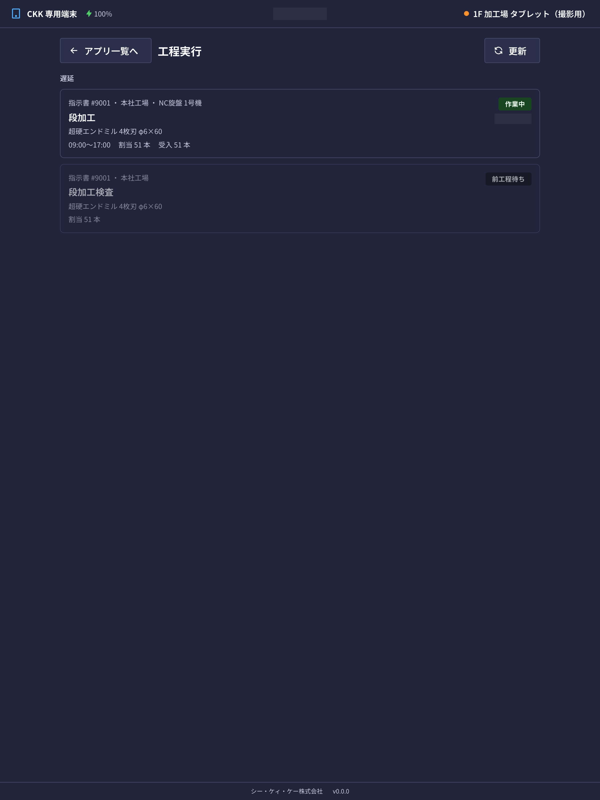
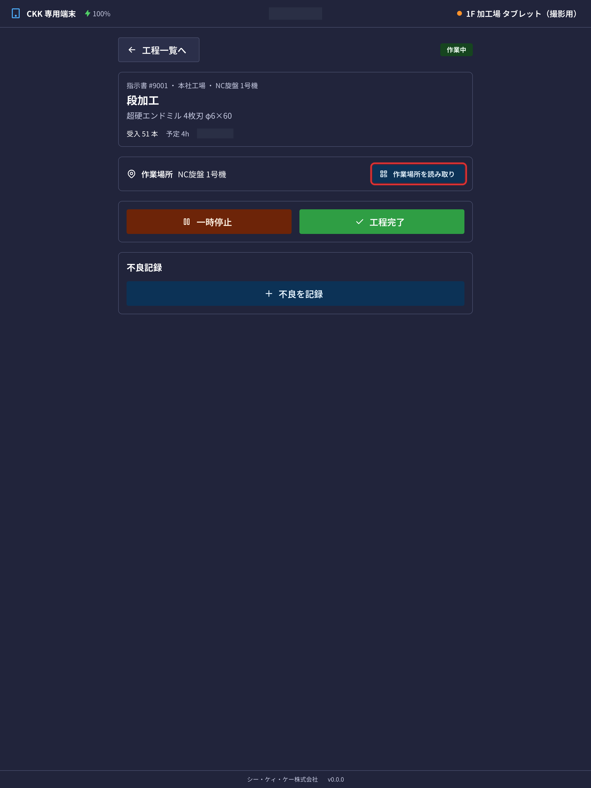

在平板的「**工程実行**」（工序执行）中，可以确认分配给自己的作业，并记录开始和完成。

## 本应用能做什么

- 可以确认今天要做的作业（工序）列表。
- 可以记录作业的 **开始、暂停、继续、完成**。
- 可以输入接收了几根，以及出了多少不良（良品数会自动计算）。
- 出现不良品时，可以留下种类、根数和详情。
- 在检查工序中，可以记录测量值和合格与否。

## 本页出现的词语

- **指示書**（制造指示书）… 说明「做哪种产品、做几根」的作业指示。会带有类似 `#9001` 的编号。
- **受入数**（接收数）… 进入该工序的根数。
- **良品数**（良品数）… 可以顺利交给下一道工序的根数。
- **前工程待ち**（等待前道工序）… 因为前一道作业还没结束，所以还不能开始的状态。

## 画面的看法

作业会分成 3 个部分显示。

- **遅延**（延误）… 已经超过预定日期的作业。请先从这里处理。
- **本日**（今天）… 今天的预定。
- **予定**（预定）… 更后面日期的作业。

每张卡片上会排列显示指示书编号、据点、工序名称、产品名称、分配的根数。右上角的标签表示当前状态。

- **開始可**（可开始）… 可以立即开始。
- **前工程待ち**（等待前道工序）… 前一道作业还没结束，无法开始。
- **作業中**（作业中）… 正在作业中。
- **一時停止中**（暂停中）… 已中断。点击「再開」（继续）可以从中断处继续。
- **◯◯ さんが作業中**（◯◯ 正在作业）… 其他人正在推进该工序。在那个人完成或暂停之前无法操作。
- **完了**（已完成）… 已经结束的作业。
- **キャンセル**（取消）… 被取消的作业。

> 💡 已完成的作业可以用「**完了した工程を隠す**」（隐藏已完成的工序）从列表中隐藏。显示条数太多时可以使用。

## 开始作业

1. 从列表中点击想开始的作业卡片。
2. 点击画面下方的「**工程開始**」（开始工序）。
3. 在「工程を開始」（开始工序）画面中确认 **受入数**（接收数，进入该工序的根数）。会预先填入从前一道工序继承的数量。
4. 与实际数量不同时，请修改数字。
5. 出现「**ロット/伝票コード**」（批次/单据编码）栏的工序，请输入材料批次或单据的编码（「必填」的工序不输入就无法开始；「选填」的话留空也可以）。输入的编码会在工序卡片上显示为「ロット ◯◯」（批次 ◯◯）。
6. 点击「**開始する**」（开始）。

开始后状态会变成「作業中」（作业中），并开始计算作业时间。

> 💡 也可以同时推进多道工序。同时推进期间的实际工时，会**按同时作业的工序数平分**记录到各道工序上（例如同时做 2 道，这段时间各算一半）。

## 中途停止・继续

- 午休等需要中断时，点击「**一時停止**」（暂停）。作业时间的计算会停止。
- 想继续时，点击「**再開**」（继续）。

即使暂停，此前的作业时间也会保留。可以多次停止和继续。

## 记录作业场所

工序画面上有「**作業場所**」（作业场所）栏，**在哪台机器・哪个区域作业**会被记录到作业实绩中。

- 平时不需要任何操作。**开始・恢复时，会自动记录该平板设置的默认作业场所**
- 在其他机器作业时，请按「**作業場所を読み取り**」（扫描作业场所），用相机扫描机器上贴的**作业场所二维码标签**。当前作业的场所会变为扫描到的场所
- 开始前先扫描的话，开始的同时就会记录该场所

> ⚠️ 显示「**この工程では使用できない作業場所です**」（此工序不能使用该作业场所）时，表示该工序限定了可使用的场所（由管理员在工序主档中设置）。请确认二维码所在的机器是否是该工序的对象。
>
> ⚠️ 显示「**この端末の作業場所ではこの工程を実行できません**」（该终端所在的作业场所无法执行此工序）时，表示该平板所在的场所不能执行此工序。请确认画面上显示的**可执行的作业场所**（及其终端），并到该终端上作业。

## 结束作业

1. 点击画面下方的「**工程完了**」（工序完成）。
2. 在「工程を完了」（完成工序）画面中确认 **良品数**（良品数，可以交给下一道工序的根数）。良品数会用接收数减去不良品合计 **自动计算**（显示为「自動計算」）。需要输入的只有不良。
3. 出现不良品时，点击「**不良を追加**」（添加不良），每一行填写以下内容。
   - **種別**（类别）… 半製品（半成品）・廃棄（报废）・工程分岐（工序分支，返修等转到其他工序的部分）之一
   - **不良種類**（不良种类，必填）… 从事先登记的不良种类中选择
   - **本数**（根数）
   - **詳細**（详情，必填）… 用文字写明是什么样的不良
4. 点击「**完了する**」（完成）。

> ⚠️ 不良品合计超过接收数时，会显示「**不良の合計（n）が受入数（n）を超えています**」（不良合计（n）超过了接收数（n）），无法完成。请重新核对根数。另外，不良的行中如果没有填种类或详情，会显示「**不良の各行に種類と詳細を入力してください**」（请在不良的每一行中输入种类和详情）。请填满所有行后再完成。

## 检查工序

在检查工序中，完成之前要输入检查记录。

1. 在「**検査記録**」（检查记录）栏中输入「**検査数**」（检查数）和「**合格数**」（合格数）。
2. 按项目输入 **実測値**（实测值）。只要在规定的范围内，合格与否会 **自动判定**。
3. 无法自动判定的项目，请自己选择「合格」（合格）或「不合格」（不合格）。
4. 点击「**検査記録を保存**」（保存检查记录）。

## 输入项

询问的数量因工序种类而异。不记录数量的工序仅有开始与完成。

| 项目 | 必填 | 填什么 |
|------|------|--------|
| [接收数 / 检查数](#field-input) | 必填 | 实际到手的数量 |
| [批次/单据编码](#field-lot) | 条件必填 | 材料批次・单据的编码 |
| [良品数 / 合格数](#field-success) | 自动计算 | 可交给下一工序的数量（无需输入） |
| [不良明细](#field-defects) | 条件必填 | 每条不良的类别・不良种类・根数・详情 |
| [不良理由](#field-reasons) | 条件必填 | 不良每一行的不良种类和详情 |
| [检查记录](#field-inspection) | 条件必填 | 检查表的实测值 |

### 接收数 / 检查数 [#field-input]

**开始工序时**输入的实际到手数量。系统会预填上一工序的良品数。若实际到手数量不同，**请改为实际数量。**

### 批次/单据编码 [#field-lot]

**开始工序时**输入的材料批次或单据的编码。每道工序设定为「必填」「选填」「无」之一，必填的工序不输入就无法开始。输入的编码会在工序卡片上显示为「ロット ◯◯」（批次 ◯◯）。

### 良品数 / 合格数 [#field-success]

可交给下一工序的数量。**不需要自己输入** — 系统会自动计算并显示接收数减去不良合计后的数量。

### 不良明细 [#field-defects]

把未成为良品的部分逐条填写的列表，每条一行。每行输入 **类别**・**不良种类**（必填）・**根数**・**详情**（必填）。类别为以下 3 种。

- **半成品** — 无法成为产品，但作为库存保留的部分
- **废弃** — 丢弃的部分
- **工序分支** — 返工等转往其他工序的部分

按类别的合计和对库存的反映会根据这个列表自动计算。唯一的条件是**不良合计不能超过接收数**，超过时画面会显示警告（良品数为接收数减去不良合计后的数量）。

### 不良理由 [#field-reasons]

指在不良的每一行中输入的 **不良种类** 和 **详情**。以前是单独的栏位，现在已合并到不良明细列表中。任何一行不选不良种类、不写详情，都无法完成工序。日后回顾原因时可以作为线索。

### 检查记录 [#field-inspection]

检查工序需按检查表的各项目输入实测值。**超出允许范围将自动判为不合格。** 抽样检查时，所需样本数会显示在画面上。

---

暂停后会记录至此为止的作业时间，并使该工序可由他人接手。恢复后将再次以本人名义继续记录。

## 常见问题・遇到困难时

**Q. 列表里什么都没有。**
A. 显示「**本日の担当工程はありません**」（今天没有负责的工序）时，说明今天没有分配给你的作业。分配由办公室（指示书的负责人）进行。

**Q. 显示「前工程待ち」（等待前道工序）无法开始。**
A. 前一道工序还没有完成。等做前一道作业的人完成后就可以开始了。

**Q. 接收数与实际不符。**
A. 请在开始时修改数字。填入的只是从前一道工序继承的初始值，改成实际接收到的根数没有问题。

**Q. 不小心点了完成。**
A. 在平板上无法取消。请联系办公室的负责人（由电脑一侧处理）。

**Q. 中途画面关掉了。**
A. 记录还在。重新登录后打开同一道工序，仍然是「作業中」（作业中），可以从中断处继续操作。
