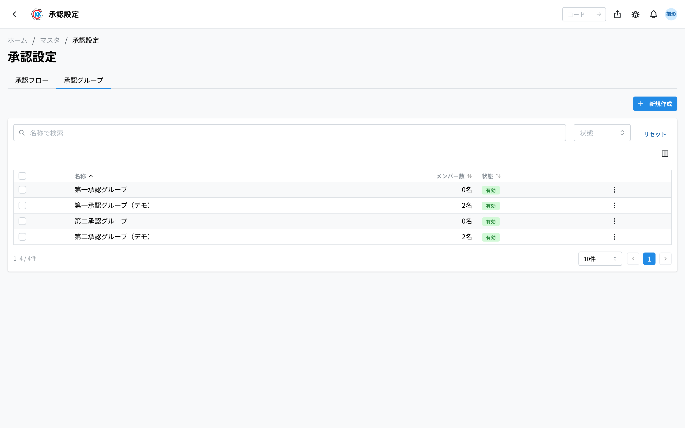
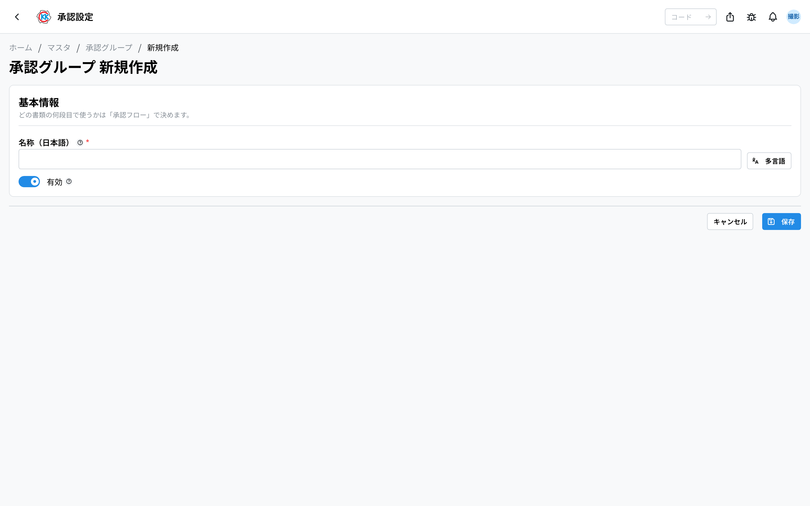
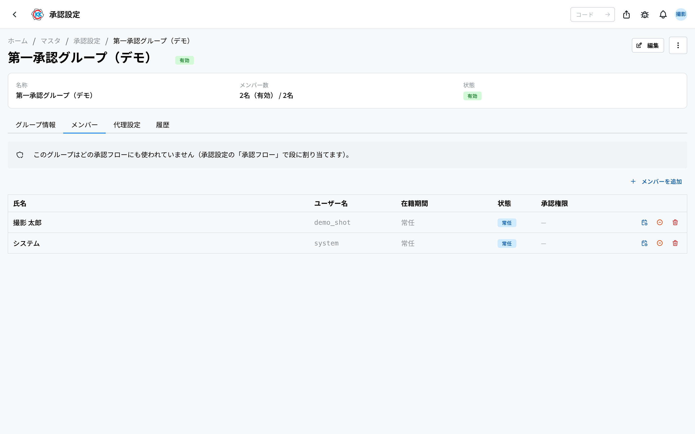
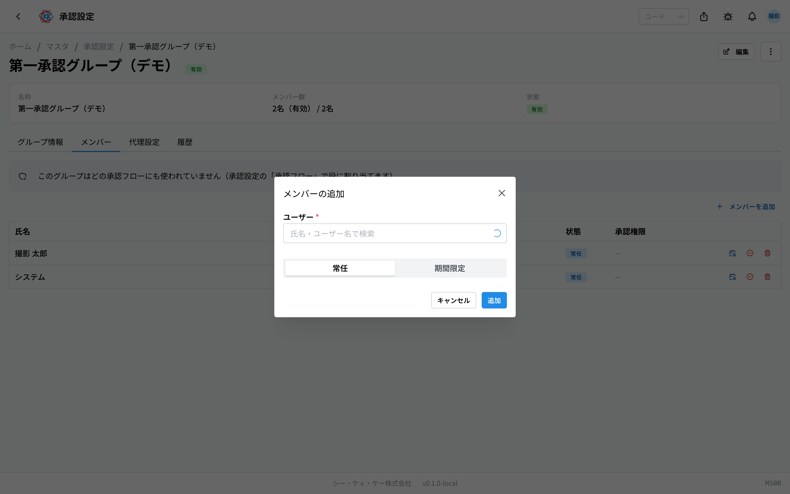
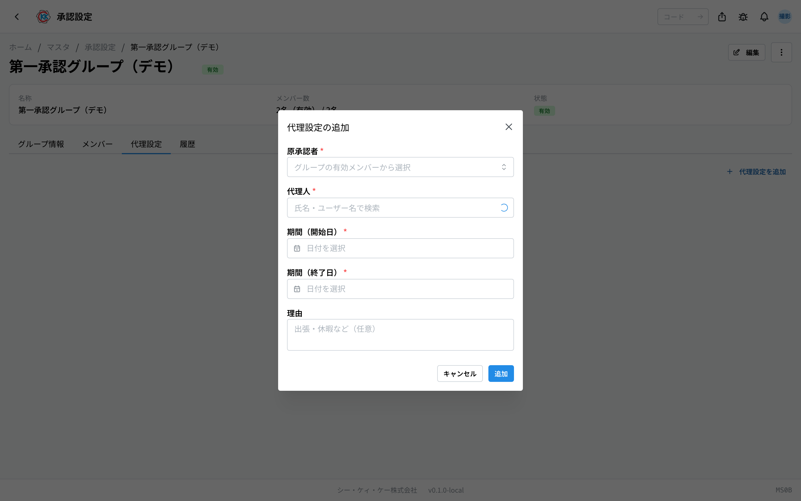

This app is for deciding **how many approval steps each document goes through** and **who can approve**. The operation code is `MS0B`.

You line up the approval steps a document must pass before it can be confirmed, per document type. Each step names a group, and only the people in that group can approve it. **A person who is not in the group cannot approve.**

## What you can do with this app

- Set an **approval flow** per document (which group approves at which step).
- Choose per step whether **any one person** is enough, or **everyone** must approve.
- Make **groups** of people who approve.
- Add and remove **members** in a group — permanent members, or members **for a set period**.
- When the person in charge is away on a business trip or on holiday, register a **stand-in** (a person who approves instead) for a set period.
- Stop a group you no longer use without deleting any records.

## Words used on this page

- **Approval** … checking the content and agreeing that it may go ahead.
- **Approval flow** … the order of approvals a document passes before it is confirmed. One flow per document type.
- **Step** … one approval in the flow. You can name it freely ("First approval", "Department approval", …).
- **Group** … a set of people who can approve. An approval request goes to this group, not to a person.
- **Member** … a person who can approve in that group. Only these people can approve.
- **Fixed-term member** … a person who is part of the group, and can approve, only during a set period.
- **Stand-in** … a person who approves **on behalf of** the real approver while they are away. The approval record keeps who they stood in for.

> 💡 **A fixed-term member is not the same as a stand-in.** A fixed-term member is a member in their own right, just for that period. A stand-in presses the button for someone else, and the original approver's name stays in the record. Use a fixed-term member for a temporary transfer or extra help; use a stand-in to cover someone's absence.

## Before you start

- You need the **master** permission to use this app.
- You can only add people who are already registered in the system. If a name does not appear, check that their company account has been created first.

## How the screen is laid out

Opening the app shows two tabs.

- **Approval flows** … the approval steps per document (the tab that opens first).
- **Approval groups** … the list of groups of people who can approve.

## Setting an approval flow

The **Approval flows** tab lists the six targets that can go through approval.

> 📷 A screenshot of this screen will be added at the next capture run.

- The six are **Order acknowledgement**, **Work order**, **Material purchase order**, **Purchase request**, **Workflow change** and **Order acknowledgement cancellation**.
  - **Workflow change** … approval for adding, editing or removing step branches on an approved / in-progress work order.
  - **Order acknowledgement cancellation** … approval for cancelling a confirmed order acknowledgement as a whole (there is no per-line cancellation).
- Each card lists its steps as "1 First approval · Plant manager · Any one person".
- A document with no approval flow is shown with a red border and the note that **no approval can be requested for it**. In that state the request button will not take you anywhere, so be sure to set one up.
  - **Workflow change** and **Order acknowledgement cancellation** are exceptions: with no steps configured they are **applied immediately without approval** (so sites that do not run approvals are not blocked). Configure at least one step if you want them approved.
- Each card also shows the **permission needed to approve** it — being able to **view or edit** that document (for example, an order acknowledgement needs read/edit rights for "Order acceptance"). There is no approve-action permission: **who can approve is decided solely by the approval groups on this screen**, and someone who cannot open the document cannot approve even when they are in the group.
- Every step carries a badge for the people who can approve it right now.
  - **N can approve** (green) … everyone in the step has the permission.
  - **N of N without permission** (red) … those people are turned away when they press Approve. Hover the badge to see their names.
  - **No members** (red) … nobody can approve that step at the moment, so a request would stall there.
  - **N can approve (N limited)** (yellow) … they have the permission, but only for their own plants, so documents outside that range cannot be approved by them.
- A card with any of these problems is bordered in red, the same as an unconfigured one.

To set it up, press **Edit** on the card (**Set up** when it is empty).

1. Press **Add step** to add one approval step.
2. Enter a **Name** for the step (for example First approval, Department approval).
3. Choose the **Approval group** that approves that step.
4. Choose **Any one person** or **Everyone**.
   - **Any one person** … the step passes as soon as one person in the group approves.
   - **Everyone** … the flow does not move on until every member of that group has approved.
5. To change the order, swap steps with the **↑** and **↓** buttons. The step numbers are renumbered for you.
6. Remove a step you do not need with the **bin** button.
7. Press **Save**.

Once a group is chosen, the same badge and the member names appear below it as **people who can approve this step** — so you can check before saving that the group you picked really can approve.

### A setting only for Workflow change — the apply mode

The edit page for **Workflow change** has, besides the steps, an **Apply mode** field (a setting this document type alone has). Switching it is saved immediately, on the spot.

- **Pre-approval (applied after approval)** … the change is held until the approval finishes, and is reflected in the steps only once the final approval is given (this is the initial setting).
- **Post-approval (applied immediately)** … the change is reflected in the steps first, and then the approval goes round. Choose this when you do not want to keep the floor waiting. However, **even when it is sent back, the steps are not put back automatically**. A red warning appears on the work order screen and stays until you deal with it — fixing the steps by hand if needed — and mark it as checked.

> ⚠️ **Changing the settings does not affect documents that are already in approval.** A document in progress runs to the end with the settings as they were when the approval was requested. Changes apply to approval requests made from now on.

## Splitting the flow by document content (conditional flows)

You can vary the approval steps by what is in the document (amount, type and so on) — for example "material purchase orders of ¥500,000 or more get an extra executive step" or "direct-to-user order acceptances go through the sales manager".

Set this up in the "**条件付きフロー**" (conditional flows) section of the edit page.

- A rule = **conditions** (matched when all of them hold) + **its own approval steps**.
- At the moment an approval request is submitted, rules are evaluated **top to bottom** and the **first matching rule's** steps are used. Documents that match no rule proceed with the **default flow** configured above.
- The available condition fields depend on the document type.
  - **Order acknowledgement** … total amount / delivery method / assigned plant
  - **Work order** … type (made-to-order / from stock) / planned quantity
  - **Material purchase order** … total amount
  - **Purchase request** … line count
  - **Workflow change** … the work order's type / the work order's planned quantity
  - **Order acknowledgement cancellation** … the acknowledgement's total amount / the acknowledgement's delivery method
- Use "**条件付きフローを追加**" to add a rule with its name, conditions and steps. A rule with **no conditions matches every document** (rules below it and the default flow are never reached — mind the order).
- Use **↑ ↓** to change the evaluation order and the switch to enable / disable a rule.
- Conditional flows **replace** the default flow; they do not create an approval gate on their own. A document type with no default flow cannot submit approval requests even if rules exist — always configure the default flow too.

> ⚠️ As with the default flow, **changes take effect from the next approval request**. Documents already in approval are unaffected.

## Making a group

Open the **Approval groups** tab and press **New** at the top right.

1. Enter the group's name in the Japanese field of **Name** (for example Plant manager, Manufacturing manager). English can be left empty.
2. Press **Save**.

Saving opens the detail screen. Add members there. The group you made can then be chosen for any step of any approval flow.

> 💡 A group does not itself know "which step" it is. You can use the same group for several documents and several steps.

## Adding members (adding people who can approve)

1. On the group's detail screen, open the **Members** tab.
2. Press **Add member**.
3. Type a name in **Search by name or username** and pick the person to add.
4. Leave **Permanent** selected if they should approve indefinitely. To set a period, choose **Fixed term** and enter **Start** and **End**. Add a **Note** with the reason if you like.
5. Press **Add**.

Above the member table you can see **which documents this group approves and the permission that requires**. A group that is not used in any approval flow says so (adding members to it does nothing).

The member table shows **Name / Username / Term / State / Approval permission**. The state is one of:

- **Permanent** … no period set; can always approve.
- **Active** … fixed term, and currently inside the period. Can approve.
- **Scheduled** … fixed term, but the start has not been reached. Cannot approve yet.
- **Ended** … fixed term, and the end has passed. Can no longer approve.
- **Disabled** … stopped by hand; cannot approve regardless of the period.

The **Approval permission** column shows one badge per document this group approves. **Green** … they can approve. **Yellow** … they have the permission but only within their own plants. **Red** … they cannot view or edit that document and are turned away when they press Approve. Permissions come from **roles in User management (SY01)**, not from this app.

> 💡 The same column appears for stand-ins on the **Stand-ins** tab. A stand-in approves with **their own** permission, so they also need approval rights for the document.

The buttons on the right of each row let you **change the term**, stop that member temporarily (**Disable member**), or take them out of the group (**Remove member**).

> 💡 Use "Disable" for stepping away from approvals for a while, "Remove" when the person is no longer involved, and "Fixed term" when the end is known in advance.

## Registering a stand-in (cover for someone who is away)

When an approver is away on a business trip or on holiday, you can hand approval to someone else for a set period.

1. On the group's detail screen, open the **Stand-ins** tab.
2. Press **Add stand-in**.
3. Choose the real approver in **Original approver**. Only members who can currently approve in this group appear here.
4. Choose the person who approves instead in **Stand-in**.
5. Enter **Period (start)** and **Period (end)**.
6. Add a **Reason** such as "business trip / holiday" if you like (it can be left empty).
7. Press **Add**.

Once the registered period passes, the stand-in stops working automatically. You do not need to delete it by hand. To end it early, delete the row from the stand-in table.

## Checking what is in a group

The detail screen has four tabs.

- **Group information** … check the name.
- **Members** … the list of people who can approve, with their term and state.
- **Stand-ins** … the stand-ins currently registered, with original approver, stand-in, period and reason.
- **History** … a record of who changed members or stand-ins, and when.

To correct the name, press **Edit** at the top right. The **…** button (three dots) next to it offers **Disable** and **Delete**.

## Input fields

The fields you enter on the approval flow and approval group screens.

| Field | What to enter |
|-------|---------------|
| [Step name](#field-step-name) | What that approval step is called |
| [Approval group](#field-group) | The group that approves that step |
| [How the step passes](#field-mode) | Whether any one person is enough, or everyone must approve |
| [Name](#field-name) | The name of the group |
| [Active](#field-active) | Clear it and that group is no longer used for approvals |
| [Start](#field-valid-from) | When a fixed-term member starts being able to approve |
| [End](#field-valid-until) | When a fixed-term member stops being able to approve |

### Step name [#field-step-name]

What that approval step is called. Use wording that makes sense in your company, such as "First approval" or "Department approval". This name appears on the document screen and in the pending-approvals list.

### Approval group [#field-group]

The group that approves that step. Only members of the group you choose here (or their in-period stand-ins) can approve that step.

### How the step passes [#field-mode]

Whether any one person is enough, or everyone must approve. **Any one person** moves on to the next step as soon as one person in the group approves. **Everyone** does not move on until every member as of the moment the approval was requested has approved.

### Name [#field-name]

The name of the group. This is the name shown when choosing a group for a step of an approval flow.

### Active [#field-active]

Clear it and that group is no longer used for approvals. Members and stand-ins are set on the detail screen.

### Start [#field-valid-from]

When a fixed-term member starts being able to approve. It does not apply to permanent members. Before this moment they do not appear as an approver.

### End [#field-valid-until]

When a fixed-term member stops being able to approve. It does not apply to permanent members. Once it passes they can no longer approve automatically, so there is nothing to delete by hand.

## Questions and problems

**Q. It says no approval flow is set up, and I cannot request approval.**
A. That document has no approval flow yet. Open its card on the **Approval flows** tab and set up at least one step.

**Q. Someone who was asked to approve says they cannot.**
A. Three things must line up: (1) they can **view or edit** that document (green in the Approval permission column), (2) they are a **member of the group** for that step, and (3) their state is **Permanent** or **Active** (**Disabled**, **Scheduled** and **Ended** cannot approve). Check the step's group on the Approval flows tab, then check all three on that group's Members tab.

**Q. A member's approval permission is red (no permission).**
A. They do not have permission to view or edit that document. Permissions come from roles, so check that person in **User management (SY01)** — this app cannot change them. Pass on the permission name shown on the card or badge.

**Q. It says "N limited" in yellow.**
A. They have the permission, but only within their own plants. They can approve documents inside that range and not outside it. If they need to approve company-wide, review the scope of their permission in User management (SY01).

**Q. A step set to "Everyone" does not move on after one person approves.**
A. That is how it works. "Everyone" waits until every member as of the approval request has approved. The document screen shows "N remaining" with the names of those who have not approved yet.

**Q. I added a step but the number of steps on a document in progress has not changed.**
A. That is intended. A document in progress runs to the end with the settings as they were when the approval was requested. The new step count applies to approval requests made from now on.

**Q. It says the person is already a member.**
A. They are already in this group. Look for the name in the list on the **Members** tab. If it is disabled, the button on the row puts it back to active.

**Q. It says a fixed-term member needs both a start and an end.**
A. Only one of them was entered. Enter both, or switch to **Permanent**.

**Q. It says the end must be later than the start.**
A. The end is the same as, or earlier than, the start. Enter them again.

**Q. It says the original approver must be an active member of this group.**
A. The real approver you want covered is not a member of this group, or is disabled or outside their period. Add or re-activate them on the **Members** tab first.

**Q. It says the original approver and the stand-in must be different users.**
A. The same person is chosen for both. Choose someone else as the person who approves instead.

**Q. I cannot delete a group.**
A. It cannot be deleted while it is used by a step of an approval flow, or while approval requests that used it remain. Take it out of the approval flow first, or use **Disable** instead of deleting. Disabling stops it being used for new approvals and leaves the existing records as they are.

<!-- permissions:start -->
## Permissions required

Using this screen requires the **Master data** (`master`) permission.

| What you want to do | Permission needed |
| --- | --- |
| Open the screen, view lists and details | Master data — View |
| Add, change or delete | Master data — Create / Edit / Delete |

Viewing only needs *View*. Where a screen offers adding, changing or deleting, each of those needs its matching permission.

Permissions come through roles. If something is missing, ask an administrator.

For the whole picture see [Permissions and roles](../../../permissions).
<!-- permissions:end -->
