这是把有业务往来的公司 **统一登记在一起的台账**。操作码是 `MS01`。

以前分成「顧客」（客户）、「最終需要家」（最终需求方）、「外注企業」（外协企业）3 个应用，现在合并成这一个 **取引先**（业务伙伴）应用了。同一家公司不需要再登记 3 次。

使用思路非常简单。

> **先登记公司（业务伙伴），然后给它加上「ロール」（角色）再使用。**

「ロール」（角色）表示 **您和这家公司是以什么身份往来的**。向您下单的公司加「顧客」（客户），实际使用产品的公司加「最終需要家」（最终需求方），向其采购材料或委托部分加工的公司加「仕入先・外注先」（供应商・外协厂）。**一家公司可以加任意多个角色。** 既卖材料给您、又向您下单的公司，两个都加上就可以了。

没有加角色的公司，在报价单、材料订购单等画面上 **不会出现在选项中**。新的业务确定后，请先在本画面登记该公司，并加上角色。

## 本应用可以做什么

- 可以按「一家公司一条记录」的方式登记有业务往来的公司。
- 可以给公司加 **角色**（顧客／最終需要家／仕入先・外注先）。一家公司可以加多个角色。
- 加上「顧客」（客户）后，就可以在[价格表](/manual/zh/operations/sales/price-list/user)、[报价单](/manual/zh/operations/sales/quote/user)、[订单请书](/manual/zh/operations/sales/order-acceptance/user)以及发票中，作为对方单位来选择。
- 加上「最終需要家」（最终需求方）后，就可以在[送货单](/manual/zh/operations/shipping/delivery-note/user)和订单明细中作为最终需求方来选择。
- 加上「仕入先・外注先」（供应商・外协厂）后，就可以在[材料订购单](/manual/zh/operations/purchasing/purchase-order/user)、[外协委托](/manual/zh/operations/purchasing/outsource-order/user)以及制造指示书工序的外协厂中选择。
- 可以在公司下面登记 **支店**（分店）。
- 每家公司可以登记任意多位 **担当者**（对方的联系人）。
- 可以登记结算截止日、付款账期、汇款账户、标准交货周期等交易条件。
- 业务结束的公司不要删除，可以设为 **無効**（无效）。

## 本页出现的词语

- **取引先（业务伙伴）** … 指有业务往来的公司本身。一家公司登记一条记录。
- **ロール（角色）** … 表示以什么身份使用这家公司的标记，共有以下 3 种。
  - **顧客（客户）** … 向您下单的公司。是报价单、订单请书、发票的对方单位。
  - **最終需要家（最终需求方）** … 在工厂里实际使用成品的公司。通过商社接单等「下单公司与使用公司不同」的情况会用到。
  - **仕入先・外注先（供应商・外协厂）** … 向其采购材料的公司（供应商），或委托研磨、涂层等部分加工的公司（外协厂）。
- **外注種別（外协类别）** … 「仕入先・外注先」角色内部的区分，选择「**仕入先**」（供应商）或「**外注先**」（外协厂）之一。
- **BPコード（BP代码）** … 每家公司一个的管理编号，以 `BP-` 开头。保存时自动生成。
- **支店（分店）** … 隶属于总公司下面的营业所或工厂。
- **締日 / 支払サイト（结算截止日 / 付款账期）** … 汇总收付款的日期，以及到付款为止的天数。
- **標準リードタイム（标准交货周期）** … 从提出委托到货物送达的通常天数。
- **AI照合名（AI 匹配名）** … 自动读取收到的订单文件时，用于核对公司名称的「其他写法」清单。

## 开始之前

使用本应用需要 **主数据权限**。如果画面打不开，请咨询管理员。

除此之外没有需要事先准备的东西，可以直接从本画面开始登记。

登记好的业务伙伴，会在之后的[价格表](/manual/zh/operations/sales/price-list/user) →[报价单](/manual/zh/operations/sales/quote/user) →[订单请书](/manual/zh/operations/sales/order-acceptance/user)，以及[材料订购单](/manual/zh/operations/purchasing/purchase-order/user) →[外协委托](/manual/zh/operations/purchasing/outsource-order/user)中一直使用。**公司名称的写法请在一开始就确定好，再进行登记。**

## 界面说明

打开应用后，会显示已登记业务伙伴的列表。

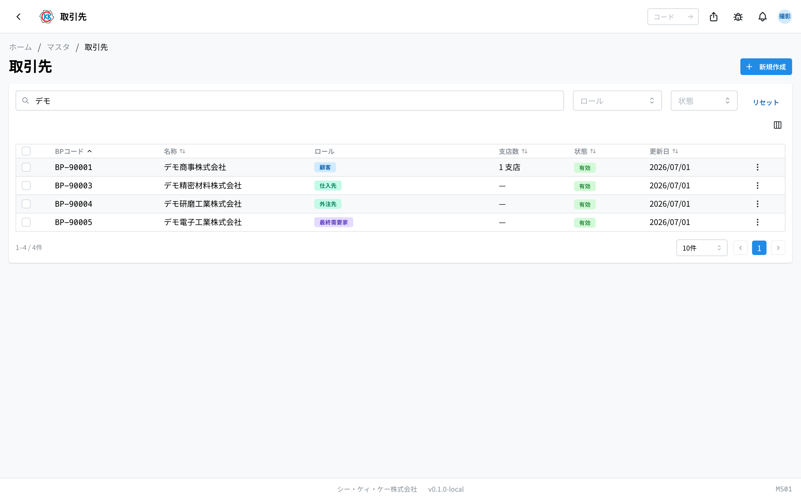

- **BPコード（BP代码）** … 以 `BP-` 开头的管理编号，由系统自动生成。
- **名称** … 公司名称。
- **ロール（角色）** … 该公司拥有的角色会以标记形式排列。「仕入先・外注先」角色会按外协类别显示为「**仕入先**」（供应商）或「**外注先**」（外协厂）。一个角色都没加的公司会显示「**ロール未設定**」（未设定角色）。
- **支店数（分店数）** … 该公司登记了多少家分店。没有分店时显示「—」。
- **状態（状态）** … 绿色的「**有効**」（有效）表示现在还能使用的公司，灰色的「**無効**」（无效）表示已经不能选择的公司。
- 在上方的搜索栏（「**BPコード・名称で検索**」／按 BP 代码・名称搜索）中输入公司名或 BP 代码，即可筛选。
- 在「**ロール**」（角色）栏中，可以只显示客户，或只显示供应商・外协厂等。
- 在「**状態**」（状态）栏中，也可以只显示「有効」（有效）或「無効」（无效）的公司。
- 点击某一行，即可打开该公司的详情画面。

列表中只显示 **总公司（上级公司）**。分店显示在公司详情画面的「支店一覧」（分店列表）标签中。

例如在「ロール」（角色）中选择「仕入先・外注先」，就只会列出采购材料和委托加工的对象公司。

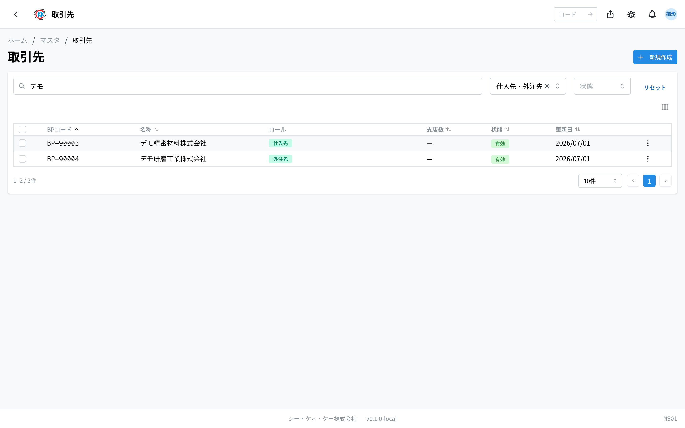

## 登记业务伙伴

### 1. 输入公司信息

1. 点击列表画面右上角的「**新規作成**」（新建）。
2. 在「**名称（日本語）**」（名称・日文）中输入公司名称。**只有这一栏是必须填写的。**
3. 「**名称（English）**」（名称・英文）、「**フリガナ**」（假名读音）、「**略称**」（简称）、「**法人番号**」（法人编号）在知道的范围内填写即可（留空也能保存）。
4. 在「**住所・連絡先**」（地址・联系方式）区域，输入邮编、地址、电话号码、传真、邮箱等。

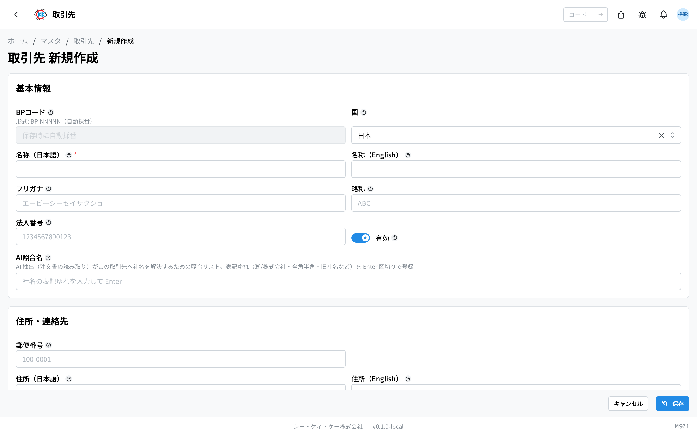

> 💡 「**BPコード**」（BP代码）栏无法输入。正如画面上显示的「保存時に自動採番」（保存时自动编号），保存后会自动生成 `BP-00001` 这样的编号。

### 2. 选择角色

在「**ロール**」（角色）区域，勾选以什么身份使用这家公司。**可以勾选任意多个。**

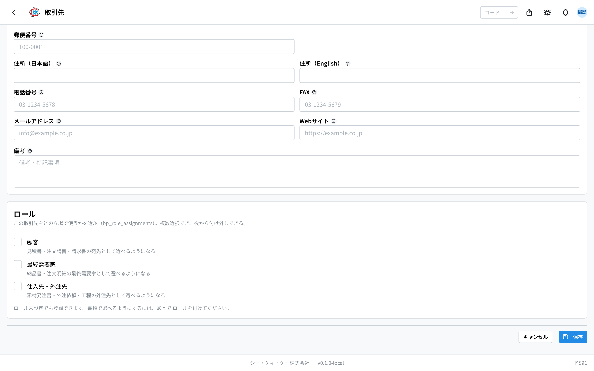

- **顧客（客户）** … 可以作为报价单、订单请书、发票的对方单位来选择。
- **最終需要家（最终需求方）** … 可以作为送货单、订单明细的最终需求方来选择。
- **仕入先・外注先（供应商・外协厂）** … 可以在材料订购单、外协委托以及工序的外协厂中选择。

勾选后，**该角色专用的输入栏会出现在下方**。取消勾选后，这些输入栏会隐藏起来。

> ⚠️ 一个角色都不加也能保存。但这样的公司 **不会出现在任何单据的选项中**。角色可以之后再加，所以先只登记公司也完全没问题。

### 3. 输入客户信息（勾选「顧客」时）

会出现「**顧客情報**」（客户信息）区域。

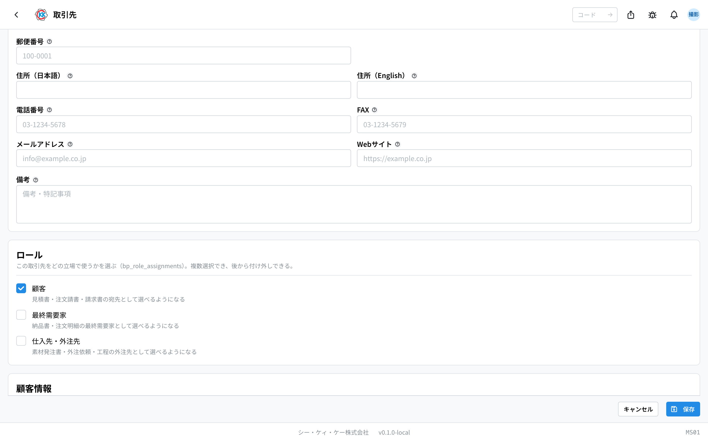

1. 「**旧システムコード**」（旧系统代码）中，如果有以前系统使用的客户代码就填入（留空也可以）。
2. 输入「**締日**」（结算截止日）、「**支払サイト（日数）**」（付款账期・天数）、「**支払日**」（付款日）。
3. 如果有授信额度，请填入「**与信限度額**」（授信额度）。
4. 选择「**課税区分**」（课税区分）：課税（课税）／非課税（非课税）／軽減税率（减免税率）。
5. 在「**請求書送付方法**」（发票送付方式）中选择发票的寄送方式：メール（邮件）／FAX（传真）／郵送（邮寄）／ポータル（门户）。
6. 如果是寄售业务的对象，请勾选「**委託先（委託販売の対象）**」（受托方・寄售对象）。

> 💡 在「**締日**」（结算截止日）中输入 `31`，表示「月末」。栏位下方也会显示「31 = 月末」。这里设定的结算截止日会用于[结算截止处理](/manual/zh/operations/billing/billing-closing/user)。

> ⚠️ 只有发票要寄给其他公司的交易，才需要在「**請求先（別法人の場合）**」（收票方・为其他法人时）中选择那家公司。留空则向该公司本身收款。

### 4. 输入最终需求方信息（勾选「最終需要家」时）

会出现「**最終需要家情報**」（最终需求方信息）区域。请在「**業種**」（行业）中填入该公司的业务领域（例如：汽车零部件）。没有固定选项，用公司内部能理解的说法即可，留空也能保存。

### 5. 输入供应商・外协厂信息和汇款账户（勾选「仕入先・外注先」时）

会出现「**仕入先・外注先情報**」（供应商・外协厂信息）和「**振込先**」（汇款账户）2 个区域。

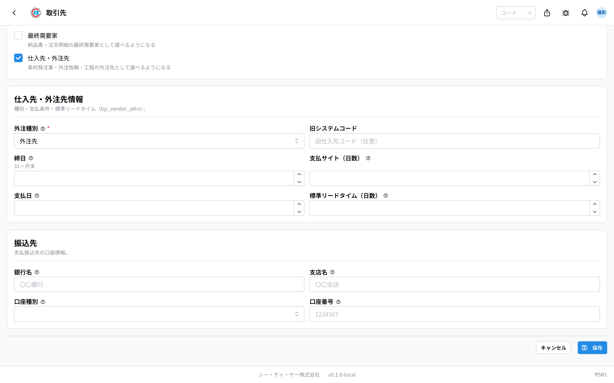

1. 选择「**外注種別**」（外协类别）。**这一栏必须选择。**
   - 采购材料或物资的对象 →「**仕入先**」（供应商）
   - 委托部分加工的对象 →「**外注先**」（外协厂）
2. 「**旧システムコード**」（旧系统代码）中，如果有以前系统使用的供应商代码就填入。
3. 输入「**締日**」（结算截止日）、「**支払サイト（日数）**」（付款账期・天数）、「**支払日**」（付款日）。
4. 在「**標準リードタイム（日数）**」（标准交货周期・天数）中，填入从委托到入库的通常天数。
5. 在「**振込先**」（汇款账户）中输入「**銀行名**」（银行名称）、「**支店名**」（分行名称）、「**口座種別**」（账户种类）、「**口座番号**」（账号）。

> 💡 填写了「**標準リードタイム（日数）**」（标准交货周期）后，制作[外协委托](/manual/zh/operations/purchasing/outsource-order/user)时可作为预计入库日的参考。不清楚时留空也能保存。

### 6. 保存

最后点击「**保存**」（保存）。保存后会打开该业务伙伴的详情画面。

## 事后增加或取消角色

公司登记之后，如果出现「以后也要向这家公司采购材料」的情况，只要加一个角色就行。

1. 打开该公司的画面，点击右上角的「**編集**」（编辑）。
2. 在「**ロール**」（角色）区域勾选想要增加的角色。
3. 填写出现的输入栏，然后点击「**保存**」（保存）。

取消时也一样，取消勾选后点击「保存」（保存）即可。

> 💡 **取消勾选并不会删除已输入的内容。** 只是该角色的分配变成「不使用」的状态，结算截止日、汇款账户等内容仍然保留。再次勾选时，之前输入的内容会原样恢复。即使不小心取消了勾选，也不用担心。

## 查看已登记的内容

在列表中点击某一行，即可打开该公司的画面。上方的概要区域会显示 **ロール**（角色），下方分为 5 个标签。

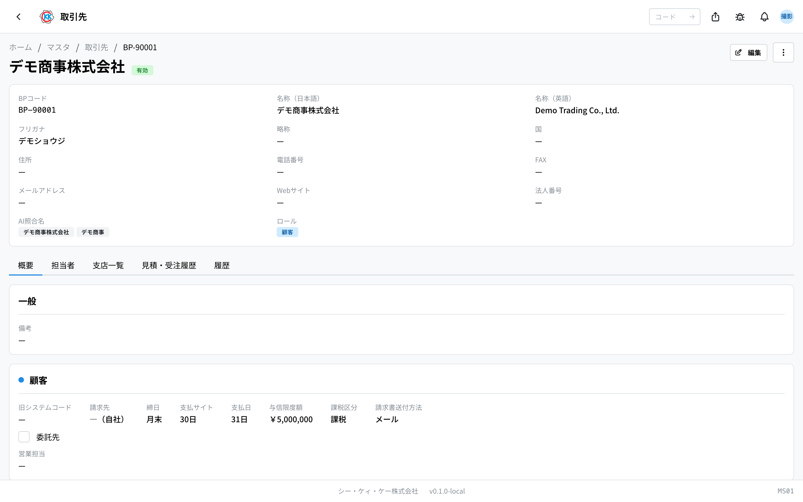

- **概要**（概要）… 分成若干个区块依次排列。最上面是「**一般**」（一般 — 备注等与角色无关、属于公司本身的信息），接着是 **该公司实际拥有的角色** 各占一个区块。角色区块中，「**顧客**」（客户）为交易条件，「**最終需要家**」（最终需求方）为行业，「**仕入先・外注先**」（供应商・外协厂）为交易条件和汇款账户。区块标题左侧的圆点，与列表中该角色徽章的颜色一致。
- **担当者**（联系人）… 对方窗口人员的列表。
- **支店一覧**（分店列表）… 该公司的分店列表。
- **見積・受注履歴**（报价・受订历史）… 向该公司发出的报价等记录。
- **履歴**（历史）… 何时、由谁修改过本登记内容的记录。

如果是供应商或外协厂，「概要」（概要）标签中会显示外协类别、标准交货周期和汇款账户。

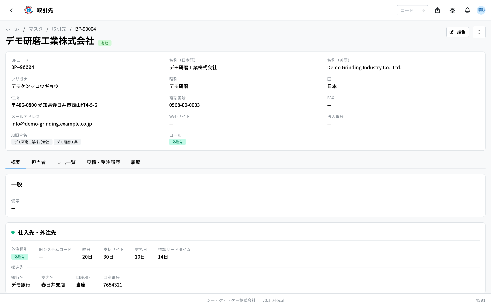

想修改内容时，请点击画面右上角的「**編集**」（编辑）。

## 登记对方的联系人

可以登记对接窗口人员的姓名和联系方式。客户和供应商的操作步骤相同。

1. 打开「**担当者**」（联系人）标签。
2. 点击右上角的「**担当者を追加**」（添加联系人）。
3. 输入「**氏名**」（姓名）。**这一栏必须填写。**
4. 在知道的范围内填写「**フリガナ**」（假名读音）、「**部署**」（部门）、「**役職**」（职务）、「**メールアドレス**」（邮箱）、「**電話番号**」（电话号码）。
5. 如果这位是主要对接人，请勾选「**主担当にする**」（设为主联系人）。
6. 点击「**追加**」（添加）。

设为主联系人的人员会显示「**主担当**」（主联系人）标记。

## 登记分店

1. 在业务伙伴画面打开「**支店一覧**」（分店列表）标签。
2. 点击「**支店を追加**」（添加分店）。
3. 在「**名称（日本語）**」（名称・日文）中输入分店名称。
4. 输入地址和电话号码。
5. 如果分店有对接人员，请填入「**担当者名**」（联系人姓名）（留空也可以）。
6. 点击「**保存**」（保存）。

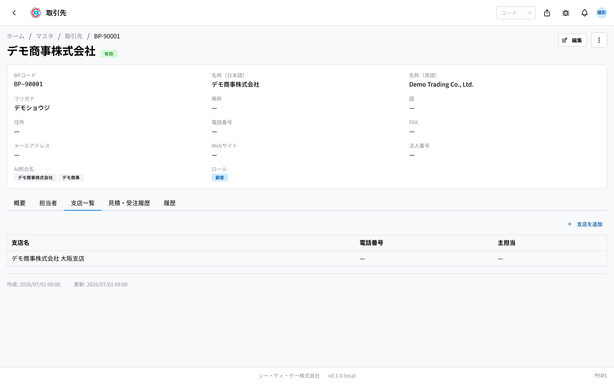

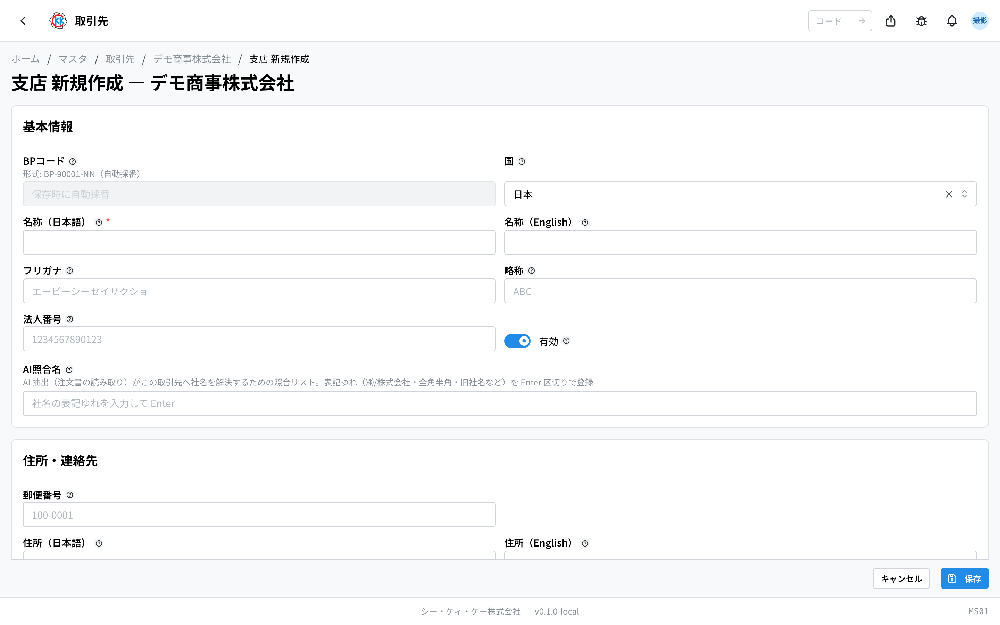

分店的 BP 代码会自动生成，形式是在总公司编号后面加上分支编号（例如 `BP-00001-01`）。

## 已停止往来的公司如何处理

即使与该公司的业务结束了，也 **请不要删除**。因为过去的报价单、订购单、送货单等仍然引用着这家公司。请改为设成「無効」（无效）。

1. 点击业务伙伴画面右上角的菜单（三个点的按钮）。
2. 选择「**無効化**」（停用）。
3. 出现「取引先の無効化」（停用业务伙伴）画面后，点击「**無効化する**」（确定停用）。

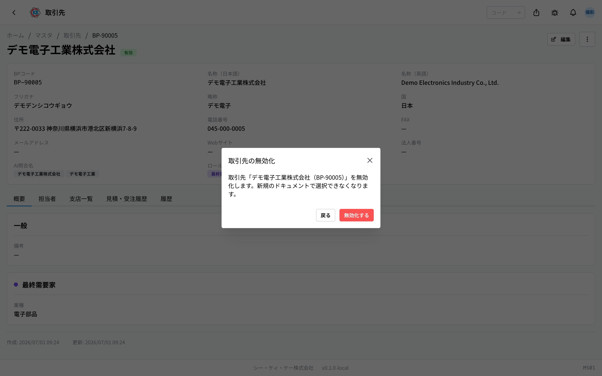

设为无效后，新的报价单和订购单等就无法再选择这家公司，但是 **过去的数据会原样保留**。如果重新开始往来，可以按同样的步骤用「有効化」（启用）恢复。

> 💡 如果是「以后不再向这家公司下单，但仍然接受它的订单」这种情况，比起停用，**取消勾选「仕入先・外注先」角色** 更为合适。这样公司本身仍然有效，可以继续作为客户使用。

## 批量设为有效・无效

重新登记了很多公司时，可以批量切换。

1. 勾选列表中各行左侧的复选框。
2. 画面上方会出现「**一括有効化**」（批量启用）、「**一括無効化**」（批量停用）、「**一括削除**」（批量删除）。
3. 点击需要使用的按钮。

> ⚠️「**一括削除**」（批量删除）无法撤销。平时请使用「一括無効化」（批量停用）。

## 输入项

业务伙伴分为**所有公司通用的字段**与**赋予角色（客户・供应商或外协・最终需求家）后才出现的字段**。

### 通用输入项

| 项目 | 必填 | 填什么 |
|------|------|--------|
| [BP 编码](#field-bp-code) | 自动 | 业务伙伴的编号 |
| [名称](#field-name) | 必填 | 公司名称 |
| [假名 / 简称](#field-name-kana) | 选填 | 便于查找・在窄画面简短显示 |
| [国家](#field-country) | 选填 | 对方所在国家 |
| [法人编号](#field-tax-number) | 选填 | 法人编号等 |
| [AI 匹配名称](#field-match-names) | 选填 | 单据读取时的其他写法 |
| [邮编 / 地址](#field-address) | 选填 | 所在地 |
| [电话 / 传真 / 邮箱 / 网站](#field-contact) | 选填 | 联系方式 |
| [有效](#field-active) | — | 是否出现在选项中 |
| [备注](#field-notes) | 选填 | 补充说明 |

### BP 编码 [#field-bp-code]

业务伙伴的编号，自动生成。

### 名称 [#field-name]

公司名称。**会原样显示在单据上**，请填写正式名称。

### 假名 / 简称 [#field-name-kana]

假名用于按名称查找。简称用于在列表等窄处简短显示。

### 国家 [#field-country]

对方所在国家。用于区分海外业务伙伴。

### 法人编号 [#field-tax-number]

法人编号等识别编号。用于请款与会计的核对。

### AI 匹配名称 [#field-match-names]

自动读取收到的单据时，**希望被判定为同一公司的其他写法**。列出旧公司名、「株式会社」位置不同的写法等，可减少导入时认错公司。

### 邮编 / 地址 [#field-address]

所在地。会显示在交货单与请求书上。

### 电话 / 传真 / 邮箱 / 网站 [#field-contact]

公司层面的联系方式。各负责人的联系方式另行登记为「负责人」。

### 有效 [#field-active]

取消后，在报价单、订购单等中将**无法再新选择**该公司。已用该公司创建的单据保持不变。已停止往来的公司请取消此项而非删除。

### 备注 [#field-notes]

补充说明。写下决定的理由或注意事项，有助于日后查阅的人了解来龙去脉。

---

### 赋予客户角色后的输入项

| 项目 | 必填 | 填什么 |
|------|------|--------|
| [请求方（为其他法人时）](#field-billing-bp) | 选填 | 请求书收件方为其他公司时 |
| [结算日 / 付款周期 / 付款日](#field-payment-terms) | 选填 | 收款约定 |
| [授信限额](#field-credit-limit) | 选填 | 可赊账的上限 |
| [课税区分](#field-tax-type) | 选填 | 消费税的处理方式 |
| [请求书送达方式](#field-invoice-method) | 选填 | 如何送达请求书 |
| [委托方](#field-consignment) | — | 是否为委托销售对象 |

### 请求方（为其他法人时） [#field-billing-bp]

请求书收件方为其他公司时指定。留空则为该公司自身。

### 结算日 / 付款周期 / 付款日 [#field-payment-terms]

收款约定。**结算日处理按此处设定的结算日运行**，付款周期与付款日决定请求书的付款期限。

### 授信限额 [#field-credit-limit]

可赊账金额的参考上限。

### 课税区分 [#field-tax-type]

消费税的处理方式，用于请求书计算。

### 请求书送达方式 [#field-invoice-method]

通过邮件・传真・邮寄・门户中的哪一种送达请求书。

### 委托方 [#field-consignment]

是否为委托销售对象。仅对进行委托销售的对象设定。

---

### 赋予供应商・外协角色后的输入项

| 项目 | 必填 | 填什么 |
|------|------|--------|
| [外协种别](#field-vendor-type) | 必填 | 采购材料的对象，还是委托工序的对象 |
| [标准交期（天数）](#field-lead-time) | 选填 | 委托后返回的大致天数 |
| [结算日 / 付款周期 / 付款日](#field-vendor-payment) | 选填 | 付款约定 |
| [银行名 / 支行名 / 账户种别 / 账号](#field-bank) | 选填 | 汇款账户 |

### 外协种别 [#field-vendor-type]

是**供应商**（采购材料、资材的对象）还是**外协企业**（委托部分工序的对象）。该公司仅出现在所选一侧的画面中。

### 标准交期（天数） [#field-lead-time]

自委托至返回的大致天数，可作为确定外协预计入库日的参考。

### 结算日 / 付款周期 / 付款日 [#field-vendor-payment]

我方付款时的约定。

### 银行名 / 支行名 / 账户种别 / 账号 [#field-bank]

汇款账户。用于我方付款时。

---

### 赋予最终需求家角色后的输入项

| 项目 | 必填 | 填什么 |
|------|------|--------|
| [行业](#field-industry) | 选填 | 属于何种行业 |

### 行业 [#field-industry]

公司所属行业。最终需求家**仅登记大客户即可**，无需登记全部需求家。

---

### 分店・负责人的输入项

分店登记在公司之下（**最多 2 层**），输入字段与上述通用输入项相同。

负责人除姓名外，还可填写部门、职务、邮箱与电话。标记为**主负责人**后，将在单据收件方中优先显示。

## 常见问题与故障处理

**Q. 以前的「顧客」（客户）、「最終需要家」（最终需求方）、「外注企業」（外协企业）应用去哪了？**
A. 已经合并到这一个「取引先」（业务伙伴）应用中了。打开旧地址会自动跳转到本画面。已登记的公司也原样保留，并已加上对应的角色。

**Q. 一家公司既卖材料给我们，也向我们下单。需要登记 2 条记录吗？**
A. 不需要。只登记 1 条记录，然后 **同时勾选**「**顧客**」（客户）和「**仕入先・外注先**」（供应商・外协厂）两个角色即可。

**Q. 下单公司和使用产品的公司是同一家。需要加两个角色吗？**
A. 只加「顧客」（客户）就够了。「最終需要家」（最终需求方）是用于通过商社接单等「下单公司与使用公司不同」的情况。

**Q. 出现「名称（日本語）を入力してください」（请输入名称・日文），无法保存。**
A. 公司名称的日文栏是空的。请填入「名称（日本語）」（名称・日文）后，再点击一次「保存」（保存）。英文名称留空也没关系。

**Q. 出现「外注種別を選択してください」（请选择外协类别），无法保存。**
A. 勾选了「仕入先・外注先」角色，但还没有选择「外注種別」（外协类别）。采购材料的对象请选「仕入先」（供应商），委托加工的对象请选「外注先」（外协厂）。

**Q. 出现「メールアドレスの形式が正しくありません」（邮箱地址格式不正确）。**
A. 邮箱地址的写法有误。请确认是否混入了全角字符，以及是否包含 `@`。不使用时请留空。

**Q. 在报价单画面选择客户时，找不到公司名称。**
A. 请依次确认以下 3 点。1) 是否已经登记。2) 是否加了「**顧客**」（客户）角色（没有加就不会出现在对方单位的选项中）。3) 是否被设为「無効」（无效）。可以在列表画面用「ロール」（角色）和「状態」（状态）栏筛选查找。

**Q. 材料订购单的「仕入先」（供应商）栏中没有这家公司。**
A. 可能是没有加「仕入先・外注先」角色，或者外协类别被设成了「外注先」（外协厂）。要作为采购材料的对象使用，请改为「仕入先」（供应商）。同时也请确认是否被设为「無効」（无效）。

**Q. 取消角色勾选后，已输入的结算截止日和汇款账户会消失吗？**
A. 不会消失。只是该角色的分配变成不使用的状态。再次勾选时，之前输入的内容会原样恢复。

**Q. 尝试删除时出现「この取引先を参照するデータ（販売・購買・製造の書類）が存在するため削除できません。無効化を検討してください。」（存在引用该业务伙伴的数据・销售・采购・制造单据，因此无法删除。请考虑停用）。**
A. 因为已经存在使用该公司的报价单、订购单等数据，所以无法删除。这是正常现象。请使用「無効化」（停用）。

**Q. 尝试删除时出现「支店が存在するため削除できません。先に支店を削除してください。」（存在分店，因此无法删除。请先删除分店）。**
A. 该公司下登记了分店。如果确实要删除，请先删除所有分店。平时使用「無効化」（停用）就足够了。

**Q.「AI照合名」（AI 匹配名）里应该填什么？**
A. 这一栏用来填写订单文件上公司名称可能出现的「差异写法」。例如「㈱デモ商事」「デモ商事株式会社」「デモ商事」等，每输入一个就按一次 Enter 键添加。留空也可以完成登记。

**Q. 修改公司名称或地址后，过去的报价单和订购单的内容会变吗？**
A. 不会变。过去的单据会保持当时的内容不变。

**Q.「業種」（行业）应该写什么？**
A. 没有固定选项，可以自由输入。用公司内部能理解的说法即可（例如：汽车零部件、电子零部件）。留空也能保存。
