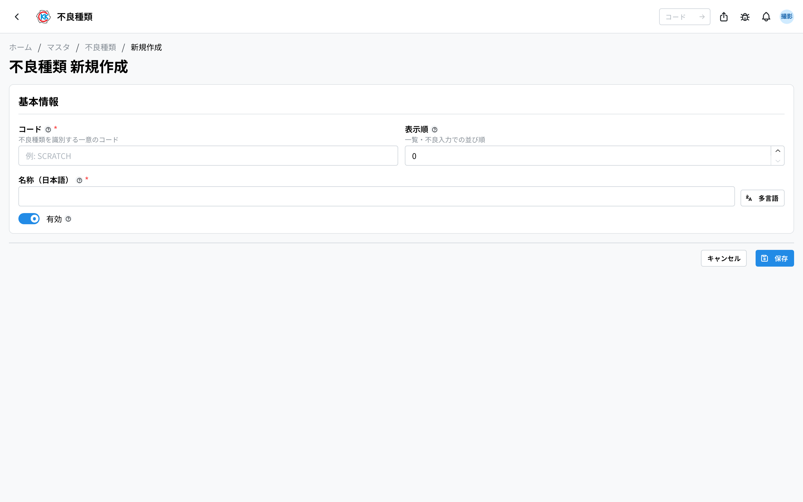
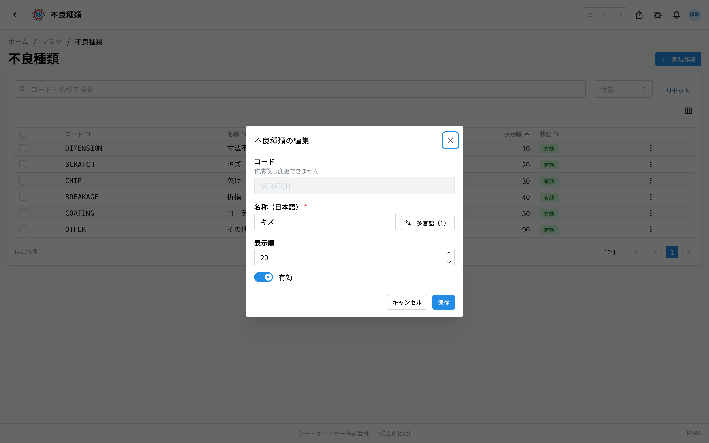
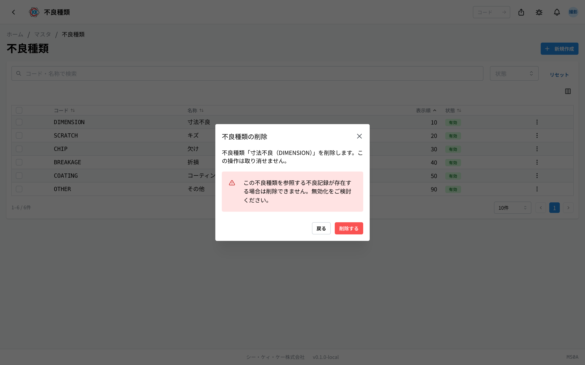

这是用于登记出现不良时所选 **分类** 的应用，例如「キズ」（划伤）、「欠け」（缺口）、「寸法不良」（尺寸不良）。操作代码是 `MS0A`。

这里登记的分类，会成为在[指示书](/manual/zh/operations/production/work-order/user)的工序中记录不良时的选项。不良按「区分・不良种类・详情・根数」逐行记录，**不良种类必须选择**。所有行填完之前无法完成工序，不良数的汇总也会根据这些记录自动计算。

> ⚠️ 本应用处于试用公开阶段。根据您使用的环境，可能还看不到它。

## 本应用可以做什么

- 可以登记不良的分类。
- 可以决定现场输入界面上的 **排列顺序**。可以把常用的分类放在上面。
- 可以在不删除记录的情况下，把不再使用的分类从选项中去掉。

## 本页出现的词语

- **不良种类** … 用于区分不良的名称。请登记现场实际使用的说法，例如「キズ」（划伤）、「欠け」（缺口）。
- **显示顺序** … 在列表和现场选项中出现的顺序。数字越小越靠上。
- **有効 / 無効**（有效 / 无效）… 有效表示出现在选项中，无效表示不出现在选项中。

## 开始之前

- 使用本应用需要 **主数据权限**。
- 常用的分类（尺寸不良、划伤、缺口、折断、涂层不良、其他）一开始就已经登记好了。请先查看列表，确认是否已经有相同的分类。

## 界面的看法

本应用只有代码、名称和排列顺序，是一个很小的应用，因此 **没有详细界面**。登记和修改都在这个列表界面上进行。

- 列表按 **コード**（代码）/ **名称**（名称）/ **表示順**（显示顺序）/ **状態**（状态）的顺序排列。
- 平时按「**表示順**」（显示顺序）数字从小到大排列。
- 用上方的「**コード・名称で検索**」（按代码・名称搜索）栏，可以筛选出您要找的分类。也可以用「**状態**」（状态）筛选。
- 点击行，会当场打开 **编辑小窗口**（不会跳转到别的界面）。

## 登记分类

1. 点击列表界面右上角的「**新規作成**」（新建）。
2. 在「**コード**」（代码）中输入代表该分类的文字（例 `SCRATCH`）。
3. 在「**名称**」（名称）的日语栏中输入现场使用的说法（例 キズ / 划伤）。英语栏留空也可以保存。
4. 在「**表示順**」（显示顺序）中输入数字。可以使用 0 以上的整数。
5. 点击「**保存**」（保存）。

保存后会返回列表。

> 💡 「**コード**」（代码）保存之后无法更改。编辑界面上也会显示「**作成後は変更できません**」（创建后无法更改）。

## 修改名称或排列顺序

1. 在列表中点击要修改的行。
2. 会打开名为「**不良種類の編集**」（编辑不良种类）的小窗口。
3. 修改「**名称（日本語）**」（名称，日语）、「**表示順**」（显示顺序）、「**有効**」（有效）。
4. 点击「**保存**」（保存）。

也可以从行右侧的「**…**」中打开「**編集**」（编辑）。

## 去掉不再使用的分类

不再使用的分类，建议不要删除，而是 **设为无效**。设为无效后，新记录中就无法选择它，此前的记录仍然保留。

1. 在列表中点击该行右侧的「**…**」。
2. 选择「**無効化**」（停用）。
3. 会弹出确认小窗口，点击「**無効化する**」（确认停用）。

也可以勾选多行，用「**一括無効化**」（批量停用）一起去掉。想重新使用时，按同样的步骤选择「**有効化**」（启用）。也有把勾选的行一起删除的「**一括削除**」（批量删除），但还留有不良记录的分类无法删除。

确实想删除时，请从同一个「**…**」中选择「**削除**」（删除）。确认小窗口中会显示「**この不良種類を参照する不良記録が存在する場合は削除できません。無効化をご検討ください。**」（如果存在引用该不良种类的不良记录，则无法删除。请考虑停用）。删除后无法恢复。

## 输入项

不良种类登记画面的输入项一览。

| 项目 | 填什么 |
|------|--------|
| [编码 / 名称](#field-code) | 不良种类的管理编号与名称，工序登记不良时按该名称选择 |
| [显示顺序](#field-sort-order) | 选项中的排列顺序 |
| [有效](#field-active) | 取消后，不良登记的选项中将不再显示 |

### 编码 / 名称 [#field-code]

不良种类的管理编号与名称，工序登记不良时按该名称选择。

### 显示顺序 [#field-sort-order]

选项中的排列顺序。将常用项置前可加快现场输入。

### 有效 [#field-active]

取消后，不良登记的选项中将不再显示。**如果一个有效的分类都没有，现场就无法记录不良**。请至少保留 1 个有效的分类。

## 常见问题・遇到麻烦时

**Q. 点击行也不会打开详细界面。**
A. 本应用没有详细界面。点击行打开编辑小窗口就是正常的动作。

**Q. 代码填错了，可以修改吗？**
A. 保存之后无法修改。请用正确的代码重新登记一个，并把填错的那个「停用」。

**Q. 出现「不良記録で使用中の不良種類は削除できません（無効化してください）」（不良记录中正在使用的不良种类无法删除（请停用）），无法删除。**
A. 还留有使用了该分类的不良记录。这是为了保护记录的机制，请不要删除，改为「停用」。

**Q. 设为无效的分类，会从此前的记录中消失吗？**
A. 不会消失。此前的记录仍然保留。只是今后新记录时无法再选择它。

**Q. 我想改变现场选项的排列顺序。**
A. 请修改各分类的「**表示順**」（显示顺序）数字。数字越小越靠上。像 10、20、30 这样留出间隔，以后更方便在中间插入。

**Q. 出现「表示順は整数で入力してください」（显示顺序请输入整数）。**
A. 显示顺序请填写不带小数点的数字（0、10、20 等）。

<!-- permissions:start -->
## 所需权限

使用本画面需要 **主数据管理**（`master`）权限。

| 想做的事 | 所需权限 |
| --- | --- |
| 打开画面、查看列表与明细 | 主数据管理 — 查看 |
| 新增・变更・删除 | 主数据管理 — 创建 / 更新 / 删除 |

仅查看有「查看」即可。画面中若有新增、变更或删除的操作，则分别需要对应的权限。

权限通过角色授予。若不足，请与管理员联系。

权限的整体说明请参见「[权限与角色](../../../permissions)」。
<!-- permissions:end -->
