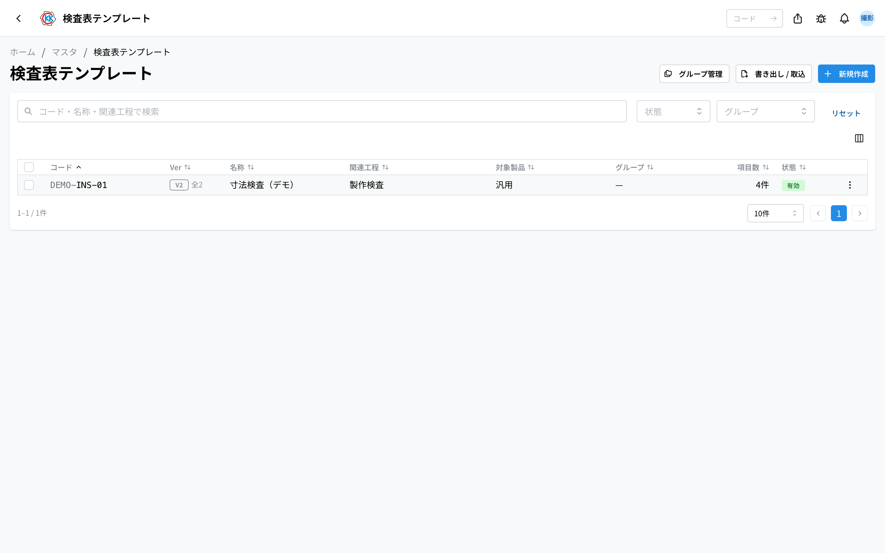
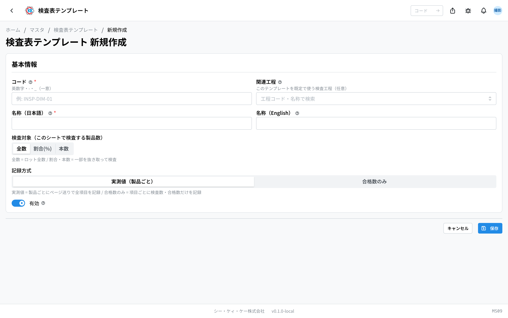
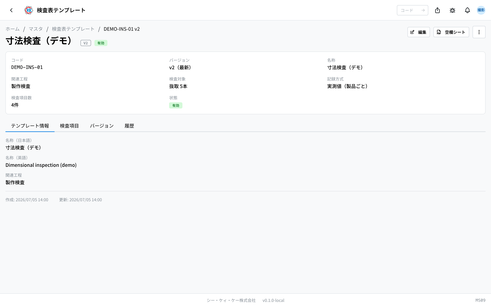
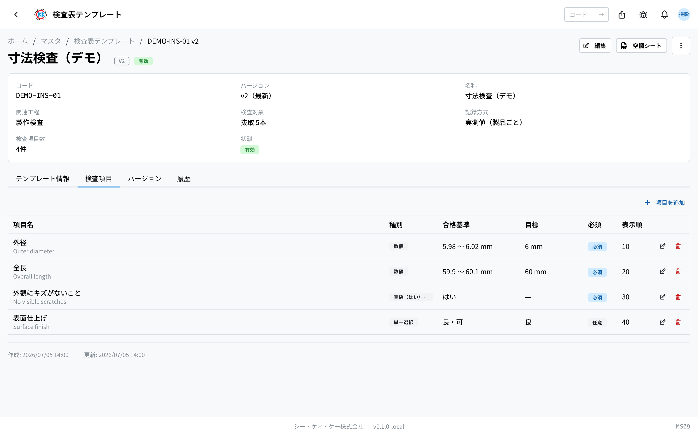
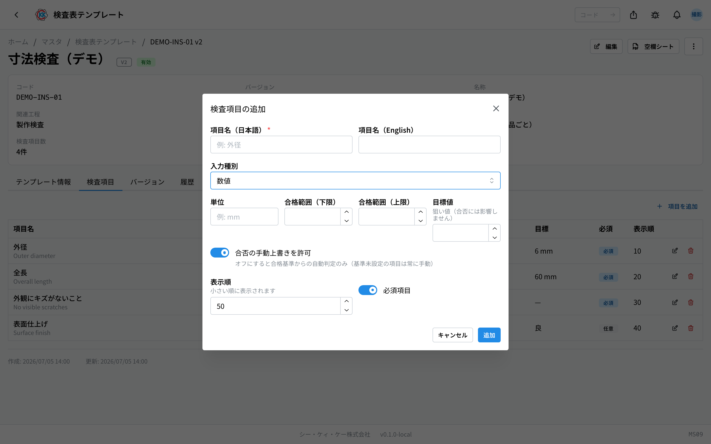
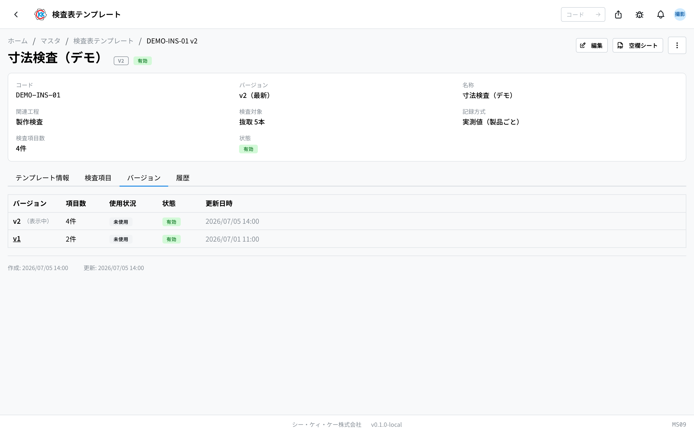

这是用于事先决定 **检查时测量什么** 的检查表 **样板** 的应用。操作代码是 `MS09`。

把样板附加到[指示书](/manual/zh/operations/production/work-order/user)的**检查工序**上，现场就会按照这个样板输入检查记录。

> ⚠️ 本应用处于试用公开阶段。根据您使用的环境，可能还看不到它。

## 本应用可以做什么

- 可以制作检查表的样板。
- 可以在样板中排列 **检查项目**（外径、全长、有无划伤等）。
- 可以为每个项目设定「从多少到多少算合格」的 **合格标准**。设定好标准后，现场只要输入数值，就会自动判定合格或不合格。
- 可以决定 **是全部检查，还是只抽取一部分检查**。
- 可以打印手写用的 **空白检查表 PDF**。

## 本页出现的词语

- **检查表模板** … 检查表的样板。附加到指示书的检查工序上，表示「请用这个样板进行检查」。
- **检查项目** … 样板中的一行。表示「测量外径」「查看有无划伤」等一项确认内容。
- **合格标准** … 判定为「合格」的条件。数值的话，可以设定为「在 5.98 ～ 6.02 mm 之间算合格」。
- **抽检** … 不是检查全部产品，而是只取出一部分进行检查。本界面上通过「**検査対象**」（检查对象）设定。
- **版本** … 样板的版次。要修改内容时，保留当前版次不变，另外制作新版次。

## 开始之前

- 使用本应用需要 **主数据权限**。
- 想把样板与检查工序关联时，需要先在[工序主数据](/manual/zh/operations/masters/process-step/user)中登记好检查工序。

## 界面的看法

打开应用后，会显示已登记样板的列表。

- 列表按 **コード**（代码）/ **Ver**（版本）/ **名称**（名称）/ **関連工程**（相关工序）/ **項目数**（项目数）/ **状態**（状态）的顺序排列。
- 「**Ver**」列显示最新版次的编号（例 `v2`）。还有旧版次时，会一起显示版次数量，例如「全2」（共 2 个）。
- 用上方的「**コード・名称・関連工程で検索**」（按代码・名称・相关工序搜索）栏，可以筛选出您要找的样板。
- 点击行，就会打开该样板的详细界面。

## 制作样板

1. 点击列表界面右上角的「**新規作成**」（新建）。
2. 在「**コード**」（代码）中输入代表该样板的文字（例 `INSP-DIM-01`）。可以使用英文数字、连字符和下划线。
3. 在「**名称**」（名称）的日语栏中输入检查表的名称（例 寸法検査 / 尺寸检查）。
4. 在「**関連工程**」（相关工序）栏中输入工序名，选择平时使用该样板的检查工序（留空也可以保存）。
5. 在「**検査対象**」（检查对象）中选择检查多少支。请见下面的说明。
6. 选择「**記録方式**」（记录方式）。请见下面的说明。
7. 点击「**保存**」（保存）。

检查项目不在这个表单中输入。保存后会打开详细界面，在那里添加。

> 💡 「**コード**」（代码）保存之后无法更改。名称和检查项目以后可以修改。

### 検査対象（检查对象，检查多少支）

- **全数**（全数）… 把做出来的全部支数都检查。
- **割合(%)**（比例%）… 只取出设定比例的支数进行检查（例 10 % 时，100 支中检查 10 支）。
- **本数**（支数）… 只取出设定的支数进行检查（例 5 支）。

选择「割合(%)」（比例%）或「本数」（支数）后，右侧会出现输入数量的栏。界面上也写着「**全数 = ロット全数 / 割合・本数 = 一部を抜き取って検査**」（全数 = 整批全部；比例・支数 = 抽取一部分检查）。

### 記録方式（记录方式，如何记录）

- **実測値（製品ごと）**（实测值，按产品）… 一支一支地记录所有项目的数值。想保留实际测量数值时选这个。
- **合格数のみ**（仅合格数）… 每个项目只记录「检查了多少支、合格了多少支」，不保留具体数值。

保存后会打开该模板的详细界面。上方会集中显示「**コード**」（代码）、「**バージョン**」（版本）、「**名称**」（名称）、「**関連工程**」（相关工序）、「**検査対象**」（检查对象）、「**記録方式**」（记录方式）、「**検査項目数**」（检查项目数）、「**状態**」（状态），可以在这里确认刚才决定的内容。下方是「**テンプレート情報**」（模板信息）、「**検査項目**」（检查项目）、「**バージョン**」（版本）、「**履歴**」（历史）这几个标签页。

## 添加检查项目

在保存后打开的详细界面中，打开「**検査項目**」（检查项目）标签页。

1. 点击「**項目を追加**」（添加项目）。
2. 在「**項目名（日本語）**」（项目名，日语）中输入要确认的内容（例 外径）。
3. 在「**入力種別**」（输入类型）中选择现场输入什么。
   - **数値**（数值）… 输入数字（例 6.01）。
   - **真偽（はい/いいえ）**（是否，是/否）… 选择「はい」（是）或「いいえ」（否）。
   - **単一選択**（单选）… 从准备好的选项中选 1 个。
   - **複数選択**（多选）… 从准备好的选项中可以选多个。
4. 配合所选类型，输入合格标准。请见下面的说明。
5. 确认「**表示順**」（显示顺序）。每次添加都会自动填入数字，通常保持原样即可。
6. 必须填写的项目，请保持「**必須項目**」（必填项目）为打开状态。
7. 点击「**保存**」（保存）。

登记好的项目会排列在表格中。表格的列是 **項目名**（项目名）/ **種別**（类型）/ **合格基準**（合格标准）/ **目標**（目标）/ **必須**（必填）/ **表示順**（显示顺序）。用行右侧的图标可以编辑或删除。

### 合格标准的设定方法

按类型不同，需要填写的内容也不同。

- **数値**（数值）… 填写「**単位**」（单位，例 mm）以及「**合格範囲（下限）**」（合格范围下限）和「**合格範囲（上限）**」（合格范围上限）。只填其中一个也可以。输入的数值在这个范围内，就会自动判定为合格。
- **真偽（はい/いいえ）**（是否）… 选择哪个回答算合格。
- **単一選択 / 複数選択**（单选 / 多选）… 先登记选项，再选择「**合格とする選択肢**」（算作合格的选项）。

「**目標値**」（目标值）和「**目標（任意）**」（目标，可选）是用来写下期望值的栏。正如界面上写的「**狙い値（合否には影響しません）**」（目标值，不影响合格与否），它与合格・不合格无关。

> 💡 不设定合格标准就保存时，该项目不会自动判定，需要现场自己选择合格或不合格。关闭「**合否の手動上書きを許可**」（允许手动覆盖合格与否）后，就只使用自动判定，列表中会显示「上書き不可」（不可覆盖）。

## 修改内容（制作新版本）

该样板一旦在指示书或检查记录中被使用过，内容就无法再修改。这是为了防止已经检查完的记录内容事后被改变。处于这种状态的样板，详细界面上不再显示「**編集**」（编辑）按钮。

想修改内容时，请制作新版本。

1. 点击详细界面右上角的「**…**」（三个点的按钮）。
2. 选择「**新バージョンを作成**」（创建新版本）。
3. 会弹出确认小窗口，请阅读内容后点击「**新バージョンを作成**」（创建新版本）。

系统会复制当前的检查项目，生成新版次（v2、v3 …）。此前的指示书和检查记录仍保持旧版次，不会改变。

打开「**バージョン**」（版本）标签页，可以看到此前所有版次的列表。当前查看的版次会标注「（表示中）」（显示中）。通过「使用状況」（使用情况）列，可以知道该版次是否在使用中（使用中 / 未使用）。

## 打印手写用的检查表

点击详细界面右上角的「**空欄シート**」（空白表），会生成只排列检查项目的空白 PDF。想在现场手写时，可以打印使用。

## 输入项

检查表模板登记画面的输入项一览。

| 项目 | 填什么 |
|------|--------|
| [编码 / 名称](#field-code) | 模板的管理编号与名称，关联到指示书的检查工序时按该名称选择 |
| [关联工序](#field-process-step) | 该检查表用于哪道工序 |
| [有效](#field-active) | 取消后，关联到指示书检查工序的选项中将不再显示 |

### 编码 / 名称 [#field-code]

模板的管理编号与名称，关联到指示书的检查工序时按该名称选择。

### 关联工序 [#field-process-step]

该检查表用于哪道工序。指定后在该工序的执行画面中更易选择。

### 有效 [#field-active]

取消后，关联到指示书检查工序的选项中将不再显示。

## 常见问题・遇到麻烦时

**Q. 找不到「編集」（编辑）按钮。**
A. 该版次已在指示书或检查记录中被使用，处于无法修改的状态。请从「**…**」中选择「**新バージョンを作成**」（创建新版本），在新版次上修改。

**Q. 出现「このバージョンは指示書または検査記録で使用中のため変更できません。新バージョンを作成してください」（该版本已在指示书或检查记录中使用，无法修改。请创建新版本）。**
A. 原因与上面相同。请先创建新版本，再进行修改。

**Q. 出现「合格範囲の上限は下限以上にしてください」（合格范围的上限请设为大于等于下限）。**
A. 上限数值比下限小了。请像「下限 5.98 / 上限 6.02」这样，把上限设为较大的数。

**Q. 出现「選択肢を 1 つ以上登録してください」（请至少登记 1 个选项）。**
A. 「単一選択」（单选）「複数選択」（多选）的项目必须先登记选项。请用「追加」（添加）创建选项后再保存。

**Q. 输入了数值，却没有自动判定合格・不合格。**
A. 该项目可能没有填写合格范围。请编辑项目，填写「合格範囲（下限）」（合格范围下限）和「合格範囲（上限）」（合格范围上限）。

**Q. 填了目标值，判定却没有变化。**
A. 这是正常的。目标值只是写下期望值的栏，与合格・不合格无关。

**Q. 无法删除样板。**
A. 只要有使用该版次的指示书或检查记录，就无法删除。不再使用的样板，请不要删除，改为「**無効化**」（停用）。停用后，新的指示书中就无法选择它，此前的记录仍然保留。

<!-- permissions:start -->
## 所需权限

使用本画面需要 **主数据管理**（`master`）权限。

| 想做的事 | 所需权限 |
| --- | --- |
| 打开画面、查看列表与明细 | 主数据管理 — 查看 |
| 新增・变更・删除 | 主数据管理 — 创建 / 更新 / 删除 |

仅查看有「查看」即可。画面中若有新增、变更或删除的操作，则分别需要对应的权限。

权限通过角色授予。若不足，请与管理员联系。

权限的整体说明请参见「[权限与角色](../../../permissions)」。
<!-- permissions:end -->
