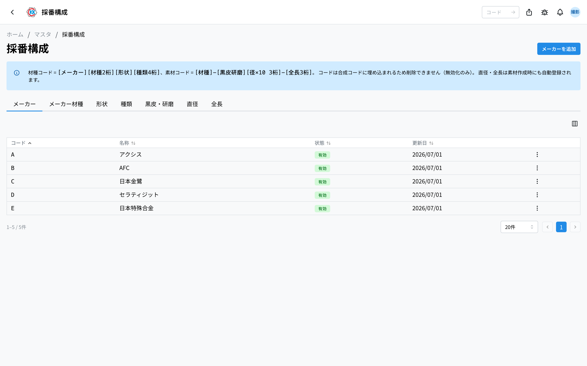
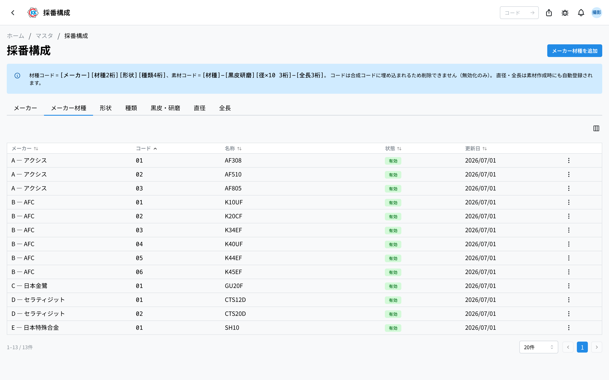
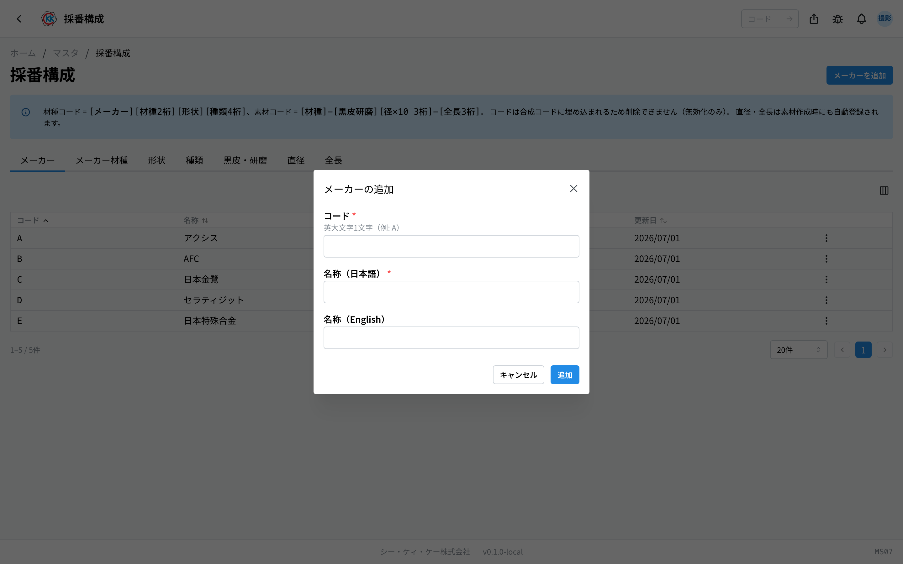
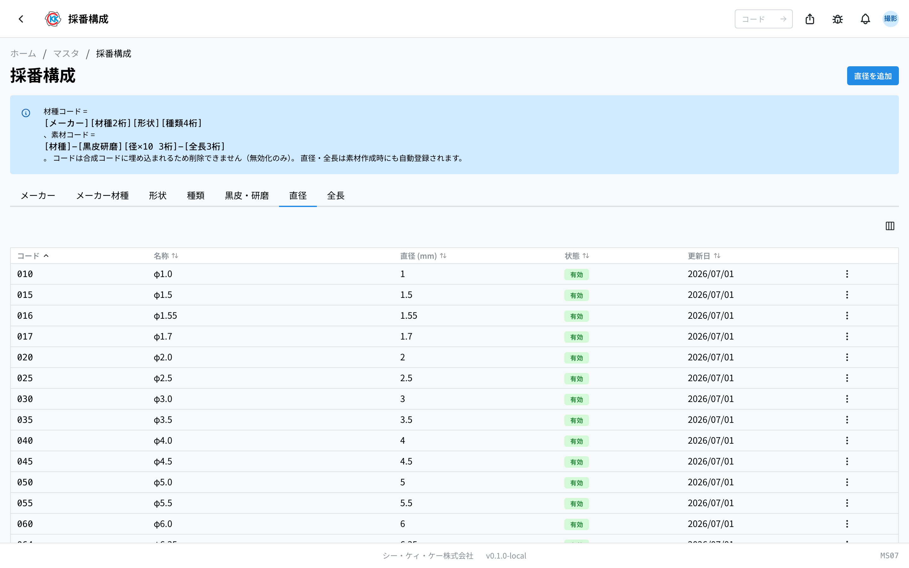

这是用于登记组成[材种](/manual/zh/operations/masters/material-type/user)代码和[材料](/manual/zh/operations/masters/material/user)代码的「部件」的画面。操作码是 `MS07`。

登记材种或材料时，「メーカー」（厂商）、「形状」（形状）等都是 **从选项中选择** 的。准备这些选项本身的，就是本画面。**例如开始使用新厂商的材料时，请先在这里添加。**

> ⚠️ 本应用目前 **仅在开发环境（测试用环境）** 中可用。在正式投入使用之前，画面和操作步骤可能会有变化。

## 本应用可以做什么

- 可以集中查看材种代码、材料代码所使用的 7 类选项。
- 可以添加新的厂商、形状等。
- 可以让不再使用的选项不出现在新登记的选项中。

## 本页出现的词语

- **構成要素（构成要素）** … 组成代码的「部件」，指厂商、形状等每一个选项。
- **材種コード（材种代码）** … 每个材种一个的 8 位编号（例如 `A02A0001`）。
- **素材コード（材料代码）** … 在材种代码后加上表面处理、直径、长度的编号（例如 `A02A0001-A080-310`）。
- **黒皮 / 研磨（黑皮 / 研磨）** … 材料表面处理的区分。

## 开始之前

使用本应用需要 **主数据权限**。画面打不开时，请咨询管理员。

日常业务中几乎不会打开本画面。它是 **在[材种](/manual/zh/operations/masters/material-type/user)或[材料](/manual/zh/operations/masters/material/user)的登记画面上找不到想选的选项时** 才使用的画面。

## 界面说明

本画面分为 7 个标签。点击上方的标签即可切换显示内容。

| 标签 | 是什么的选项 | 用在哪里 |
|---|---|---|
| **メーカー**（厂商） | 材料厂商 | 材种代码的开头 1 位 |
| **メーカー材種**（厂商材种） | 该厂商内部的等级 | 材种代码的第 2〜3 位 |
| **形状**（形状） | 通常 / OH / 円筒（普通 / OH / 圆筒）等 | 材种代码的第 4 位 |
| **種類**（种类） | 按形状细分的类别 | 登记材料时选择 |
| **黒皮・研磨**（黑皮・研磨） | 材料的表面处理 | 材料代码中间的 1 位 |
| **直径**（直径） | 材料的粗细 | 材料代码中间的 3 位 |
| **全長**（全长） | 材料的长度 | 材料代码最后的 3 位 |

无论哪个标签，表格中都会有「**コード**」（代码）、「**名称**」（名称）、「**状態**」（状态）、「**更新日**」（更新日期）。「メーカー材種」（厂商材种）标签还会有表示属于哪家厂商的「**メーカー**」（厂商）列，「種類」（种类）标签则会有「**形状**」（形状）列。

## 添加选项

1. 打开要添加的类别的标签。
2. 点击画面右上角的按钮。**按钮上的文字会随打开的标签而变化**（「**メーカーを追加**」／添加厂商、「**形状を追加**」／添加形状等）。
3. 在打开的画面中填写内容（请参见下表）。
4. 点击「**追加**」（添加）。

| 标签 | 需要填写的内容 |
|---|---|
| メーカー（厂商） | 在「**コード**」（代码）中填 1 个英文大写字母（例如 `A`），以及「**名称（日本語）**」（名称・日文） |
| メーカー材種（厂商材种） | 选择「**メーカー**」（厂商），在「**コード**」（代码）中填 2 个数字（例如 `01`），以及「**名称（日本語）**」（名称・日文） |
| 形状（形状） | 在「**コード**」（代码）中填 1 个英文大写字母，以及「**名称（日本語）**」（名称・日文） |
| 種類（种类） | 选择「**形状**」（形状），在「**コード**」（代码）中填 2 个字符（可混用英文大写字母和数字，例如 `B5`），以及「**名称（日本語）**」（名称・日文） |
| 黒皮・研磨（黑皮・研磨） | 在「**コード**」（代码）中填 1 个英文大写字母，以及「**名称（日本語）**」（名称・日文） |
| 直径（直径） | 只填「**直径 (mm)**」（直径・毫米）（0.1〜99.9）。代码会自动确定 |
| 全長（全长） | 「**全長 (mm)**」（全长・毫米）（1〜999），需要时再填「**カスタム識別（任意）**」（自定义标识・选填）（例如 特注 330L） |

> 💡 在「直径」（直径）和「全長」（全长）标签中，**不需要自己决定代码**。输入数值后，输入栏下方会显示自动确定的 3 位数字「コード:」（代码）。

> 💡 「直径」（直径）和「全長」（全长）在登记[材料](/manual/zh/operations/masters/material/user)时会 **当场自动添加**。在本画面事先添加，只是为了预先准备好选项，或者为了整理名称。

## 隐藏不再使用的选项

本画面中的项目 **无法删除**。因为一旦创建的代码已经包含在材种代码、材料代码之中。请改为设成「無効」（无效）。

1. 点击要隐藏那一行右侧的菜单。
2. 选择「**無効化**」（停用）。
3. 会出现名为「無効化の確認」（停用确认）的画面，点击「**無効化する**」（确定停用）。

设为无效后，**在创建新的材种或材料时就不会再出现在选项中**。已经登记的材种代码、材料代码则完全不受影响。

如果想再次使用，可以按同样的步骤用「**有効化**」（启用）恢复。

## 输入项

采番构成用于登记组合材种编码・材料编码所需的「部件」。各部件的输入项相同，如下所示。

| 项目 | 必填 | 填什么 |
|------|------|--------|
| [编码](#field-code) | 必填 | 用于编码的符号 |
| [名称](#field-name) | 必填 | 选项中显示的名称 |
| [有效](#field-active) | — | 是否出现在选项中 |

### 编码 [#field-code]

构成材种编码・材料编码一部分的符号。**日后更改会与已用其组合的既有编码不符**，请在登记时确定。位数按部件固定（厂商为 1 位，直径为 3 位等）。

### 名称 [#field-name]

在材种与材料画面的选项中显示的名称。

### 有效 [#field-active]

取消后，登记材种与材料时的选项中将不再显示。适用于**隐藏不再使用的厂商或形状，同时保留过往登记**的情况。

## 常见问题与故障处理

**Q. 出现「同じコードが既に存在します」（相同代码已存在），无法添加。**
A. 该代码已被使用。请查看表格，确认要找的项目是否已经存在。如果只是被设为「無効」（无效），可以用「有効化」（启用）恢复。

**Q. 出现「コードは英大文字1文字です」（代码为 1 个英文大写字母）。**
A. 代码栏中请只填入 1 个英文大写字母。小写字母、数字以及 2 个以上的字符都不能使用。

**Q. 出现「コードは数字2桁です」（代码为 2 位数字）或「コードは英数字2桁です」（代码为 2 位英数字）。**
A. 厂商材种的代码是 2 个数字（例如 `01`）。种类的代码可以混用英文大写字母和数字，共 2 个字符（例如 `B5`）。请正好填 2 个字符。

**Q. 找不到删除按钮。**
A. 本画面没有删除功能。因为代码已包含在材种代码、材料代码之中，删除后过去的数据就无法读取了。不使用的项目请「無効化」（停用）。

**Q. 停用之后，该材料过去的数据会怎么样？**
A. 不会有任何变化。过去的材种代码、材料代码会原样保留，也可以继续使用。变为无效的只是「今后新建时的选项」。

**Q. 名称登记错了，可以修改吗？**
A. 本画面没有编辑功能。请把填错的项目「無効化」（停用），再用正确的名称新添加一个。不过代码不能重复，因此需要使用另一个代码。

<!-- permissions:start -->
## 所需权限

使用本画面需要 **主数据管理**（`master`）权限。

| 想做的事 | 所需权限 |
| --- | --- |
| 打开画面、查看列表与明细 | 主数据管理 — 查看 |
| 新增・变更・删除 | 主数据管理 — 创建 / 更新 / 删除 |

仅查看有「查看」即可。画面中若有新增、变更或删除的操作，则分别需要对应的权限。

权限通过角色授予。若不足，请与管理员联系。

权限的整体说明请参见「[权限与角色](../../../permissions)」。
<!-- permissions:end -->
