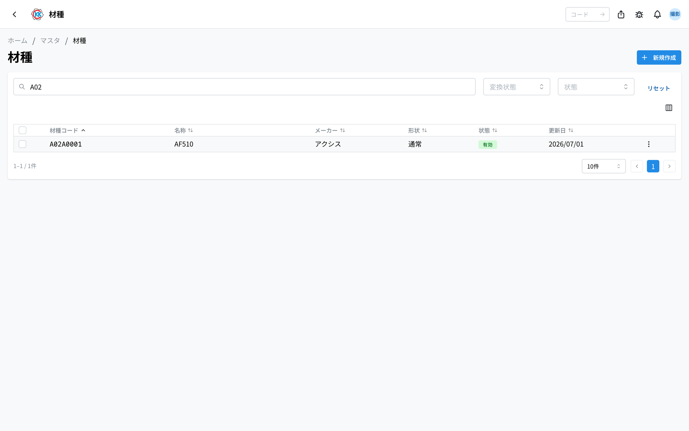
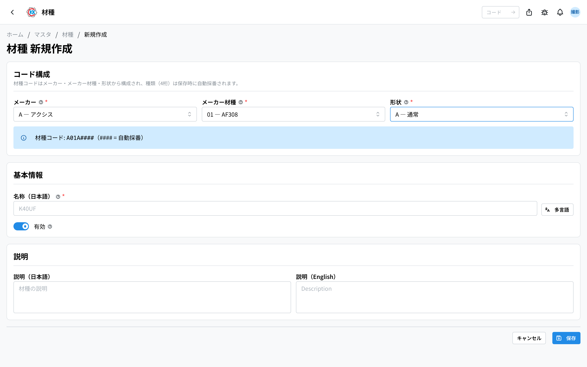
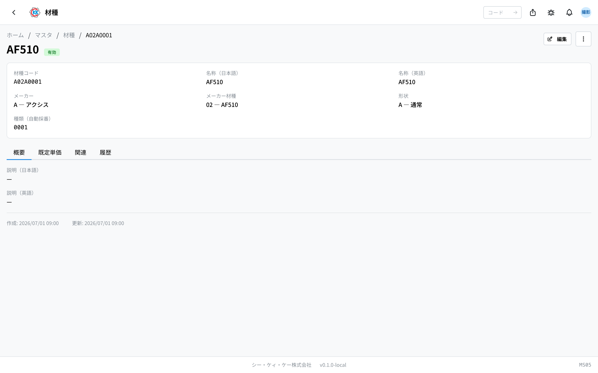
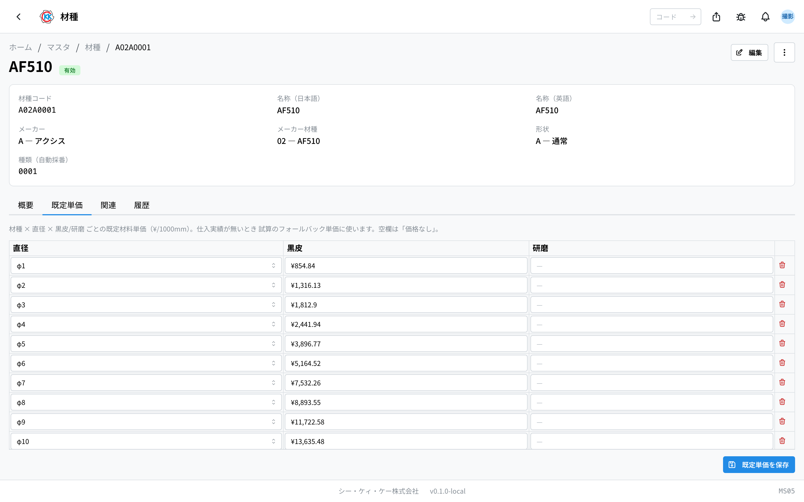

This is a ledger for the kinds of material. The operation code is `MS05`.

Here you register "whose material it is and what kind it is". **If a material type is not registered, you cannot set the material for a [Product](/manual/en/operations/masters/product/user) or a [Material](/manual/en/operations/masters/material/user).** You also cannot work out the material cost in a [Trial Estimate](/manual/en/operations/sales/trial-estimate/user).

## What you can do in this app

- You can register the kinds of material.
- After you register one, you can choose it in products, materials and trial estimates.
- For each material type, you can register the **standard price** for each diameter and each surface finish.
- You can see the list of materials that use that material type.

## Words used on this page

- **材種 (Material type)** … the kind of material. It is a unit such as "Axis AF510 round bar".
- **材種コード (Material type code)** … an 8-character number given to each material type. It is built automatically from what you registered.
- **メーカー材種 (Maker grade)** … the grade name of the material inside that maker (AF510, K40UF and so on).
- **形状 (Shape)** … the shape of the material (通常 / OH / 円筒 — normal / OH / cylinder).
- **黒皮 / 研磨 (Black skin / Ground)** … the surface finish of the material.
- **既定単価 (Default unit price)** … the standard price of that material type.

## Before you start

You need **master data permission** to use this app. If the screen does not open, please ask your administrator.

To register a material type, the **maker, the maker grade and the shape** must already be registered in [Numbering Setup](/manual/en/operations/masters/material-numbering/user). If the maker you want does not appear, please register it there first.

## How the material type code works

The material type code is **8 characters**, made by joining four parts from left to right. You do not type them one by one — the code is **built automatically from what you choose**.

For example, `A02A0001` is read like this.

| Place | What you see | What it means |
|---|---|---|
| First 1 character | `A` | Maker (Axis in this case) |
| Next 2 characters | `02` | Maker grade (AF510 in this case) |
| Next 1 character | `A` | Shape (normal in this case) |
| Last 4 characters | `0001` | Serial number (**added automatically**) |

The last 4 characters are a serial number inside the same maker, the same grade and the same shape. **You do not need to decide it yourself.** It is added automatically when you save.

## How to read the screen

When you open the app, a list of the registered material types is shown.

- **材種コード (Material type code)** … the 8-character number.
- **メーカー / 形状 (Maker / Shape)** … shows what you chose.
- **状態 (Status)** … the green 「**有効**」 (Active) means a material type you can still use. The gray 「**無効**」 (Inactive) means one you can no longer choose.
- Use the search box at the top (「**材種コード・名称で検索**」 / Search by material type code or name) to narrow the list.
- Click a row to open the detail screen for that material type.

> 💡 Some material types brought over from the old system do not have a code yet. Those rows show 「**未変換**」 (Not converted) in gray. You can correct the name and so on, but **you cannot choose them when you make a [Material](/manual/en/operations/masters/material/user).** If you choose 「未変換」 (Not converted) in the 「**変換状態**」 (Conversion status) field, only those material types are shown.

## Registering a material type

1. Press 「**新規作成**」 (New) at the top right of the list screen.
2. Choose 「**メーカー**」 (Maker).
3. Choose 「**メーカー材種**」 (Maker grade). **You cannot use this field until you have chosen a maker.**
4. Choose 「**形状**」 (Shape).
5. A blue bar shows 「**材種コード:**」 (Material type code) with the code that will be made. The last 4 characters are shown as `####`, and they change to the real number when you save.
6. Enter the name of the material type in 「**名称（日本語）**」 (Name in Japanese) — for example, AF510. **This field must always be filled in.**
7. If you need to, write extra information in 「**説明（日本語）**」 (Description in Japanese).
8. Press 「**保存**」 (Save).

> ⚠️ **The maker, the maker grade and the shape cannot be changed after you save.** They are part of the code. If you chose the wrong one, please register a new material type instead.

## Looking at what you registered

The screen of a saved material type has four tabs.

- **概要** (Overview) … the description (Japanese and English).
- **既定単価** (Default unit price) … the standard price for each diameter and each surface finish.
- **関連** (Related) … the list of materials that use this material type. Click one to open that material.
- **履歴** (History) … the record of when and who changed this registration.

To correct the name or the description, press 「**編集**」 (Edit) at the top right of the screen. **Only three things can be edited: the name, the description and the active setting.**

## Registering the standard price

When there is no purchase record for the material yet, the material cost in a [Trial Estimate](/manual/en/operations/sales/trial-estimate/user) uses the price you register here. **If this is empty, the trial estimate cannot show a material cost.**

1. On the material type screen, open the 「**既定単価**」 (Default unit price) tab.
2. Press 「**直径を追加**」 (Add diameter). One row is added.
3. In the 「**直径**」 (Diameter) field of the new row, choose the diameter.
4. Enter the price in the field for each surface finish (「黒皮」 black skin, 「研磨」 ground, 「研磨済黒皮」 ground black skin). There is one column for each registered surface finish.
5. To add more diameters, press 「**直径を追加**」 (Add diameter) again.
6. Finally, press 「**既定単価を保存**」 (Save default unit prices).

> 💡 The price you enter here is the **amount per 1000mm**. The screen also shows 「¥/1000mm」 at the top.
> Please note that it is not the price of one 330mm-long bar.

> 💡 For a combination with no decided price, **please leave the field empty**. An empty field is treated as "no price".

To remove a row you no longer need, press 「**行を削除**」 (Delete row) and then press 「既定単価を保存」 (Save default unit prices).

## What to do with a material type you no longer use

Even when you stop using a material type, **please do not delete it**. Materials and products made from it point to it. Set it to "Inactive" instead.

1. Press the menu (the button with three dots) at the top right of the material type screen.
2. Choose 「**無効化**」 (Deactivate).
3. On the confirmation screen, press 「**無効化する**」 (Deactivate).

Once it is inactive, you can no longer choose it when you register a new material, but **the past data stays as it is**.

## Input fields

Every field on the material type screen. The material type code is **assembled automatically** from the four selections below.

| Field | Required | What to enter |
|-------|----------|---------------|
| [Manufacturer](#field-manufacturer) | Required | The material manufacturer |
| [Manufacturer grade](#field-grade) | Required | The grade within that manufacturer |
| [Shape](#field-shape) | Required | Standard, OH, cylinder and so on |
| [Kind (auto)](#field-kind) | Automatic | Serial within the three above |
| [Name](#field-name) | Required | The material type name |
| [Description (ja / en)](#field-description) | Optional | Notes |
| [Active](#field-active) | — | Whether it appears in pick lists |

### Manufacturer [#field-manufacturer]

The material manufacturer. The options are registered in [Numbering Components](/manual/en/operations/masters/material-numbering/user).

### Manufacturer grade [#field-grade]

The grade within that manufacturer; choosing a manufacturer narrows the list.

### Shape [#field-shape]

Standard, OH, cylinder and so on.

### Kind (auto) [#field-kind]

A serial within the manufacturer, grade and shape combination. **It is assigned automatically.**

### Name [#field-name]

The material type name, shown on material and product screens.

### Description (ja / en) [#field-description]

Notes. Filling in both languages keeps it readable in English too.

### Active [#field-active]

Turning it off removes it from material type pick lists.

## Questions and problems

**Q. The 「メーカー材種」 (Maker grade) field is gray and I cannot use it.**
A. Please choose 「メーカー」 (Maker) first. The field shows 「先にメーカーを選択」 (Choose a maker first). Once you choose a maker, only the grades of that maker appear.

**Q. I see 「名称（日本語）を入力してください」 (Please enter the name in Japanese) and cannot save.**
A. The Japanese name field is empty. Enter the name of the material type (for example, AF510) and press 「保存」 (Save) again.

**Q. I cannot correct the maker or the shape on the edit screen.**
A. That is how it works. They are part of the code, so they cannot be changed after you save. The screen also says 「コード構成は作成後変更できません。」 (The code structure cannot be changed after creation.) If you chose the wrong one, please register a new material type instead.

**Q. When I try to delete, I see 「この材種に紐づく素材が存在するため削除できません。無効化を検討してください。」 (This material type cannot be deleted because materials linked to it exist. Please consider deactivating it instead).**
A. Materials made from that material type already exist, so it cannot be deleted. This is normal. Please use 「無効化」 (Deactivate).

**Q. When I try to save default unit prices, I see 「同一の直径 × 黒皮/研磨 の行が重複しています」 (There are duplicate rows with the same diameter and black skin / ground).**
A. You have made two rows with the same diameter. Remove one of them with 「行を削除」 (Delete row) and save again.

**Q. I see 「採番が競合しました。再度お試しください」 (The numbering conflicted. Please try again).**
A. This appears when someone else registered the same kind of material type at the same moment. Just press 「保存」 (Save) once more.

**Q. Can I use a material type shown as 「未変換」 (Not converted) in the list?**
A. You can correct the name and so on, but **you cannot choose it when you make a material**. If you want to use it for a material, please register it again from this screen.

<!-- permissions:start -->
## Permissions required

Using this screen requires the **Master data** (`master`) permission.

| What you want to do | Permission needed |
| --- | --- |
| Open the screen, view lists and details | Master data — View |
| Add, change or delete | Master data — Create / Edit / Delete |

Viewing only needs *View*. Where a screen offers adding, changing or deleting, each of those needs its matching permission.

Permissions come through roles. If something is missing, ask an administrator.

For the whole picture see [Permissions and roles](../../../permissions).
<!-- permissions:end -->
