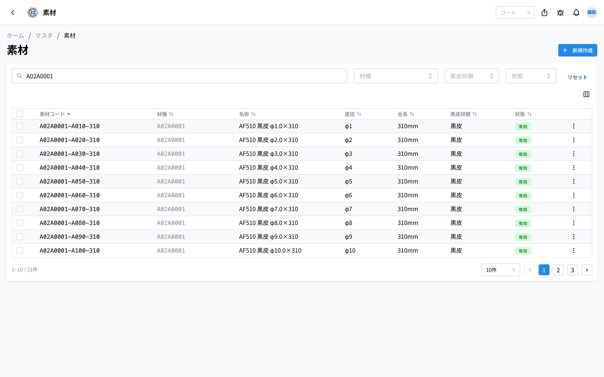
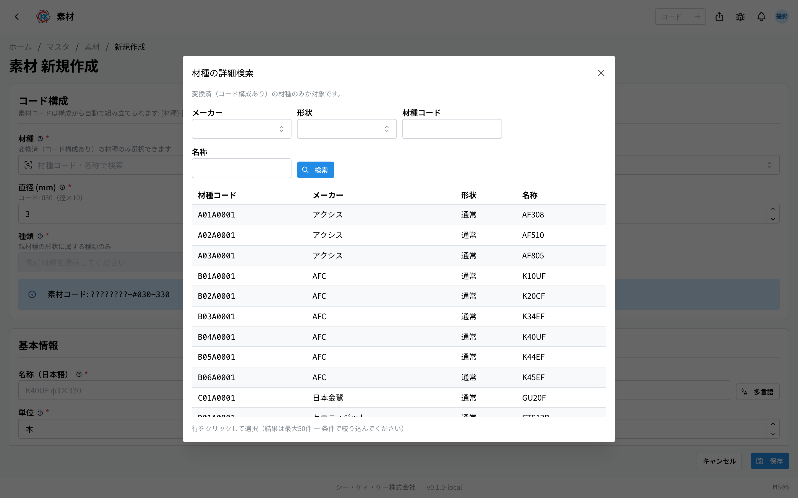
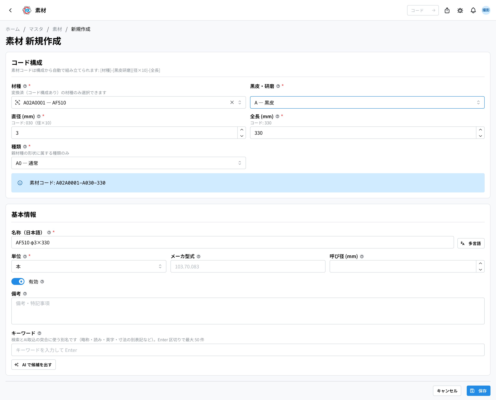
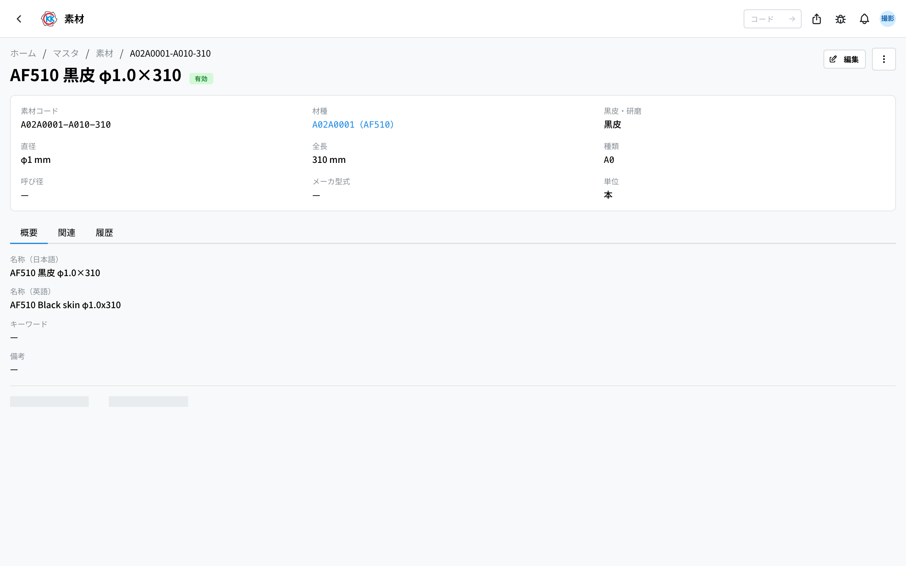

仕入れて在庫する材料の棒を、1 種類ずつ登録しておく台帳です。操作コードは `MS06` です。

[材種](/manual/ja/operations/masters/material-type/user)が「どんな材料か」だとすると、素材は **「その材料の、この太さ・この長さ・この表面仕上げのもの」** という、実際に買って棚に置く 1 本のことです。ここに登録していない素材は、[素材発注書](/manual/ja/operations/purchasing/purchase-order/user)や[在庫管理（素材・仕掛品）](/manual/ja/operations/production/material-inventory/user)で **選べません**。

> ⚠️ このアプリは現在 **開発環境（テスト用の環境）だけ** で使えます。本番で使えるようになるまでに、画面や手順が変わることがあります。

## このアプリでできること

- 仕入れる材料の棒を、太さ・長さ・表面仕上げごとに登録できます。
- 登録すると、素材の発注・入荷・在庫の画面で選べるようになります。
- 素材コードは、選んだ内容から **自動で組み立てられます**。手で打つ必要はありません。
- 仕入れなくなった素材は、消さずに **無効** にしておけます。

## 用語（このページで出てくる言葉）

- **素材（そざい）** … 実際に仕入れて在庫する材料の棒のことです。
- **材種（ざいしゅ）** … 材料の種類です。素材の「親」にあたります（[材種](/manual/ja/operations/masters/material-type/user)で登録します）。
- **黒皮（くろかわ）/ 研磨（けんま）** … 材料の表面の仕上げの区分です。
- **種類** … 形状ごとの細かい区分です。通常の丸材なら自動で決まります。
- **メーカ型式** … メーカーが付けている品番です。
- **呼び径（よびけい）** … カタログなどで使われる、おおまかな太さです。

## はじめる前に

素材を登録するには、先に **[材種](/manual/ja/operations/masters/material-type/user)が登録されている必要があります**。素材は必ず、どれか 1 つの材種にぶら下がります。

また、このアプリを使うには **マスタ権限** が必要です。画面が開かないときは、管理者にご相談ください。

なお、[製品](/manual/ja/operations/masters/product/user)は「材種 + 直径 + 全長」で材料を指定します。**製品が特定の素材と結びつくわけではありません。** この台帳は、あくまで仕入れと在庫のためのものです。

## 素材コードのしくみ

素材コードは、材種コードのうしろに **表面仕上げ・太さ・長さ** をつなげた形です。ひとつずつ入力するのではなく、**選んだ内容から自動で組み立てられます**。

たとえば `A02A0001-A080-310` は次のように読みます。

| 場所 | 見た目 | 意味 |
|---|---|---|
| はじめの 8 文字 | `A02A0001` | 材種コード（親の材種） |
| ハイフンのあと 1 文字 | `A` | 表面仕上げ（この場合は黒皮） |
| 続く 3 文字 | `080` | 直径 8.0mm |
| 最後の 3 文字 | `310` | 全長 310mm |

太さは **10 倍した数字** が入ります。8.0mm なら `080`、12.5mm なら `125` です。入力欄の下にも変換後の数字が出るので、自分で計算する必要はありません。

## 画面の見かた

アプリを開くと、登録済みの素材の一覧が表示されます。

- **素材コード** … ハイフンでつながった番号です。
- **材種 / 直径 / 全長 / 黒皮研磨** … その素材の中身が列で分かれて表示されます。
- **状態** … 緑の「**有効**」は今も使える素材、灰色の「**無効**」はもう選べない素材です。
- 上の検索欄（「**素材コード・名称で検索**」）で絞り込めます。
- 「**材種**」「**黒皮研磨**」の欄で、特定の材種や表面仕上げだけを表示できます。
- 行をクリックすると、その素材の詳しい画面が開きます。

## 素材を登録する

### 親になる材種を選ぶ

1. 一覧画面の右上にある「**新規作成**」を押します。
2. 「**材種**」の欄をクリックして、材種名か材種コードを打ちます。
3. 出てきた候補から選びます。

材種名が思い出せないときは、欄の左にある **虫めがねのボタン** を押します。「材種の詳細検索」という画面が開き、メーカーや形状で絞り込みながら探せます。

### 太さ・長さ・表面仕上げを入れる

4. 「**黒皮・研磨**」を選びます。
5. 「**直径 (mm)**」に太さを入れます（0.1 から 99.9 まで）。
6. 「**全長 (mm)**」に長さを入れます（1 から 999 まで）。
7. 「**種類**」を選びます。ふつうの丸材のときは自動で選ばれています。
8. 青い帯に「**素材コード:**」と、できあがるコードが表示されます。

### 名前と単位を確認して保存する

9. 「**名称（日本語）**」には「材種名 φ直径×全長」の形で **自動で名前が入ります**。そのままで構いませんし、書き換えてもかまいません。
10. 「**単位**」を確認します（ふつうは「本」です）。
11. 「**メーカ型式**」「**呼び径 (mm)**」「**備考**」は、分かる範囲で入れます（空欄でも保存できます）。
12. 「**保存**」を押します。

> ⚠️ **材種・黒皮研磨・直径・全長・種類は、保存したあとは変えられません。** コードの一部になっているためです。入れ間違えたときは、新しく登録し直してください。

> ⚠️ 太さ・長さ・表面仕上げがまったく同じ素材は、2 つ登録できません。すでにある素材をお使いください。

## 登録した内容を見る

保存した素材の画面には、3 つのタブがあります。

画面の上には、素材コード・材種・黒皮研磨・直径・全長・種類・呼び径・メーカ型式・単位が並びます。

- **概要** … 名称（日本語・英語）と備考です。
- **関連** … 製品とのつながりについての説明です。
- **履歴** … いつ誰がこの登録内容を変えたかの記録です。

内容を直したいときは、画面右上の「**編集**」を押します。**編集できるのは名称・単位・メーカ型式・呼び径・キーワード・有効・備考です。**

## 仕入れなくなった素材の扱い

その素材を仕入れなくなっても、**削除しないでください**。過去の発注や在庫の記録がその素材を参照しているためです。代わりに「無効」にします。

1. 素材の画面の右上にあるメニュー（点が 3 つのボタン）を押します。
2. 「**無効化**」を選びます。
3. 確認の画面で「**無効化する**」を押します。

無効にすると新しい発注や指示書では選べなくなりますが、**過去のデータはそのまま残ります**。

## 入力項目

素材の登録画面で入力する項目の一覧です。素材コードは、材種と下の 3 つから**自動で組み立てられます**。

| 項目 | 必須 | 何を入れるか |
|------|------|-------------|
| [材種](#field-material-type) | 必須 | もとになる材種 |
| [黒皮・研磨](#field-surface-finish) | 必須 | 表面の状態 |
| [直径 (mm) / 全長 (mm)](#field-dimensions) | 必須 | 素材の寸法 |
| [種類](#field-kind) | 必須 | 形状ごとの種類 |
| [素材コード](#field-code) | 自動 | 上の組み合わせから決まる |
| [名称](#field-name) | 必須 | 素材の名前 |
| [単位](#field-unit) | 必須 | 本・kg など |
| [メーカ型式 / 呼び径 (mm)](#field-model) | 任意 | メーカーの型式と呼び径 |
| [キーワード](#field-keywords) | 任意 | 別の呼び方（検索とAI取込に使う） |
| [有効](#field-active) | — | 選択肢に出すかどうか |
| [備考](#field-notes) | 任意 | 補足 |

### 材種 [#field-material-type]

もとになる材種です。先に[材種](/manual/ja/operations/masters/material-type/user)を登録しておきます。

### 黒皮・研磨 [#field-surface-finish]

表面の状態です。**黒皮・研磨・研磨済黒皮から選びます。** 価格試算では、この違いで材料単価が変わります。

### 直径 (mm) / 全長 (mm) [#field-dimensions]

素材の寸法です。この 2 つが素材コードの一部になります。

### 種類 [#field-kind]

形状ごとに決まっている種類です（OH の CH・2V30 など）。

### 素材コード [#field-code]

材種・表面・直径・全長の組み合わせから決まるコードです。**自動で組み立てられます。**

### 名称 [#field-name]

素材の名前です。発注や入荷の画面でこの名前が出ます。

### 単位 [#field-unit]

数え方の単位です。発注や入荷の既定の単位になります。

### メーカ型式 / 呼び径 (mm) [#field-model]

メーカーの型式と呼び径です。発注のときに相手へ伝える情報として登録します。

### キーワード [#field-keywords]

この素材の**別の呼び方**を並べておく欄です。略称、読み（ひらがな・カタカナ）、英語、寸法の別の書き方（φ8.3 / 8.3mm）など、**名称と違う書かれ方**を入れます。

入れておくと 2 つのことができます。

1. **探せる** — 一覧の検索欄にその言葉を打っても出てきます。
2. **自動で見つかる** — 受け取った書類を読み取ったとき、書かれていた名前がこの素材のことだと判断できます。

「**AI で候補を出す**」を押すと、いま入力されている内容（名称・材種・寸法・メーカ型式など）から候補が作られます。**候補は押したものだけが入り、保存するまで登録されません** — 見て、合っているものだけを選んでください。

同じ言葉を 2 つの素材に付けると、どちらのことか決められなくなります。**その素材だけを指す言葉**にしてください。

### 有効 [#field-active]

外すと、発注や入荷の素材の選択肢に出なくなります。

### 備考 [#field-notes]

補足です。後から見た人が経緯をたどれるように、決めた理由や注意点を書いておくと役に立ちます。

## よくある質問・困ったとき

**Q.「同一構成（材種 × 黒皮研磨 × 直径 × 全長）の素材が既に存在します」と出て保存できません。**
A. まったく同じ組み合わせの素材が、すでに登録されています。一覧でその素材を探してお使いください。新しく作る必要はありません。

**Q.「未変換（レガシー）の材種では素材を作成できません。変換済の材種を選択してください。」と出ます。**
A. 選んだ材種にコードがまだ付いていません。[材種](/manual/ja/operations/masters/material-type/user)の画面で新しく登録し直してから、その材種を選んでください。

**Q. 材種の欄に打ち込んでも、使いたい材種が出てきません。**
A. コードが付いている材種だけが選べます。欄の下にも「変換済（コード構成あり）の材種のみ選択できます」と出ています。[材種](/manual/ja/operations/masters/material-type/user)の画面で登録し直してください。

**Q.「種類」の欄が灰色で選べません。**
A. 先に「材種」を選んでください。欄には「先に材種を選択してください」と表示されています。

**Q.「直径は 0.1〜99.9mm で入力してください」と出ます。**
A. 直径は 0.1 から 99.9 までの範囲で入れてください。全長は 1 から 999 までです。

**Q. 編集画面で直径や全長を直せません。**
A. 直せない仕組みです。これらはコードの一部になっているため、保存後は変えられません。入れ間違えたときは、新しく登録し直してください。

**Q. 削除しようとしたら「関連するデータが存在するため実行できません」と出ます。**
A. その素材を使った発注や在庫の記録が既にあるため、消せません。これは正常な動きです。「無効化」を使ってください。
