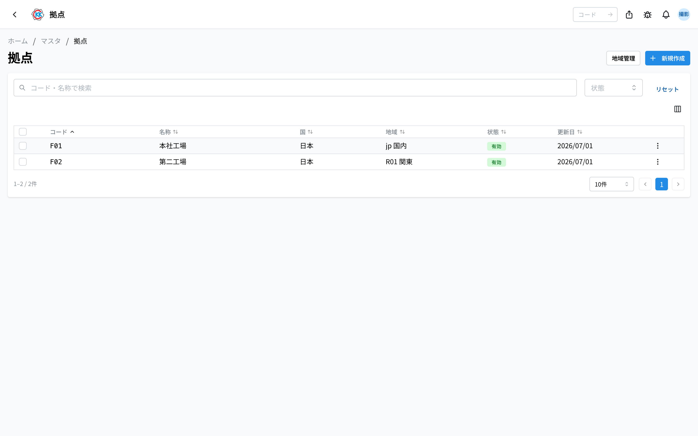
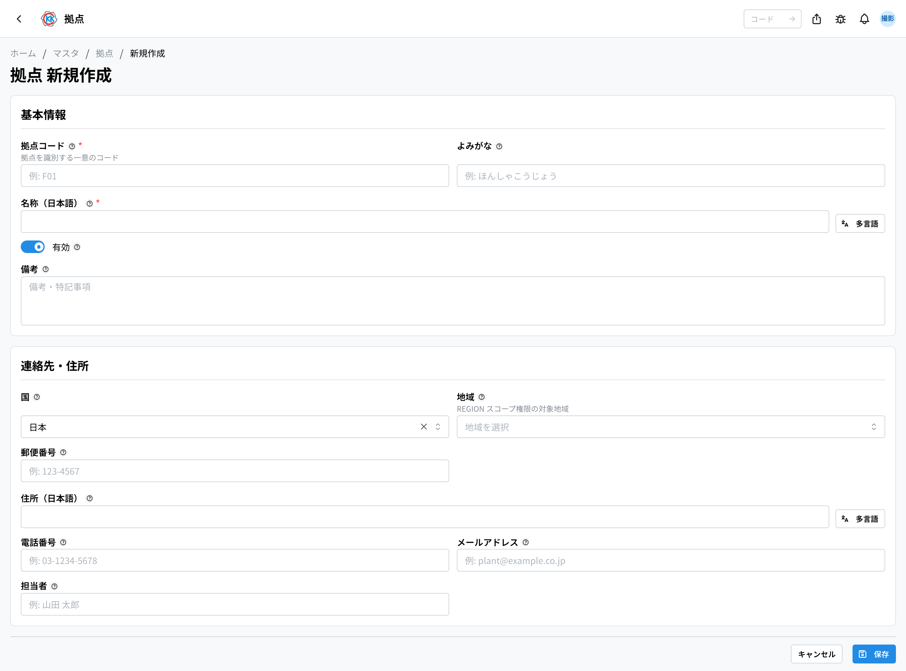
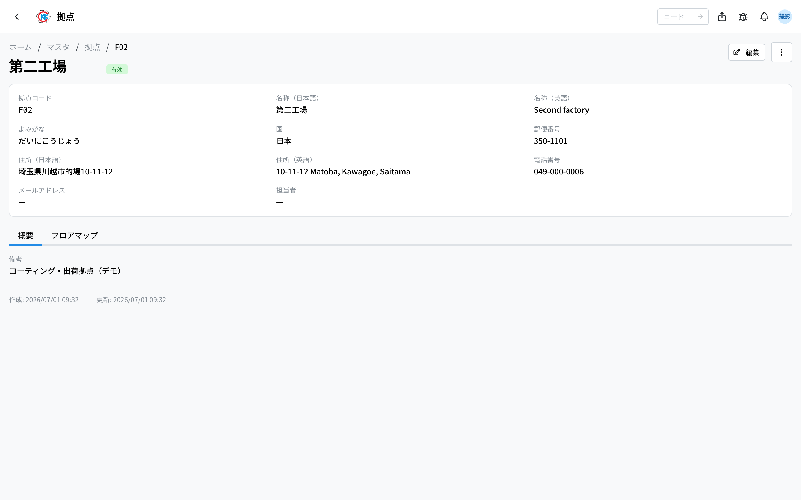
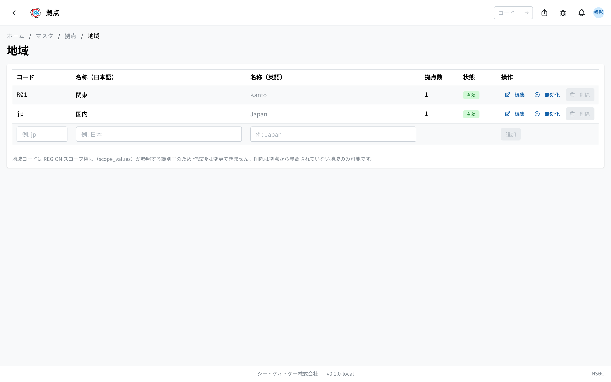
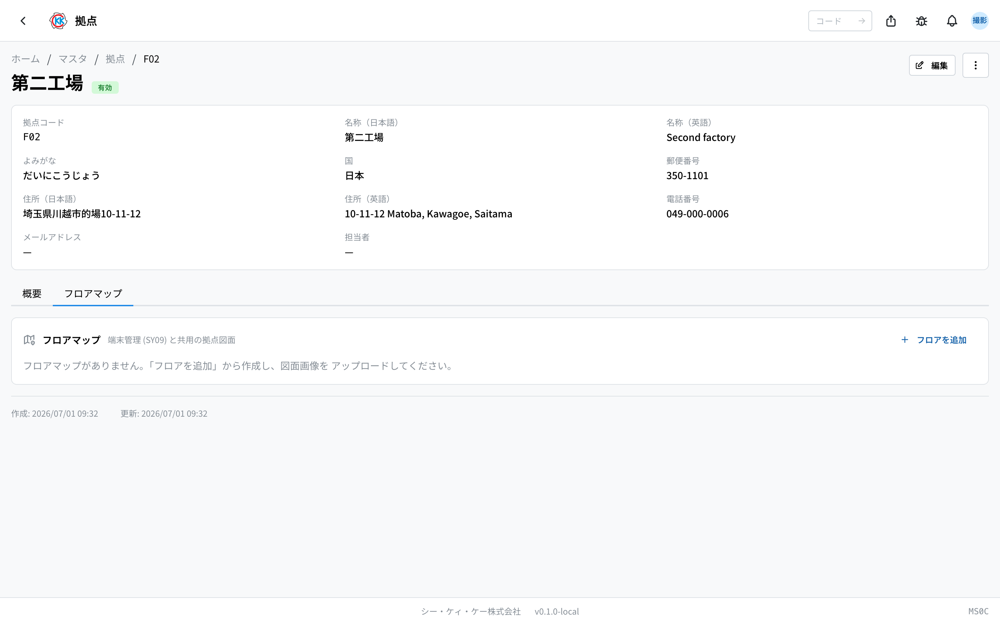

这是用于登记 **据点（工厂・营业所）本身** 的应用。操作代码是 `MS0C`。

[产品库存](/manual/zh/operations/production/product-inventory/user)和[材料库存](/manual/zh/operations/production/material-inventory/user)按据点分开管理，材料的到货地点等也从这里登记的据点中选择。

> ⚠️ 本应用处于试用公开阶段。根据您使用的环境，可能还看不到它。

## 三个相似应用的区别

关于「场所」的应用有 3 个，容易混淆，请注意区分。

| 应用 | 登记什么 | 示例 |
|--------|----------------|-----|
| **拠点（据点）**（本页） | 工厂本身 | 总部工厂、第二工厂 |
| [作業場所（作业场所）](/manual/zh/operations/masters/work-location/user) | 据点内部进行作业的场所・机器 | NC车床1号机、研磨区 |
| [保管場所（保管场所）](/manual/zh/operations/masters/storage-location/user) | 据点内部存放物品的仓库・货架 | 资材仓库A 的 A-1 货架 |

作业场所和保管场所在登记时，都要选择「位于哪个据点」。因此请 **先登记据点**。

## 本应用可以做什么

- 可以登记据点的基本信息（代码、名称、地址、电话号码等）。
- 可以登记把多个据点归并在一起的 **地区**。
- 可以按据点的楼层登记 **图纸**（楼层地图）。

## 本页出现的词语

- **据点** … 进行制造、库存、出货的工厂。
- **地区** … 把若干据点归为一类的区分（例 关东）。用于「只负责该地区的据点」这类权限设定。
- **楼层地图** … 据点楼层的图纸。可以在这张图纸上放置保管场所和共享终端位置的标记。

## 开始之前

- 使用本应用需要 **主数据权限**。
- 据点内部的 **仓库和货架** 不在本应用中登记，请在[保管场所](/manual/zh/operations/masters/storage-location/user)中登记。本应用只处理图纸。

## 界面的看法

打开应用后，会显示已登记据点的列表。

- 列表按 **コード**（代码）/ **名称**（名称）/ **国**（国家）/ **地域**（地区）/ **状態**（状态）/ **更新日**（更新日）的顺序排列。
- 用上方的「**コード・名称で検索**」（按代码・名称搜索）栏，可以筛选出您要找的据点。也可以用「**状態**」（状态）筛选。
- 右上角除了「**新規作成**」（新建）之外，还有「**地域管理**」（地区管理）按钮。
- 点击行，就会打开该据点的详细界面。

## 登记据点

1. 点击列表界面右上角的「**新規作成**」（新建）。
2. 在「**拠点コード**」（据点代码）中输入代表该据点的短文字（例 `F01`）。
3. 在「**名称**」（名称）的日语栏中输入据点的名称（例 本社工場 / 总部工厂）。
4. 在「**よみがな**」（读音）中输入读法（例 ほんしゃこうじょう）。
5. 选择「**連絡先・住所**」（联系方式・地址）中的「**国**」（国家）（初始为 日本）。
6. 选择「**地域**」（地区）（尚未登记时留空也可以）。
7. 填写「**郵便番号**」（邮政编码）「**住所**」（地址）「**電話番号**」（电话号码）「**メールアドレス**」（邮箱地址）「**担当者**」（负责人）。
8. 点击「**保存**」（保存）。

> ⚠️ 「**拠点コード**」（据点代码）保存之后无法更改。名称和地址以后可以修改。

## 确认已登记的据点

在列表中点击行，就会打开该据点的详细界面。

上方会显示据点代码、名称、读音、国家、邮政编码、地址、电话号码、邮箱地址、负责人。下方有 2 个标签页。

- **概要**（概要）… 显示备注中填写的内容。
- **フロアマップ**（楼层地图）… 管理楼层的图纸（请见下面的说明）。

想修改内容时，点击右上角的「**編集**」（编辑）。从其右侧的「**…**」（三个点的按钮）中，可以进行 **無効化**（停用）和 **削除**（删除）。

## 登记地区

想把若干据点归在一起时，可以登记地区。可以创建「关东的所有据点」这样的集合。

1. 点击列表界面右上角的「**地域管理**」（地区管理）。
2. 在表格最下面一行填入「**コード**」（代码，例 `jp`）。
3. 填写「**名称（日本語）**」（名称，日语，例 日本）和「**名称（英語）**」（名称，英语，例 Japan）。
4. 点击「**追加**」（添加）。

表格中排列着 **コード**（代码）/ **名称（日本語）**（名称，日语）/ **名称（英語）**（名称，英语）/ **拠点数**（据点数）/ **状態**（状态）/ **操作**（操作）。「**拠点数**」（据点数）是选择了该地区的据点数量。通过行右侧的按钮，可以进行编辑、停用、删除。

登记好的地区，可以在据点编辑界面的「**地域**」（地区）中选择。

> ⚠️ 地区的 **代码** 创建之后无法更改。另外，只有「据点数」为 0 的地区才能删除。

## 登记楼层地图

登记好据点楼层的图纸后，就可以在上面放置保管场所和共享终端位置的标记。

1. 在据点的详细界面上打开「**フロアマップ**」（楼层地图）标签页。
2. 点击「**フロアを追加**」（添加楼层）。
3. 填写「**フロア名**」（楼层名，例 `1F 加工場` / 1F 加工车间）。
4. 点击「**追加**」（添加）。
5. 选择添加好的楼层，从「**図面をアップロード**」（上传图纸）中选择图纸的图片。

- 想更换图纸时，点击「**図面を差し替え**」（更换图纸）。
- 想更改楼层名称时，点击「**名称変更**」（重命名）。
- 有 2 层以上时，可以用「**重ね表示**」（叠加显示）把其他楼层的图纸淡淡地叠在上面。可用于楼层之间的位置对齐。
- 想删除楼层时，点击「**フロアを削除**」（删除楼层）。

图纸的登记和更换只能在本应用中进行。在[保管场所](/manual/zh/operations/masters/storage-location/user)界面上，只能在这张图纸上放置标记。

## 输入项

基地登记画面的输入项一览。

| 项目 | 必填 | 填什么 |
|------|------|--------|
| [基地编码](#field-code) | 必填 | 基地的管理编号 |
| [名称 / 假名](#field-name) | 必填 | 基地的名称 |
| [国家 / 地区](#field-region) | 选填 | 用于权限范围的区分 |
| [邮编 / 地址](#field-address) | 选填 | 所在地 |
| [电话 / 邮箱 / 负责人](#field-contact) | 选填 | 联系方式 |
| [有效](#field-active) | — | 是否出现在选项中 |
| [备注](#field-notes) | 选填 | 补充说明 |

### 基地编码 [#field-code]

基地的管理编号，用于库存与发货画面。

### 名称 / 假名 [#field-name]

基地的名称，表示库存・到货・发货的「地点」。

### 国家 / 地区 [#field-region]

国家与地区的区分。**是将用户权限限定为「仅该地区的基地」时的单位。**

### 邮编 / 地址 [#field-address]

所在地，用于单据的抬头。

### 电话 / 邮箱 / 负责人 [#field-contact]

联系方式。用作单据上的联系方式。

### 有效 [#field-active]

取消后，到货基地与发货基地的选项中将不再显示。

### 备注 [#field-notes]

补充说明。写下决定的理由或注意事项，有助于日后查阅的人了解来龙去脉。

## 常见问题・遇到麻烦时

**Q. 保管场所界面上出现「この拠点にはフロアマップがありません」（该据点没有楼层地图）。**
A. 该据点还没有登记图纸。请在本应用的「フロアマップ」（楼层地图）标签页中添加楼层并上传图纸。

**Q. 无法删除楼层。**
A. 该楼层的图纸上还留有共享终端或保管场所的标记。请先移除标记后再试。确认界面上也会显示「**端末・保管場所のピンが残っている場合は削除できません。**」（若还残留终端・保管场所的图钉，则无法删除）。

**Q. 无法删除据点。**
A. 只要还留有使用该据点的库存或工序记录，就无法删除。不再使用的据点，请不要删除，改为「**無効化**」（停用）。停用后，新的库存・出货・工序中就无法选择它，此前的记录仍然保留。

**Q. 出现「この地域は 2 件の拠点から参照されているため削除できません（先に拠点の地域を変更してください）」（该地区被 2 个据点引用，无法删除；请先更改据点的地区）。**
A. 还有据点选择着该地区。请先在据点的编辑界面把「**地域**」（地区）改为其他（或清空），然后就可以删除了。

**Q. 仓库和货架在哪里登记？**
A. 不在本应用，请在[保管场所](/manual/zh/operations/masters/storage-location/user)中登记。

**Q. 机器和作业的场所在哪里登记？**
A. 不在本应用，请在[作业场所](/manual/zh/operations/masters/work-location/user)中登记。

<!-- permissions:start -->
## 所需权限

使用本画面需要 **主数据管理**（`master`）权限。

| 想做的事 | 所需权限 |
| --- | --- |
| 打开画面、查看列表与明细 | 主数据管理 — 查看 |
| 新增・变更・删除 | 主数据管理 — 创建 / 更新 / 删除 |

仅查看有「查看」即可。画面中若有新增、变更或删除的操作，则分别需要对应的权限。

权限通过角色授予。若不足，请与管理员联系。

权限的整体说明请参见「[权限与角色](../../../permissions)」。
<!-- permissions:end -->
