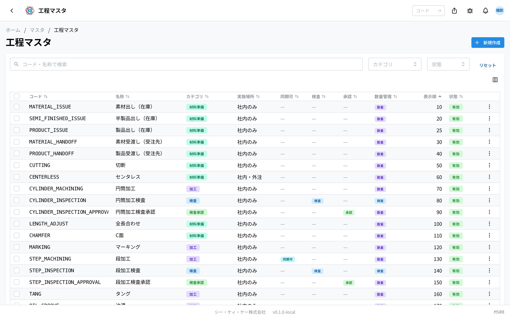
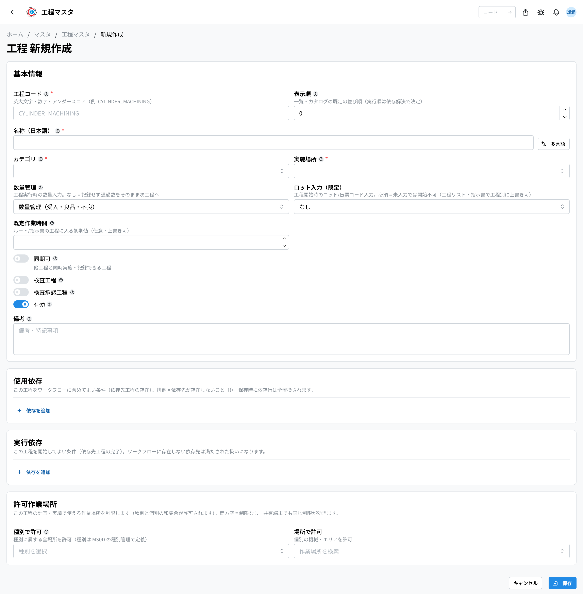
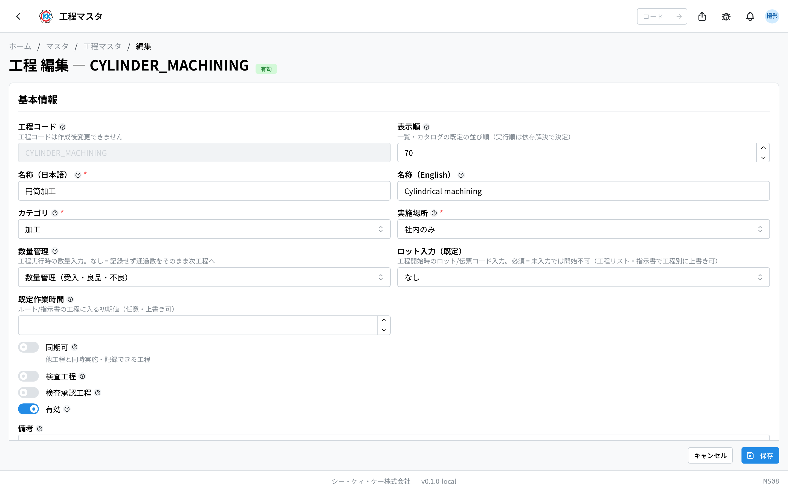
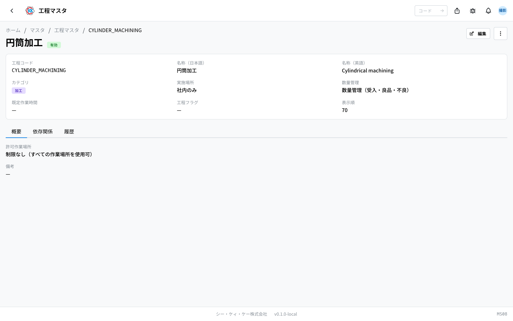
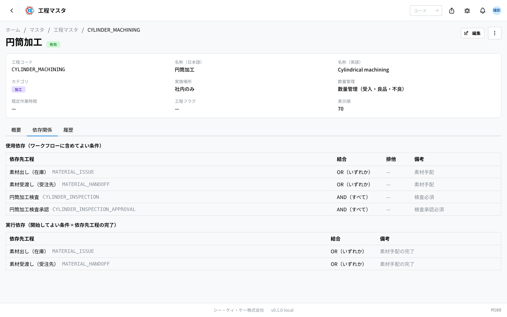
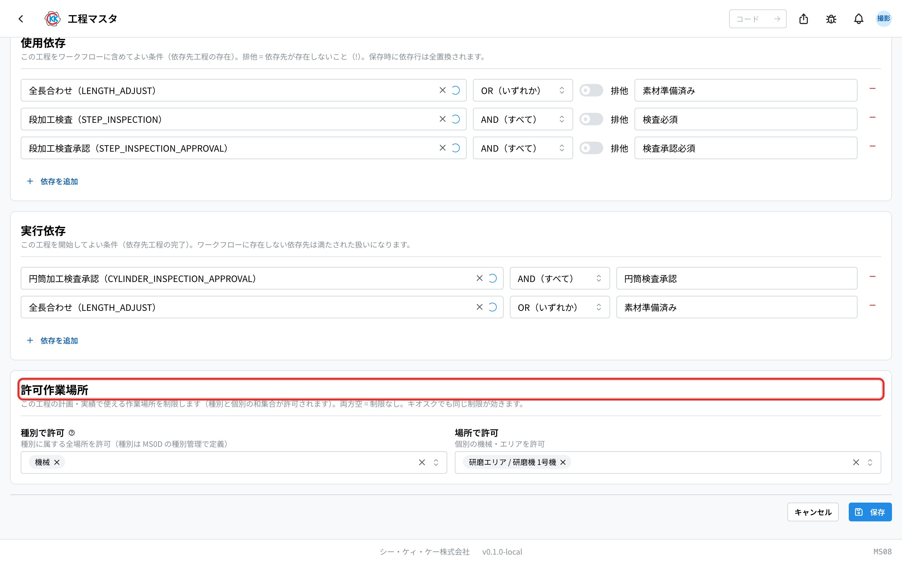

「切断」「円筒加工」「製作検査」など、工場で行う **作業の種類** を登録しておくアプリです。操作コードは `MS08` です。

[指示書](/manual/ja/operations/production/work-order/user) の工程は、ここに登録したものの中から選んで並べます。ここに無い作業は、指示書でも選べません。

> ⚠️ このアプリは試験公開中です。ご利用の環境によっては、まだ表示されないことがあります。

## このアプリでできること

- 工場で行う工程を登録できます。
- 工程ごとに、どの種類の作業か（材料準備・加工・コーティング・検査など）を決められます。
- その工程を **社内でやるか、外の会社にお願いできるか** を決められます。
- 工程を実施したときに **何の数を入力させるか**（受入数・良品数など）を決められます。
- 「この工程の前に、あの工程が終わっていること」という **順番の決まり** を登録できます。

## 用語（このページで出てくる言葉）

- **工程（こうてい）** … 「切断」「センタレス」「製作検査」のような、1 つひとつの作業のことです。
- **カテゴリ** … 工程の大きな分類です。材料準備 / 加工 / コーティング / 検査 / 検査承認 / 出荷 の 6 つがあります。
- **実施場所** … その工程を社内だけで行うか、外の会社にもお願いできるかの区分です。
- **同期可（どうきか）** … ほかの工程と同時に進めて、まとめて記録してよい工程のことです。
- **数量管理** … 工程を行ったときに、現場の人に何の数を入力してもらうかの設定です。
- **使用依存 / 実行依存** … 工程どうしの決まりごとです。くわしくは「[工程の順番の決まりを登録する](#工程の順番の決まりを登録する)」をご覧ください。

## はじめる前に

- このアプリを使うには **マスタの権限** が必要です。ボタンが押せないときは、権限をお持ちの方にご相談ください。
- よく使う工程は、はじめから登録されています。まずは一覧を見て、同じ工程がすでに無いかを確認してください。

## 画面の見かた

アプリを開くと、登録されている工程の一覧が表示されます。

- 一覧は **コード / 名称 / カテゴリ / 実施場所 / 同期可 / 検査 / 承認 / 数量管理 / 表示順 / 状態** の順に並んでいます。
- ふだんは「**表示順**」の数字が小さいものから順に並びます。
- 上の「**コード・名称で検索**」の欄に文字を入れると、探している工程だけを表示できます。
- 「**カテゴリ**」と「**状態**」でも絞り込めます。状態は「有効」（使える）と「無効」（もう使わない）の 2 つです。
- 行をクリックすると、その工程の詳しい画面が開きます。

## 工程を登録する

1. 一覧画面の右上にある「**新規作成**」を押します。
2. 「**工程コード**」に、この工程を表す文字を入れます（例 `CYLINDER_MACHINING`）。大文字のアルファベット・数字・アンダースコアだけが使えます。
3. 「**名称**」の日本語の欄に、現場で呼んでいる名前を入れます（例 円筒加工）。英語は空欄のままでも保存できます。
4. 「**カテゴリ**」を選びます。
5. 「**実施場所**」を選びます。外の会社にお願いすることがある工程は「**社内・外注**」を選びます。
6. 「**数量管理**」を選びます（次の説明をご覧ください）。
7. 「**ロット入力（既定）**」を選びます。工程を始めるときに、材料のロットや伝票のコードを入力してもらうかの決めごとです（必須 / 任意 / なし）。
8. 必要なら「**既定作業時間**」に、ふつうこのくらいかかるという時間を入れます（単位は時間です）。
9. 「**表示順**」に数字を入れます。小さい数字ほど一覧の上に出ます。
10. 「**保存**」を押します。

> 💡 「**工程コード**」は、保存したあとは変えられません。名称や表示順はあとから直せます。

### 数量管理の選びかた

現場の人が工程を行ったときに、どの数を入力するかを決めます。

- **なし（記録しない）** … 数を入力しません。前の工程から来た数が、そのまま次の工程へ渡ります。
- **数量管理（受入・良品・不良）** … 受け取った数・良品の数・不良の数を入力します。ふつうの加工工程はこれを選びます。
- **検査（検査数・合格・不合格）** … 検査した数・合格数・不合格数を入力します。検査の工程はこれを選びます。

「**検査工程**」のスイッチを入れると、「数量管理」が自動で「検査」に切り替わります。合わないときは選び直せます。

### スイッチの意味

- **同期可** … ほかの工程と同時に行える工程のときに入れます。
- **検査工程** … 検査を行う工程のときに入れます。
- **検査承認工程** … 検査の結果を上長が確認する工程のときに入れます。入れると「**承認必要役職**」の欄が出るので、「係長以上」のように入れます。
- **有効** … 切ると、指示書などで選べなくなります。

## 工程の順番の決まりを登録する

工程には 2 種類の決まりを登録できます。フォームの下のほうにある「**使用依存**」と「**実行依存**」で設定します。

- **使用依存** … 「この工程を指示書に **入れてよいのは、どんなときか**」の決まりです。たとえば「円筒加工」を入れるなら「円筒加工検査」も一緒に入っていること、という具合です。
- **実行依存** … 「この工程を **始めてよいのは、どんなときか**」の決まりです。たとえば「円筒加工検査」は「円筒加工」が終わってから始められます。

登録のしかたは、どちらも同じです。

1. 「**依存を追加**」を押します。
2. 「**依存先の工程を検索**」の欄に工程名を入れて、相手の工程を選びます。
3. その右で、決まりのつなげかたを選びます。
   - 「**AND（すべて）**」… 選んだ工程がすべてそろっていること。
   - 「**OR（いずれか）**」… どれか 1 つでもあればよいこと。
4. メモを残したいときは、右の「**備考**」の欄に入れます。
5. 「**保存**」を押します。

「使用依存」の行にだけ「**排他**」というスイッチがあります。これを入れると意味が逆になり、「その工程が **入っていない** ときだけ使える」という決まりになります。「溝」と「刃裏」のように、両方は一緒に入れない工程で使います。

行を消したいときは、行の右端にある赤いボタンを押します。

> ⚠️ 自分自身は相手に選べません。同じ相手を 2 行に入れることもできません。保存すると、その画面に並んでいる行がそのまま登録内容になります（消した行は無くなります）。

## 登録した工程を確認する

一覧で行をクリックすると、その工程の詳しい画面が開きます。

上のほうに、工程コード・名称・カテゴリ・実施場所・数量管理・既定作業時間・表示順などがまとめて表示されます。下には 3 つのタブがあります。

- **概要** … 許可作業場所（制限が無ければ「制限なし」、あれば種別・場所の一覧）と、備考に書いた内容が出ます。
- **依存関係** … 使用依存と実行依存が、それぞれ表で出ます。行をクリックすると相手の工程の画面へ移動します。
- **履歴** … いつ誰が変更したかの記録です。

決まりが 1 つも無いときは、「**使用依存はありません（単独でワークフローに含められます）**」「**実行依存はありません（先行工程なしで開始できます）**」と表示されます。どちらも「制限なし」という意味です。

## 使わなくなった工程を止める

もう使わない工程は、消すのではなく **止める**（無効化する）のがおすすめです。止めても、これまでの記録はそのまま残ります。

1. 詳細画面の右上にある「**…**」（点が 3 つのボタン）を押します。
2. 「**無効化**」を選びます。
3. 確認の小窓が出るので、「**無効化する**」を押します。

一覧で複数の行にチェックを入れて、「**一括無効化**」でまとめて止めることもできます。

## 入力項目

工程マスタの登録画面で入力する項目の一覧です。ここで登録した工程が、指示書のワークフローで並べられる「部品」になります。

| 項目 | 必須 | 何を入れるか |
|------|------|-------------|
| [工程コード / 名称](#field-code) | 必須 | 工程の管理番号と名前 |
| [カテゴリ](#field-category) | 必須 | 材料準備・加工・検査 などの区分 |
| [実施場所](#field-execution) | 必須 | 社内だけか、外注も可か |
| [許可作業場所](#field-allowed-locations) | 任意 | この工程で使える作業場所の制限 |
| [数量管理](#field-quantity-tracking) | 必須 | 本数をどう扱う工程か |
| [ロット入力（既定）](#field-lot-input-mode) | 必須 | 開始時にロット・伝票コードを入力させるか |
| [既定作業時間](#field-default-time) | 任意 | 1 回あたりの目安時間 |
| [同期可](#field-sync) | — | 並行して進められるか |
| [検査工程 / 検査承認工程](#field-inspection) | — | 検査に関わる工程か |
| [承認必要役職](#field-approval-rank) | 任意 | 承認に必要な役職 |
| [表示順](#field-sort-order) | 任意 | 一覧での並び |
| [有効 / 備考](#field-active) | — | 選択肢に出すか・補足 |

### 工程コード / 名称 [#field-code]

工程の管理番号と名前です。指示書ではこの名前が並びます。

### カテゴリ [#field-category]

材料準備・加工・コーティング・検査・検査承認・出荷の区分です。

### 許可作業場所 [#field-allowed-locations]

この工程の**計画・実績で使える作業場所**を制限します。種別（機械・エリアなど）でまとめて指定するか、場所を個別に指定します（併用可 — 和集合が許可されます）。**両方とも空なら制限なし**（すべての作業場所を使えます）。

- 指示書の工程で計画・実績を追加するとき、選択肢は許可された場所だけに絞られます
- 現場タブレット（共有端末）でも同じ制限が効きます — 許可外の作業場所 QR は拒否され、端末の既定作業場所が許可外なら実績に記録されません
- 共有端末側で「作業場所の制限」トグルが ON の端末は、端末の既定作業場所が許可に含まれる工程しか開始できません

### 実施場所 [#field-execution]

**社内**か、**社内・外注**かです。外注も可にすると、指示書で外注先を選べるようになります。

### 数量管理 [#field-quantity-tracking]

その工程で本数をどう扱うかです。**通す（数量を引き継ぐ）/ 検査として数える / 数えない** のいずれかで、工程実行画面の入力欄が変わります。

### ロット入力（既定） [#field-lot-input-mode]

工程を始めるときに、材料の**ロットや伝票のコード**を入力してもらうかの決めごとです。「**必須**」にすると、入力するまで工程を開始できません。「**任意**」は入力してもしなくても開始でき、「**なし**」は入力欄が出ません。ここで決めるのはあくまで既定で、製品の工程リストや指示書の側で **工程ごとに変えられます**。

### 既定作業時間 [#field-default-time]

1 回あたりの目安時間です。指示書を作るときの初期値になります。

### 同期可 [#field-sync]

他の工程と並行して進められるかどうかです。

### 検査工程 / 検査承認工程 [#field-inspection]

検査を行う工程か、検査結果を承認する工程かです。**検査工程にすると、工程実行画面で検査表を記録できます。**

### 承認必要役職 [#field-approval-rank]

その工程の承認に必要な役職です（係長以上など）。

### 表示順 [#field-sort-order]

一覧や選択肢での並び順です。小さいほど先に出ます。**工程リストや指示書に工程を選んで入れたときの、はじめの並び順もこの数字で決まります**（材料の出し・受け渡しの工程は数字に関係なく先頭に、出荷前検査は最後に並びます）。すでに作ってある工程リスト・指示書の並びは、あとから数字を変えても変わりません。

### 有効 / 備考 [#field-active]

外すと工程の選択肢に出なくなります。備考は補足です。

## よくある質問・困ったとき

**Q.「他の工程がこの工程に依存しているため削除できません。無効化を検討してください。」と出ます。**
A. ほかの工程が、この工程を「順番の決まり」の相手にしています。消さずに「無効化」してください。どうしても消したいときは、先に相手の工程から決まりの行を消してください。

**Q.「この工程に関連する検査表テンプレートが存在するため削除できません。無効化を検討してください。」と出ます。**
A. [検査表テンプレート](/manual/ja/operations/masters/inspection-template/user)がこの工程を「関連工程」に指定しています。消さずに「無効化」してください。

**Q.「同じ工程コードの工程が既に存在します」と出て保存できません。**
A. そのコードはすでに使われています。一覧の検索でコードを探して、同じ工程がないか確認してください。別の工程なら、違うコードを付けてください。

**Q.「工程コードは英大文字はじまりの英大文字・数字・アンダースコアで入力してください」と出ます。**
A. コードには大文字のアルファベット・数字・アンダースコア（ `_` ）だけが使えます。1 文字目は大文字のアルファベットにしてください。日本語や小文字は使えません。

**Q. 工程コードを間違えました。直せますか。**
A. 保存したあとは直せません。正しいコードで新しく登録し、間違えたほうを「無効化」してください。

**Q. 一覧の並び順を変えたいです。**
A. 各工程の「**表示順**」の数字を変えてください。小さい数字ほど上に出ます。10・20・30 のように間隔をあけておくと、あとから間に足しやすくなります。

**Q. 「表示順」と「実行依存」は、どちらが作業の順番を決めるのですか。**
A. 並び順を決めるのは「**表示順**」です。工程リストや指示書に工程を入れると、この数字の小さい順に並びます（すでに作ってある指示書の並びは、あとから数字を変えても変わりません）。「**実行依存**」は順番そのものではなく、「前の工程が終わるまで、この工程は始められない」という **始めてよい条件** を決めるものです。

<!-- permissions:start -->
## 必要な権限

この画面を使うには **マスタ管理**（`master`）の権限が要ります。

| したいこと | 必要な権限 |
| --- | --- |
| 画面を開く・一覧や詳細を見る | マスタ管理 の 閲覧 |
| 追加・変更・削除する | マスタ管理 の 作成 / 更新 / 削除 |

見るだけなら「閲覧」で足ります。追加・変更・削除の操作がある画面では、その操作にあたる権限がそれぞれ必要です。

権限は役割（ロール）を通して付きます。足りないときは管理者に相談してください。

権限の全体像は「[権限とロール](../../../permissions)」を参照してください。
<!-- permissions:end -->
