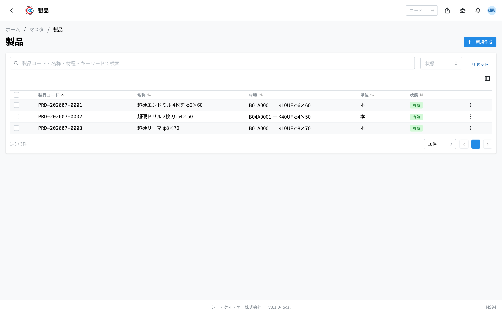
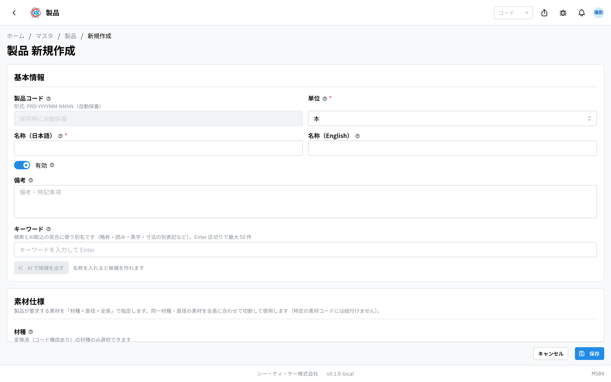
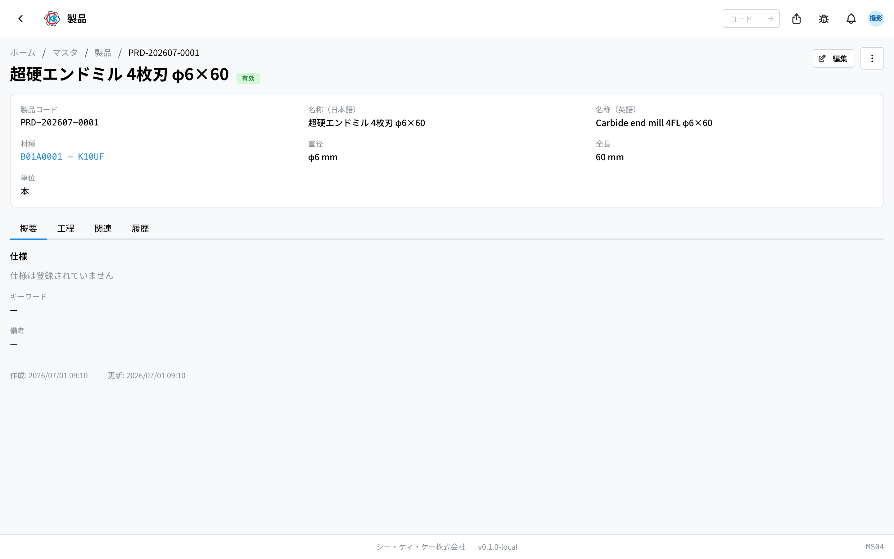
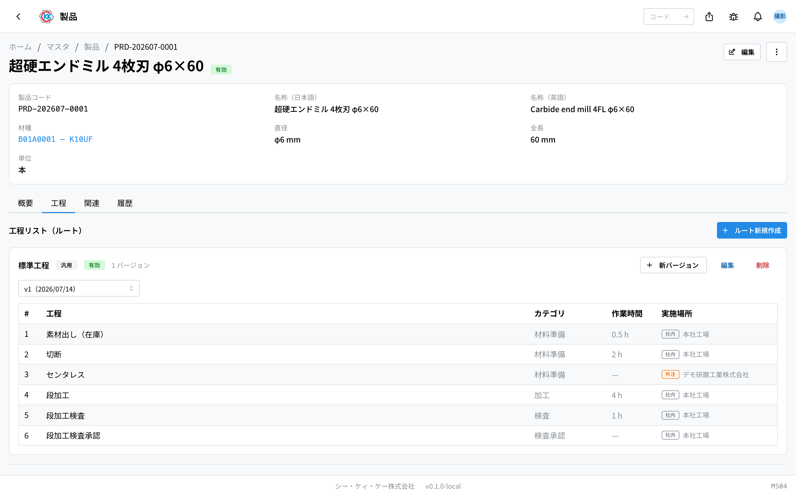
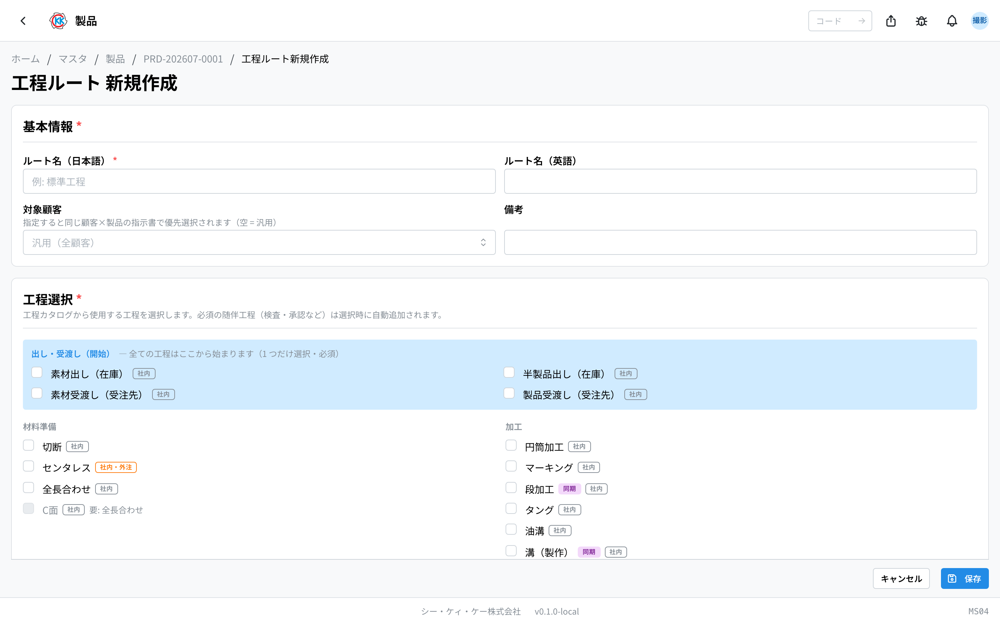

This is a ledger for the products you make. The operation code is `MS04`.

**If a product is not registered, you cannot make a [Trial Estimate](/manual/en/operations/sales/trial-estimate/user), a [Price List](/manual/en/operations/sales/price-list/user) or a [Quote](/manual/en/operations/sales/quote/user).** When a new product comes up, register it on this screen first.

## What you can do in this app

- You can register the products you make.
- After you register a product, you can choose it in the 「製品」 (Product) field of trial estimates, price lists and quotes.
- You can record **what material the product is made from** (material type, diameter, length).
- You can record the rules for each product, such as hardness and tolerance.
- You can register the **order of the process steps** used to make that product.
- You can **copy** a similar product and change only the parts you need.

## Words used on this page

- **製品コード (Product code)** … one control number for each product. It starts with `PRD-`. It is added automatically when you save.
- **材種 (Material type)** … the kind of material. It shows whose material it is and what kind it is (you register it in [Material Type](/manual/en/operations/masters/material-type/user)).
- **単位 (Unit)** … how the items are counted (本 / 個 / kg / m / セット).
- **製品種別 (Product type)** … a set of input fields prepared for each type of product, such as 「標準品」 (standard product) or 「コーティング品」 (coated product).
- **仕様 (Specification)** … the rules for that product, such as hardness, tolerance and drawing number.
- **工程リスト（ルート） (Process route)** … the order of the process steps used to make that product.

## Before you start

To register a product, the **[Material Type](/manual/en/operations/masters/material-type/user) must be registered first**. The material type is used in the field where you choose "what material to use".

You can also register a product without choosing a material type, but then you cannot get the material cost later when you make a [Trial Estimate](/manual/en/operations/sales/trial-estimate/user). We recommend that you fill in the material type as well whenever you can.

## How to read the screen

When you open the app, a list of the registered products is shown.

- **製品コード (Product code)** … a control number that starts with `PRD-`. The system adds it automatically.
- **材種 (Material type)** … shows what material the product is made from, in the form "material type code — material type name φdiameter×length". For a product with no material decided, it shows "—".
- **状態 (Status)** … the green 「**有効**」 (Active) means a product you can still use. The gray 「**無効**」 (Inactive) means a product you can no longer choose.
- In the search box at the top (「**製品コード・名称・材種で検索**」 / Search by product code, name or material type) you can search **not only by product name but also by material type**.
- Click a row to open the detail screen for that product.

> 💡 Some products brought over from the old system have no product code. Those rows show 「**未採番**」 (Not numbered) in gray. You can use them as they are.

## Registering a product

### Entering the name and the unit

1. Press 「**新規作成**」 (New) at the top right of the list screen.
2. Enter the product name in 「**名称（日本語）**」 (Name in Japanese). **This field must always be filled in.**
3. Choose 「**単位**」 (Unit). **This must also always be chosen** (it is usually 「本」).

### Choosing the material

4. Click the 「**材種**」 (Material type) field in 「**素材仕様**」 (Material specification) and type a material type name or a material type code.
5. Choose the material type you use from the list that appears.
6. Enter the diameter of the material in 「**直径 (mm)**」 (Diameter in mm).
7. Enter the length of the material in 「**全長 (mm)**」 (Length in mm).
8. Press 「**保存**」 (Save).

> 💡 When you enter the diameter or the length, a 3-digit number appears under the field (for example, 「060」 for a diameter of 6.0mm). The system makes this number by itself, so you do not need to worry about it.

> ⚠️ When you choose a material type, you **must also enter the diameter and the length**. You cannot save with only one of them.

> ⚠️ You cannot type in the 「**製品コード**」 (Product code) field. As the screen says 「保存時に自動採番」 (numbered automatically on save), a number such as `PRD-202607-0001` is added by itself when you save.

### Entering the rules for each product (optional)

When the 「**製品種別**」 (Product type) field is shown, choose from 「標準品」 (standard product), 「コーティング品」 (coated product) and so on. When you choose one, the input fields decided for that category (surface treatment, hardness, tolerance and so on) appear below.

If you want more fields, choose them from 「**項目を追加**」 (Add item) under 「**追加項目**」 (Extra items). **You cannot make a field with a name of your own.** You choose from the items that are prepared in advance. To remove a field you added, press the 「−」 button on that row.

> 💡 The items and the categories you can choose are decided by the administrator. If the item you need is missing, please ask the person in charge of [Product Type](/manual/en/operations/system/product-type/settings).

## Looking at what you registered

The screen of a saved product has four tabs.

- **概要** (Overview) … the product type, the specification (a table of items and values) and the notes.
- **工程** (Processes) … the order of the process steps used to make this product. Each route shows its target customer (「汎用」 — generic — when none is set) and its 「◯ バージョン」 (number of versions).
- **関連** (Related) … the price lists for this product, listed per customer. Click one to open that price list.
- **履歴** (History) … the record of when and who changed this registration.

To correct the content, press 「**編集**」 (Edit) at the top right of the screen.

## Managing drawings

The 関連 (related) tab lists this product's drawings.

**Versions are counted per product × customer.** The same product grows separate drawings for different customers, so customer A's v3 and customer B's v1 sit side by side on one product. A series with no customer is **汎用 (generic)** and is used by any customer that has no drawing of its own. Each series gets its own heading, with the newest thumbnail on top — press it to enlarge, and 3D models can be rotated right there.

Each version carries a tag saying where it came from.

- **依頼 (request)** — produced by completing a [design request](/manual/en/operations/sales/design-request/user).
- **手動 (manual)** — added directly from this screen.

### Adding a drawing without a design request

When the drawing already exists, or you are importing one received from elsewhere, register it directly with「**設計図を追加**」(add a drawing).

1. Press「**設計図を追加**」on the 関連 tab.
2. Choose the **受注元 (customer)**. Left empty, the version is generic.
3. Put files into **図面データ (blueprint)** (required, one file), **プレビュー用 (preview)** (optional, one file) and **参考資料 (reference material)** (optional, as many as you like). Each piece of reference material can carry its own short description.
4. Press「**登録**」(register).

The version number continues that series. A customer's first drawing is v1 even when other customers already have versions on the same product.

### Which versions can be changed

| State of the version | Edit the note | Delete |
|---|---|---|
| In use by a work order | No | No |
| Output of a design request | Yes | No |
| Added manually, unused | Yes | Yes |

**A version a work order points at cannot be moved.** It is the record of what a part was made from, so if its contents changed afterwards you could no longer tell what was actually used. Unpin it on the work order and it becomes editable again.

A version produced by a design request cannot be deleted for a different reason — it is the deliverable of a completed request. Its note can still be edited.

**The drawing file itself cannot be swapped.** Changing a drawing means making a new version, so register it through「設計図を追加」or by completing a design request.

## Registering the order of the process steps

On the 「工程」 (Processes) tab you can register the order of the process steps used to make that product. If you register it, the steps are **already filled in** when you make a [Work Order](/manual/en/operations/production/work-order/user). You no longer have to choose the steps from nothing every time.

1. Open the 「**工程**」 (Processes) tab.
2. Press 「**ルート新規作成**」 (New route).
3. Enter 「**ルート名（日本語）**」 (Route name in Japanese) — for example, 標準工程 (standard process). **This field must always be filled in.**
4. To make the route for a specific customer, choose that customer in 「**対象顧客**」 (Target customer). Left empty, it becomes 「**汎用**」 (generic — usable for any customer). A route with a customer set is chosen first when making a work order for the same customer × the same product.
5. In 「**工程選択**」 (Choose steps), tick the steps you use.
6. The steps you ticked are listed in 「**選択済み工程・実施場所**」 (Chosen steps and where they are done).
7. For a step that can be done in-house or outside, choose 「**社内**」 (In-house) or 「**外注**」 (Outsourced).
8. When you choose 「**外注**」 (Outsourced), also choose 「**仕入先（外注先）**」 (Supplier / outsourcing company).
9. For the steps you know, enter 「**作業時間**」 (Work time) (you can leave it empty).
10. If you need to, add a note in 「**備考**」 (Notes).
11. Press 「**保存**」 (Save).

> 💡 Some steps, such as inspection and approval, are always needed together with another step. Those steps are added automatically when you choose the other one. A blue bar tells you: 「必須工程を自動追加しました」 (Required steps were added automatically).

### When you want to change the order of the steps

The order of the steps is kept by **version**. The earlier content is kept too, so you can see later when and how it changed.

- To change the steps → press 「**新バージョン**」 (New version) on the route. It starts with the earlier content already filled in. If you note what you changed in 「**備考**」 (Notes), it is shown next to the version selector, so the reason for the change can be seen later.
- To correct the route name (Japanese / English) or the 「**有効**」 (Active) switch → press 「**編集**」 (Edit).
- To remove the whole route → press 「**削除**」 (Delete).

## Making a similar product

When you add a product that is almost the same as one you registered before, you can copy it instead of typing everything again.

1. Open the product you want to copy.
2. From the menu at the top right (the button with three dots), press 「**複製**」 (Copy).
3. 「**名称（日本語）**」 (Name in Japanese) contains a name with 「（コピー）」 (copy) added, so change it to the correct name.
4. Check 「**単位**」 (Unit).
5. Press 「**複製して新規作成**」 (Copy and create).

The material type, the diameter and the length are carried over from the product you copied. A new product code is added automatically.

## What to do with a product you no longer make

Even when you stop making a product, **please do not delete it**. Past quotes and other documents point to that product. Set it to "Inactive" instead.

1. Press the menu (the button with three dots) at the top right of the product screen.
2. Choose 「**無効化**」 (Deactivate).
3. On the confirmation screen, press 「**無効化する**」 (Deactivate).

Once a product is inactive, you can no longer choose it in new trial estimates, price lists or quotes, but **the past data stays as it is**.

## Input fields

Every field on the product screen.

| Field | Required | What to enter |
|-------|----------|---------------|
| [Product code](#field-code) | Required | The product's reference number |
| [Name](#field-name) | Required | The product name |
| [Unit](#field-unit) | Required | Pieces and so on |
| [Product type](#field-product-type) | Optional | The type, which decides the spec fields |
| [Material type](#field-material-type) | Optional | The material grade used |
| [Diameter / length (mm)](#field-dimensions) | Optional | Stock dimensions |
| [キーワード (keywords)](#field-keywords) | Optional | Other ways this product is written (search + AI intake) |
| [Active](#field-active) | — | Whether it appears in pick lists |
| [Notes](#field-notes) | Optional | Notes |

### Product code [#field-code]

The product's reference number, used on quotes, order lines, work orders and every other document.

### Name [#field-name]

The product name, printed on documents.

### Unit [#field-unit]

How it is counted. The default is pieces.

### Product type [#field-product-type]

The product's type. **Choosing a type brings up the spec fields defined for it.** Types and their fields are set by an administrator in [Product Types](/manual/en/operations/system/product-type/settings).

### Material type [#field-material-type]

The material grade used to make it.

### Diameter / length (mm) [#field-dimensions]

The stock dimensions required. **Products specify material type plus diameter and length rather than one specific stock item**, because any stock meeting those conditions can be used.

### キーワード (keywords) [#field-keywords]

Other ways this product is written: abbreviations, readings (hiragana / katakana), English, and other notations of the size (φ8.3 / 8.3mm) — anything that differs from the registered name.

Registering them does two things.

1. **You can find it** — typing any of those words in the list's search box finds this product.
2. **The AI can find it** — when a received document is read, a name printed on it can be resolved to this product.

Press 「**AI で候補を出す**」 (suggest with AI) and candidates are generated from what is currently entered (name, material type, dimensions, type-specific items …). **Only the ones you click are added, and nothing is registered until you save** — look at them and pick the ones that fit.

If the same word is put on two products, neither can be chosen. Use words that point at **this product only**.

### Active [#field-active]

Turning it off removes the product from pick lists on quotes and price lists.

### Notes [#field-notes]

Notes. Writing down why something was decided, or anything to watch out for, helps whoever reads it later.

## Questions and problems

**Q. I see 「単位を選択してください」 (Please choose the unit) and cannot save.**
A. 「単位」 (Unit) in 「基本情報」 (Basic information) has not been chosen yet. Normally you choose 「本」.

**Q. I see 「直径は 0.1〜99.9mm で入力してください」 (Please enter a diameter between 0.1 and 99.9 mm).**
A. When you choose a material type, the diameter is required. Enter a value between 0.1 and 99.9. The length must be between 1 and 999.

**Q. I type in the material type field, but the material type I want does not appear.**
A. Only material types "that have a code structure registered" can be chosen. The screen also says under the field: 「変換済（コード構成あり）の材種のみ選択できます」 (Only converted material types, which have a code structure, can be chosen). Material types brought over from the old system cannot be chosen, so please register them again in [Material Type](/manual/en/operations/masters/material-type/user).

**Q. When I try to delete, I see 「この製品を参照するデータ（価格表・見積書）が存在するため削除できません。無効化を検討してください。」 (This product cannot be deleted because data that refers to it — price lists, quotes — exists. Please consider deactivating it instead).**
A. Price lists or quotes that use that product already exist, so it cannot be deleted. This is normal. Please use 「無効化」 (Deactivate).

**Q. When I try to save a process route, I see 「工程を1つ以上選択してください」 (Please choose at least one step).**
A. No step is ticked. Please tick the steps you use in 「工程選択」 (Choose steps).

**Q. When I try to save a new version, I see 「最新バージョン v◯ と同じ構成です（変更がありません）」 (This is the same as the latest version v◯ — there is no change).**
A. The steps are exactly the same as the earlier version. Change something before saving, or press 「キャンセル」 (Cancel) to go back if it is fine as it is.

**Q. I cannot make an extra item with a name of my own.**
A. That is how it works. You can only choose from the items prepared in advance. If the item you need is missing, please ask your administrator.
