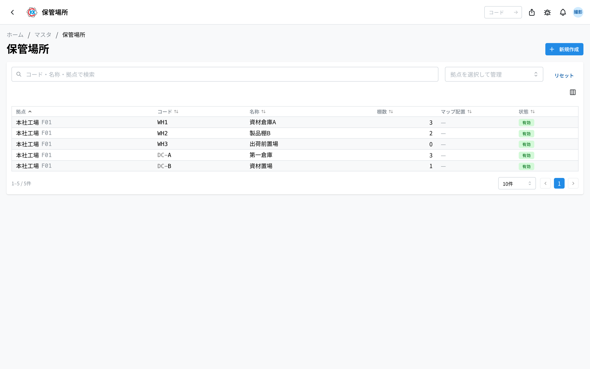
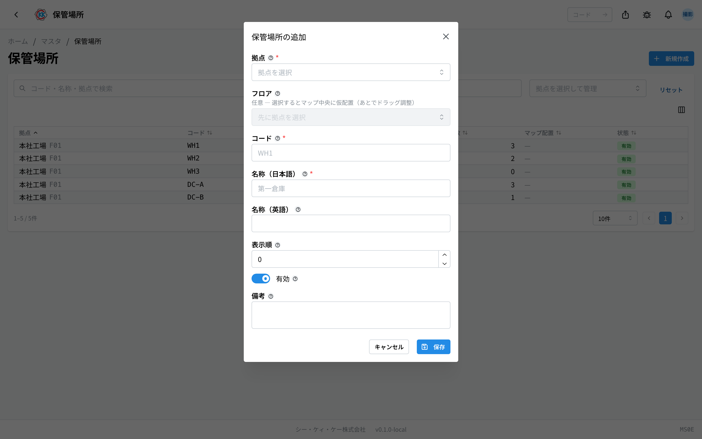
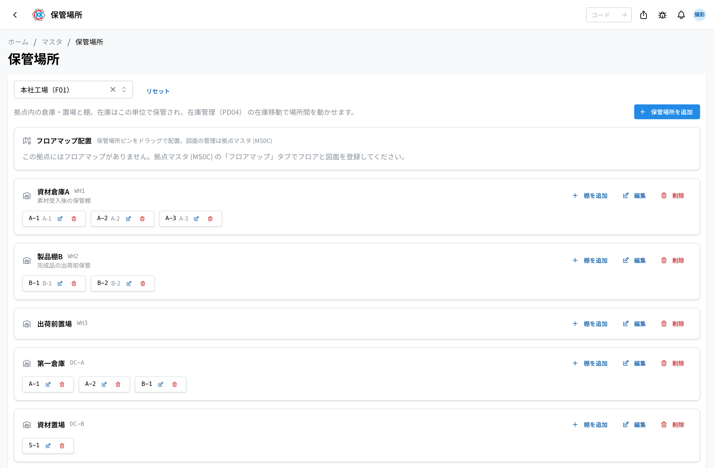
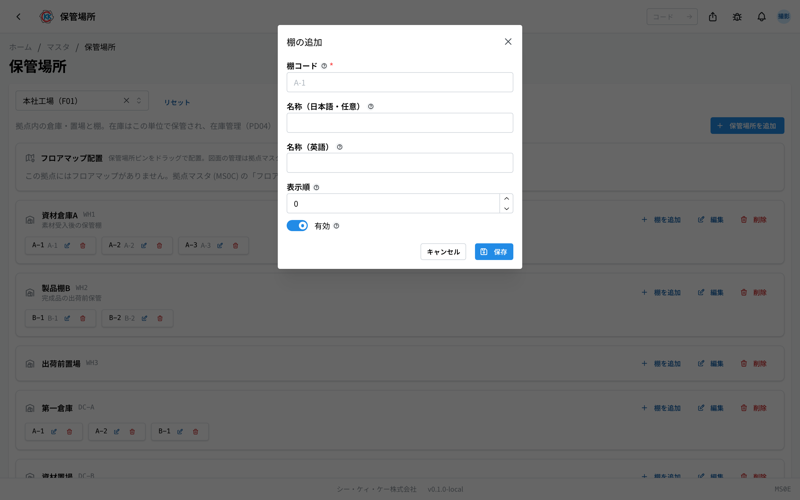

这是用于登记「資材倉庫A」（资材仓库A）这类 **存放物品的仓库、堆放场** 以及其中 **货架** 的应用。操作代码是 `MS0E`。

库存会细分到「在哪个保管场所的哪个货架上」来管理。在[库存管理](/manual/zh/operations/production/product-inventory/user)的库存移动中，可以在这里登记的场所之间搬动物品。

> ⚠️ 本应用处于试用公开阶段。根据您使用的环境，可能还看不到它。

## 三个相似应用的区别

关于「场所」的应用有 3 个，容易混淆，请注意区分。

| 应用 | 登记什么 | 示例 |
|--------|----------------|-----|
| [拠点（据点）](/manual/zh/operations/masters/plant/user) | 工厂本身 | 总部工厂、第二工厂 |
| [作業場所（作业场所）](/manual/zh/operations/masters/work-location/user) | 据点内部进行作业的场所・机器 | NC车床1号机、研磨区 |
| **保管場所（保管场所）**（本页） | 据点内部存放物品的仓库・货架 | 资材仓库A 的 A-1 货架 |

**存放物品的场所** 用本应用，**人进行作业的场所** 用作业场所应用。

## 本应用可以做什么

- 可以按据点登记仓库和堆放场（保管场所）。
- 可以登记其中的 **货架**。
- 可以在据点的图纸（楼层地图）上放置保管场所的 **标记**（图钉）。
- 登记好的保管场所和货架，可以作为库存的存放位置来选择。

## 本页出现的词语

- **保管场所** … 据点内部的仓库或堆放场（例 資材倉庫A / 资材仓库A、出荷前置場 / 出货前置场）。
- **货架** … 保管场所中的区划（例 A-1、A-2）。库存按「保管场所 + 货架」的单位计数。
- **楼层地图** … 据点楼层的图纸。图纸本身在[据点](/manual/zh/operations/masters/plant/user)中登记。
- **图钉** … 放在图纸上、表示保管场所位置的标记。

## 开始之前

- 使用本应用需要 **主数据权限**。
- 保管场所必定属于某个据点。请先登记[据点](/manual/zh/operations/masters/plant/user)。
- 想在图纸上放置标记时，请先在[据点](/manual/zh/operations/masters/plant/user)的「フロアマップ」（楼层地图）标签页中登记图纸。本应用中无法添加或更换图纸。

## 界面的看法（所有据点的列表）

打开应用后，会汇总显示所有据点的保管场所。

- 列表按 **拠点**（据点）/ **コード**（代码）/ **名称**（名称）/ **棚数**（货架数）/ **マップ配置**（地图放置）/ **状態**（状态）的顺序排列。
- 已在图纸上放置标记的保管场所会显示「**配置済**」（已放置）。
- 用上方的「**コード・名称・拠点で検索**」（按代码・名称・据点搜索）栏，可以筛选出您要找的场所。
- 用「**拠点を選択して管理**」（选择据点进行管理）选择据点，或点击列表中的行，就会切换到该据点的管理界面。

## 登记保管场所

在列表界面和据点管理界面上都可以登记。

1. 点击列表界面右上角的「**新規作成**」（新建）。
2. 在「**拠点**」（据点）中选择该仓库所在的据点。
3. 在「**フロア**」（楼层）中选择要放置的楼层（留空也可以）。
4. 在「**コード**」（代码）中输入代表该场所的文字（例 `WH1`）。
5. 在「**名称（日本語）**」（名称，日语）中输入仓库的名称（例 第一倉庫 / 第一仓库）。
6. 在「**表示順**」（显示顺序）中输入数字。数字越小越靠上。
7. 点击「**保存**」（保存）。

选择「楼层」后保存，会先在该图纸的正中间临时放置一个标记。之后可以拖到正确的位置。还没有图纸的据点会显示「**この拠点にはフロアマップがありません（ピンなしで作成）**」（该据点没有楼层地图（将不带图钉创建）），并在不带标记的状态下登记。

> 💡 在据点管理界面上，点击「**保管場所を追加**」（添加保管场所），可以直接登记到该据点中（不会出现选择据点的栏）。

## 各据点的管理界面

选择据点后，会进入汇总管理该据点保管场所和货架的界面。

- 每个保管场所以卡片形式排列。卡片上会显示名称、代码、备注。已停用的场所会显示「**無効**」（无效）。
- 卡片右侧排列着「**棚を追加**」（添加货架）「**編集**」（编辑）「**削除**」（删除）按钮。
- 登记好的货架会以带代码和名称的小标签形式排列在卡片中。通过标签上的按钮可以编辑或删除。

## 登记货架

1. 在要添加货架的保管场所卡片上点击「**棚を追加**」（添加货架）。
2. 在「**棚コード**」（货架代码）中输入代表货架的文字（例 `A-1`）。
3. 想取名字时，请填写「**名称（日本語・任意）**」（名称，日语，可选）（留空也可以）。
4. 在「**表示順**」（显示顺序）中输入数字。
5. 点击「**保存**」（保存）。

## 在图纸上放置标记

据点的管理界面上有一个「**フロアマップ配置**」（楼层地图放置）栏。在这里可以在图纸上标出保管场所位于据点的什么位置。

- 图纸下方会以「**〈名称〉 を配置**」（放置〈名称〉）按钮的形式排列尚未放置的保管场所。点击后，图纸正中间会出现标记。
- 标记可以 **拖动** 到任意位置。
- 已放置的保管场所会以标签形式排列在图纸下方。点击标签上的「×」，就会从图纸上移除。
- 有 2 层以上时，可以用上方的标签页切换楼层。也可以用「**重ね表示**」（叠加显示）把其他楼层的图纸淡淡地叠在上面。

还没有图纸时，会显示「**この拠点にはフロアマップがありません。拠点マスタ (MS0C) の「フロアマップ」タブでフロアと図面を登録してください。**」（该据点没有楼层地图。请在据点主数据 (MS0C) 的「楼层地图」标签页中登记楼层和图纸）。

## 输入项

保管场所登记画面的输入项一览。

| 项目 | 填什么 |
|------|--------|
| [基地 / 楼层](#field-plant) | 位于哪个基地的哪一楼层 |
| [编码 / 名称（日文・英文）](#field-code) | 场所的管理编号与名称 |
| [显示顺序](#field-sort-order) | 选项中的排列顺序 |
| [有效 / 备注](#field-active) | 取消后保管场所的选项中将不再显示 |

### 基地 / 楼层 [#field-plant]

位于哪个基地的哪一楼层。**库存可定位到该场所单位。**

### 编码 / 名称（日文・英文） [#field-code]

场所的管理编号与名称。登记后即可作为库存的存放位置进行选择。

### 显示顺序 [#field-sort-order]

选项中的排列顺序。数值越小越靠前。将常用场所置顶可更便于选择。

### 有效 / 备注 [#field-active]

取消后保管场所的选项中将不再显示。备注为补充说明。

## 常见问题・遇到麻烦时

**Q. 出现「この保管場所を参照する在庫があるため削除できません（在庫移動で空にするか、無効化してください）」（存在引用该保管场所的库存，无法删除；请用库存移动清空，或将其停用）。**
A. 该场所还留有库存。请用[库存管理](/manual/zh/operations/production/product-inventory/user)的库存移动把里面的东西移到别的场所清空，或者在编辑界面上关闭「**有効**」（有效）将其停用。删除货架时也一样。

**Q. 删除保管场所后，里面的货架会怎样？**
A. 会一起被删除。确认界面上会显示将被删除的货架数量。此操作无法撤销。

**Q. 没有上传图纸的按钮。**
A. 图纸的登记和更换请在[据点](/manual/zh/operations/masters/plant/user)应用中进行。本应用只能在已登记的图纸上放置标记。

**Q. 列表的「マップ配置」（地图放置）列一直是空的。**
A. 该保管场所还没有放到图纸上。请在据点管理界面的「フロアマップ配置」（楼层地图放置）中点击「〈名称〉 を配置」（放置〈名称〉）。放置后会变为「**配置済**」（已放置）。

**Q. 想放置标记时出现「フロアマップが保管場所の拠点と一致しません」（楼层地图与保管场所的据点不一致）。**
A. 您正试图放到别的据点的图纸上。请打开该保管场所所在据点的管理界面，重新放置。

**Q. 库存登记界面上没有出现我创建的货架。**
A. 请确认该货架的「**有効**」（有效）是否被关闭了。无效的货架不会出现在选项中。

**Q. 机器和作业的场所在哪里登记？**
A. 不在本应用，请在[作业场所](/manual/zh/operations/masters/work-location/user)中登记。

<!-- permissions:start -->
## 所需权限

使用本画面需要 **主数据管理**（`master`）权限。

| 想做的事 | 所需权限 |
| --- | --- |
| 打开画面、查看列表与明细 | 主数据管理 — 查看 |
| 新增・变更・删除 | 主数据管理 — 创建 / 更新 / 删除 |

仅查看有「查看」即可。画面中若有新增、变更或删除的操作，则分别需要对应的权限。

权限通过角色授予。若不足，请与管理员联系。

权限的整体说明请参见「[权限与角色](../../../permissions)」。
<!-- permissions:end -->
