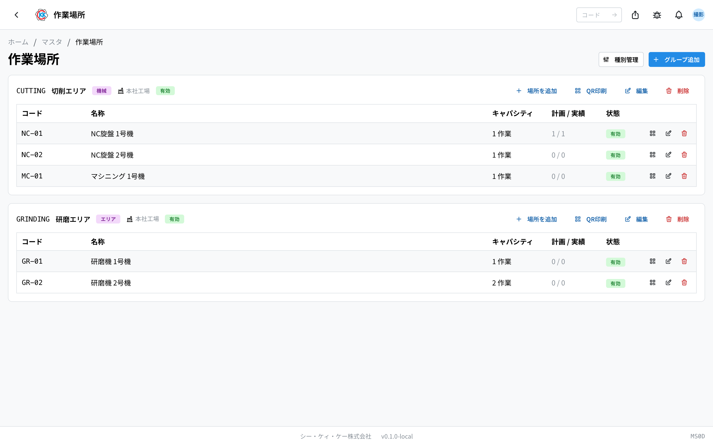
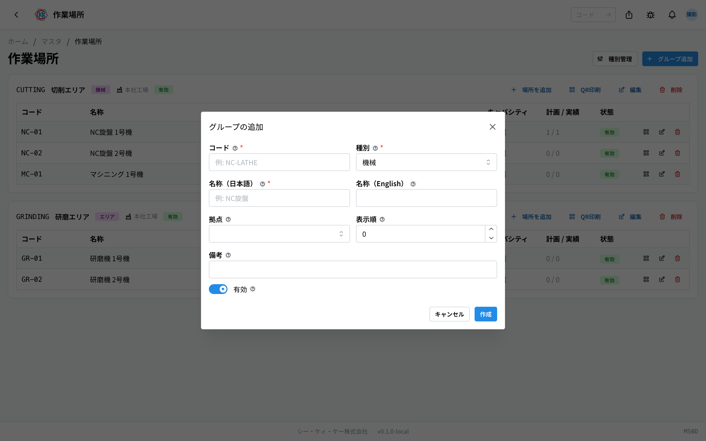
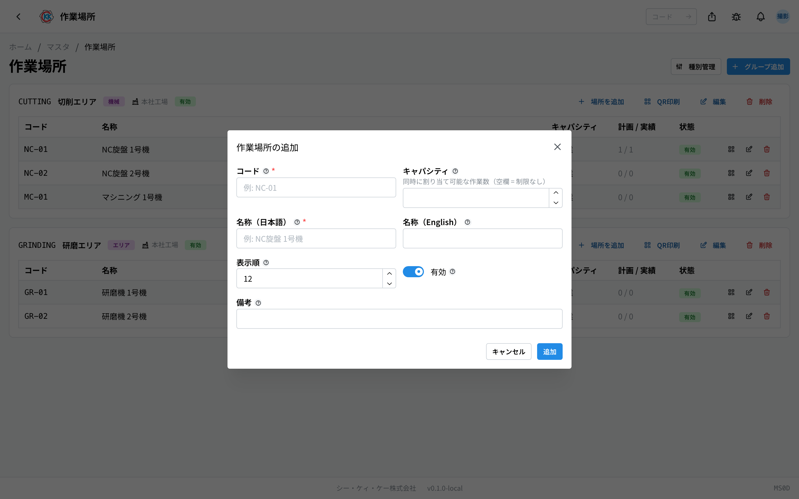
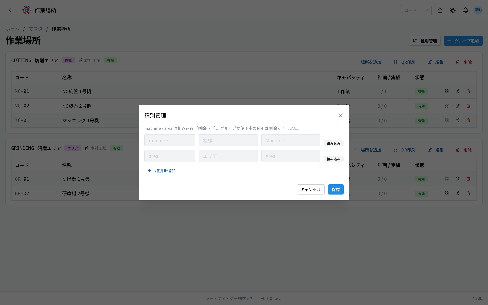
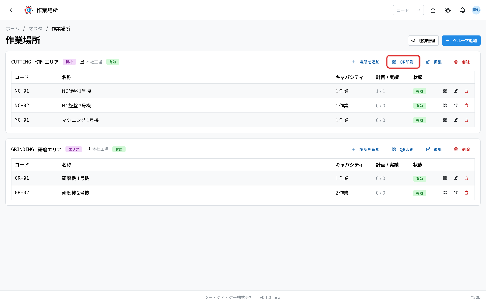
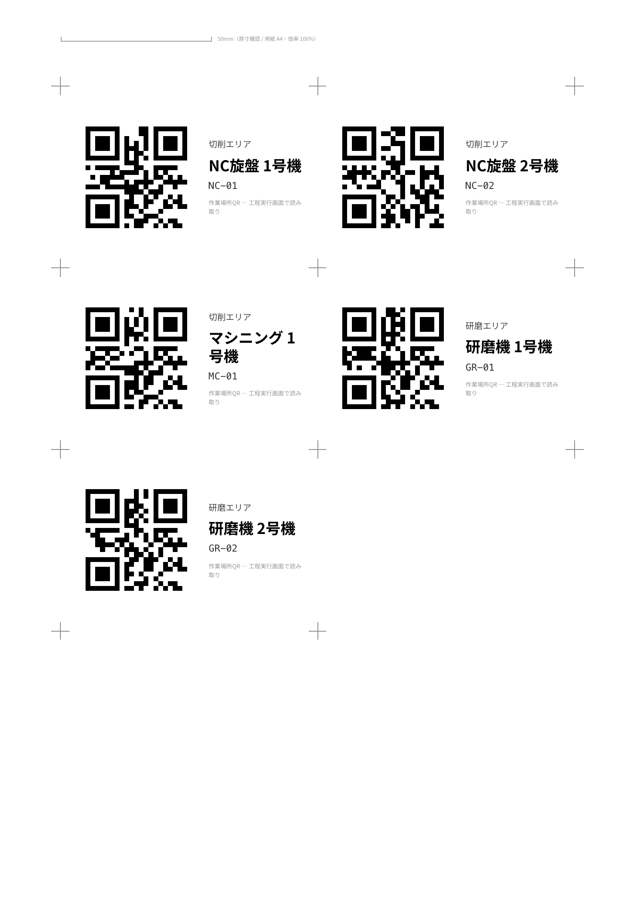

This app is for registering the **machines and areas where work is really done**, such as NC旋盤 1号機 (NC lathe no. 1). The operation code is `MS0D`.

The places registered here become selectable as "where the work is done" in the work plan of a step on a [指示書 (work order)](/manual/en/operations/production/work-order/user).

> ⚠️ This app is in trial release. Depending on your environment, it may not be shown yet.

## The difference between three similar apps

There are three apps about places, and they are easy to mix up. Please take care.

| App | What you register | Example |
|--------|----------------|-----|
| [拠点 (Site)](/manual/en/operations/masters/plant/user) | The factory itself | Head office plant, second plant |
| **作業場所 (Work location)** (this page) | A place or machine inside the site where work is done | NC lathe no. 1, polishing area |
| [保管場所 (Storage location)](/manual/en/operations/masters/storage-location/user) | A warehouse or shelf inside the site where things are kept | Shelf A-1 in material warehouse A |

**Places where people work** belong in this app; **places where things are kept** belong in the storage location app.

## What you can do with this app

- You can register machines and areas sorted into **groups** (sets by machine kind or by area).
- For each machine you can decide **how many jobs can be put on it at the same time** (the capacity).
- You can check how many work plans are using that machine right now.
- You can add your own **types** for sorting the groups.

## Words used on this page

- **Group** … the unit that brings work locations together. You make them by machine kind or by area, such as 「NC旋盤」 (NC lathe) or 「研磨エリア」 (polishing area). A group always belongs to one of the sites.
- **Work location** … one machine, or one area. It is always registered under one of the groups.
- **Capacity** … the number of jobs that can be put on that place at the same time. Leave it empty and there is no limit.
- **計画 / 実績** (plan / actual counts) … the number of work plans and work actuals that use that place.
- **Type** … the division used for sorting the groups. 「機械」 (machine) and 「エリア」 (area) are there from the start.

## Before you start

- You need the **master permission** to use this app.
- A group is given a site. Please register the [site (拠点)](/manual/en/operations/masters/plant/user) first.
- You register **the group first and the machine after that**. You cannot register a machine on its own without making a group.

## How to read the screen

This app is not split into a list and a detail screen. **You do everything on one screen.**

- At the top right of the screen there are the 「**種別管理**」 (Manage types) and 「**グループ追加**」 (Add group) buttons.
- The groups are shown as cards. The top of a card shows the code, name, type, site and status of that group.
- At the right of a card there are the 「**場所を追加**」 (Add location), 「**QR印刷**」 (Print QR), 「**編集**」 (Edit) and 「**削除**」 (Delete) buttons. 「QR印刷」 cannot be pressed while the group has no locations.
- The table inside a card lists the machines of that group in the order **コード** (code) / **名称** (name) / **キャパシティ** (capacity) / **計画 / 実績** (plan / actual counts) / **状態** (status).
- When nothing is registered yet, 「**作業場所が未登録です。グループ（機械種別・エリアなど）を作成し、配下に物理的な場所（機械 1 台・1 区画）を追加してください。**」 (no work locations are registered; create a group such as a machine kind or area, and add physical places under it, one machine or one area at a time) is shown.

## Make a group

First make the container that brings the machines together.

1. Press 「**グループ追加**」 (Add group) at the top right of the screen.
2. Enter text that stands for this group in 「**コード**」 (code), for example `NC-LATHE`.
3. Choose 「**種別**」 (type): machine, area, or a type you added yourself.
4. Enter the name of the group in 「**名称（日本語）**」 (name, Japanese), for example NC旋盤 (NC lathe).
5. In 「**拠点**」 (site), choose the site this group is in.
6. Enter a number in 「**表示順**」 (display order). A smaller number comes higher.
7. Press 「**作成**」 (Create).

## Add a machine (work location)

Once the group is made, register the machines inside it one at a time.

1. On the card of the group you want to add to, press 「**場所を追加**」 (Add location).
2. Enter text that stands for this machine in 「**コード**」 (code), for example `NC-01`.
3. Enter the number of jobs that can be on it at the same time in 「**キャパシティ**」 (capacity). If it is one at a time on one machine, that is `1`. Leave it empty for "no limit".
4. Enter the name of the machine in 「**名称（日本語）**」 (name, Japanese), for example NC旋盤 1号機 (NC lathe no. 1).
5. Enter a number in 「**表示順**」 (display order).
6. Press 「**追加**」 (Add).

The machines you register are listed in the table on that group's card. Use the buttons at the right of a table row to edit or delete it.

> 💡 If you set the capacity to `1`, it is easier to notice when two or more jobs are on that machine at the same time.

## Add more types

You can add your own divisions for sorting the groups. Use this when you want groupings such as 「ライン」 (line) or 「検査室」 (inspection room).

1. Press 「**種別管理**」 (Manage types) at the top right of the screen.
2. Press 「**追加**」 (Add) at the bottom to add a row.
3. In the left box, enter text that stands for the division, for example `line`. Small letters, numbers, hyphens and underscores can be used.
4. In the middle box, enter the Japanese display name, for example ライン (line).
5. Press 「**保存**」 (Save).

「**機械**」 (machine) and 「**エリア**」 (area) are prepared from the start. They are shown as 「**組み込み**」 (built in) and cannot be deleted or renamed.

## Print QR labels

You can print **QR labels** to stick on machines and areas. When a worker scans the QR on a shared floor tablet while running a step, "where the work happened" is recorded on the work actual.

- The 「**QR印刷**」 (print QR) button on a group prints all locations in that group at once
- The QR icon on a row prints just that one location

The print sheet opens in a new tab. Print it on plain A4 paper as-is, cut along the cross marks, and stick the labels somewhere easy to see on the machine or area.

> 💡 Print from the browser at 100% scale. If the "50mm" ruler printed at the top of the sheet measures 50mm with a real ruler, the labels are actual size.
>
> ⚠️ If you change a work location's **code**, printed labels stop working. Re-print and replace them after a change.

## How it connects to work orders

In the 「**作業計画**」 (work plan) and 「**作業実績**」 (work actuals) of a step on a work order, you can choose 「**作業場所（任意）**」 (work location, optional) for each row. The chosen location is shown in the lists, and can also be seen on the shared tablet screen on the floor.

When a step is started or resumed from a shared floor tablet, the tablet's **default work location** is recorded on the actual automatically (set in [Kiosk devices](/manual/en/operations/system/kiosk-device/user#field-default-work-location)). Scanning a work-location QR overrides it.

[Process steps](/manual/en/operations/masters/process-step/user#field-allowed-locations) can also restrict which work locations a step may use, by type or by individual location.

Usage counts appear in the 「**計画 / 実績**」 (plans / actuals) column of the work location table. A place where either count is not 0 is still in use (places in use cannot be deleted — deactivate them instead).

## Input fields

Every field on the Work location screen.

| Field | What to enter |
|-------|---------------|
| [Plant](#field-plant) | Which plant the work location belongs to |
| [Code / name (ja, en)](#field-code) | The work location's code and name, selectable as where a step is carried out |
| [Type](#field-type) | The kind of work location |
| [Capacity](#field-capacity) | A guide to how much it can handle at once |
| [Sort order / active / notes](#field-sort-order) | Ordering, whether it is offered, and notes |

### Plant [#field-plant]

Which plant the work location belongs to. When picking where a step runs, **only that plant's work locations** are offered.

### Code / name (ja, en) [#field-code]

The work location's code and name, selectable as where a step is carried out.

### Type [#field-type]

The kind of work location. It is used to narrow the list.

### Capacity [#field-capacity]

A guide to how much it can handle at once. Enter 1 for a single machine, or how many fit at once for an area.

### Sort order / active / notes [#field-sort-order]

Ordering, whether it is offered, and notes.

## Questions and problems

**Q. I want to add a machine, but I cannot find the 「場所を追加」 (Add location) button.**
A. This button is inside a group card. When there is no group at all yet, make one first with 「**グループ追加**」 (Add group).

**Q. I see 「この場所は 作業計画 3 件 / 作業実績 1 件 から参照されています（削除できません — 無効化をご検討ください）。」 (this location is referred to by 3 work plans / 1 work actual; it cannot be deleted, please consider deactivating it).**
A. That machine is in use in the work plans or work actuals of a work order. Do not delete it. Turn off 「**有効**」 (active) on the edit screen to make it inactive. Once it is inactive it can no longer be chosen in plans made from now on.

**Q. I see 「グループの削除に失敗しました（作業計画で使用中の場所が含まれる場合は削除できません）」 (deleting the group failed; it cannot be deleted if it contains a location in use in a work plan).**
A. That group still contains a machine that is in use. Check which machine is in use, do not delete the whole group, and make that machine inactive instead.

**Q. If I delete a group, what happens to the machines inside it?**
A. They are deleted with it. The confirmation screen shows how many machines will be deleted. This cannot be undone.

**Q. I see 「使用中の種別は削除できません」 (a type in use cannot be deleted).**
A. There is a group that has chosen that type. First change 「**種別**」 (type) of that group to another one, and then try again.

**Q. I see 「存在しない種別です（先に種別を追加してください）」 (this type does not exist; please add the type first).**
A. The type you tried to choose is not registered yet. Add it in 「**種別管理**」 (Manage types) and then save the group.

**Q. I want to register warehouses and shelves. Is this the right place?**
A. No. Places where things are kept are registered in [storage location (保管場所)](/manual/en/operations/masters/storage-location/user).

<!-- permissions:start -->
## Permissions required

Using this screen requires the **Master data** (`master`) permission.

| What you want to do | Permission needed |
| --- | --- |
| Open the screen, view lists and details | Master data — View |
| Add, change or delete | Master data — Create / Edit / Delete |

Viewing only needs *View*. Where a screen offers adding, changing or deleting, each of those needs its matching permission.

Permissions come through roles. If something is missing, ask an administrator.

For the whole picture see [Permissions and roles](../../../permissions).
<!-- permissions:end -->
