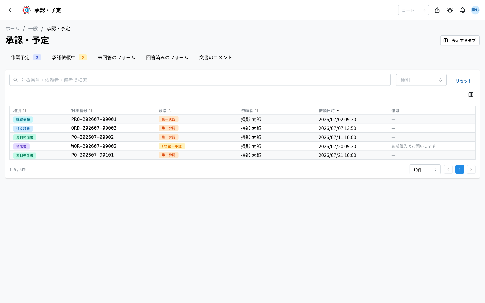
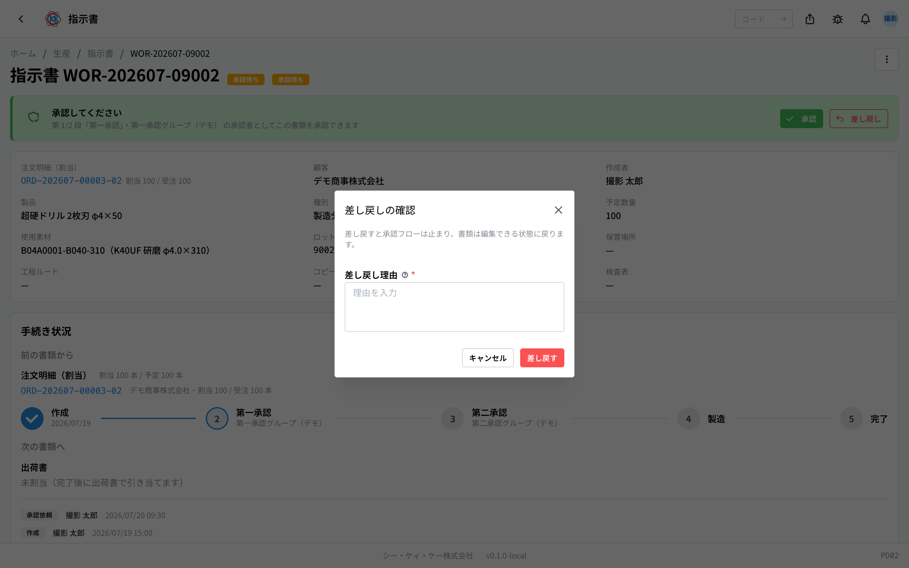
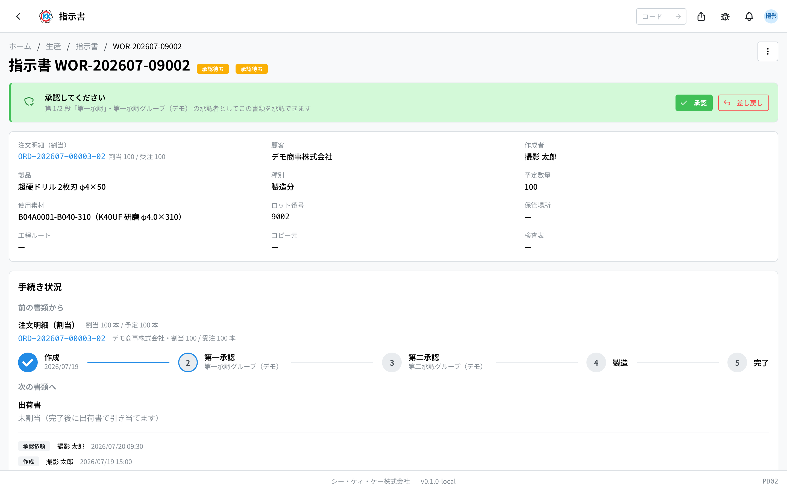

This app gathers, on one screen, only the documents that are pending approval, across every type of document. Think of it as your approval inbox. The operation code is `PD03`.

> ⚠️ For now this app works **only in the test environment**. The screens and the steps may change before it can be used for real work.

## What you can do with this app

- You can see all the documents that are pending approval right now, **across every type of document**.
- Click a row and the screen for that document opens directly.
- From there you can approve or send back.
- Documents you have dealt with disappear from this list automatically.

These are the documents that appear in the list.

- **指示書** (work order) … the stages decided in the approval settings ([work order](/manual/en/operations/production/work-order/user) PD02)
- **注文請書** (order acceptance) … the approval before it is confirmed ([order acceptance](/manual/en/operations/sales/order-acceptance/user) SA04)
- **注文請書キャンセル** (order acceptance cancellation) … a request to cancel a confirmed order acceptance. Clicking the row opens the screen of that order acceptance
- **素材発注書** (material purchase order) … the approval before the order is placed ([material purchase order](/manual/en/operations/purchasing/purchase-order/user) PU02)
- **購買依頼** (purchase request) … [purchase request](/manual/en/operations/purchasing/purchase-request/user) PU01
- **工程フロー変更** (step flow change) … a change that adds or fixes a step branch on an approved or in-progress work order. Clicking the row opens the screen of that work order

## Words used on this page

- **承認グループ** (approval group) … the list of people who are allowed to approve. Only people on this list can approve or send back. Which group approves each stage is decided in the approval settings (`MS0B`).
- **代理** (stand-in) … a person appointed for a set period to approve while the usual approver is away.
- **段階** (stage) … the order of approvals. How many stages a document goes through is decided per document type in the approval settings (`MS0B`), and can also differ depending on what is in the document.
- **差し戻し** (send back) … returning a document to the person who made it when there is a problem. The document goes back to draft.

## Before you start

- To approve or send back, **you must be in the approval group for that stage**. If you are not, the buttons do not appear on the screen.
- Being added to a group and setting up stand-ins is done in [approval settings](/manual/en/operations/masters/approval-setting/user). It is not something you set up yourself, so please ask an administrator when you need it.

## How to read the screen

When you open the app, the documents pending approval are listed.

- **種別** (document type) … a coloured badge shows which of 「指示書」 (work order), 「注文請書」 (order acceptance), 「注文請書キャンセル」 (order acceptance cancellation), 「素材発注書」 (material purchase order), 「購買依頼」 (purchase request), or 「工程フロー変更」 (step flow change) it is.
- **対象番号** (document number) … the number of that document.
- **段階** (stage) … shows **which stage it is on out of how many**, with the stage name — such as 「**2/3 部門承認**」 (2/3, department approval). When there is only one stage, only the stage name is shown. The last stage changes colour, so you can see it is one approval away from going through. When the stage is set to "everyone", 「全員 ◯/◯」 (everyone ◯/◯) is added as well.
- **依頼者** (requester) … the person who asked for approval.
- **依頼日時** (request date and time) … when it was asked for. **The oldest are at the top**, so the ones that have been waiting longest come first.
- **備考** (notes) … any note written when the approval was requested.
- Use the search box at the top to search by **document number, requester, or notes**. You can also narrow it down with 「**種別**」 (document type).
- Rows with a 「**閲覧権限なし**」 (no view permission) badge are ones where you are in the approval group but do not have permission to open that document. Approval happens on the document's screen, so please ask an administrator about granting the permission.
- When the list is empty, it shows 「**承認依頼中の依頼はありません**」 (There are no requests pending approval).

## Approving

1. Click a row in the list. The screen for that document opens.
2. For a work order, 「**手続き状況**」 (procedure status) is near the top of the screen and shows which stage it is at.
3. If it is your turn to approve, the 「**承認**」 (Approve) button appears.
4. Check the content and press the button.

How many stages of approval a document goes through is decided per document. The card shows which stage it is on, such as 「第 2/3 段「部門承認」・製造部長」 (stage 2 of 3, "department approval" — manufacturing manager). Once the last stage is through, the next work can go ahead (for a work order, manufacturing can start).

When a stage is set to 「**全員**」 (everyone), it does not move on until everyone covered by that stage has approved. The card shows 「残り ◯ 名」 (◯ people remaining) with the names of those who have not approved yet.

> 💡 Only people in the approval group for that step, and stand-ins within their period, can approve. If the button does not appear, the screen shows 「◯◯ のメンバーのみ承認・差し戻しできます」 with the group name (Only members of that group can approve or send back).

## Sending back

When there is a problem, you return the document to the person who made it.

1. Press 「**差し戻し**」 (Send back).
2. A small window called 「差し戻しの確認」 (confirm send back) appears.
3. Write your reason in 「**差し戻し理由**」 (reason for sending back). This is required.
4. Press 「**差し戻す**」 (Send back).

Once you send it back, that document returns to 「**下書き**」 (draft), and the reason appears in red on the screen of the person who made it. After they fix it, they request approval again.

## The screen just for approving

For work orders there is also a screen used only for approving. It shows the same content as the work order screen, with 「手続き状況」 (procedure status) placed at the very top. This screen is used when you open it from a link in a notification, for example.

## The record of approvals

When you approve or send back, an **approval record** stays under 「手続き状況」 (procedure status). It shows who, when, at which stage, whether they approved or sent it back, and any comment. Ones approved by a stand-in are marked 「（代理: 原承認者）」 (stand-in for the original approver).

You need read permission for Approvals to use this app. Actually approving or rejecting requires being a member (or in-period stand-in) of the step's approval group, plus being able to view or edit the target document.

## Input fields

The only thing you type here is the reason when sending something back. Approving just takes a click.

| Field | Required | What to enter |
|-------|----------|---------------|
| [Rejection reason](#field-reject-reason) | Required | Why you are not approving |

### Rejection reason [#field-reject-reason]

Why you are sending it back. **The requester sees it as written**, so phrase it so they know **what to fix** — "the quantity differs from the order", "no material is specified".

Sending it back returns the work order to draft so the requester can correct and resubmit. The reason stays in the history, so it can be traced later.

## Questions and problems

**Q. Nothing appears in the list.**
A. There are no requests pending approval right now. Requests that have been dealt with or sent back do not appear in this list.

**Q. The approval button does not appear.**
A. You are not in the approval group for that stage. Please ask an administrator about being added to the approval group.

**Q. A row has a 「閲覧権限なし」 (no view permission) badge.**
A. You are in the approval group, but you do not have permission to open that document. Approving and sending back happen on the document's detail screen, so please ask an administrator about granting the permission.

**Q. I pressed the send-back button and saw 「差し戻し理由を入力してください」 (Please enter a reason for sending back).**
A. The reason is still empty. A reason is required, so please write it and press 「差し戻す」 (Send back) again.

**Q. A request that was here a moment ago has disappeared from the list.**
A. Another person who can approve may have dealt with it first. Requests that have been dealt with disappear from this list automatically. You can still open the document itself from its own app.

**Q. Approvals stop while I am away.**
A. A stand-in can be set up for a set period. This is set in [approval settings](/manual/en/operations/masters/approval-setting/user), so please ask an administrator.

<!-- permissions:start -->
## Permissions required

Using this screen requires the **Approvals** (`approve`) permission.

| What you want to do | Permission needed |
| --- | --- |
| Open the screen, view lists and details | Approvals — View |
| Add, change or delete | Approvals — Create / Edit / Delete |

Viewing only needs *View*. Where a screen offers adding, changing or deleting, each of those needs its matching permission.

Permissions come through roles. If something is missing, ask an administrator.

For the whole picture see [Permissions and roles](../../../permissions).
<!-- permissions:end -->
