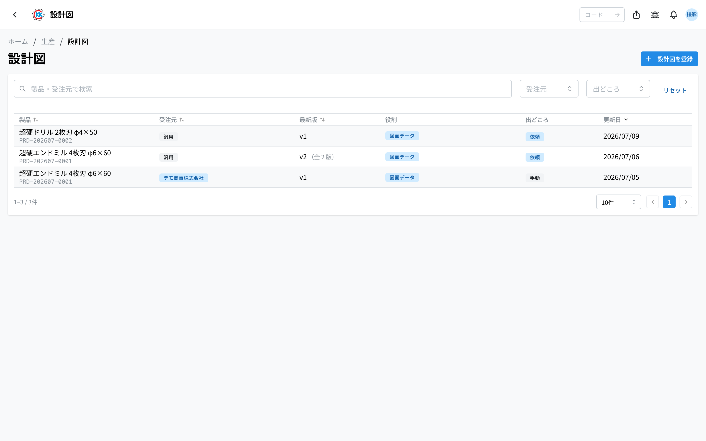
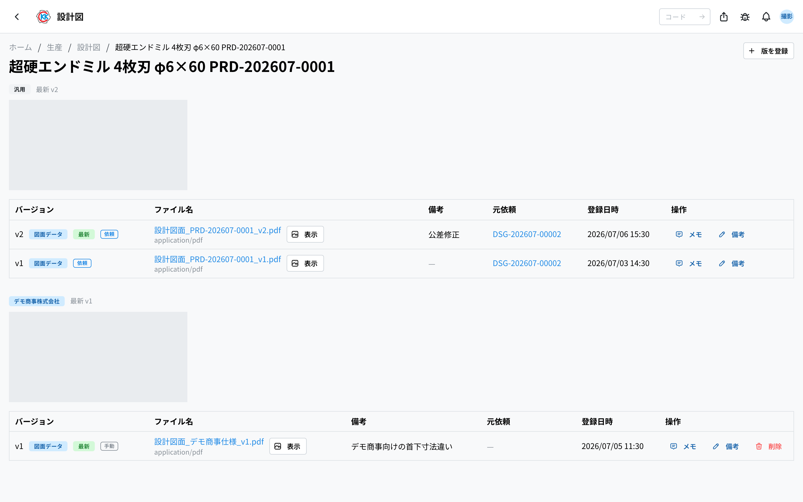
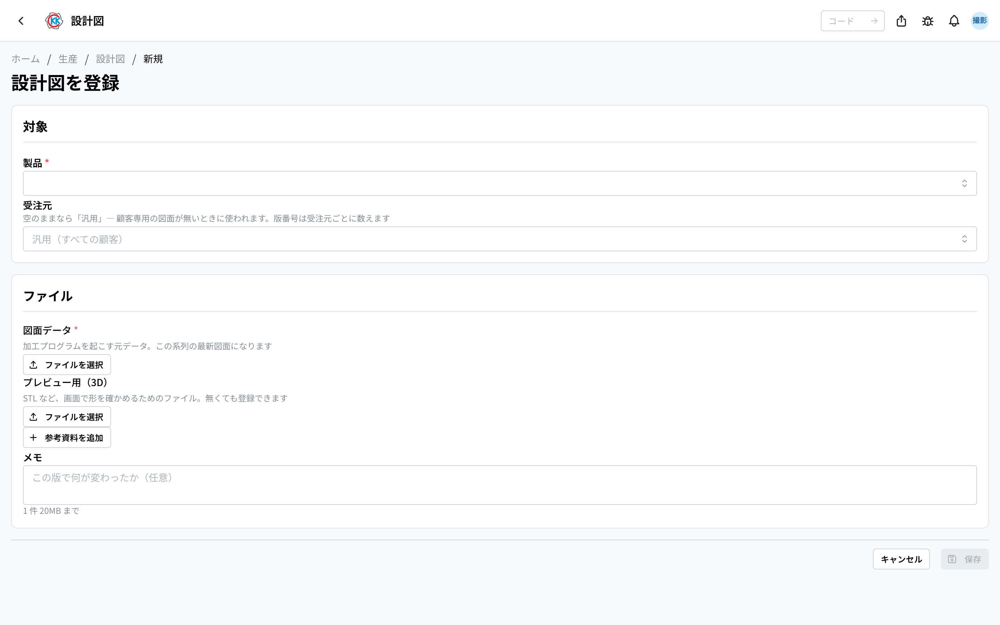

Register product drawings as **versions** and keep them **separate per customer**. The operation code is `PD06`.

> ⚠️ This app is still in trial release. Screens and steps may change.

## What you can do

- Register a product drawing as a **version**. One registration is one version.
- Keep versions **separate per customer**. The same product can have a different drawing for each customer.
- Open a registered version on screen (PDF and images render directly; 3D models such as STL can be rotated).
- Register a version as the deliverable of a [design request](/manual/en/operations/sales/design-request/user), which is what lets that request be completed.
- Register without a request (the drawing already exists, or you are importing an old one).
- Leave a **note** on each version describing what changed.

**This is the only app that can register, edit or delete a drawing.** Drawings also appear in the [product master](/manual/en/operations/masters/product/user) and in [design requests](/manual/en/operations/sales/design-request/user), but those are read-only. Keeping one place to write is what keeps version numbering consistent.

## Versions and series

### One registration = one version

Even if you upload a drawing file, a preview and reference materials together, they **all share the same version number**. A version is a revision generation of the drawing, not a serial number per file. So an assembly drawing and its part drawings released together never drift apart, and "make it v3" is unambiguous.

### Versions are counted per product and customer

The same product grows a separate drawing for each customer. That combination of **product and customer** is called a series.

- Customer A's v3 and customer B's v1 live side by side on the same product.
- A series with no customer is the **generic** one. It is used when a customer has no dedicated drawing.
- **Another customer's series is never used.** Customer A's drawing will not appear on customer B's work order — that would mean making the wrong thing without noticing.

A work order picks its drawing in this order: the matching customer's series, then the generic one.

## Reading the screen

The list shows **one row per series**, not per version. Listing every version would repeat the same product many times and bury the series you are looking for.

| Column | Contents |
|--------|----------|
| Product | The product the drawing is for |
| Customer | Blank series show as "generic" |
| Latest version | The newest version number, and how many versions exist |
| Role | Which file types the latest version has |
| Source | "Request" if any version came from a design request, otherwise "manual" |
| Updated | The date the newest version was registered |

Clicking a row shows **every series for that product**, split by customer, each with a thumbnail of its latest version and the full version list.

## Registering a drawing

1. Select **Register drawing** at the top right of the list.
2. Choose the **product** (required).
3. Choose the **customer**. Leave it blank for the generic series.
4. Choose the **drawing file** (required, one). This becomes the latest drawing for that series.
5. Add a **preview** (optional, one) and **reference** files (optional, any number) if you need them.
6. Add a **note** if you want.
7. Select **Save**.

The version number is assigned automatically (the series' latest version plus one).

### The three roles

| Role | What goes in it |
|------|-----------------|
| **Drawing file** | The source data a machining program is written from (CAD). **Required** — the product's latest drawing points at this |
| **Preview** | A file for checking the shape on screen (STL and similar). Can be rotated |
| **Reference** | Part drawings, dimension tables and so on. Each can carry its own description |

**Preview and drawing file are chosen separately** because they are used differently. Even for the same shape, an STL is for looking at and a CAD file is for making from; neither substitutes for the other.

### Supported files

There is no format restriction (20MB per file). However, only PDF, images and some 3D models (STL, OBJ, PLY, GLB, 3MF) **open on screen**. Download STEP, IGES, DXF and DWG and open them in your own software.

## Registering as a design request deliverable

Selecting **Register drawing** on a [design request](/manual/en/operations/sales/design-request/user) opens this form with the **product and customer fixed to that request**. The request decides those two, so they cannot be changed.

After saving you return to the request, where **Complete** is now available. **A request cannot be completed with no deliverable** — otherwise completing it would only advance a status, and the person who raised it could not see what was produced.

## Writing a memo on a version

Selecting **メモ** (memo) on a row opens a memo **for that version alone** — where to record what changed in it, or what to watch out for when using it.

- Text can carry **bold, italic, bullet lists, headings and links**.
- It is **one shared field per version**: anyone who can register or edit drawings can rewrite it. It holds the current facts about the version, not a record of who said what.
- **It can be written even on a version used by a work order.** What freezes is the drawing itself, not the notes about it.
- **Memos are internal.** They never appear on a printed document.

This is separate from the short **備考** (note) shown in the list column: that is the one line written at registration, while the memo grows afterwards.

## Editing the note and deleting versions

Use the buttons at the right of each row in the version list.

| Action | When it is allowed |
|--------|--------------------|
| Memo | Always — read-only users can open it too |
| Edit note | The version is not used by a work order |
| Delete | The version is not used by a work order and did not come from a design request |

**The drawing file itself cannot be replaced.** Changing a drawing means creating a new version; rewriting a past version would make it impossible to trace what something was made from.

**A version used by a work order cannot be touched.** It records that something was made — or is about to be made — from that drawing. A version from a design request cannot be deleted for a different reason: it is the deliverable of a completed request. Its note and memo can still be edited.

## Questions and problems

**Q. The version went back to v1 on the same product**
You are looking at a different series. Versions are counted per product and customer, so a drawing for a new customer starts at v1.

**Q. No drawing appears on the work order**
There is neither a series for that order's customer nor a generic one. Register one version with the customer left blank and it becomes available to every customer's work orders.

**Q. I cannot see "Register drawing"**
You do not have permission to register drawings. Ask an administrator — almost everyone can view them.

**Q. I cannot complete a design request**
That request has no deliverable registered yet. Use "Register drawing" on the request screen.

**Q. I registered against the wrong product**
Delete that version and register it again against the right product (manual versions not yet used by a work order can be deleted).

<!-- permissions:start -->
## Permissions required

Using this screen requires the **Drawing** (`design_file`) permission.

| What you want to do | Permission needed |
| --- | --- |
| Open the screen, view lists and details | Drawing — View |
| Add, change or delete | Drawing — Create / Edit / Delete |

Viewing only needs *View*. Where a screen offers adding, changing or deleting, each of those needs its matching permission.

Permissions come through roles. If something is missing, ask an administrator.

For the whole picture see [Permissions and roles](../../../permissions).
<!-- permissions:end -->
