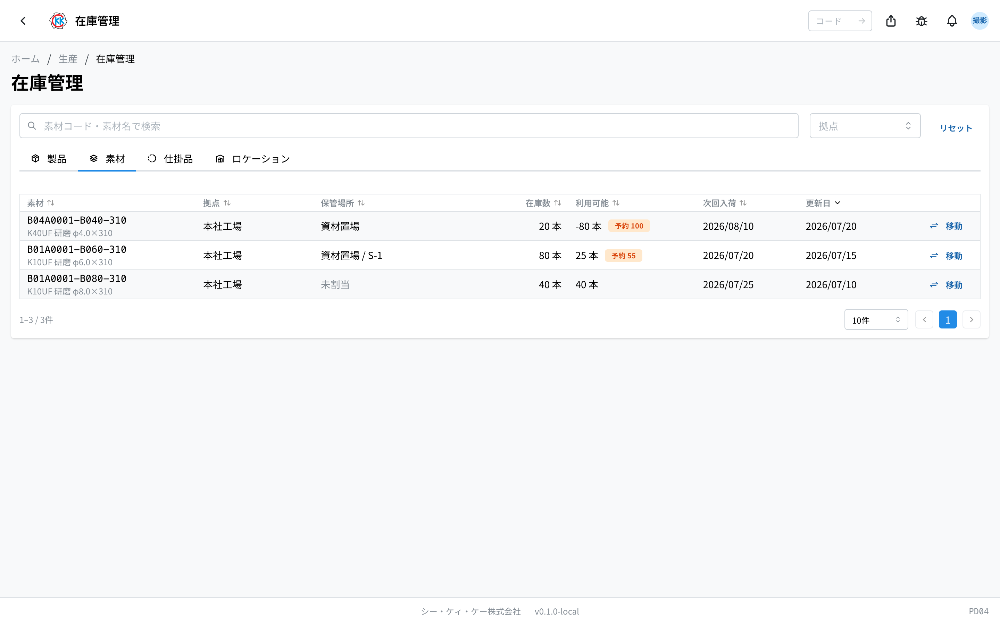
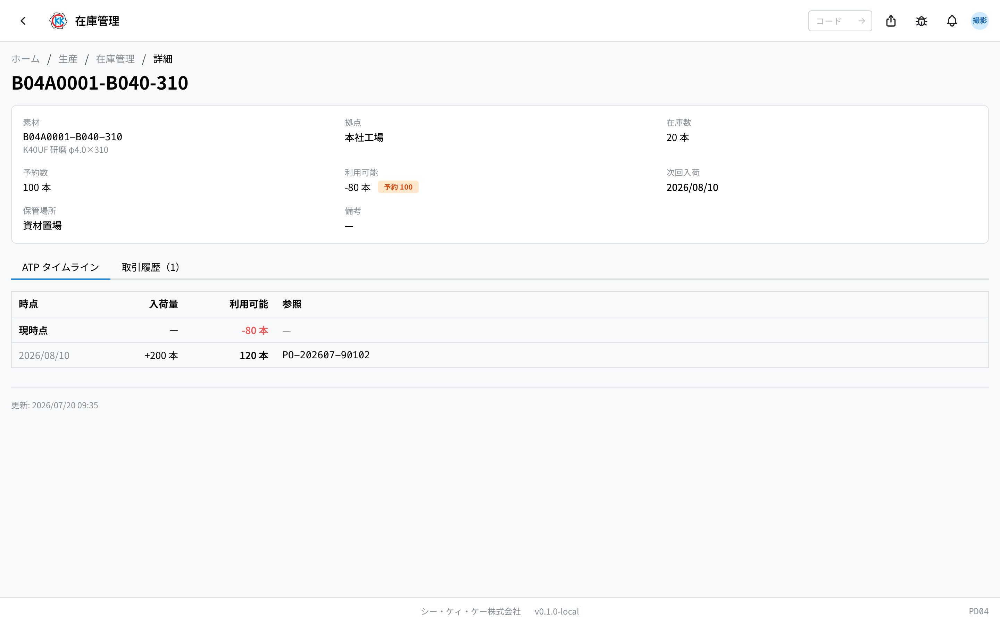
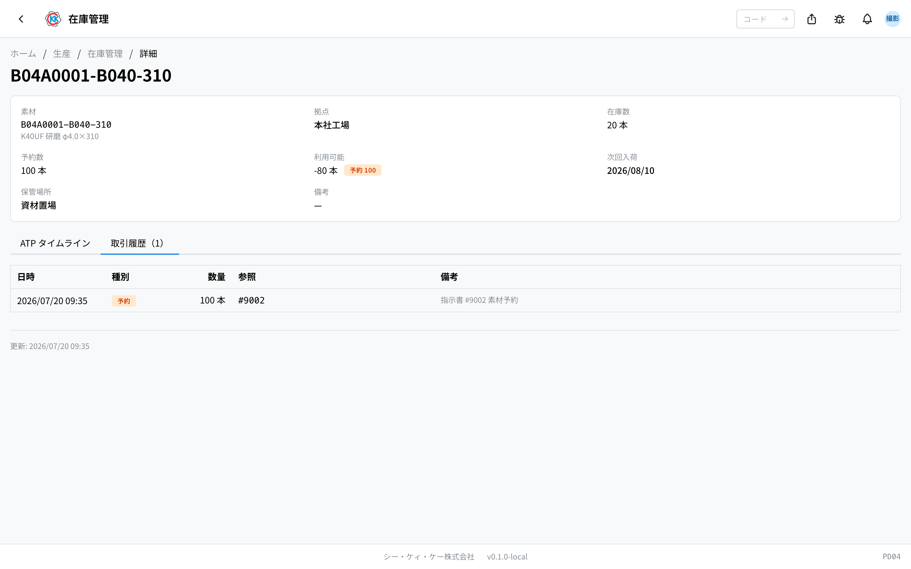
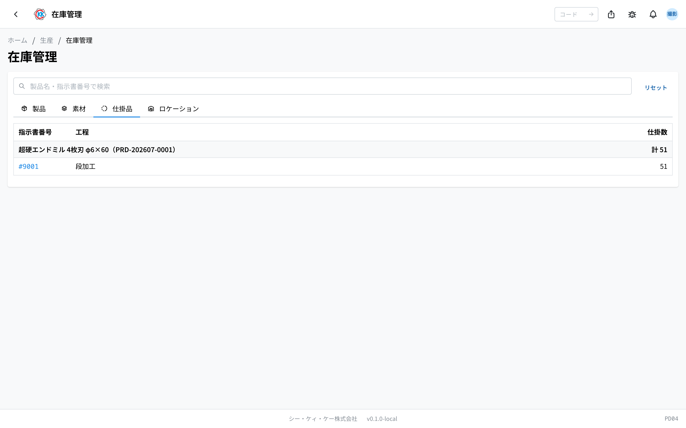

本页说明[库存管理](/manual/zh/operations/production/product-inventory/user)（操作码 `PD04`）的「**素材**」（材料）标签页和「**仕掛品**」（在制品）标签页的看法。可以确认材料现在能用多少，以及现在有多少正在制造中。

> ⚠️ 本应用目前 **只能在测试环境中使用**。在可以正式使用之前，画面和步骤可能会有变化。

## 本页能做什么

- 可以确认材料在哪个据点有多少。
- 可以了解扣除被预留部分之后 **实际能使用的根数**。
- 可以确认已订购的材料 **什么时候、会进来多少**。
- 可以确认现在哪份指示书的哪道工序上有多少根。

> 💡 材料数量无法在这里直接修改。数量会随着日常业务自动变动。本画面上能手动进行的操作只有「**在庫移動**」（库存移动，即更改存放位置）。步骤请参考[库存管理](/manual/zh/operations/production/product-inventory/user)。

## 本页出现的词语

- **利用可能**（可用）… 库存中尚未被预留的部分，也就是实际能用的根数。
- **予約（取り置き）**（预留）… 为接下来要制造的部分确保下来的材料。
- **次回入荷**（下次到货）… 已订购的材料下一次预计进来的日期。
- **仕掛品**（在制品）… 做到一半的物品。还在工序途中，尚未成为库存。

## 材料从哪里增加、从哪里减少

- **增加** … 在[材料到货](/manual/zh/operations/purchasing/material-receipt/user)（PU03）中登记到货后，收货据点的库存会增加。
- **被预留** … 「製造分」（制造分）的[制造指示书](/manual/zh/operations/production/work-order/user)获批后，要使用的材料会按计划数量被预留。
- **减少** … 该指示书的所有工序完成后，预留的材料会作为已使用的部分减少。
- **出现到货预定** … 已下单的[材料订购单](/manual/zh/operations/purchasing/purchase-order/user)（PU02）的明细，会显示下次的到货预定日和数量。

## 材料标签页的看法

- **素材**（材料）… 材料编码和名称。
- **拠点**（据点）… 位于哪个据点。
- **保管場所**（保管场所）… 以「场所名 / 货架编码」的形式显示。尚未确定的会显示「**未割当**」（未分配）。
- **在庫数**（库存数）… 实际存在的数量（带单位显示）。
- **利用可能**（可用）… 其中未被预留、实际可以使用的数量。
- **次回入荷**（下次到货）… 已订购的材料下一次预计进来的日期。
- **移動**（移动）… 更改存放位置时点击的按钮。
- 在上方搜索框输入材料编码或材料名称即可查找。也可以用「**拠点**」（据点）筛选。
- 点击某一行，会打开该材料库存的详情画面。

## 查看详情画面

点击某一行，会打开该条材料的详情画面。上方会依次显示材料、据点、库存数、预留数、可用数、下次到货、保管场所、备注。

### ATP 时间轴

这是一张按日期排列的表：从「现在能用多少」开始，逐步加上到货预定，从而看出 **什么时候能用多少**。

- **時点**（时点）… 最上面一行是「**現時点**」（当前时点）。下面是各个到货预定日。尚未确定到货日的会显示「**未定**」（未定）。
- **入荷量**（到货量）… 当天预计进来的数量。
- **利用可能**（可用）… 过了那一天之后可以使用的数量（是加上此前到货的数量）。
- **参照**（参照）… 作为依据的订购单编号。

「利用可能」（可用）显示为 **红色数字（负数）** 的日期，表示在那个时点数量不够。也就是被预留的部分超过了手头库存加上到货预定的总量，是考虑订购的信号。

### 交易履历

材料变动的记录。会保留日期时间、类别、数量、参照、备注。

类别有「**入庫**」（入库）「**出庫**」（出库）「**予約**」（预留）「**解除**」（解除）「**調整**」（调整）5 种。

## 在制品标签页的看法

这是按指示书和工序排列、显示现在有多少正在制造中的画面。

- 会按产品汇总，并显示「計 51」（合计 51）这样的合计数。
- 下方会排列「**指示書番号**」（指示书编号）「**工程**」（工序）「**仕掛数**」（在制数）。
- 点击指示书编号，会打开该[制造指示书](/manual/zh/operations/production/work-order/user)的画面。
- 没有进行中的指示书时，会显示「**進行中の仕掛品はありません**」（没有进行中的在制品）。

> ⚠️ 在制品还不是库存。只有指示书的所有工序完成后，才会进入实际库存。

使用本应用需要库存权限。产品标签页、位置标签页以及库存移动的步骤，请参考[库存管理](/manual/zh/operations/production/product-inventory/user)。

## 输入项

库存管理基本上是**用于查看的画面**，仅在将库存移至其他场所时需要输入。

| 项目 | 必填 | 填什么 |
|------|------|--------|
| [移动目标基地](#field-plant) | 必填 | 移动到何处 |
| [保管场所 / 货架](#field-location) | 选填 | 在该基地内放置的位置 |
| [数量](#field-quantity) | 必填 | 移动的数量 |
| [备注](#field-notes) | 选填 | 移动的理由等 |

### 移动目标基地 [#field-plant]

移动到哪个基地。**移动源的库存减少，移动目标的库存增加。**

### 保管场所 / 货架 [#field-location]

在移动目标基地内放置的位置。事先确定后，日后更容易找到实物。

### 数量 [#field-quantity]

移动的数量。不能超过移动源现有的数量。

### 备注 [#field-notes]

用于记录移动理由等。移动记录会保留在履历中。

## 常见问题・遇到困难时

**Q. 预留数比库存数还多，是不是不正常？**
A. 这并不异常。即使库存不足，指示书也可以获批，并在那时预留所需的数量。不足的状态就是「需要订购」的信号。请用 ATP 时间轴确认到货之后是否够用。

**Q. 「利用可能」（可用）显示为红色负数。**
A. 被预留的部分超过了手头库存加上到货预定的总量。请考虑提前到货，或是否需要追加订购。

**Q. 想手动修改材料数量。**
A. 本画面上能做的只有「在庫移動」（库存移动，即更改存放位置）。数量有偏差时需要做盘点调整，请与管理员商量。

**Q. 「次回入荷」（下次到货）栏是空的。**
A. 该材料没有已下单的材料订购单。没有订购时不会显示到货预定。

**Q. 在制品标签页什么都没有显示。**
A. 目前没有进行中的指示书。指示书获批并开始工序后就会显示。

**Q. 在制品的数量没有出现在产品标签页。**
A. 因为制造中的部分还不算库存。所有工序完成后就会进入产品标签页。
