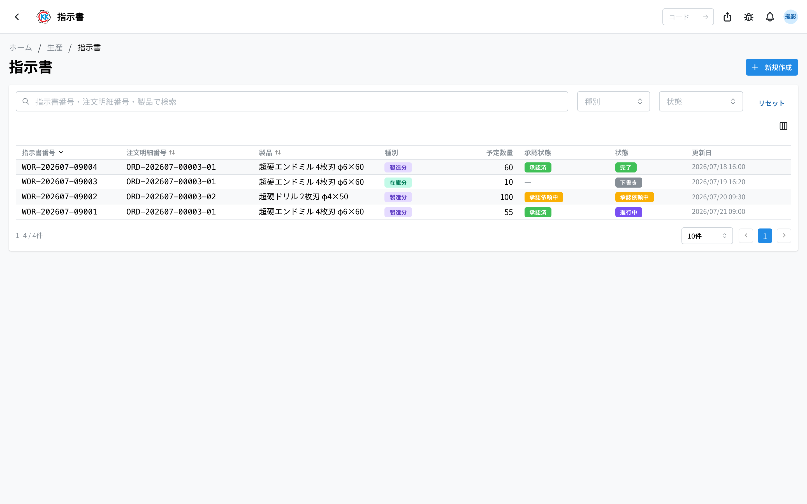
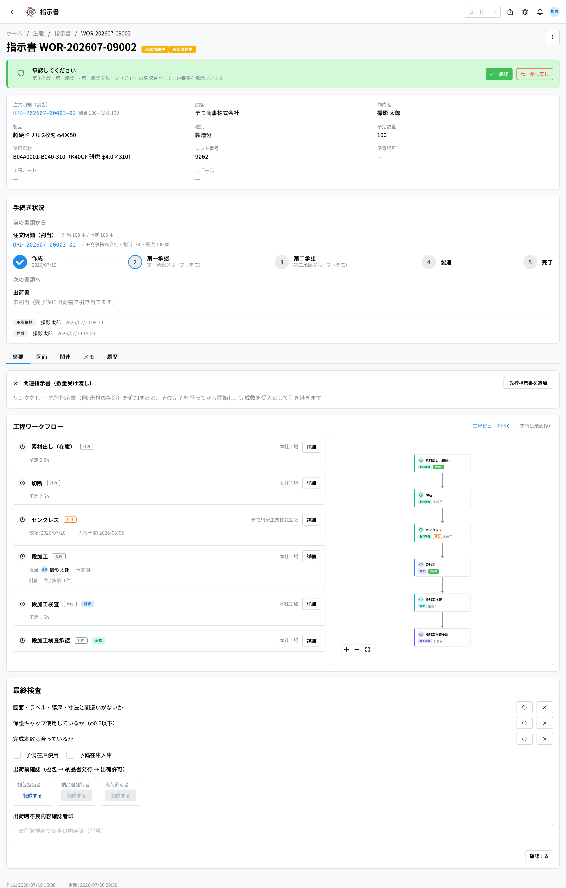
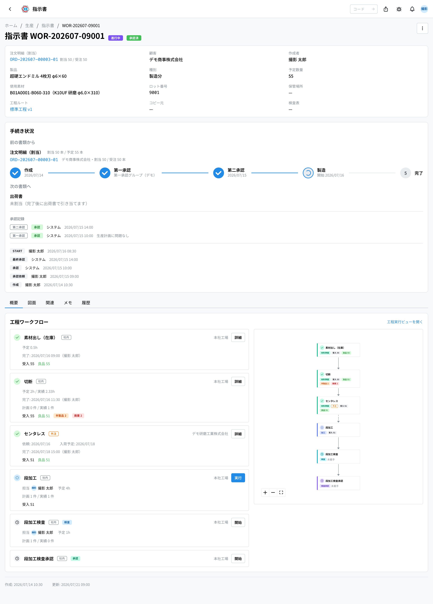
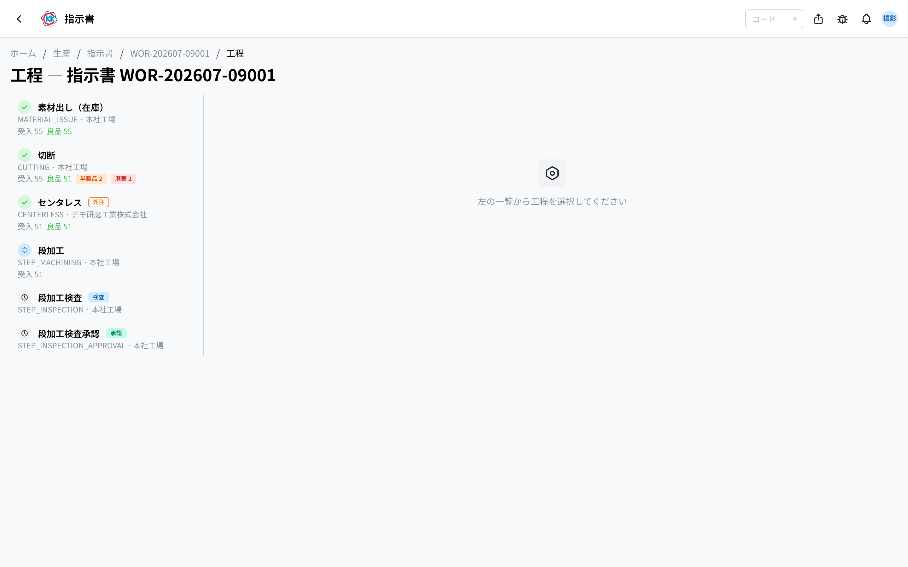
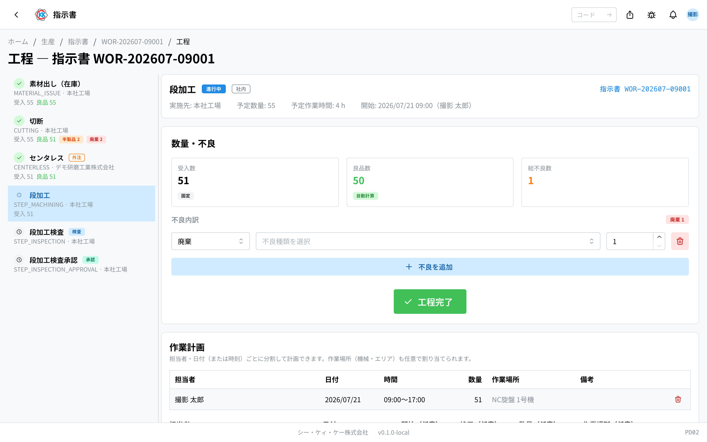
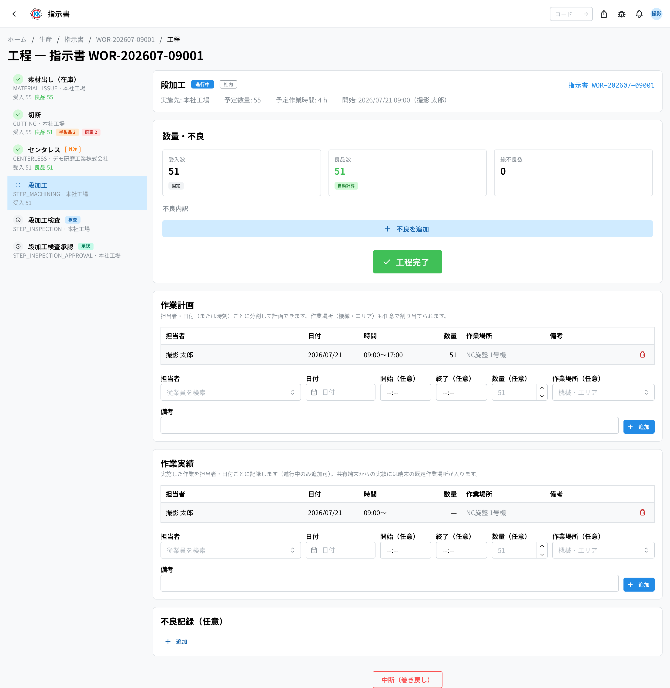

工場で「どの製品を・何本・どの順番で作るか」を決める書類（**指示書**）をつくり、承認から作業の完了までを記録するアプリです。操作コードは `PD02` です。

> ⚠️ このアプリは今のところ **テスト用の環境だけ** で使えます。本番で使えるようになるまでに、画面や手順が変わることがあります。

> このアプリが属するフロー … [生産の流れ](/manual/ja/process/production)

## このアプリでできること

- お客様の注文（注文明細）をもとに、工場への作業指示をつくれます。
- つくった指示書を上長に回して、**承認** をもらえます。
- 作業の一つひとつ（工程）について、**始めた・終わった・何本できた** を記録できます。
- 不良が出たときは、その本数と理由を残せます。
- 全部の作業が終わると、できあがった製品が **自動で在庫に入ります**。

## 用語（このページで出てくる言葉）

- **注文明細（ちゅうもんめいさい）** … お客様の注文を、製品ごと・本数ごとに分けた社内の書類です。指示書はこれを選んでつくります。
- **割当（わりあて）** … その指示書が、どの注文明細のために何本つくるかという結び付きです。1 つの明細を複数の指示書に分けても（分割）、同じ製品の複数の明細を 1 つの指示書にまとめても（統合ロット）かまいません。
- **工程（こうてい）** … 「切断」「段加工」「検査」など、作業の 1 ステップのことです。
- **工程リスト** … その製品を作るときの工程の並びを、あらかじめ登録しておいたものです。
- **ロット番号** … 作った製品のかたまりに付く通し番号（例: `#9001`）です。指示書を作ると自動で付き、在庫や出荷でロットを追いかけるのに使います。
- **受入数 / 良品数** … 受入数はその工程に入ってきた本数、良品数は問題なく次に進める本数です。
- **承認グループ** … 承認していい人をまとめた名簿です。ここに入っている人だけが承認できます。

## はじめる前に

- 先に **注文明細** が必要です。注文明細は[注文請書](/manual/ja/operations/sales/order-acceptance/user)の取込画面から作られ、「注文明細」の画面（操作コード `SA05`）で確認できます。
- 注文明細の画面で「**在庫照合**」を実行すると、すでにある在庫が注文に取り置きされます。足りない分をこのアプリで作ります。
- 承認をする人は、あらかじめ[承認設定](/manual/ja/operations/masters/approval-setting/user)で、その段の承認グループに登録されている必要があります。

## 画面の見かた

アプリを開くと、これまでに作った指示書の一覧が出ます。

- **指示書番号** … `WOR-202608-00001` のような番号です。他の書類（見積書・注文請書など）と同じ形式で、月ごとに 1 から振り直されます。ロット番号（`#9001` のような通し番号）は別に付き、詳しい画面で確認できます。
- **種別** … 「**在庫分**」（すでにある在庫を使う）か「**製造分**」（新しく作る）かの区分です。
- **予定数量** … 作る予定の本数です。
- **承認状態** … 「承認依頼中」「承認済」「差し戻し」が色つきのバッジで分かります。いま何段目かは詳細画面のカードに出ます。
- **状態** … 「下書き」「承認依頼中」「承認済」「進行中」「完了」「キャンセル」のいずれかです。
- 上の検索欄に指示書番号・注文明細番号・製品名を入れて探せます。「**種別**」「**状態**」でも絞り込めます。
- 行をクリックすると、その指示書の詳しい画面が開きます。

## 指示書をつくる

1. 一覧画面の右上にある「**新規作成**」を押します（注文明細の画面からも開けます。そのときは注文明細が選ばれた状態で始まります）。
2. 「**注文明細の割当**」で、もとになる注文明細を選びます。注文明細番号・製品・顧客で検索できます。選ぶと、お客様の名前・製品・受注数量・**割当可能残**（受注数量からほかの指示書ぶんを引いた残り）が下に表示されます。
3. 「**割当数量**」に、この指示書がその明細のためにつくる本数を入れます。残りの本数は自動で入るので、一部だけ作るとき（分割）だけ直します。
4. 同じ製品の別の明細もまとめて作るとき（統合ロット）は「**明細を追加（統合ロット）**」を押して、行を足します。ちがう製品の明細は同じ指示書にできません。
5. 「**種別**」で「在庫分」か「製造分」を選びます。在庫分は明細を 1 つだけ選べます。**在庫分の工程は「製品出し（在庫）」＋（必要なら）「出荷前検査」の固定構成**で、工程リストは使いません — 以降の 10〜12 は製造分だけの手順です。
6. 「**予定数量**」に、作る本数を入れます。割当の合計が自動で入り、それより少ない本数にはできません。不良予備分として多めにするのは自由です。
7. 「製造分」を選んだときは「**使用素材**」を選びます。**製品の想定材種（材種 × 直径）に合う素材があれば、最初から入っています。** 欄の下に「製品の想定材種: …」と出るので、そのままでよければ触らなくてかまいません。
8. できあがった製品をどこにしまうかが決まっていれば「**保管場所**」を選びます（空のままでもかまいません）。
9. 「**検査表**」は**検査工程ごと**に割り当てます。工程を選ぶと、その工程を関連工程に持つ検査表が自動で選ばれます。足りなければ工程ごとの欄で追加で選びます。
10. 「**工程リスト**」を選びます（次の項目を参照。製造分のみ）。
11. 社内でも外注でもできる工程は、「**社内**」か「**外注**」を選び、社内なら拠点、外注なら外注先を選びます。工程ごとに「**ロット入力**」（既定 / ロット必須 / ロット任意 / ロットなし）と「**作業時間**」（かかる時間の目安）も変えられます。「ロット必須」にした工程は、現場で始めるときにロットや伝票のコードを入れないと開始できません。
12. 「**作業計画（担当者）**」で、工程ごとの担当者を割り当てられます（任意）。担当を入れた工程には、計画日付きの作業計画が作られます。時間帯や数量まで決めたいときは、作成後に工程ごとの計画の表で追加します。
13. 「**保存**」を押します。

保存すると「**下書き**」の指示書ができ、詳しい画面が開きます。

> 💡 1 つの明細の一部だけを先に作ることもできます（分割）。残りの本数は「未処理指示書」の画面（操作コード `PD05`）の「未手配」に出続けるので、あとから別の指示書で作れます。

素材が足りないときは「**素材在庫が 30 不足しています**」のような案内が出ます。これは注意のお知らせなので、そのままでも保存できます。次の入荷予定が無いときは「**入荷予定がありません。素材発注を検討してください**」と出ます。

### 工程リストについて

工程の並びは、製品ごとに「工程リスト」として登録されています（**製造分のみ**。在庫分は固定構成のため工程リストを使いません）。

- 工程リストは、どのお客様にも使える「**汎用**」のほかに、**特定のお客様専用** のものも作れます。注文明細を選ぶと、そのお客様専用のリスト → 汎用のリスト → 一覧の先頭、の順で自動的に選ばれます。ほかのお客様専用のリストが自動で選ばれることはありません（手で選ぶことはできます）。
- 専用のリストが混ざっているときは、選択肢が「リスト名（お客様名）」「リスト名（汎用）」のように区別して表示されます。
- 「**バージョン**」を選び直すと、以前の並びを使うこともできます。
- その製品にまだ工程リストが無いときは「**この製品の工程リストは未登録です（下で新規作成）**」と出ます。「**新しい工程リスト名**」（例: 標準工程）を入れて保存すると、そのまま新しいリストとして登録されます。新しく作るときは「**対象顧客**」で「◯◯ 専用」か「**汎用（全顧客）**」を選べます。専用にすると、同じお客様×製品の指示書で優先して選ばれます。
- 工程を足したり外したりすると「保存時に新バージョンとして保存されます」という案内が出ます。前に使った指示書の内容は変わりません。

工程はチェックリストから選びます。並びと決まりは次のとおりです。

- 一番上の「**出し・受渡し（開始）**」（素材出し・半製品出し・素材受渡し・製品受渡し）から**必ず 1 つだけ**選びます（別のものを選ぶと入れ替わります）。**全ての工程はここから始まります。**
- 前の工程が前提になっている工程は、前提を選ぶまでチェックできません（灰色になり「**要: 全長合わせ**」のように必要な工程が出ます）。逆に、ある工程に必要な検査・検査承認は、選んだときに自動で一緒に追加されます。
- 一番下の「**出荷前検査（任意）**」は追加してもしなくてもかまいません。追加すると常に最後に実行されます。**出荷そのものは工程ではなく、[出荷書](/manual/ja/operations/shipping/delivery-order/user)で管理します。**
- 組み合わせに問題があると赤い案内が出て、そのままでは保存できません（「**工程構成にエラーがあります**」）。赤い案内が消えるまで工程を直してください。

保存したあと、指示書の詳しい画面には「**工程ルート**」として使った工程リストの名前とバージョン（例: 標準工程 v1）が出ます。ここから製品の工程リストを開けます。

## 承認をもらう

指示書は、承認をもらうまで作業を始められません。**何段の承認を通るか**は[承認設定](/manual/ja/operations/masters/approval-setting/user)で決まっていて、書類の内容によって段数が変わることもあります。画面のカードに、いま何段目かが表示されます。

1. 指示書の画面のいちばん上のカードにある「**承認依頼**」を押します。
2. 状態が「**承認依頼中**」に変わります。ここから先、もとの注文明細は編集できなくなります。
3. 各段の承認をする人が、順番に「**承認**」を押します。
4. 最後の段まで通ると、状態が「**承認済**」になり、作業を始められます。

- 承認できるのは、その段の **承認グループに入っている人** と、期間を決めて代理を任された人だけです。入っていない場合はボタンが出ず、「◯◯ のメンバーのみ承認・差し戻しできます」と表示されます。加えて、**その指示書を閲覧または編集できる権限**（担当拠点の範囲を含む）も必要です。グループに入っていても書類を開けない人は承認できません。
- 内容に問題があるときは「**差し戻し**」を押します。「**差し戻し理由**」の入力が必要です。
- 差し戻された指示書は「下書き」に戻り、画面に赤く理由が出ます。直したあと「**再承認依頼**」で出し直せます。
- 承認・差し戻しの記録は「手続き状況」の下に残ります。代理で承認したものには「（代理: 原承認者）」が付きます。

承認は[承認管理](/manual/ja/operations/production/approval/user)（PD03）の一覧からも行えます。

「製造分」の指示書が承認されると、使う素材がその指示書のために **取り置き（予約）** されます。

## 先行の指示書とつなぐ（数量受け渡し）

母材を作る指示書 → それを使って仕上げる指示書、のように、**別の指示書の完成品を受け取って始める**ことができます。指示書の画面の「**関連指示書（数量受け渡し）**」で設定します。

1. 「**先行指示書を追加**」を押します。
2. 「**先行指示書番号**」に、先に完了すべき指示書のロット番号を入れます。
3. 「**受け渡し数量**」は任意です。空のままにすると、先行の指示書が完了したときの完成数を全量受け取ります。

先行の指示書をつなぐと、その指示書が完了するまで、こちらの最初の工程は始められません（「先行指示書 #◯◯ が未完了です」と表示されます）。先行が完了すると、その完成数がこちらの最初の工程の **受入数の初期値** になります。

## 工程を進める

指示書の画面の下に「**工程ワークフロー**」があり、工程が順番に並んでいます。

承認が済んでいると、右上に「**工程実行ビューを開く**」というリンクが出ます。これを押すと、左に工程の一覧、右に作業の記録画面が並んだ画面が開きます。承認前や完了後も「**工程ビューを開く**」から同じ画面を開けますが、**閲覧だけ**で作業の操作はできません（リンクの横に「（実行は承認後）」「（閲覧のみ）」と表示されます）。

### 作業を始める

1. 左の一覧から、これから行う工程を選びます。
2. ロットの記録が設定されている工程では、「**ロット/伝票コード**」に素材ロットや伝票のコードを入れます（「必須」の工程では入れないと始められません。「任意」なら空のままでもかまいません）。入れたコードは進行中なら直せます。
3. 「**工程開始**」を押します。
4. 前の工程が終わっていないなど始められない場合は「**開始できません**」と出て、理由が並びます。

作業を始めると、その工程はあなたが使っている状態になります。ほかの人の画面には「**別のユーザーがセッション中です**」と出て、操作できなくなります。

### 本数を記録して終わる

工程を始めると「**数量・不良**」の入力欄が出ます。

- **受入数** … その工程に入ってきた本数です。前の工程の良品数が自動で入り、ここでは直せません（「固定」と表示されます）。
- **良品数** … 自動で計算されます（「自動計算」と表示されます）。不良を入れると、その分だけ減ります。
- **総不良数** … 不良の行に入れた本数の合計です。これも自動で表示されます。
- **不良内訳** … 不良が出たときだけ入力します。「**不良を追加**」を押し、1 行ごとに次を入れます。
  - 種別 … 「**半製品**」（在庫に戻す）/「**廃棄**」/「**工程分岐**」（手直しなど、別の工程へ回す分）
  - 不良種類（必須） … 「**不良種類を選択**」から選びます（[不良種類](/manual/ja/operations/masters/defect-type/user)で登録したもの）
  - 本数
  - 詳細（必須） … どんな不良だったかを文章で書きます
- 最後に「**工程完了**」を押します。

検査の工程では、欄の名前が「**検査数**」「**合格数**」「**不合格（半製品）**」「**不合格（工程分岐）**」などに変わります。数量を記録しない工程では入力欄が出ず、「この工程は数量記録なしで完了します（通過数 51）」と出るのでそのまま完了できます。

> ⚠️ 不良の合計が受入数より多いと「**不良の合計（55）が受入数（51）を超えています**」と出て、完了できません。本数を見直してください。また、不良の行に不良種類か詳細が入っていないと「**不良の各行に種類と詳細を入力してください**」と出ます。全部の行を埋めてから完了してください。

### そのほかに記録できること

- **検査表の確認・付け替え** … 検査の工程では「**検査表を見る**」から、その工程に割り当てられている検査表をその場で確認できます。付け替えもこの画面から行い、「**編集**」で選び直して「**保存**」を押します（指示書の編集画面へ戻る必要はありません）。割り当てが無い工程では「**検査表が割り当てられていません**」と出ます。キャンセル済みの指示書・工程では見るだけになります。
- **検査記録** … 検査の工程では、検査表の項目ごとに実測値を入れます。合否は項目の種類にあわせて自動で判定されます。全部を測らない抜取検査では、決められたサンプル数の規則にしたがって検査数が決まります。検査承認の工程では、合格した検査記録を承認できます。
- **不良記録（任意）** … 不良種類と内容を書き残せます。
- **作業計画 / 作業実績** … 誰が・いつ・どこで・何本やるか（やったか）を、担当者・日付・時間・数量・作業場所で記録できます（下の「作業計画と作業実績」を参照）。
- **外注日程** … 外注の工程では「依頼日」「入荷予定日」「入荷日」「外注費」を記録できます。

### 作業計画と作業実績

工程の画面の下のほうに「**作業計画**」「**作業実績**」の表があります。担当者・日付（または時刻）・数量・**作業場所**を行ごとに記録できます。

- **作業場所（任意）** … どの機械・区画で作業する（した）かです。[工程マスタ](/manual/ja/operations/masters/process-step/user#field-allowed-locations)で許可作業場所が設定されている工程では、許可された場所だけが選べます
- 現場の共有端末（タブレット）から工程を開始・再開すると、実績の行は自動で作られ、作業場所には端末の**既定の作業場所**（または読み取った作業場所 QR）が入ります
- ここで手入力する実績にも、同じように作業場所を付けられます
- **同時作業数** … 1 人が複数の工程を同時に進めていた実績には「**同時 ◯**」のバッジが付きます。実働時間は、かかった時間を同時作業数で割った値（按分）で数えます（例: 2 つ同時なら半分ずつ）

### やり直したいとき

- **中断（巻き戻し）** … 進行中の工程を、理由を書いて未着手に戻します。入力途中の数量は残りません。
- **巻き戻し** … 完了した工程を未着手に戻します。次の工程がもう始まっている場合や、在庫に計上済みの場合は戻せません。

## 工程分岐の分を別の流れに回す（分岐追加）

工程分岐に回した分だけ、別の工程を通したいことがあります。

1. 完了した工程のカードで、点が 3 つ並んだボタンを押します。
2. 「**分岐追加**」を選びます。
3. 「**追加する工程（実行順）**」で通したい工程を選びます。
4. 「**分岐数量**」に流す本数を入れます。
5. 分岐の終わり方を「**本流へ合流**」か「**在庫へ**」から必ず選びます。
   - 「**本流へ合流**」 … 「**合流先（未着手のメインライン工程）**」で、どの工程に戻すかを選びます。
   - 「**在庫へ**」 … 「**入庫先**」で「半製品」か「完成品」を選びます。分岐の最後の工程の良品が、指示書の完了時にその在庫に入ります。
   - どちらも選ばずにいると「合流先を選ぶか、「在庫へ」を選んでください。分岐は必ず合流か在庫で終わります。」と出て、追加できません。
6. 「**分岐を追加**」を押します。

分岐を作ると、工程ワークフローの上に工程の流れの図が出て、どの工程からどこへ何本流れるかが分かります。

作ったあとも、分岐のまとまりの鉛筆のボタンから **分岐数量**（分岐の工程がすべて未着手のときだけ）と **終わり方（合流先・入庫先）**（最後の工程が未着手のときだけ）を直せます。工程そのものを入れ替えたいときは、分岐をいったん削除して作り直します。

### 分岐の変更にも承認が必要な場合があります

承認済み・進行中の指示書で分岐を足したり直したり消したりすると、[承認設定](/manual/ja/operations/masters/approval-setting/user)に「工程フロー変更」の段がある場合は、**承認を通してから**変更が効きます。設定の内容によって、次のどちらかになります。

- **事前承認** … 変更は保留され、承認が済んでから工程に反映されます。保留中は指示書の画面の上にカードが出ます（承認できる人には承認・差し戻しのボタンが出ます）。
- **事後承認** … 変更はすぐ工程に反映され、承認はあとから行われます。あとから差し戻された場合は、工程が自動では元に戻らないため、画面に赤い案内が出ます。工程を確認して必要なら手で直し、「**確認済みにする**」を押してください。

承認設定に「工程フロー変更」の段が 1 つも無い場合は、承認なしでそのまま反映されます。

## 全部終わったとき

すべての工程が完了すると、指示書は自動で「**完了**」になります。

- 最後の工程の良品が、ロット番号付きで製品の在庫に入ります。
- 「半製品」に振り分けた分は、半製品として在庫に入ります。
- 取り置きしていた素材は、使った分として在庫から減ります。

在庫は[在庫管理](/manual/ja/operations/production/product-inventory/user)（PD04）で確認できます。作っている途中の本数は、同じアプリの「**仕掛品**」タブで見られます。

### 次のステップ: 出荷書をつくる

完了した指示書のうち、**完成した本数がまだ出荷書に載っていない**ものは、詳しい画面の一番上に「**次のステップ: 出荷書の作成**」が出ます。押すと[出荷書](/manual/ja/operations/shipping/delivery-order/user)の新規作成が開き、この指示書の注文明細が入った状態になります。

**同じ注文請書に、まだ出荷していない明細が他にもあるときは「まとめますか」と聞かれます。** まとめたいものにチェックを付けて「**選んだ明細を追加**」を押すと 1 つの出荷書になり、この指示書の分だけでよければ「**この指示書だけ**」を押します。あとから注文請書の欄で追加することもできるので、ここで決めきらなくてもかまいません。

在庫向けの指示書（注文明細に紐づいていないもの）からは作れません。その場合は出荷書の側で注文請書を選んでください。

## そのほかの操作

- **編集** … 「下書き」のときだけできます。画面右上の「**編集**」を押します。
- **キャンセル** … 「下書き」と「承認依頼中」のときだけできます。右上の点が 3 つ並んだボタンから「**キャンセル**」を選びます。
- **コピー** … 右上の点が 3 つ並んだボタンから「**コピー**」を選び、対象の注文明細を選ぶと、工程・実施場所・検査表を引き継いだ下書きができます。どこからコピーしたかは詳しい画面に「**コピー元**」として残ります。コピー元よりも新しい版がある場合は「最新版のコピーを検討してください」と案内が出ます。
- **ストリップ印刷** … 右上の点が 3 つ並んだボタンから「**ストリップ印刷**」を選ぶと、指示書の要点と QR コードが入った帯（A4 の普通紙に 6 本）を印刷できます。現物や箱に貼って使えます。
- 詳しい画面のタブは「**概要**」（工程と備考）/「**関連**」（もとの注文明細やコピー元）/「**履歴**」（いつ誰が変えたか）です。

このアプリを使うには、指示書の権限が必要です。

## 入力項目

指示書の作成画面で入力する項目の一覧です。工程そのものの並べ方は「工程リスト」で決めます。

| 項目 | 必須 | 何を入れるか |
|------|------|-------------|
| [注文明細の割当](#field-order-line) | 任意 | どの受注のために何本つくるか |
| [割当数量](#field-alloc-quantity) | 条件付き | その明細のためにつくる本数 |
| [対象製品](#field-product) | 必須 | つくる製品 |
| [予定数量](#field-planned-quantity) | 必須 | つくる本数 |
| [使用素材](#field-material) | 任意 | 使う素材 |
| [保管場所](#field-storage-location) | 任意 | できた製品をしまう場所 |
| [使用する図面](#field-design-file) | 任意 | どの版の図面で作るか |
| [工程リスト / バージョン](#field-route) | 必須（製造分） | どの工程の並びを使うか |
| [新しい工程リスト名](#field-new-route-name) | 条件付き | 新しく工程リストを作るときの名前 |
| [検査表](#field-inspection-templates) | 任意 | 検査工程ごとに使う検査表テンプレート |
| [ロット入力](#field-lot-input-mode) | 任意 | 工程ごとのロット/伝票コードの記録方法 |
| [作業時間](#field-step-work-hours) | 任意 | 工程ごとの作業時間の目安 |
| [作業計画（担当者）](#field-step-plans) | 任意 | 工程ごとの担当者と計画日 |
| [備考](#field-notes) | 任意 | 補足 |

### 注文明細の割当 [#field-order-line]

どの受注のための指示書かです。行を足せば**同じ製品の複数の明細を 1 つの指示書（1 ロット）にまとめられ**、逆に 1 つの明細を複数の指示書に分けて作ることもできます。**在庫を積むためだけの指示書では空のままにできます**（独立した在庫用の指示書）。

### 割当数量 [#field-alloc-quantity]

その明細のためにつくる本数です。明細ごとの**割当可能残**（受注数量からほかの指示書ぶんを引いた残り）が上限です。

### 対象製品 [#field-product]

つくる製品です。注文明細を選んだ場合は、その受注の製品が入ります。

### 予定数量 [#field-planned-quantity]

つくる本数です。**割当の合計以上**で入力します（不良予備分の上乗せは自由。在庫分は割当の合計と同じ本数になります）。**最初の工程の受入数の初期値**にもなります（ただし先行の指示書をつないでいる場合は、先行の完成数が受入数になります）。

### 使用素材 [#field-material]

使う素材です。指示書が承認されると、**この素材が在庫から予約されます。**

対象製品を選ぶと、その製品に登録された**想定材種（材種 × 直径）に合う素材が自動で入ります**。欄の下には「製品の想定材種: …」が表示されます。想定と違う素材を選ぶと「**選択中の素材は製品の想定材種（…）と異なります**」と注意が出ますが、**止められはしません** — 代替材で作ることはあるので、意図してそうしているなら、そのまま進めてかまいません。

### 使用する図面 [#field-design-file]

現場が見る図面の版を **固定** します。任意です。

空のままにすると固定されず、画面を開くたびに**そのときの最新の版**が出ます。図面が改訂されれば、現場が見る図面も変わります。欄の説明に「固定しない場合: …」と、いま何が使われるかが出ます。

版を選ぶと、その版に固定されます。あとから改訂されても現場が見る図面は変わりません。**固定された版は編集・削除ができなくなります** — その図面で物を作ったという記録だからです。

図面は「製品 × 受注元」ごとに分かれていて、固定しない場合はこの指示書のお客様の系列 → 無ければ汎用、の順で選ばれます。**他のお客様専用の図面は選ばれません**（別のお客様の図面が黙って出ると、気づかないまま違う物を作ることになるためです）。複数の注文明細をまとめた指示書でお客様が混ざっているときは、汎用が使われます。

指示書の詳細画面の「図面」タブからも、固定と解除ができます。

### 保管場所 [#field-storage-location]

できあがった製品をしまう場所です。[保管場所](/manual/ja/operations/masters/storage-location/user)マスタから選びます。決まっていなければ空のままでかまいません。

### 工程リスト / バージョン [#field-route]

どの工程の並びを使うかです。製品ごとに登録された工程リストから選びます。**バージョンを選ぶと、その時点の並びがそのまま複製されます** — 後で工程リストを直しても、作成済みの指示書は変わりません。在庫分の指示書では使いません（固定構成のため）。

### 新しい工程リスト名 [#field-new-route-name]

その場で新しい工程リストを作る場合の名前です。次回以降、同じ製品でこの並びを選べるようになります。

### 検査表 [#field-inspection-templates]

検査工程ごとに使う検査表テンプレートです。複数選べます。工程を追加すると、その工程を関連工程に持つ検査表が自動で選ばれ、検査工程の実行画面ではその工程に割り当てたものが使えます。

### ロット入力 [#field-lot-input-mode]

工程ごとの、ロット/伝票コードの記録方法です。「既定」（工程マスタの設定どおり）/「ロット必須」/「ロット任意」/「ロットなし」から選べます。「ロット必須」の工程は、現場で開始するときにコードを入れないと始められません。

### 作業時間 [#field-step-work-hours]

工程ごとの、かかる時間の目安（時間単位）です。工程のカードに「予定 ◯h」として表示され、実績と見比べられます。

### 作業計画（担当者） [#field-step-plans]

工程ごとの担当者と計画日です（任意）。担当を入れた工程に作業計画が作られ、担当者の現場タブレットの「工程実行」の一覧にその作業が出ます。時間帯・数量まで決める場合は、作成後に各工程の計画の表で追加してください。

### 備考 [#field-notes]

補足です。**現場が指示書を見るときに読まれます。** 注意点があればここに書いてください。

## よくある質問・困ったとき

**Q. 工程の画面は開けるのに、作業を始められません。**
A. その指示書がまだ承認されていません。リンクが「**工程ビューを開く**（実行は承認後）」になっている間は閲覧だけできます。先に承認をもらってください。

**Q. 承認のボタンが出ません。**
A. その段の承認グループに入っていないためです。「◯◯ のメンバーのみ承認・差し戻しできます」と表示されます。管理者に、承認設定でのグループ登録を相談してください。

**Q.「別のユーザーがセッション中です」と出て操作できません。**
A. ほかの人がその工程を進めている最中です。その人が完了するか中断するまで待ってください。

**Q.「不良の合計（55）が受入数（51）を超えています」と出て完了できません。**
A. 不良の行に入れた本数の合計が、受け取った本数より多くなっています。行ごとの本数を見直してください。

**Q.「工程構成にエラーがあります」と出て保存できません。**
A. 選んだ工程の組み合わせに足りないものがあります。赤い案内に「〜には〜が必要です」と書かれているので、その工程を追加してください。

**Q. 予定数量を減らしたら保存できませんでした。**
A. 予定数量が「割当数量」の合計を下回っています。予定数量を割当の合計以上にするか、割当数量のほうを減らしてください。

**Q.「割当が受注残を超えています」と出て保存できません。**
A. その明細には、ほかの指示書ですでに割り当て済みの本数があります。案内に出ている「残」の本数までしか割り当てられません。多めに作りたいときは、割当はそのままにして「予定数量」を増やしてください（不良予備分）。

**Q. 完了した工程を戻せません。**
A. 次の工程がすでに始まっているか、指示書が完了して在庫に計上済みです。在庫に入ったあとの本数のずれは、この画面では直せません。管理者に相談してください。

<!-- permissions:start -->
## 必要な権限

この画面を使うには **指示書**（`work_order`）の権限が要ります。

| したいこと | 必要な権限 |
| --- | --- |
| 画面を開く・一覧や詳細を見る | 指示書 の 閲覧 |
| 追加・変更・削除する | 指示書 の 作成 / 更新 / 削除 |

見るだけなら「閲覧」で足ります。追加・変更・削除の操作がある画面では、その操作にあたる権限がそれぞれ必要です。

権限は役割（ロール）を通して付きます。足りないときは管理者に相談してください。

権限の全体像は「[権限とロール](../../../permissions)」を参照してください。
<!-- permissions:end -->
