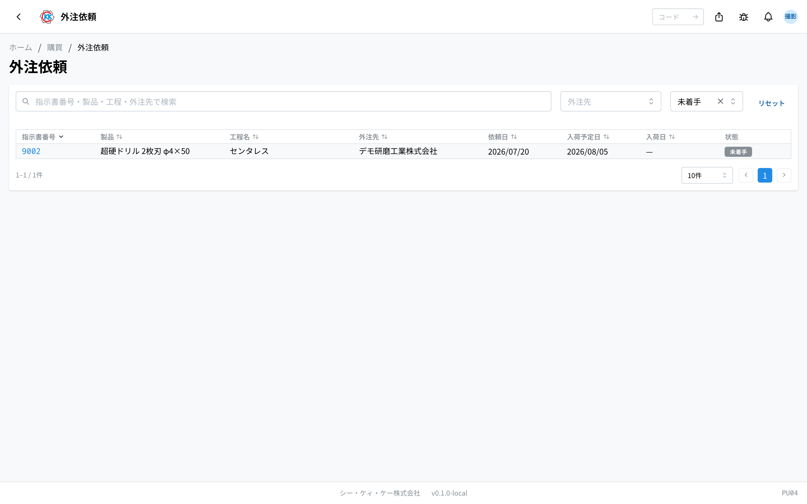
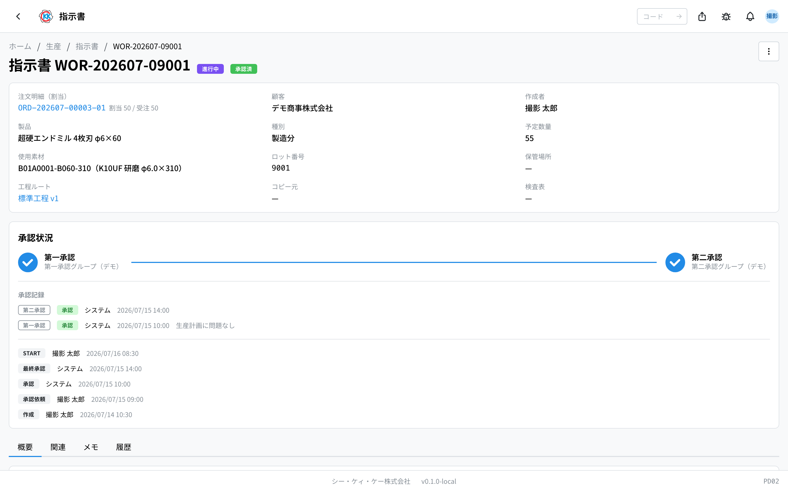
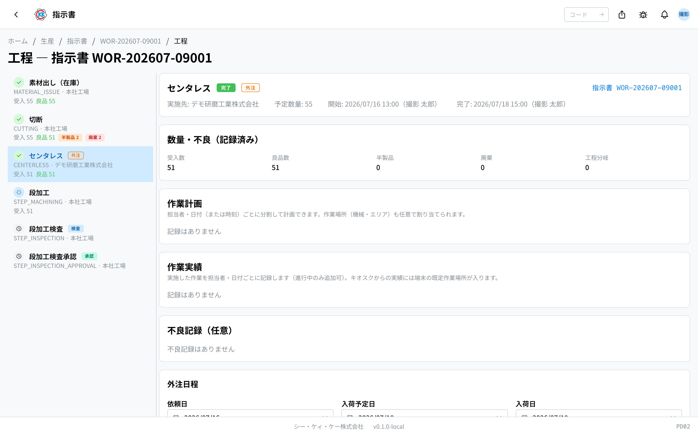

这是用一个列表确认委托给外部公司的加工的 **外注依頼**（外协委托）应用。操作码是 `PU04`。

> ⚠️ 本应用仍在准备中，正式环境上可能还看不到。找不到时请咨询公司内的负责人。

## 本应用能做什么

- 可以在一张表里统一查看委托给外部公司的加工。
- 一眼就能看出「哪道加工、交给了哪家公司、预计什么时候回来」。
- 可以只筛选出还没有送回来的项目。
- 点击关注的行，可以直接跳转到该道加工的作业画面。
- 早上第一件事确认「今天预计送回来的项目」时很方便。

## 本页出现的词语

- **外注**（外协）… 把一部分加工委托给外部公司，例如无心磨削、涂层等。
- **外注先**（外协厂）… 承接加工的公司。
- **工程**（工序）… 制造产品的作业中的一个阶段。
- **指示書**（制造指示书）… 「这个产品做几根」的制造指示。工序就排列在其中。
- **依頼日**（委托日）… 把物品送出到外部公司的日期。
- **入荷予定日**（预计返回日）… 加工完成后预计送回的日期。
- **入荷日**（返回日）… 实际送回的日期。

## 开始之前

本应用是 **只能查看的画面**，无法从这里新增外协。

要让外协出现在这个列表中，请在[制造指示书](/manual/zh/operations/production/work-order/user)的工序中，把实施地点选为「**外注**」（外协），并指定外协厂。外协厂在[业务伙伴主数据](/manual/zh/operations/masters/business-partner/user)中登记。

查看需要外协委托权限。画面打不开时请咨询公司内的负责人。

## 画面的看法

打开应用后，会显示已委托外协的工序列表。

- **指示書番号**（指示书编号）… 蓝色数字。点击会打开[制造指示书](/manual/zh/operations/production/work-order/user)画面。
- **製品**（产品）… 该加工所制造的产品名称。
- **工程名**（工序名）… 委托的加工名称（如无心磨削等）。
- **外注先**（外协厂）… 承接加工的公司名称。
- **依頼日 / 入荷予定日 / 入荷日**（委托日 / 预计返回日 / 返回日）… 送出的日期、预计返回的日期、实际返回的日期。尚未发生的日期显示为「—」。
- **状態**（状态）… 灰色是「未着手」（未开始），蓝色是「進行中」（进行中），绿色是「完了」（已完成），红色是「キャンセル」（取消）。

在上方搜索框输入指示书编号、产品、工序、外协厂，可以筛选出要找的行。也可以用右侧的「**外注先**」（外协厂）和「**状態**」（状态）筛选。

> 💡 「外注先」（外协厂）的选项是由这个列表中出现过的公司自动生成的。还没有委托过的公司不会出现在选项中。

## 让外协出现在这个列表中

无法从本应用添加。在[制造指示书](/manual/zh/operations/production/work-order/user)画面上，把工序的实施地点选为「**外注**」（外协），并指定外协厂，就会出现在这个列表中。

在指示书的工序列表中，外协工序会带有橙色的「**外注**」（外协）徽章。

## 输入・修改日期

委托日、预计返回日、返回日无法在这个列表中输入，要在工序的作业画面中输入。

1. 在列表中点击想输入日期的行。
2. 会打开该工序的作业画面。
3. 找到下方的「**外注日程**」（外协日程）框。
4. 输入「**依頼日**」（委托日）「**入荷予定日**」（预计返回日）「**入荷日**」（返回日）。
5. 如果知道费用，也可以输入「**外注費**」（外协费用）。
6. 点击「**外注日程を保存**」（保存外协日程）。

保存后，这些日期也会反映到外协委托列表中。

## 输入项

本画面没有输入框，是**用于一览已委外工序的画面**。

委外的内容（外协企业・委托日・预计入库日・入库日）在**指示书的工序**中输入，本画面仅汇总显示其结果。

| 筛选 | 会改变什么 |
|------|-----------|
| [外协企业](#field-supplier) | 查看委托给哪家公司的部分 |
| [状态](#field-status) | 按委托中・已入库等筛选 |
| [搜索](#field-search) | 按指示书编号・产品・工序・外协企业查找 |

### 外协企业 [#field-supplier]

查看委托给哪家公司的部分。

### 状态 [#field-status]

按委托中・已入库等状态筛选。可用于查找**已过预计入库日却仍未入库**的部分。

### 搜索 [#field-search]

可按指示书编号・产品・工序・外协企业查找。点击行可跳转至含该工序的指示书。

## 常见问题・遇到困难时

**Q. 列表是空的。**
A. 还没有包含外协工序的指示书。画面会显示「**外注工程がありません（指示書の工程で外注を選ぶと表示されます）**」（没有外协工序——在指示书的工序中选择外协后会显示）。在[制造指示书](/manual/zh/operations/production/work-order/user)的工序中把实施地点选为「外注」（外协），就会出现。

**Q. 列表里没有「新規作成」（新建）按钮。**
A. 本应用是只能查看的画面。外协是作为指示书的工序登记的，不会在这里创建单据。

**Q. 点击日期栏也无法输入。**
A. 列表的表格中无法修改日期。请点击该行打开工序的作业画面，在「外注日程」（外协日程）框中输入。

**Q. 打开了作业画面，但日期栏是灰色的，无法输入。**
A. 有两种可能。一是指示书还没有获得审批（尚未进入可以开始作业的状态）；二是别人正在作业该工序，画面显示「**別のユーザーがセッション中です**」（其他用户正在操作中）。请确认指示书的状态，或与正在作业的人沟通。

**Q. 外协厂的名称显示为「—」。**
A. 该工序还没有指定外协厂。请在指示书画面上打开该工序并指定外协厂。

**Q. 材料的采购也在这里进行吗？**
A. 不是。购买材料请使用[材料订购单](/manual/zh/operations/purchasing/purchase-order/user)。本应用只是委托外部公司做加工本身的一览。
