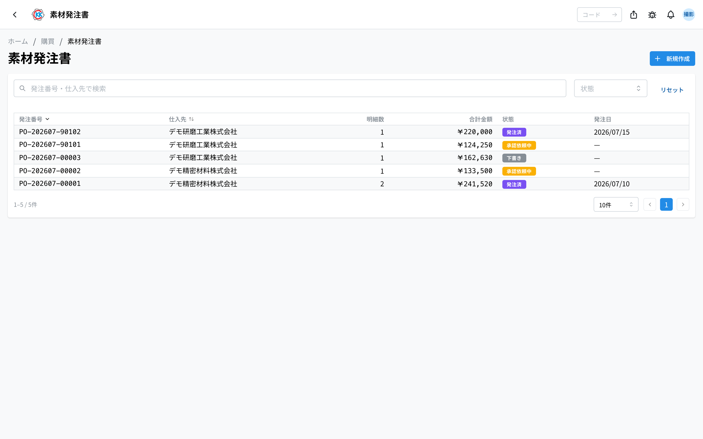
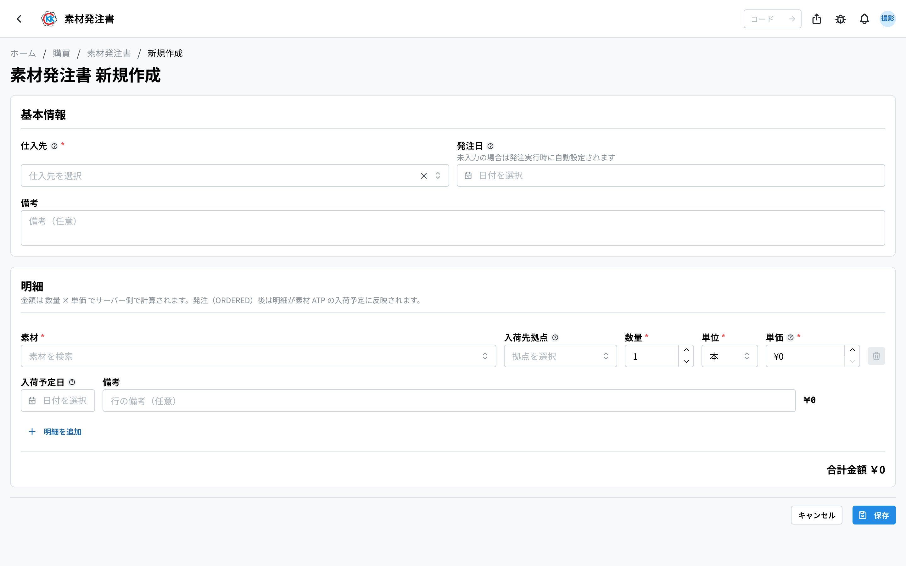
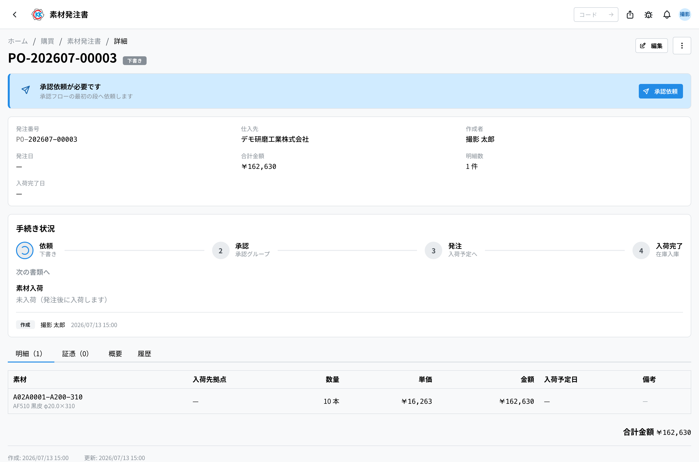
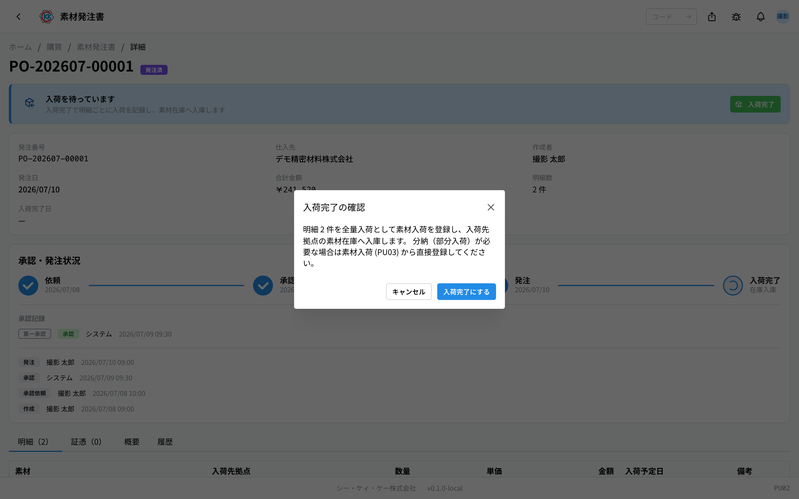
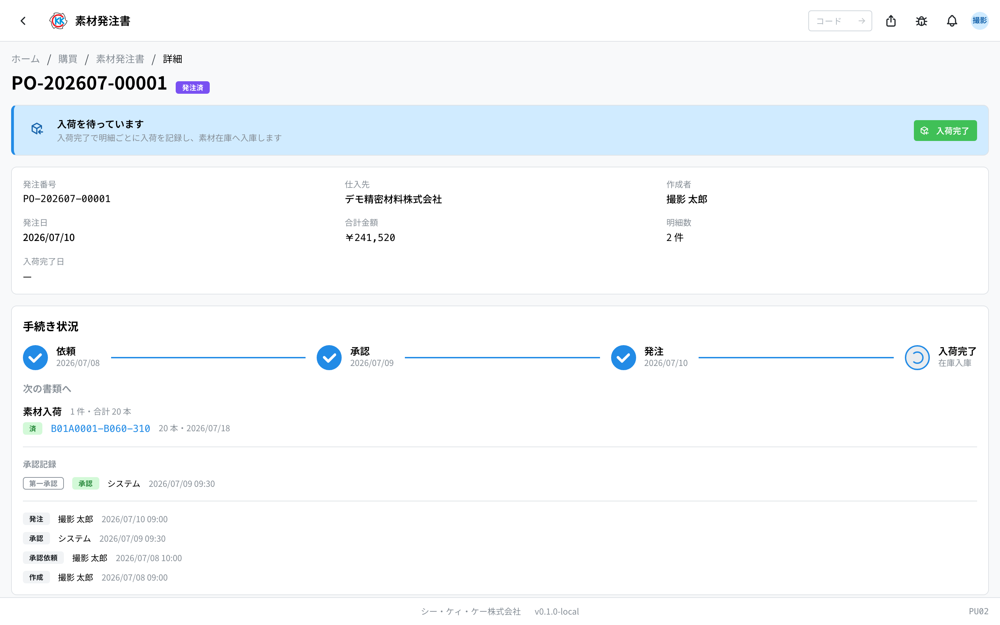

仕入先へ素材を注文する **素材発注書** をつくるアプリです。操作コードは `PU02` です。

> ⚠️ このアプリはまだ準備中のため、本番の画面には出ていないことがあります。見当たらないときは、社内の担当者にご確認ください。

> このアプリが属するフロー … [購買の流れ](/manual/ja/process/purchasing)

## このアプリでできること

- どの仕入先に、どの素材を何本、いくらで注文するかを書けます。
- 上長の **承認** をもらってから発注できます。
- 発注すると、その素材の[在庫画面](/manual/ja/operations/production/material-inventory/user)に「入荷予定」として出ます。
- 素材が届いたら「入荷完了」を押すだけで、**在庫に自動で入ります**。
- 注文書控えや納品書控えのファイルを、発注書にくっつけて保管できます。

## 用語（このページで出てくる言葉）

- **明細（めいさい）** … 発注書の中の 1 行のこと。「どの素材を何本いくらで」を書きます。
- **仕入先（しいれさき）** … 素材を買う相手の会社です。
- **入荷先拠点（にゅうかさききょてん）** … その素材を受け取る拠点（工場・事業所）のことです。
- **入荷予定日** … 「この日に届く予定」という日付です。
- **入荷（にゅうか）** … 素材が実際に届くことです。
- **証憑（しょうひょう）** … 注文書控え・納品書控えなど、あとから見返す書類のことです。

## はじめる前に

- 注文したい **素材が[素材マスタ](/manual/ja/operations/masters/material/user)に登録されている** 必要があります。
- **仕入先が[取引先マスタ](/manual/ja/operations/masters/business-partner/user)に登録されている** 必要があります。登録されていない会社は選べません。
- 作成・編集・発注には購買の権限が必要です。ボタンが出ないときは社内の担当者にご確認ください。

## 発注が進んでいく順番

素材発注書は、次の順番で進みます。いまどこにいるかは、画面の色つきバッジでわかります。

1. **下書き** … あなたが作っただけの状態です。直せるのはこのときだけです。
2. **承認依頼中** … 上長の返事待ちです。
3. **承認済** … 認められました。仕入先へ発注できます。
4. **発注済** … 仕入先へ注文しました。届くのを待ちます。
5. **入荷完了** … 素材が届いて、在庫に入りました。

発注する前なら、途中で取り下げて「**キャンセル**」にできます。

## 画面の見かた

アプリを開くと、これまでに作った素材発注書の一覧が表示されます。

- **発注番号** … `PO-` で始まる番号です。システムが自動で付けます。
- **状態** … 色つきのバッジで今の状況がわかります。灰色は「下書き」、黄色は「承認依頼中」、青は「承認済」、紫は「発注済」、緑は「入荷完了」、赤は「キャンセル」です。
- 上の検索欄に発注番号や仕入先の名前を入れると、探している発注書を絞り込めます。
- 行をクリックすると、その発注書の詳しい画面が開きます。

## 素材発注書をつくる

作り方は 2 通りあります。

### 方法 1：はじめから作る

1. 一覧画面の右上にある「**新規作成**」を押します。
2. 「**仕入先**」を選びます（必ず選んでください）。
3. 「**発注日**」を入れます（空欄でもかまいません）。
4. 明細の「**素材**」の欄をクリックし、素材コードや名前で検索して選びます。
5. 「**入荷先拠点**」で、受け取る拠点を選びます（空欄のままでもかまいません）。
6. 「**数量**」と「**単位**」を入れます。
7. 「**単価**」に 1 本あたりの値段を入れます。
8. 「**入荷予定日**」に、届く予定の日を入れます（空欄でもかまいません）。
9. 素材を追加したいときは「**明細を追加**」を押して、4 〜 8 をくり返します。
10. 最後に「**保存**」を押します。

金額（数量 × 単価）と合計金額は、入力すると自動で表示されます。電卓は不要です。

> 💡 「発注日」を空欄のままにしておくと、あとで「発注」を押した日が自動で発注日になります。

### 方法 2：購買依頼から変える

[購買依頼](/manual/ja/operations/purchasing/purchase-request/user)が承認されている場合は、その画面の「**発注書へ変換**」から作れます。素材・数量・拠点はそのまま引き継がれますが、**単価は 0 円のまま** です。下書きのうちに「編集」から単価を入れてください。

## 承認をお願いする

1. 発注書の画面を開きます。
2. 画面の上のほうに出ている「**承認依頼が必要です**」というカードの「**承認依頼**」を押します。

状態が「**承認依頼中**」に変わり、承認する人に依頼が届きます。同じ依頼は[承認管理](/manual/ja/operations/production/approval/user)の画面にも並びます。

## 承認する・差し戻す（承認する人の操作）

承認する人だけに、次のボタンが出ます。

- 内容でよければ「**承認**」を押します。状態が「承認済」になります。
- 直してほしいときは「**差し戻し**」を押し、「**差し戻し理由**」を書いて「**差し戻す**」を押します。

差し戻された発注書は「**下書き**」に戻ります。作った人が内容を直して、もう一度「承認依頼」を押せます。

## 仕入先へ発注する

1. 「承認済」の発注書の画面を開きます。
2. 「**発注**」を押します。
3. 「発注の確認」という小さな画面が出るので、「**発注する**」を押します。

状態が「**発注済**」になります。この時点で、注文した素材が[在庫画面](/manual/ja/operations/production/material-inventory/user)に「入荷予定」として表示されるようになります。

## 素材が届いたら記録する

注文した素材がすべて届いたら、この操作で在庫に入れます。

1. 「発注済」の発注書の画面を開きます。
2. 「**入荷完了**」を押します。

3. 「入荷完了の確認」という小さな画面が出ます。
4. 内容を確認して「**入荷完了にする**」を押します。

まだ届いていない残りの数量がまとめて「届いた」ことになり、入荷先拠点の素材在庫に加わります。同時に[素材入荷](/manual/ja/operations/purchasing/material-receipt/user)の記録も自動で作られ、依頼した人と作った人にお知らせが届きます。

> ⚠️ 一部だけ先に届いた場合は、この操作を使わないでください。届いた分だけを[素材入荷](/manual/ja/operations/purchasing/material-receipt/user)で登録してください。「入荷完了」は残り全部をまとめて処理します。

「発注済」以降は、明細に「**入荷済 20**」のように、これまでに届いた本数が表示されます。

## 書類をくっつけておく

注文書控えや納品書控えを、発注書と一緒に保管できます。

1. 発注書の画面の「**証憑**」タブを開きます。
2. 「**アップロード**」を押してファイルを選びます。
3. 「証憑のアップロード」という画面が出るので、必要なら「**ラベル（任意）**」に「注文書控え」などと書きます。
4. 「**アップロード**」を押します。

承認前は添付できません。承認前に開くと「**証憑の添付は承認後（承認済・発注済・入荷完了）に可能になります**」と表示されます。

## 内容を確認する

発注書の画面には、4 つのタブがあります。

- **明細** … 素材・数量・単価・金額の一覧です。下に合計金額が出ます。
- **証憑** … くっつけた書類の一覧です。
- **概要** … 備考です。
- **履歴** … いつ誰が変更したかの記録です。

購買依頼から作った発注書には、上のほうに「**変換元（購買依頼）**」として元の依頼番号へのリンクが出ます。

## 入力項目

素材発注書の画面で入力する項目の一覧です。アプリの入力欄の横にある「?」からも、その項目の説明へ直接来られます。

| 項目 | 必須 | 何を入れるか |
|------|------|-------------|
| [仕入先](#field-supplier) | 必須 | 素材を買う相手 |
| [発注日](#field-order-date) | 任意 | 発注する日 |
| [備考](#field-notes) | 任意 | 発注書全体への補足 |
| [素材](#field-material) | 必須 | 発注する素材 |
| [入荷先拠点](#field-plant) | 任意 | 受け取る拠点 |
| [数量](#field-quantity) | 必須 | 発注する数 |
| [単位](#field-unit) | 必須 | 本・kg など |
| [単価](#field-unit-price) | 必須 | 1 単位あたりの価格 |
| [入荷予定日](#field-expected-date) | 任意 | 届く予定の日 |
| [明細の備考](#field-item-notes) | 任意 | その素材だけへの補足 |

### 仕入先 [#field-supplier]

素材を買う相手です。一覧に無いときは[取引先マスタ](/manual/ja/operations/masters/business-partner/user)へ登録してください。

### 発注日 [#field-order-date]

発注する日です。空欄のままでもかまいません — 未入力のときは、「発注」を押した日が自動で入ります。

### 備考 [#field-notes]

発注書全体への補足です。特定の素材だけの話は、明細側の備考に書いてください。

### 素材 [#field-material]

発注する素材を選びます。購買依頼から発注書を作った場合は、依頼の内容が引き継がれています。

### 入荷先拠点 [#field-plant]

その素材を受け取る拠点です。**入荷を記録するとこの拠点の在庫が増えます。** まだ決まっていないときは空欄のままでもかまいません。

### 数量 [#field-quantity]

発注する数です。**入荷のときに分割して受け取ることもできます**（複数回に分けて届く場合）。

### 単位 [#field-unit]

本・kg・m など、数え方の単位です。素材を選ぶと既定の単位が入ります。

### 単価 [#field-unit-price]

1 単位あたりの価格です。**ここに入れた金額が、試算の材料費の参考価格として使われます**ので、実際の取引価格を入れてください。

### 入荷予定日 [#field-expected-date]

その素材が届く予定の日です。仕入先と決めた日を入れます。

### 明細の備考 [#field-item-notes]

その素材だけへの補足です。発注書全体への補足は、上の備考に書きます。

## よくある質問・困ったとき

**Q.「編集」ボタンが出ません。**
A. 直せるのは「下書き」のときだけです。承認依頼を出したあとは直せません。無理に操作すると「**作成中の素材発注書のみ編集できます**」と表示されます。直したいときは、承認する人に差し戻してもらってください。

**Q.「承認」「差し戻し」のボタンが出ません。**
A. 承認できるのは、その段の承認グループに入っている人（またはその代理の人）だけです。ボタンの代わりに「**◯◯ のメンバーのみ承認・差し戻しできます**」と、グループ名が表示されます。

**Q.「仕入先を選択してください」と出て保存できません。**
A. 仕入先が空のままです。「仕入先」の欄をクリックして、一覧から会社を選んでください。

**Q. 発注済のものをキャンセルしたいです。**
A. 「発注済」と「入荷完了」はキャンセルできません。キャンセルできるのは発注する前（下書き・承認依頼中・承認済）だけです。無理に操作すると「**発注前の素材発注書のみキャンセルできます**」と表示されます。

**Q. 素材が分けて届きました。**
A. 届いた分だけを[素材入荷](/manual/ja/operations/purchasing/material-receipt/user)で登録してください。全部そろってから「入荷完了」を押すと、残りがまとめて処理されます。

**Q.「未入荷の明細がありません」と出ます。**
A. すでに全部の数量が届いたことになっています。この発注書ですることはもうありません。

<!-- permissions:start -->
## 必要な権限

この画面を使うには **素材発注・購買依頼**（`purchase_order`）の権限が要ります。

| したいこと | 必要な権限 |
| --- | --- |
| 画面を開く・一覧や詳細を見る | 素材発注・購買依頼 の 閲覧 |
| 追加・変更・削除する | 素材発注・購買依頼 の 作成 / 更新 / 削除 |

見るだけなら「閲覧」で足ります。追加・変更・削除の操作がある画面では、その操作にあたる権限がそれぞれ必要です。

権限は役割（ロール）を通して付きます。足りないときは管理者に相談してください。

権限の全体像は「[権限とロール](../../../permissions)」を参照してください。
<!-- permissions:end -->
