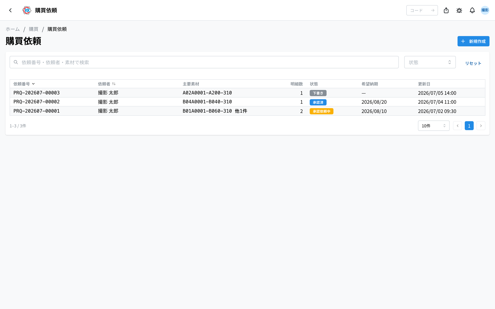
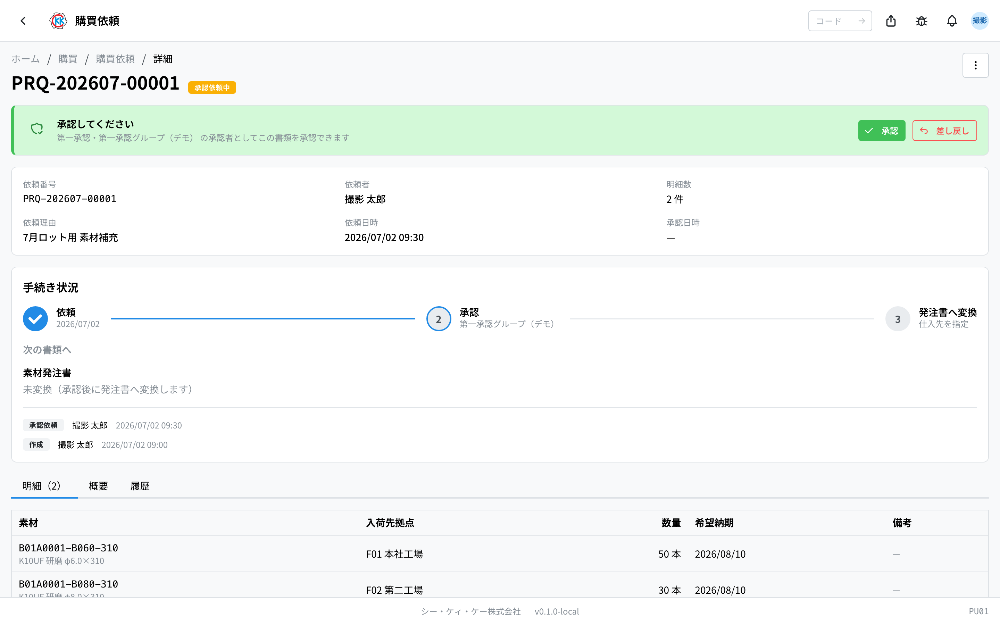
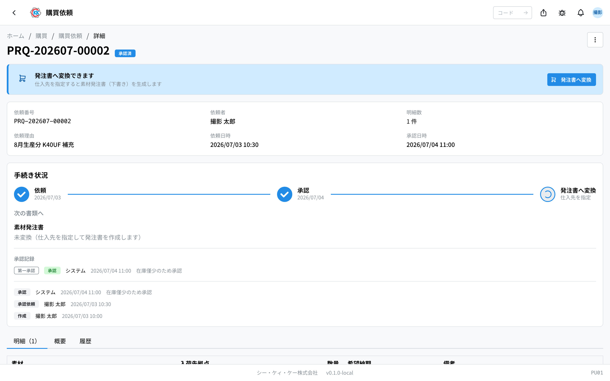
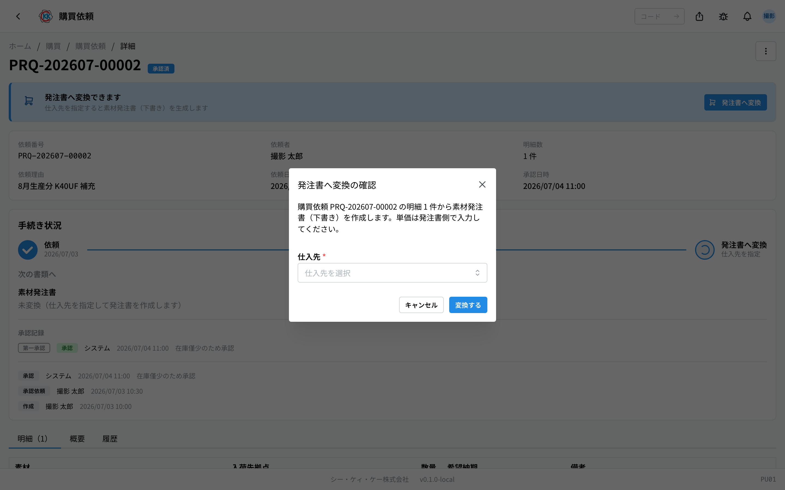

「この素材を買ってほしい」と社内にお願いする **購買依頼** をつくるアプリです。操作コードは `PU01` です。

> ⚠️ このアプリはまだ準備中のため、本番の画面には出ていないことがあります。見当たらないときは、社内の担当者にご確認ください。

> このアプリが属するフロー … [購買の流れ](/manual/ja/process/purchasing)

## このアプリでできること

- 必要な素材を「何を・どこへ・いくつ・いつまでに」だけ書いて、購入をお願いできます。
- **値段や仕入先は書きません。** そこは承認のあと、発注する人が決めます。
- 出した依頼が、いま承認待ちなのか承認されたのかを確認できます。
- 承認された依頼は、ボタン 1 つで[素材発注書](/manual/ja/operations/purchasing/purchase-order/user)に変わります。
- 在庫が減ってきた素材を買い足したいときに使います。

## 用語（このページで出てくる言葉）

- **明細（めいさい）** … 依頼の中の 1 行のこと。「どの素材を何本」を書きます。
- **素材** … 加工の材料になる棒材などです。あらかじめ[素材マスタ](/manual/ja/operations/masters/material/user)に登録されているものから選びます。
- **入荷先拠点（にゅうかさききょてん）** … その素材を受け取る拠点（工場・事業所）のことです。
- **希望納期** … 「この日までに欲しい」という日付です。
- **承認（しょうにん）** … 上長がその依頼を認めることです。認められないと発注に進めません。
- **差し戻し（さしもどし）** … 上長から「ここを直して」と戻されることです。

## はじめる前に

- 依頼したい **素材が[素材マスタ](/manual/ja/operations/masters/material/user)に登録されている** 必要があります。登録されていない素材は選べません。
- 受け取り先を指定したいときは、その **[拠点](/manual/ja/operations/masters/plant/user)が登録されている** 必要があります。
- 作成・編集には購買の権限が必要です。ボタンが出ないときは社内の担当者にご確認ください。

## 依頼が進んでいく順番

購買依頼は、次の順番で進みます。いまどこにいるかは、画面の色つきバッジでわかります。

1. **下書き** … あなたが作っただけの状態です。何度でも直せます。
2. **承認依頼中** … 上長の返事待ちです。この間は直せません。
3. **承認済** … 認められました。発注書に変えられます。
4. **発注済** … 発注書に変わりました。ここから先は[素材発注書](/manual/ja/operations/purchasing/purchase-order/user)の作業になります。

途中で上長から戻されると「**差し戻し**」、取り下げると「**キャンセル**」になります。

## 画面の見かた

アプリを開くと、これまでに出した購買依頼の一覧が表示されます。

- **依頼番号** … `PRQ-` で始まる番号です。システムが自動で付けます。
- **状態** … 色つきのバッジで今の状況がわかります。灰色は「下書き」、黄色は「承認依頼中」、青は「承認済」、紫は「発注済」、赤は「差し戻し」または「キャンセル」です。
- **主要素材** … 1 行目の素材が出ます。行が複数あるときは「他 2 件」のように付きます。
- 上の検索欄に依頼番号・依頼者・素材コードを入れると、探している依頼を絞り込めます。
- 右の「**状態**」で、承認待ちのものだけを表示することもできます。
- 行をクリックすると、その依頼の詳しい画面が開きます。

## 購買依頼をつくる

1. 一覧画面の右上にある「**新規作成**」を押します。
2. 「**依頼理由**」に、なぜ必要かを書きます（空欄のままでも保存できます）。
3. 明細の「**素材**」の欄をクリックし、素材コードや名前で検索して選びます。
4. 「**入荷先拠点**」で、受け取る拠点を選びます（空欄のままでも保存できます）。
5. 「**数量**」に必要な本数を入れます。
6. 「**単位**」を確認します（はじめは「本」が入っています）。
7. 「**希望納期**」に、この日までに欲しいという日付を入れます（空欄でもかまいません）。
8. 素材を追加したいときは「**明細を追加**」を押して、3 〜 7 をくり返します。
9. 最後に「**保存**」を押します。

保存すると「下書き」として登録され、詳しい画面が開きます。

> 💡 この画面に値段の欄はありません。仕入先と値段は、承認のあと発注書をつくるときに決めます。

## 承認をお願いする

内容を確認したら、上長に見てもらいます。

1. 依頼の画面を開きます。
2. 画面の上のほうに出ている「**承認依頼が必要です**」というカードの「**承認依頼**」を押します。

状態が「**承認依頼中**」に変わり、承認する人に依頼が届きます。同じ依頼は[承認管理](/manual/ja/operations/production/approval/user)の画面にも並びます。

承認依頼中は内容を直せません。直したいときは、いったん「**…**」（点が 3 つのボタン）から「**キャンセル**」して作り直すか、上長に差し戻してもらいます。

## 承認する・差し戻す（承認する人の操作）

承認する人だけに、次のボタンが出ます。

- 内容でよければ「**承認**」を押します。状態が「承認済」になります。
- 直してほしいときは「**差し戻し**」を押します。「差し戻しの確認」という小さな画面が出るので、「**差し戻し理由**」を書いて「**差し戻す**」を押します。

> ⚠️ 差し戻し理由は必ず入力してください。空のまま押すと「**差し戻し理由を入力してください**」と表示されます。

差し戻された依頼は状態が「**差し戻し**」になり、依頼した人の画面に理由が表示されます。内容を直して、もう一度「承認依頼」を押せます。作り直す必要はありません。

## 発注書に変える

承認された依頼は、発注書に変えて仕入先へ注文します。

1. 「承認済」の依頼の画面を開きます。
2. 「**発注書へ変換**」を押します。

3. 「発注書へ変換の確認」という小さな画面が出ます。
4. 「**仕入先**」を選びます。
5. 「**変換する**」を押します。

明細をそのまま引き継いだ[素材発注書](/manual/ja/operations/purchasing/purchase-order/user)（下書き）ができ、その画面に移動します。依頼のほうは「**発注済**」になり、変換先の発注書番号へのリンクが表示されます。

> 💡 できあがった発注書は、**単価がすべて 0 円** で入っています。発注書の「編集」から単価を入れてから、発注書の承認依頼を出してください。

## 内容を確認する

依頼の画面には、3 つのタブがあります。

- **明細** … 素材・入荷先拠点・数量・希望納期の一覧です。
- **概要** … 依頼理由と備考です。
- **履歴** … いつ誰が変更したかの記録です。

「手続き状況」の枠には、依頼 → 承認 → 発注書へ変換 の進み具合と、誰がいつ承認したかの記録が並びます。変換してできた素材発注書は「次の書類へ」に出ます。

## 入力項目

購買依頼の画面で入力する項目の一覧です。アプリの入力欄の横にある「?」からも、その項目の説明へ直接来られます。

| 項目 | 必須 | 何を入れるか |
|------|------|-------------|
| [依頼理由](#field-reason) | 任意 | なぜ必要なのか（承認する人が見ます） |
| [備考](#field-notes) | 任意 | 依頼全体への補足 |
| [素材](#field-material) | 必須 | ほしい素材 |
| [入荷先拠点](#field-plant) | 任意 | 受け取る拠点 |
| [数量](#field-quantity) | 必須 | ほしい数 |
| [単位](#field-unit) | 必須 | 本・kg など |
| [希望納期](#field-desired-date) | 任意 | いつまでに欲しいか |
| [明細の備考](#field-item-notes) | 任意 | その素材だけへの補足 |

### 依頼理由 [#field-reason]

なぜその素材が必要なのかを書きます。**承認する人はここを見て判断します**ので、「どの製品のどの工程で使うのか」まで書いておくと、やり取りが減ります。

### 備考 [#field-notes]

依頼全体への補足です。特定の素材だけの話は、明細側の備考に書いてください。

### 素材 [#field-material]

ほしい素材を選びます。一覧に無いときは、先に[素材マスタ](/manual/ja/operations/masters/material/user)へ登録してください。

### 入荷先拠点 [#field-plant]

その素材を受け取る拠点です。**ここで指定した拠点の在庫として入ります**ので、実際に使う場所を選んでください。まだ決まっていないときは空欄のままでもかまいません。

### 数量 [#field-quantity]

ほしい数を入れます。あとの発注書でも同じ数が引き継がれます。

### 単位 [#field-unit]

本・kg・m など、数え方の単位です。素材を選ぶと既定の単位が入ります。

### 希望納期 [#field-desired-date]

いつまでに欲しいかの希望日です。**確定した予定ではありません** — 実際の入荷予定日は、発注書を作るときに仕入先と決めます。

### 明細の備考 [#field-item-notes]

その素材だけへの補足です（「前回と同じロットで」など）。

## よくある質問・困ったとき

**Q.「承認」「差し戻し」のボタンが出ません。**
A. 承認できるのは、その段の承認グループに入っている人（またはその代理の人）だけです。ボタンの代わりに「**◯◯ のメンバーのみ承認・差し戻しできます**」と、グループ名が表示されます。

**Q.「編集」ボタンが出ません。**
A. 直せるのは「下書き」と「差し戻し」のときだけです。承認依頼中・承認済・発注済では直せません。無理に操作すると「**下書き・差し戻しの購買依頼のみ編集できます**」と表示されます。

**Q.「明細を1件以上追加してください」と出て保存できません。**
A. 素材の行が 1 行も入っていません。「素材」を選んでから、もう一度「保存」を押してください。

**Q.「素材を選択してください」と出ます。**
A. 明細の「素材」が空のままです。欄をクリックして素材コードや名前で検索し、候補から選んでください。手で打ち込むだけでは選んだことになりません。

**Q. 依頼を取り消したいです。**
A. 発注書に変える前（下書き・承認依頼中・承認済・差し戻し）であれば、画面右上の「**…**」から「**キャンセル**」を選べます。理由の入力が必要です。発注書に変えたあとは取り消せません。

**Q. 値段を入れる欄が見つかりません。**
A. 購買依頼には値段の欄がありません。値段は[素材発注書](/manual/ja/operations/purchasing/purchase-order/user)に変えたあとで入力します。
