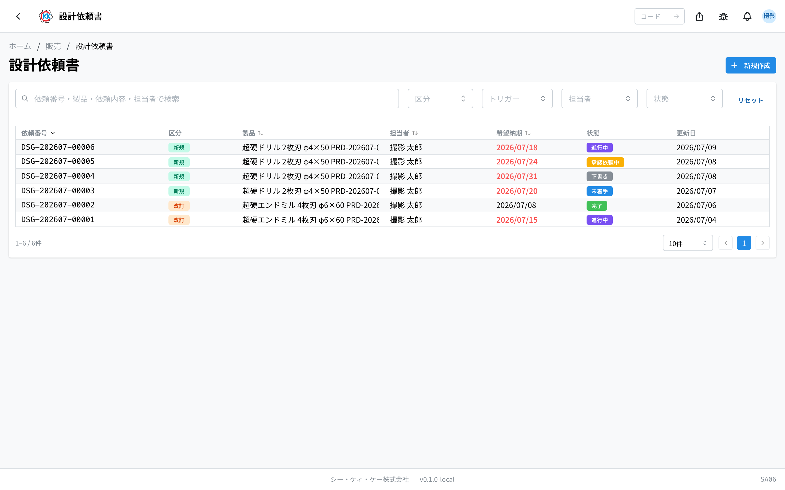
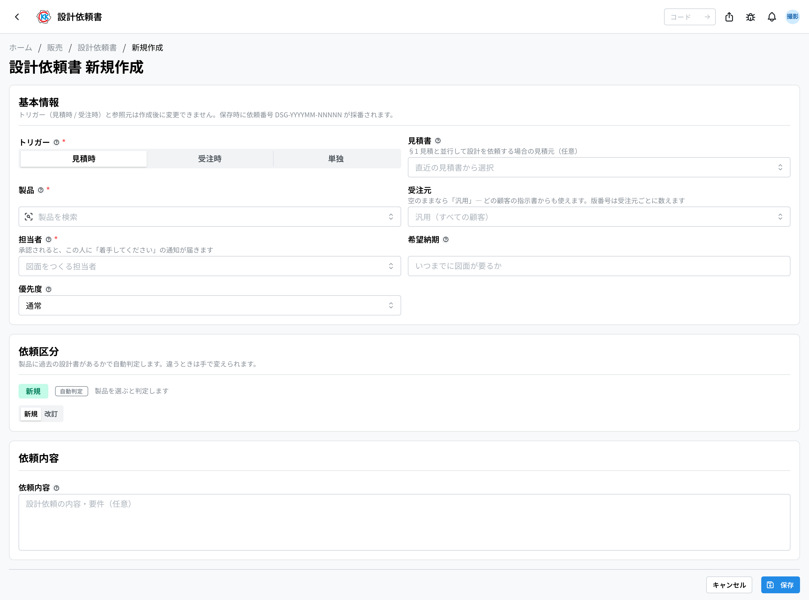
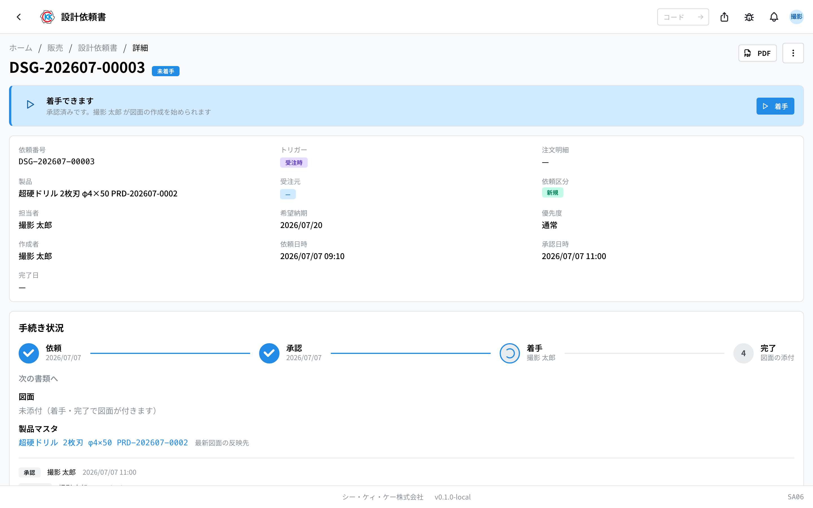
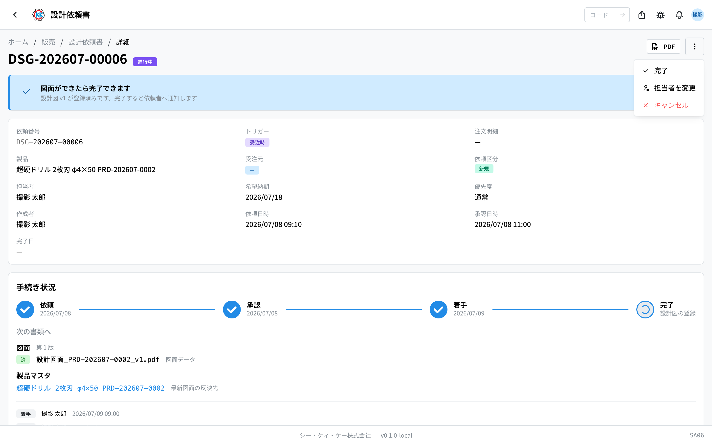
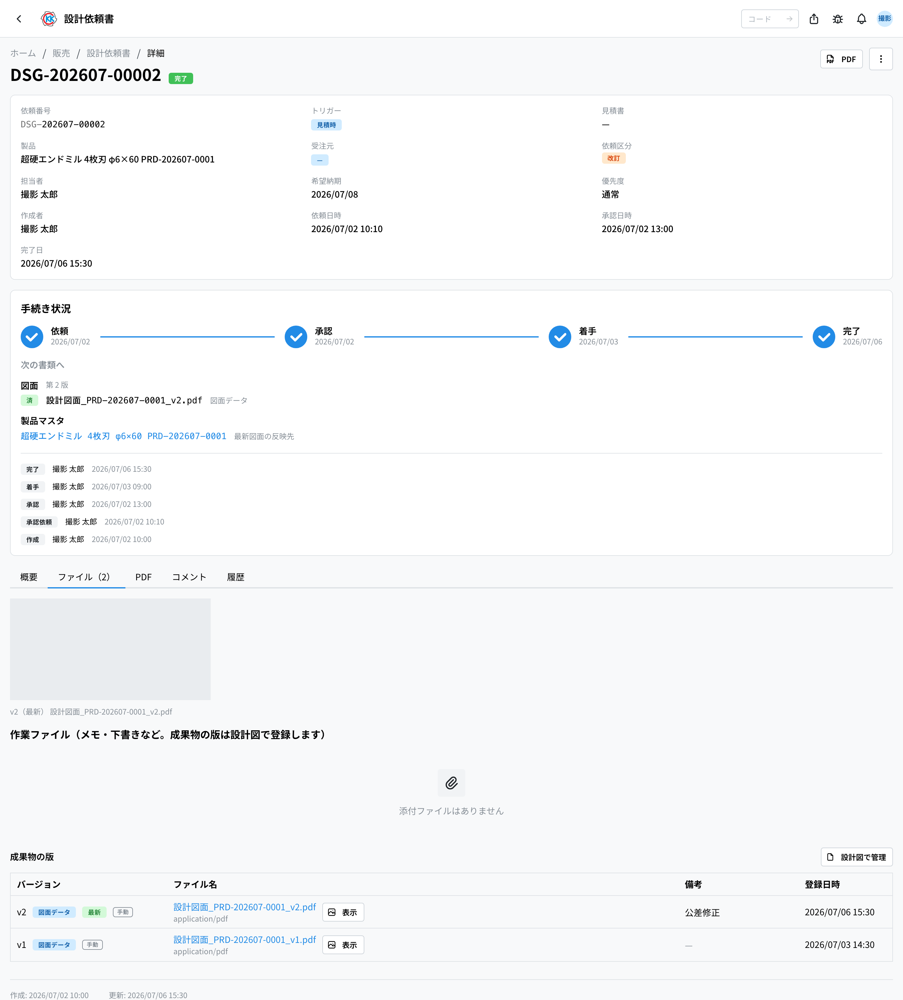
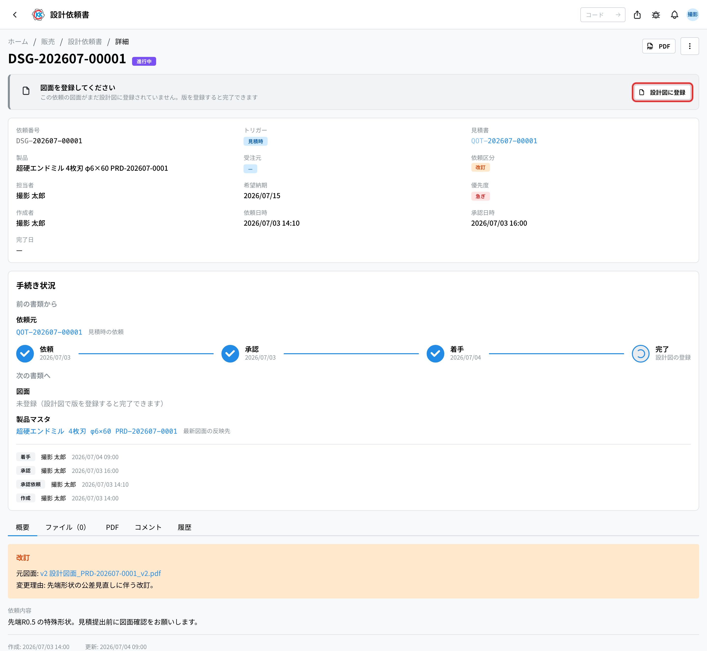

委托设计部门制作图纸，并把做好的图纸文件 **按版本（バージョン）保存下来** 的应用。操作码是 `SA06`。

> ⚠️ 本应用仍在试验公开中，画面和步骤今后可能会变更。

## 本应用能做什么

- 可以写下想委托设计的内容，登记成一份委托。
- 可以从[报价单](/manual/zh/operations/sales/quote/user)、订单明细、[产品主数据](/manual/zh/operations/masters/product/user)的画面 **带着关联单据直接提出**。
- 可以区分记录是报价时的委托、接单之后的委托，还是 **两者都不属于的单独委托**。
- 可以 **指定制图的负责人**，被指定的人会收到通知。
- **新规还是改订会自动判定**：该产品有过去的设计书就是「改訂」（改订），没有就是「新規」（新规）。
- 可以填 **希望納期（期望交期）** 和 **優先度（优先级）**，在列表里排序、找出已延误的委托。
- 可以设成 **经过审批之后** 才开始设计。审批的段数在[审批设置](/manual/zh/operations/masters/approval-setting/user)里决定。
- 做好的图纸登记到[图纸](/manual/zh/operations/production/design-file/user)。**版本（v1、v2）由图纸应用持有**，本应用持有委托及其进度。
- 审批通过的委托可以 **打印成单据（PDF）**，用纸交给制造。
- 指定了产品时，完成后[产品主数据](/manual/zh/operations/masters/product/user)的最新图纸会随之更换。

客户来咨询特殊形状、需要图纸时使用。

## 委托推进的顺序

```
下書き → 承認依頼中 → 未着手 → 進行中 → 完了
（草稿）  （审批中）  （未开始）（进行中）（完成）
           ↓（退回）
        差し戻し →（改好后重新提交）
```

- 刚建好时是 **「下書き」（草稿）**，只有这段时间能自由修改内容。
- 点击「承認依頼」（申请审批）后变成 **「承認依頼中」（审批中）**，审批人会收到通知。
- 审批通过后变成 **「未着手」（未开始 — 已审批、等待开始）**，并且 **负责人会收到「请开始」的通知**。
- 负责人点击「着手」（开始）变成 **「進行中」（进行中）**，把图纸登记到[图纸](/manual/zh/operations/production/design-file/user)后点击「完了」（完成）就变成 **「完了」（完成）**。

## 本页出现的词

- **「トリガー」（触发）** … 以什么为契机委托设计的区分。从 **「見積時」（报价时）**、**「受注時」（接单时）**、**「単独」（单独）** 中选一个。
- **「見積時」（报价时）** … 在提交报价单之前，同时请人制作图纸的情况。
- **「受注時」（接单时）** … 订单定下来之后再请人制作图纸的情况。
- **「単独」（单独）** … 既不关联报价单也不关联订单明细的委托。用于 **还没有任何单据的阶段**，例如新产品的探讨、客户的事前咨询、公司内部的改善。
- **「担当者」（负责人）** … 制图的制造负责人。审批通过后这个人会收到通知。
- **「依頼区分」（委托类别）** … **新規**（新规）还是 **改訂**（改订）。选了产品就自动决定。
- **「元図面」（原图纸）** … 改订时以哪个版本为基础重画。
- **「変更理由」（变更理由）** … 改订时为什么要重画。
- **「依頼内容」（委托内容）** … 写下希望设计什么的文字栏。
- **「バージョン（版）」（版本）** … 每重做一次图纸就会增加的编号。按 v1、v2 递增，最新的那个会标上「最新」。**一次完成上传的文件都属于同一个版本。**
- **「プレビュー用」（预览用）** … 在画面上确认形状的文件（STL 等），可以转动查看。
- **「図面データ」（图纸数据）** … 用来编写加工程序的原始文件（CAD 等）。产品主数据的「最新图纸」指的就是它。
- **「参考資料」（参考资料）** … 同一版本的其他文件（零件图、尺寸表等）。
- **「下書き」（草稿）/「承認依頼中」（审批中）/「未着手」（未开始）/「進行中」（进行中）/「完了」（完成）/「差し戻し」（退回）/「キャンセル」（取消）** … 委托目前的情况。

## 开始之前

- **审批设置里必须已登记「設計依頼書」（设计委托单）的审批段。** 没有登记时，点击「承認依頼」（申请审批）会出现提示，请与管理员联系。
- **请先登记图纸对象的[产品](/manual/zh/operations/masters/product/user)（必填）。** 即使是全新产品，**只要有名称和单位就能登记**。没有产品就无法判定是新规还是改订。
- 用「見積時」（报价时）登记时，先有[报价单](/manual/zh/operations/sales/quote/user)就能和该报价关联起来。
- 用「受注時」（接单时）登记时，先有订单明细就能关联起来（订单明细由[订单请书](/manual/zh/operations/sales/order-acceptance/user)的「注文確定」（确定）生成）。
- 要完成委托，**该委托的图纸必须已在[图纸](/manual/zh/operations/production/design-file/user)中登记至少 1 件**。从委托页面一键即可打开登记界面。

## 界面怎么看

打开应用后，会以列表显示至今的委托。



- **「依頼番号」（委托编号）** … 以 `DSG-` 开头的编号，保存后会自动编上。
- **「トリガー」（触发）** … 以徽章显示「見積時」（报价时）或「受注時」（接单时）。
- **「担当者」（负责人）** … 制图的人。
- **「状態」（状态）** … 用彩色徽章显示目前的情况。灰色是「下書き」（草稿），黄色是「承認依頼中」（审批中），蓝色是「未着手」（未开始），紫色是「進行中」（进行中），绿色是「完了」（完成），红色是「差し戻し」（退回）和「キャンセル」（取消）。
- 在上方搜索框里输入委托编号、产品名称或委托内容里的词，即可缩小范围。也可以用右侧的「トリガー」（触发）、「担当者」（负责人）、「状態」（状态）筛选。
- 点击某一行，就会打开该委托的详细画面。

## 委托设计

1. 点击列表画面右上角的「**新規作成**」（新建）。
2. 在「**トリガー**」（触发）里点击选择「**見積時**」（报价时）或「**受注時**」（接单时）。
3. 选了报价时的话，在「**見積書**」（报价单）栏里选择作为依据的报价单（留空也能登记）。
4. 选了接单时的话，在「**订单明细**」（订单明细）栏里搜索并选择作为依据的订单明细（留空也能登记）。选了「単独」时，不会出现关联栏。
5. 在「**製品**」（产品）栏里选择对象产品（必填）。选好后，下方的「**依頼区分**」（委托类别）会自动变成 **新規**（新规）或 **改訂**（改订）。
6. 在「**担当者**」（负责人）栏里选择制图的人。
7. 需要时填写「**希望納期**」（期望交期）和「**優先度**」（优先级）。
8. 「**依頼区分**」为 **改訂** 时，填写「**元図面**」（以哪个版本为基础，留空则用最新版）和「**変更理由**」（必填）。
9. 在「**依頼内容**」（委托内容）里写下希望设计的内容。
10. 点击「**保存**」（保存）。



保存后会编上委托编号，并打开详细画面。此时还是 **「下書き」（草稿）**。

> ⚠️ 「トリガー」（触发），以及在那里选的报价单、订单明细 **之后不能更改**。弄错时请重新建立一份新的委托。

### 关于新规与改订的判定

「**依頼区分**」（委托类别）会根据所选产品 **是否已有过去的设计书（版本）** 自动决定，
画面上也会显示判定理由（例如「この製品には v2 まであります → 改訂」＝该产品已有到 v2 → 改订）。

判定与实际不符时，可以当场 **手动切换**（会显示「手動指定」＝手动指定）。
想恢复自动判定，点击「**自動判定に戻す**」（恢复自动判定）。

类别会 **按建立委托时的值保存下来**。之后即使别的委托先完成，这份委托的类别也不会变
（这样在按类别区分审批段数时，才不会和当初审批的内容对不上）。

从报价单或订单明细画面点击「**設計依頼を起票**」（提出设计委托）进来时，触发和关联单据已经填好。这种情况下触发不能切换 —— 一旦切换，与来源的关联就会悄悄断开。

## 从哪里提出委托

从列表的「新規作成」（新建）也能建，但从下面这些地方进来会 **带着关联单据打开**，
之后不用再补关联。

| 从哪里 | 会自动填入什么 |
|--------|---------------|
| [报价单](/manual/zh/operations/sales/quote/user)的「…」→「設計依頼を起票」 | 触发 = 見積時（报价时）+ 该报价单 |
| 订单明细的「…」→「設計依頼を起票」 | 触发 = 受注時（接单时）+ 该订单明细 |
| [产品主数据](/manual/zh/operations/masters/product/user)的「…」→「設計依頼を起票」 | 该产品 |
| 报价单明细出现「価格表なし」（无价格表）时的「設計依頼を起票」 | 该产品 |

最后一个是 **新产品取不到单价时** 的出路。没有价格表通常是因为还没有图纸，
所以可以从那里直接委托制图。

> 从带产品的入口（产品主数据 / 无价格表）进来时，必填的「製品」（产品）已经填好。
> 从报价单或订单明细进来时，只要再选一下产品即可（选好的瞬间就决定新规还是改订）。

提出的委托，可以从原单据的「関連」（关联）标签页反向找到（订单明细里是「設計」）。

## 申请审批

1. 打开草稿状态的委托，画面上方会出现「**承認を依頼できます**」（可以申请审批）的卡片。
2. 点击「**承認依頼**」（申请审批）。
3. 状态变成「**承認依頼中**」（审批中），审批人会收到通知。

有审批权限的人，会在同一位置看到「**承認**」（批准）和「**差し戻し**」（退回）按钮。

- 点击 **「承認」（批准）** 进入下一段。通过最后一段后变成「**未着手**」（未开始），并通知负责人。
- 点击 **「差し戻し」（退回）** 时需要填写理由。填好理由退回后变成「**差し戻し**」（退回）状态，提出委托的人可以改好后重新提交。

审批有几段、由谁审批，在[审批设置](/manual/zh/operations/masters/approval-setting/user)里决定。

## 推进委托

审批通过后状态是「**未着手**」（未开始）。

1. 要开始设计作业时，点击画面上方的「**着手**」（开始）。
2. 状态会变成「**進行中**」（进行中），提出委托的人会收到通知。



在未开始和进行中期间，可以从「**…**」修改 **「担当者」（负责人）** 和 **「製品」（产品）**。「依頼内容」（委托内容）是经过审批的内容，这个阶段不能修改（内容本身要变时，请取消后重新建立）。



## 附上作业文件

1. 在委托页面打开「**ファイル**」（文件）标签页。
2. 点击右上角的「**アップロード**」（上传）。
3. 选择文件（**不限格式** — PDF、图片、3D 模型、Excel 等。每个 20MB 以内）。
4. 如有需要，在「**ラベル（任意）**」（标签，选填）中写说明。
5. 点击「**アップロード**」（上传）。



这里放的是 **备忘、草稿等作业文件**。做好的图纸请登记到[图纸](/manual/zh/operations/production/design-file/user)（见下）。

只有在 **审批通过之后到完成之前**（未着手・进行中）才能附加文件。

## 登记图纸并完成

**做好的图纸登记到[图纸](/manual/zh/operations/production/design-file/user)（PD06）。** 设计委托是「请帮我做」的提出，图纸本身归图纸应用管理。写入口保持唯一，版本编号的规则才不会因界面而异。

1. 点击委托页面上方的「**設計図に登録**」（登记图纸）。登记界面会以 **该委托的产品和接单方为固定值** 打开。
2. 选择图纸文件（必填，1 个）、预览（选填，1 个）和参考资料（选填，任意数量），点击「**保存**」。
3. 回到委托页面，此时「**完了**」（完成）可以点击了，点击后确定。

**没有成果的委托无法完成。** 否则完成只是推进状态，提出委托的一方看不出究竟做出了什么。



版本的计数方式（一次登记 = 一个版本，版本按「产品 × 接单方」计数）请参阅[图纸](/manual/zh/operations/production/design-file/user)页面。

完成后会记录完成日期，并通知提出委托的人（报价时提出的还会通知该报价的销售负责人）。指定了产品的委托，该产品的最新图纸也会切换到这一版本。

完成后需要修改时，从「**…**」点击「**差し戻し**」（退回），再点击「**差し戻す**」（退回）。状态回到「進行中」（进行中），完成日期被清除。这种退回属于 **重做作业**，不需要重新走审批。

## 用评论沟通

委托页面的「**コメント**」（评论）标签页用于记录围绕该委托的往来。图纸的指摘和答复是来回进行的，因此这里是 **投稿式的评论串**（新的在上），而不是会被覆盖的单一共享备忘。

- 文字可以使用 **粗体、斜体、项目符号、标题、链接** 等。
- 只能 **编辑或删除自己** 的发言。
- 看完的发言可以 **归档** 折叠起来（不是删除，点击即可展开）。
- **评论仅限内部。** 不会出现在单据（PDF）上。

需要设计什么请写在「依頼内容」（委托内容）栏。评论是之后沟通用的地方。

## 打印单据

审批通过之后（未着手・進行中・完了），可以在委托画面的「**PDF**」标签页查看
设计委托单的单据。右上角的「**PDF**」按钮也能打开。

单据上有 委托编号・**委托类别**・状态・负责人・**期望交期**・优先级・触发与关联单据・
对象产品・改订时的 **原图纸与变更理由**・**委托内容**・
图纸文件的版本一览・审批和作业履历。这是准备用纸交给制造的内部文件，
请不要外发。

内容还可能变动的期间（未着手・進行中），每次打开都会用最新内容重新生成。
完成之后内容不再变动，会直接显示已保存的那份。

> 审批通过之前（下書き・承認依頼中・差し戻し）不能打开 PDF。
> 规定只有经过审批的内容才会变成纸。

## 取消委托

委托本身不再需要时，请从「**…**」点击「**キャンセル**」（取消），填写理由后确定。如果当时正在审批中，也会从待审批列表里消失。

已完成的委托不能取消，请先用「差し戻し」（退回）回到进行中。

## 输入项

设计委托书画面的输入项一览。应用中输入栏旁边的 **?** 也可直接跳转到对应说明。

| 项目 | 必填 | 填什么 |
|------|------|--------|
| [触发时机](#field-trigger) | 必填 | 报价时、受订后或独立 |
| [报价单](#field-quote) | 条件必填 | 报价时选择的对应报价单 |
| [订单明细](#field-order-line) | 条件必填 | 受订后选择的对应订单明细 |
| [产品](#field-product) | 必填 | 需要制图的产品 |
| [受订方](#field-customer-bp) | 选填 | 版本归属于哪个客户的系列 |
| [负责人](#field-assignee) | 必填 | 制图的制造负责人 |
| [期望交期](#field-desired-at) | 选填 | 什么时候需要图纸 |
| [优先级](#field-priority) | 必填 | 通常还是加急 |
| [原图纸](#field-base-design-file) | 条件必填 | 改订时作为基础的版本 |
| [变更理由](#field-change-reason) | 条件必填 | 改订时为什么要重画 |
| [委托内容](#field-description) | 必填 | 希望设计什么 |

### 触发时机 [#field-trigger]

该委托是 **为了报价**、**受订确定之后**，还是 **两者都不属于的单独委托**。选了报价时或受订后，接下来关联的是「报价单」还是「订单明细」；选了「単独」则不会出现关联栏 —— 适用于还没有任何单据的阶段，例如新产品的探讨或客户的事前咨询。

### 报价单 [#field-quote]

触发时机为报价时选择。记录该设计对应哪份报价，便于日后追溯经过。

### 订单明细 [#field-order-line]

触发时机为受订后时选择，记录该设计对应哪笔受订。

### 产品 [#field-product]

需要制图的产品。**必填。** 该产品是否已有过去的设计书，决定了是新规还是改订。尚未登记的新产品，只要有名称和单位就能登记到产品主数据，请先登记再提出委托。

### 受订方 [#field-customer-bp]

决定完成后的版本落在哪个客户的系列。从报价单或订单明细提出委托时，该单据的客户会自动填入。

留空则为 **汎用（通用）**，供该产品没有专属图纸的客户的指示书使用。新规还是改订的判定也**只看这个系列** —— 即使 A 公司已有图纸，只要 B 公司还没有，从 B 公司来看就是 **新规**。

### 负责人 [#field-assignee]

制图的制造负责人。审批通过后，这个人会收到「请开始」的通知。审批之后也可以从「…」变更。

### 期望交期 [#field-desired-at]

什么时候需要图纸。留空也能登记，但填了之后可以在列表里排序，并用颜色看出已超期的委托。

### 优先级 [#field-priority]

**通常** 还是 **急ぎ**（加急）。填了期望交期时以交期为准，所以优先级适合用在「交期还早，但希望先动手」这种场合。

### 原图纸 [#field-base-design-file]

改订时 **以哪个版本为基础重画**。留空则使用判定时点的最新版本。委托进行期间如果别的改订先完成了，完成时会在履历里留下说明。

### 变更理由 [#field-change-reason]

改订时 **为什么要重画**。这是与委托内容分开的栏位，也是日后追溯版本差异的线索。

### 委托内容 [#field-description]

写明希望设计什么。**制造负责人仅依据此内容制图**，请具体写明尺寸・形状・可参考的既有产品・注意事项等。

## 常见问题与困扰

**Q. 出现「設計依頼書の承認フローが未設定です」（设计委托单的审批流程未设置），无法申请审批。**
A. 审批设置里还没有登记「設計依頼書」的段。请让管理员在审批设置（MS0B）里建立。

**Q. 出现「設計ファイルを添付してから完了してください」（请先附上设计文件再完成），无法完成。**
A. 还没有附上图纸文件。请从「**ファイル**」（文件）标签页上传图纸后，再点击「完了」（完成）。

**Q. 明明是新规，却显示「改訂」（改订）。**
A. 该产品还留有过去的设计书（版本）。与实际不符时，请手动把类别切换成「新規」（会显示「手動指定」）。

**Q. 不选产品能提出委托吗？**
A. 不能。判定新规还是改订需要产品。尚未登记在产品主数据里的新产品，只要有名称和单位就能登记。

**Q. 没有审批通过能开始吗？**
A. 不能。要等审批通过、变成「未着手」（未开始）之后才能开始。

**Q. 审批之后想改委托内容。**
A. 那是经过审批的内容，不能修改。内容本身要变时，请取消后重新建立委托。只有负责人和产品可以从「…」变更。

**Q. 完成的委托不能编辑。**
A. 规定完成后的委托也不能添加文件。想修改时，请先用「**差し戻し**」（退回）回到进行中。

**Q. 好像有两个「差し戻し」（退回），有什么区别？**
A. 审批中的「差し戻し」是 **审批人打回**，状态变成「差し戻し」（退回），改好后重新提交。完成后的「差し戻し」是 **重新画图**，状态回到「進行中」（进行中），不需要重新走审批。

**Q. 触发或报价单栏改不了。**
A. 触发，以及在那里选的报价单、订单明细，建立之后就不能更改。弄错时请重新建立一份新的委托，弄错的那份可以就这样放着，或与负责人商量。

**Q. 报价单或订单明细是必须选的吗？**
A. 两者都是可选的。也可以选了报价时・受订后之后把关联栏留空；但如果本来就没有可关联的单据，**触发时机选「単独」** 是最清楚的写法。

**Q. 报价和受订都还没有，能只委托图纸吗？**
A. 可以。触发时机请选 **「単独」**。适用于新产品探讨或客户事前咨询的阶段。之后不能再改成关联报价单或订单明细，需要时请重新建立委托。

**Q. 出现「未着手の設計依頼書のみ着手できます」（只有未开始的设计委托单才能开始）。**
A. 该委托已经在进行中或已完成，不需要再点一次「着手」（开始）。

**Q. 完成之后想更换文件。**
A. 请用「差し戻し」（退回）回到进行中，上传新文件后，再点击「完了」（完成）。之前的版本会保留，同时增加新的版本。

<!-- permissions:start -->
## 所需权限

使用本画面需要 **设计委托**（`design_request`）权限。

| 想做的事 | 所需权限 |
| --- | --- |
| 打开画面、查看列表与明细 | 设计委托 — 查看 |
| 新增・变更・删除 | 设计委托 — 创建 / 更新 / 删除 |

仅查看有「查看」即可。画面中若有新增、变更或删除的操作，则分别需要对应的权限。

权限通过角色授予。若不足，请与管理员联系。

权限的整体说明请参见「[权限与角色](../../../permissions)」。
<!-- permissions:end -->
