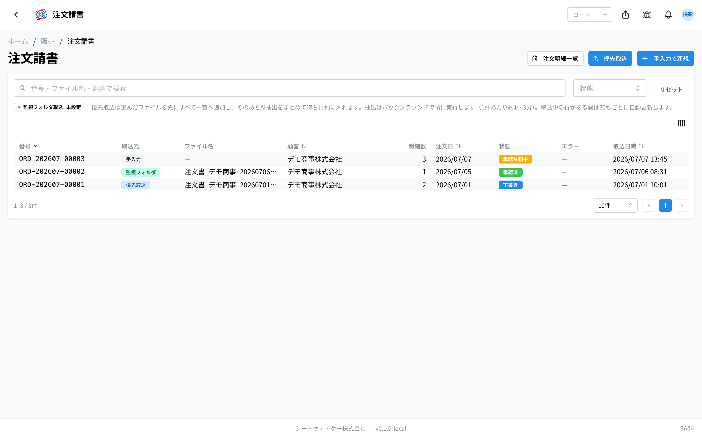
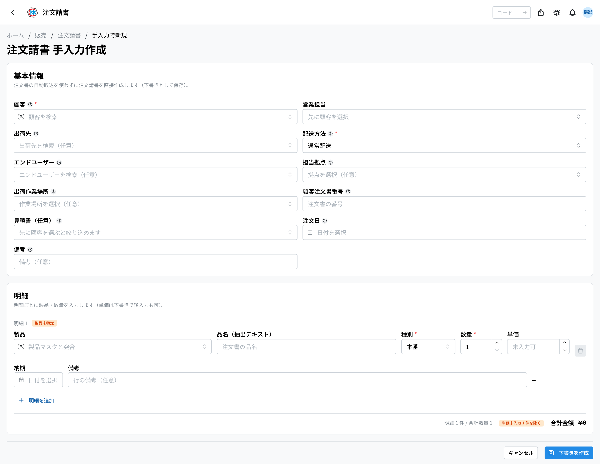
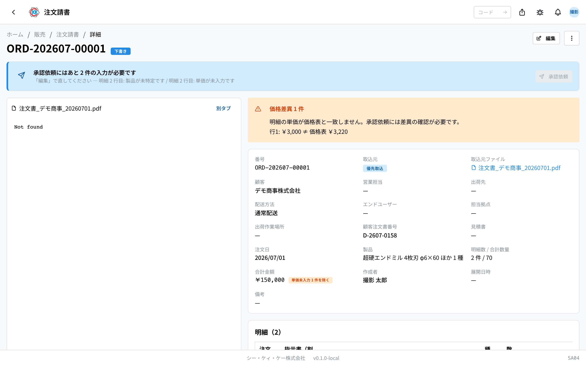
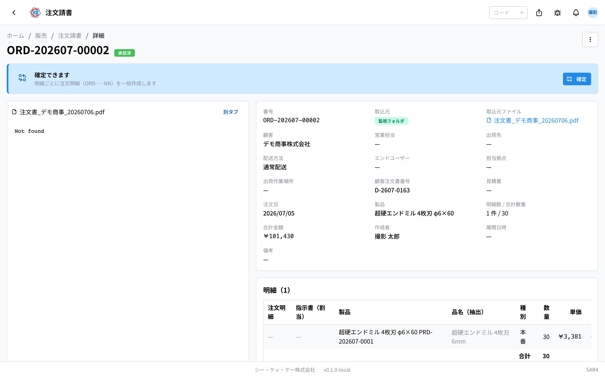
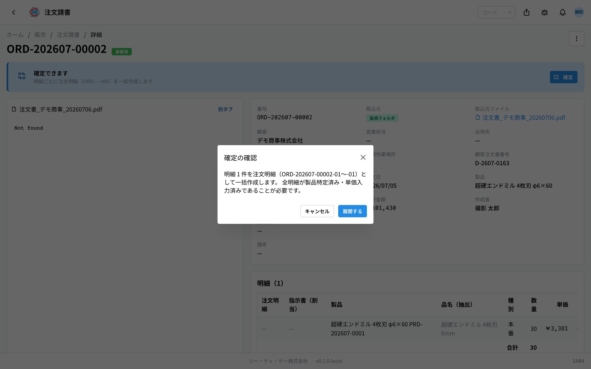

由电脑自动读取客户寄来的订单（PDF 或扫描的图片），确认内容后，一直做到生成 **「订单明细」** 的应用。操作码是 `SA04`。

> ⚠️ 本应用仍在试验公开中，画面和步骤今后可能会变更。

## 本应用能做什么

- 读入订单文件后，会以 **客户名称、品名、支数已自动填好** 的状态登记。
- 可以用人眼确认读取到的内容，修改后再往下走。
- 单价会从[价格表](/manual/zh/operations/sales/price-list/user)自动带入。**仅在以价格表以外的价格受理时**，才在该行打开「单价を上書き」（覆盖单价）自行决定。
- 没有覆盖却与价格表不一致的行，**画面会提示**。
- 取得上级审批后，可以按明细每 1 行 1 张，批量生成 **「订单明细」**。
- 没有订单文件时，也可以手动输入登记。
- 可以从已确定的订单回执直接进入**发货单的创建**。
- 订单被取消时，可以**按订单回执整单申请取消**（需经过审批）。

收到客户的订单（传真或邮件）时使用。

## 本页出现的词

- **「订单请书」（订单请书）** … 从客户处接到的 1 笔订单的记录，就是本应用处理的对象。
- **「订单明细」** … 按订单请书的每 1 行明细生成的单据，是公司内部制造与出货的依据。
- **「明細」（明细）** … 订单中的 1 行，写的是「哪个产品、几支」。
- **「注文確定」（确定）** … 从订单请书批量生成订单明细的操作。
- **「価格差異」（价格差异）** … 未覆盖的行，其单价与价格表的价格不一致。
- **「単価を上書き」（覆盖单价）** … 把该行的单价从价格表中脱离，由自己决定。这是有意的价格，因此不算价格差异（审批的人仍会看到）。
- **「取込中」（导入中）/「下書き」（草稿）/「承認依頼中」（审批中）/「承認済」（已审批）/「確定済」（已展开）/「アーカイブ」（归档）/「キャンセル」（已取消）** … 订单请书目前的情况。

## 开始之前

- 客户需要已登记在[业务伙伴主数据](/manual/zh/operations/masters/business-partner/user)中。没有登记的话，就算读取了，客户也会一直是「未特定」（未确定）。
- 所订购的[产品](/manual/zh/operations/masters/product/user)需要已登记在产品主数据中。
- 为了确认单价，登记好[价格表](/manual/zh/operations/sales/price-list/user)会比较方便（没有也能继续）。
- 审批和退回，只有属于审批组的人才能做。

## 界面怎么看

打开应用后，会显示已导入的订单列表。

- **「番号」（编号）** … 以 `ORD-` 开头的编号，导入后会自动编上。
- **「取込元」（导入来源）** … 是怎么登记进来的，为「監視フォルダ」（监视文件夹）、「優先取込」（优先导入）、「手入力」（手动输入）之一。
- **「顧客」（客户）** … 显示橙色「未特定」（未确定）徽章的，表示客户还没有定下来。
- **「状態」（状态）** … 用彩色徽章显示目前的情况。
- **「エラー」（错误）** … 红色的「抽出失敗」（提取失败）徽章表示读取失败。橙色的「再試行中」（重试中）徽章表示系统正在自动重新读取，稍等即可。将鼠标移到徽章上，可以看到原因和处理方法。
- 通过画面上方的「監視フォルダ取込」（监视文件夹导入）徽章，可以知道自动导入能不能用。
- 只要还有正在读取的行，画面每 30 秒会自动刷新一次。

## 导入订单（4 种方式）

**1. 通过邮件接收（自动）**

客户将订单书发送到 **order-intake@ckk-tool.co.jp** 后，**无需任何操作**即会自动导入，数分钟内出现在列表中。

- 若一封邮件附有 3 份订单书，则会生成 **3 件注文请书**（1 份订单书 = 1 件）。
- 签名中嵌入的公司标志等图片不会被导入。
- 文件名前会加上 `mail_发件人_`，因此在列表上即可看出**来自何处**。
- 附件仅支持 **PDF・PNG・JPG・WEBP**，其他格式不会被导入。

> 发件人与主题不会记录在注文请书上。需要确认时，请直接查看该邮箱。

**2. 放进指定的文件夹**

把文件放进服务器的导入文件夹，就会自动导入。列表上显示「**監視フォルダ取込: 有効**」（监视文件夹导入：有效）时即可使用。

**3. 当场选择文件**

1. 点击列表画面右上角的「**優先取込**」（优先导入）。
2. 选择订单文件（PDF、PNG、JPG、WebP。可以一次选多个）。
3. 所选文件会 **先全部** 加入列表（状态为「取込中」＝导入中）。全部列出之后，才开始依次读取（AI 提取）。
4. 画面右上角会显示进度。读取每 1 件大约需要 **1 〜 3 分钟**。

**4. 手动输入**

1. 点击列表画面右上角的「**手入力で新規**」（手动输入新建）。
2. 选择「**顧客**」（客户）（必填）。选择后，「**営業担当**」（营业负责人）会自动填入该客户的主负责人，需要时可重新选择。
3. 在知道的范围内填写「**顧客注文書番号**」（客户订单编号）、「**注文日**」（订购日）等。
4. 选择「**配送方法**」（配送方式）（普通配送 / 直送最终用户。直送最终用户时必须同时选择「**エンドユーザー**」（最终用户））。
5. 如果已经定了送货地点或负责单位，也请选择「**出荷先**」（发货目的地）、「**担当拠点**」（负责据点）、「**出荷作業場所**」（发货作业场所）（都是选填，之后再填也可以）。
6. 在明细行里输入「**製品**」（产品）、「**種別**」（类型）、「**数量**」（数量）（单价之后再填也可以）。
7. 想增加行时，点击「**明細を追加**」（添加明细）。
8. 点击「**下書きを作成**」（创建草稿）。

## 确认读取到的内容

读取完成后状态会变成「**下書き**」（草稿）。只有在这个状态下才能修改内容。

草稿画面以**查看模式**（只读）打开。需要修改时才切换到「**編集**」（编辑）。

1. 在列表中点击对象行。读取到的内容会以一览形式显示，可与原始订单对照。
2. 需要修改时点击「**編集**」（编辑）——在画面右上。画面会变成可输入的表单。
3. 在「**基本情報**」（基本信息）里确认客户、客户订单编号、订购日。
4. 客户是空的时候，在「**顧客**」（客户）栏里搜索并选择。选择客户后，「**営業担当**」（营业负责人）会自动填入该客户的主负责人，需要时可重新选择。
5. 是承接报价单而来的订单时，在「**見積書（任意）**」（报价单·可选）栏里搜索并选择原来的报价单（已选择客户时，只会列出该客户的报价单）。
6. 确认「**配送方法**」（配送方式）（直送最终用户时必须同时选择「**エンドユーザー**」（最终用户））。
7. 如有需要，选择「**出荷先**」（发货目的地）、「**担当拠点**」（负责据点）、「**出荷作業場所**」（发货作业场所）（选填）。
8. 在「**明細**」（明细）里确认产品、类型、数量、单价、交期。
9. 带橙色「**製品未特定**」（产品未确定）徽章的行，请在「**製品**」（产品）栏里选择正确的产品。栏位下方若出现「**もしかして**」（是不是这个）候选，点击即可填入。
10. 点击画面最下方的「**保存**」（保存）。保存后会回到查看模式。

放弃修改时点击「**キャンセル**」（取消）；如果已经改动过会出现确认，点击「**変更を破棄**」（放弃修改）即可回到查看模式。还没有任何明细行的草稿（例如刚手动新建的），会直接以编辑状态打开。

点击文件名链接，可以在另一个标签页打开原始订单，对照查看。

画面上方的「**製品**」（产品）、「**明細数 / 合計数量**」（明细数 / 合计数量）、「**合計金額**」（合计金额），不用打开明细表也能知道**订了什么、订了多少、总共多少钱**。产品有 2 种以上时会显示「〇〇 ほか 2 種」（某某等 2 种），把鼠标移上去可以看到全部名称。明细表的最下面也会出现**合計**（合计）行。

> ⚠️ 合计金额只把**填了单价的行**加起来。有单价为空的行时会显示「**単価未入力 N 件を除く**」（不含 N 条未填单价的明细）— 把那些行填上就是总额了。

> 💡 有价格表的行，其单价**由价格表带入，直接是不能改的**（蓝色的「**価格表 ￥…**」徽章还会显示生效的数量档）。要以别的价格受理时，请打开该行右侧的「**単価を上書き**」（覆盖单价）后再修改。已覆盖的行会显示紫色的「**上書き**」徽章并并列价格表的价格，画面上方也会出现「**単価の上書き N 件**」（单价覆盖 N 件）。
>
> 橙色的「**価格差異**」（价格差异）徽章表示：没有覆盖却与价格表不一致的行（例如保存之后价格表变更了）。灰色的「**価格表なし**」（无价格表）只是表示该客户与产品还没有价格表，并不是错误 —— 该行的单价可以自由填写。

## 请求审批

1. 在查看模式下，点击画面最上方卡片中的「**承認依頼**」（申请审批）。（编辑中不会显示该按钮，请先保存。）输入不齐时该按钮无法点击 —— 卡片上会列出缺什么（例如「顧客が未特定です」＝客户未确定、「明細 2 行目: 単価が未入力です」＝第 2 行未填单价），请先用「**編集**」（编辑）补齐。
2. 有价格差异时会出现「価格差異の確認」（确认价格差异）画面。确认内容后点击「**差異を確認して依頼**」（确认差异并申请）。已覆盖单价的行**不会阻止申请**（因为是有意的价格），但审批人的画面上也会显示为「単価の上書き N 件」。

状态会变成「**承認依頼中**」（审批中）。

> 💡 审批的级数以及由谁审批，都在[审批设定](/manual/zh/operations/masters/approval-setting/user)中决定。根据合计金额、配送方式、负责据点等条件，每份单据的级数和级别构成可能会不同。

审批的人在这个画面点击「**承認**」（审批）或「**差し戻し**」（退回）。退回时要先输入理由，再点击「**差し戻す**」（退回）。被退回的订单请书会回到「下書き」（草稿），修改后再次申请审批。

> ⚠️ 编辑中不会显示「**承認依頼**」（申请审批）。请先点击「**保存**」（保存）回到查看模式，再申请审批。

## 生成订单明细（注文確定／确定）

获得审批后，画面最上方的卡片会显示「**確定できます**」（可以确定），并出现「**確定**」（确定）按钮。

1. 点击「**確定**」（确定）。
2. 在「**確定の確認**」（确定的确认）画面上确认将生成的张数，然后点击「**展開する**」（展开）。

按明细每 1 行会生成 1 张订单明细。编号会在订单请书的编号后接上 `-01`、`-02` … 这样的连号。生成的订单明细，可以从画面上的「**生成された订单明细**」（已生成的订单明细）链接打开，也可以从列表右上角的「**订单明细一覧**」（订单明细一览）打开。

如果指定了报价单，那份[报价单](/manual/zh/operations/sales/quote/user)若处于「発行済」（已发行）状态，会自动变成「受諾済」（已受理）（仍是草稿的报价单不会变化）。

确定之后，画面上方会出现「**次のステップ: 出荷書の作成**」（下一步：创建发货单）卡片。点击「**出荷書を作成**」（创建发货单），会在已载入该订单回执可发货明细的状态下打开[发货单](/manual/zh/operations/shipping/delivery-order/user)表单。

右上角的「…」菜单中始终排列着「**出荷書を作成**」（创建发货单）「**アーカイブ**」（归档）「**キャンセル依頼**」（取消申请）。当前不能执行的操作会呈灰色，并在下方显示原因。作业结束后点「**アーカイブ**」收起来（可选）。归档之后就不能再编辑了。

## 申请取消

订单被取消时，**按订单回执整单**取消（不能单独取消某一条明细）。

1. 在已确定的订单回执上，从「…」菜单选择「**キャンセル依頼**」（取消申请）。
2. 填写**取消理由**（必填），点击「**キャンセルを依頼する**」。

若[审批设定](/manual/zh/operations/masters/approval-setting/user)的「**订单回执取消**」流程设定了级别，则**审批完成前什么都不会改变**。画面上方会出现审批中的卡片；有审批权限的人会在卡片上看到「**承認**」（批准）「**差し戻し**」（驳回）按钮（也可以在[审批管理](/manual/zh/operations/production/approval/user)列表中操作）。一个级别都没有设定时，会当场取消。

最终批准后会自动执行以下处理：

- 所有订单明细变为**已取消**，订单回执本身也变为「**キャンセル**」（已取消）。
- 已预留的库存**全部释放**。
- 尚未完成的指示书会**连带取消**（已完成的、以及同时为其他明细生产的合并批次指示书保持不变）。

只要有一条明细已经发货，就无法提出取消申请。被驳回时什么都不会改变，申请随之关闭。

## 输入项

订单请书画面的输入・确认项一览。AI 读取的内容也会填入这些栏位，因此这里也是**修正读取结果的地方**。应用中输入栏旁边的 **?** 也可直接跳转到对应说明。

| 项目 | 必填 | 填什么 |
|------|------|--------|
| [客户](#field-customer) | 必填 | 下单的客户 |
| [营业负责人](#field-sales-rep) | 选填 | 这笔订单的本公司营业负责人 |
| [客户订单号](#field-customer-order-ref) | 选填 | 客户方订单上的编号 |
| [报价单](#field-quote-number) | 选填 | 对应的报价单 |
| [订单日期](#field-order-date) | 选填 | 客户下单的日期 |
| [发货目的地](#field-ship-to) | 选填 | 产品的送达地点 |
| [配送方式](#field-delivery-method) | 必填 | 普通配送 / 直送最终用户 |
| [最终用户](#field-end-user) | 直送时必填 | 直送时的实际送达对象（最终需要方） |
| [负责据点](#field-assigned-plant) | 选填 | 处理这笔订单的据点 |
| [发货作业场所](#field-shipping-work-location) | 选填 | 进行发货作业的场所 |
| [备注](#field-notes) | 选填 | 对整份受理书的补充 |
| [产品](#field-product) | 必填 | 所订购的产品 |
| [品名（提取文本）](#field-extracted-name) | — | 订单上记载的品名 |
| [类别](#field-order-type) | 必填 | 正式・测试等区分 |
| [数量](#field-quantity) | 必填 | 订购的数量 |
| [单价](#field-unit-price) | 必填 | 每支的价格 |
| [交期](#field-delivery-date) | 选填 | 各明细的交期 |
| [明细备注](#field-item-notes) | 选填 | 仅针对该明细的补充 |

### 客户 [#field-customer]

下单的客户。系统会依导入的订单自动判定，但**有时无法判定**，此时请在此选择。未确定客户则无法进行价格核对。

### 营业负责人 [#field-sales-rep]

负责这笔订单的本公司营业。选择客户后，会自动填入该客户的主负责人。需要时，可以从登记为该客户负责人的人当中重新选择。之后即使客户主数据的负责人换了人，这份单据上的负责人也不会变。

### 客户订单号 [#field-customer-order-ref]

客户方订单上记载的编号。日后接到查询时可用该编号检索。

### 报价单 [#field-quote-number]

对应的报价单。搜索并选择（已选择客户时，只会列出该客户的报价单）。指定后，注文确定时若该报价单已发行，会自动变为「已受理」。

### 订单日期 [#field-order-date]

客户下单的日期。填写订单上记载的日期。

### 发货目的地 [#field-ship-to]

产品的送达地点。要送到**与下单客户不同的公司・分店**时选择。留空则表示送到该客户处。

### 配送方式 [#field-delivery-method]

产品的送达方式。**普通配送**送到下单客户（或指定的发货目的地）。**直送最终用户**则直接发给最终用户。一份发货单只能汇总**同一客户・同一发货目的地・同一配送方式**的订单明细，因此这里的选择决定了发货的合并方式。

### 最终用户 [#field-end-user]

实际送达对象（最终需要方）。**选择直送时为必填**，普通配送时也可作为记录选填。从登记为最终需要方的往来单位中选择。

### 负责据点 [#field-assigned-plant]

主要处理这笔订单的本公司据点。想明确这是哪个据点的工作时选择。

### 发货作业场所 [#field-shipping-work-location]

进行发货作业（包装、装车等）的场所。从[作业场所](/manual/zh/operations/masters/work-location/user)主数据中选择。

### 备注 [#field-notes]

对整份受理书的补充。各明细的补充说明请写在对应行的备注中。

### 产品 [#field-product]

所订购的产品。**系统会依订单品名自动匹配，但可能匹配不到** — 此时请手动选择。未确定产品的明细无法进入下一步。

品名后面接着尺寸或规格也能匹配。但如果只读取到 `超硬ソリッド` 这类**多个产品共有的词**，系统不会擅自选定其中之一，而是列出「**もしかして**」（是不是这个）候选 — 因为让您来选，比默默选错产品更安全。

如果某个品名每次都用同样的写法过来却总是匹配不到，请把该写法登记到[产品主数据](/manual/zh/operations/masters/product/user#field-keywords)的「**キーワード**」（关键词）里（客户的叫法、简称等），下次就能自动匹配。

### 品名（提取文本）[#field-extracted-name]

订单上实际记载的品名。**用于原样保留读取内容**，是识别产品的线索。

### 类别 [#field-order-type]

正式・测试・样品・其他的区分。价格按该区分而不同。

### 数量 [#field-quantity]

订购的数量。读取结果有误时请修正。

### 单价 [#field-unit-price]

每支的价格。**存在价格表时会带入价格表的单价，该栏不能修改**（更改数量后，会变为对应该数量档的单价）。

要以别的价格受理时，请打开该行的「**単価を上書き**」（覆盖单价）后再修改。打开后初始值就是价格表的单价，只改需要改的地方即可。关掉覆盖会回到价格表的单价（**关掉后保存，之前填的价格会被替换为价格表的单价** —— 保存前会用徽章提示）。

对于没有价格表的客户・产品，从一开始就可以自由填写（不会出现覆盖开关）。

### 交期 [#field-delivery-date]

该明细的交期。明细未指定时，采用表头的希望交期。

### 明细备注 [#field-item-notes]

仅针对该明细的补充（版次或定制内容等）。

## 常见问题与困扰

**Q. 出现了红色的提取失败提示。**
A. 订单读取失败了。提示中会写明**发生了什么、原因以及接下来该怎么做**，请先阅读。临时性的失败（读取服务器重启中、负载过高等）**系统会自动重试，最多 3 次** — 期间显示橙色的「再試行中」（重试中），等待即可恢复。3 次都失败后会停在红色提示：可点击「**再抽出**」（重新提取）再试一次，或点击「**手入力に切り替え**」（切换为手动输入）直接在该画面输入。文件损坏、文件过大等无法自动恢复的失败不会重试，会立即显示红色提示。

**Q. 客户一直是「未特定」（未确定）。**
A. 订单上的公司名称没能和业务伙伴主数据对上。「(株)」与「株式会社」的差别、全角与半角、公司名后面跟着的分店名或「御中」等**写法差异会自动吸收**，因此出现这种情况只有两种可能：该公司*尚未登记*，或者*匹配到多个候选、无法确定其一*。在编辑画面的「**顧客**」（客户）栏下方，如果出现「**もしかして**」（是不是这个）候选，点击即可填入。没有候选时请搜索并选择，然后点击「保存」（保存）。名称写法经常变化的客户，可以在[业务伙伴主数据](/manual/zh/operations/masters/business-partner/user)里登记其他写法，下次就能自动对上。

> 💡 **您改过的内容会被记住。** 手动选择客户（或产品）并保存后，系统会记录「订单上的这个写法＝这条主数据」，**下次再收到同样写法时会自动对上**。同一客户每月用同样格式寄来的话，只需要第一次改。之后若改选别的主数据，就会改记那一条。

**Q.「承認依頼」（申请审批）按不了。**
A. 申请审批需要**客户、至少 1 条明细、以及所有行的产品与单价**都齐全。缺什么会显示在画面最上方的卡片里（例如「顧客が未特定です / 明細 2 行目: 単価が未入力です」）。用「**編集**」（编辑）补齐并「**保存**」（保存）后即可点击。

**Q. 确定时出现「確定できません: 明細 2 行目: 製品が未特定です」（无法确定：明细第 2 行产品未确定）。**
A. 所显示那一行的产品或单价是空的。申请审批时已经做过同样的检查，通常不会发生；万一出现，因为需要回到审批前的草稿状态，请让审批的人做「**差し戻し**」（退回），修改该行后再继续。

**Q. 没有出现审批按钮。**
A. 审批和退回只有属于审批组的人才能做。画面上会显示「◯◯ のメンバーのみ承認・差し戻しできます」（只有该级别审批组的成员才能审批·退回）。请联系负责人。

**Q. 草稿的内容改不了。**
A. 草稿画面以只读方式打开，请先点击「**編集**」（编辑）——在画面右上。另外，只有状态为「下書き」（草稿）时才能修改内容。审批中、已审批、已展开时都不能修改。出现「下書きの订单请书のみ編集できます」（只有草稿状态的订单请书才能编辑）时，请让人退回。

**Q. 导入一直没结束。**
A. 读取每 1 件大约需要 1 〜 3 分钟。选了多个文件时会 1 件 1 件依次处理，所以会花上相应的时间。

<!-- permissions:start -->
## 所需权限

使用本画面需要 **订单确认书・订单明细**（`order_acceptance`）权限。

| 想做的事 | 所需权限 |
| --- | --- |
| 打开画面、查看列表与明细 | 订单确认书・订单明细 — 查看 |
| 新增・变更・删除 | 订单确认书・订单明细 — 创建 / 更新 / 删除 |

仅查看有「查看」即可。画面中若有新增、变更或删除的操作，则分别需要对应的权限。

权限通过角色授予。若不足，请与管理员联系。

权限的整体说明请参见「[权限与角色](../../../permissions)」。
<!-- permissions:end -->
