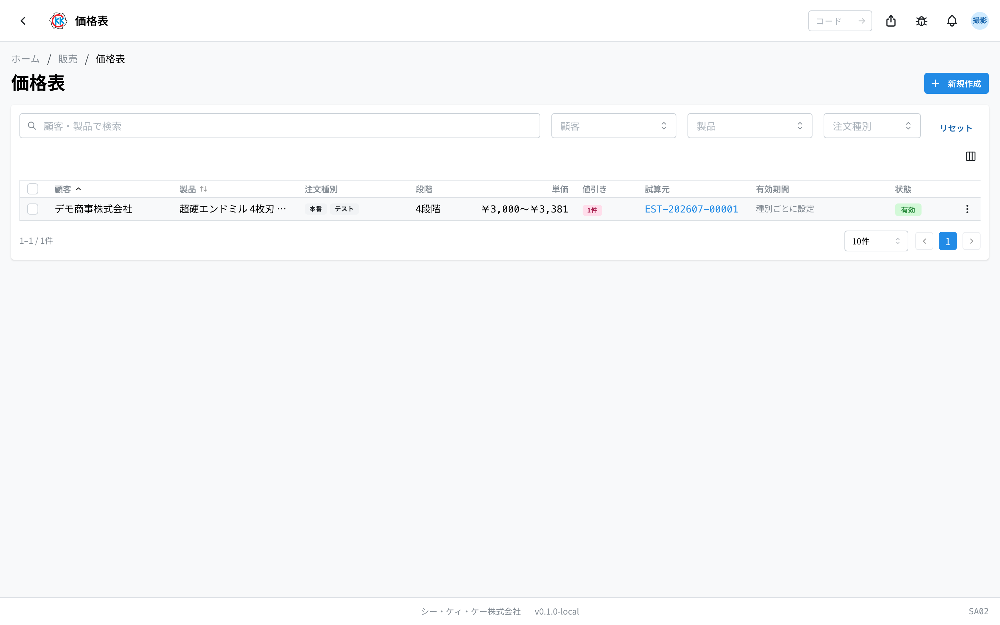
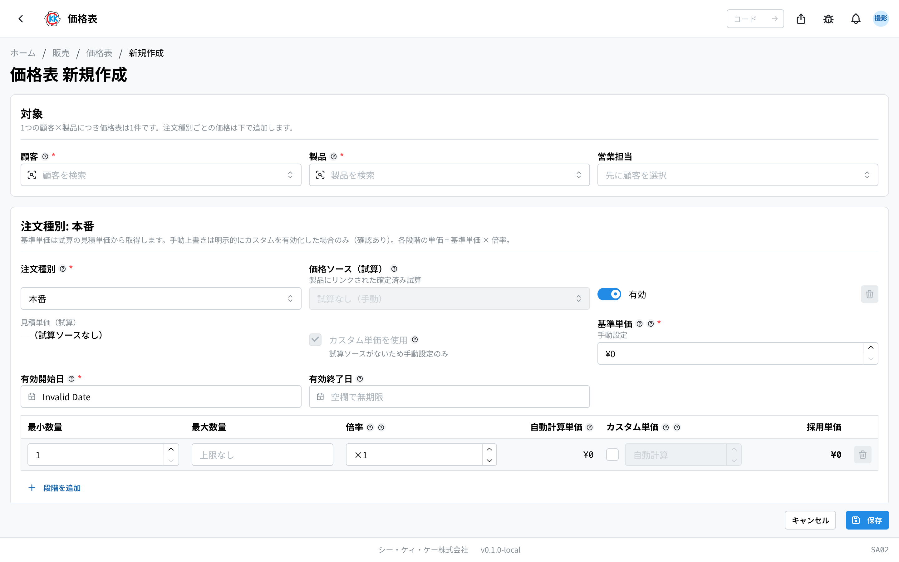
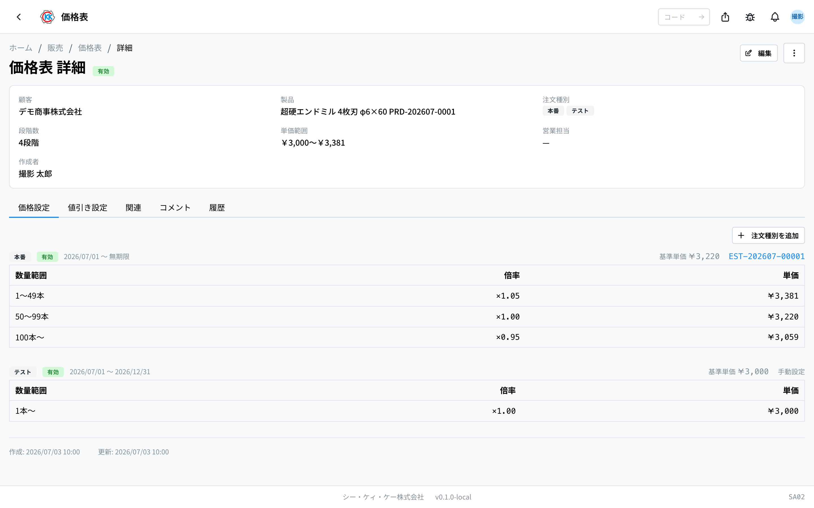
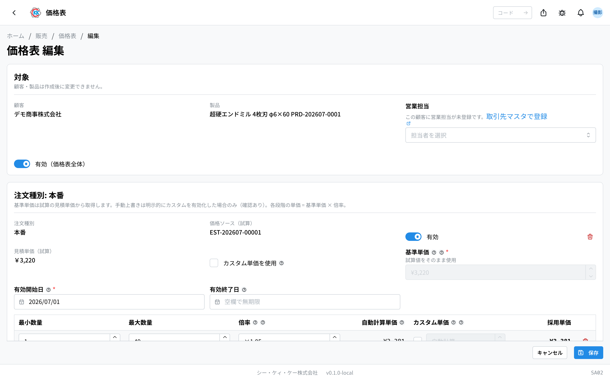
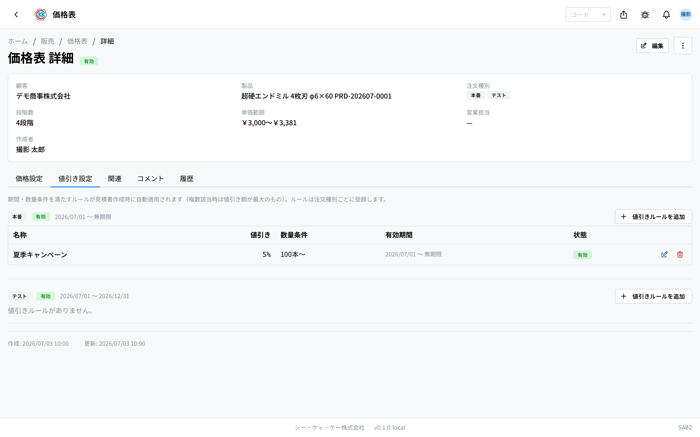
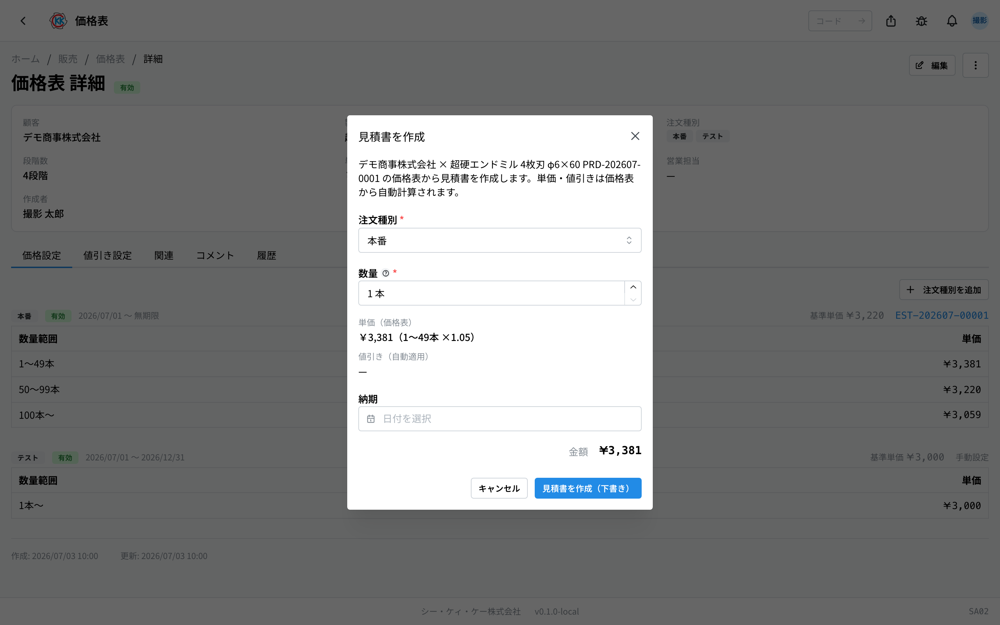

按客户登记「这个[产品](/manual/zh/operations/masters/product/user)多少钱」的台账。操作码是 `SA02`。

## 本应用能做什么

- 可以按[客户](/manual/zh/operations/masters/business-partner/user)登记每个产品的售价。
- 登记之后，[报价单](/manual/zh/operations/sales/quote/user)的金额会 **自动带入**（在报价单画面不需要手动输入金额）。
- 在[订单请书](/manual/zh/operations/sales/order-acceptance/user)（订单请书）中，客户订单上的单价会与这里的价格 **自动比对**，不一致时会提示。
- 可以设定「**买得越多，每支越便宜**」这种按数量的价格。
- 可以登记限期的活动折扣。
- 可以直接从这张价格表制作报价单。

和客户谈好价格后登记在这里，之后只要改这里，报价单的金额也会跟着变。

## 本页出现的词

- **「価格表」（价格表）** … 「1 位客户 × 1 个产品」为 1 条。同样的组合只能建 1 条。
- **「注文種別」（订单类型）** … **本番（正式）/ テスト（测试）/ サンプル（样品）/ その他（其他）** 的区分。同一个产品，各区分可以定不同价格。
- **「基準単価」（基准单价）** … 该订单类型的基本价格。通常从[试算](/manual/zh/operations/sales/trial-estimate/user)的结果带入。
- **「段階（数量段階）」（阶梯·数量阶梯）** … 按数量划分的区间，例如「1〜49 支是这个价，50〜99 支是这个价」。
- **「倍率」（倍率）** … 基准单价要乘以多少的数字。小于 1 就会变便宜。
- **「値引きルール」（折扣规则）** … 事先定好期间和支数的条件后，制作报价单时会自动扣除的折扣。

## 开始之前

- 需要先登记好对象[客户](/manual/zh/operations/masters/business-partner/user)和[产品](/manual/zh/operations/masters/product/user)。
- 如果有作为价格来源的[试算](/manual/zh/operations/sales/trial-estimate/user)会很方便。在试算中指定产品并设为「確定」（确定）后，在这个画面就能选到，金额也会自动带入。
- 没有试算时，也可以手动输入价格来登记。

## 界面怎么看

打开应用后，会以列表显示已登记的价格表。1 行就是「客户 × 产品」1 条。

- **「注文種別」（订单类型）** … 该价格表中登记的区分会以徽章排列显示。
- **「段階」（阶梯）** … 数量区间有几个。
- **「単価」（单价）** … 从最便宜到最贵的价格范围。
- **「値引き」（折扣）** … 粉色徽章上的数字，是可用折扣规则的条数。
- **「価格試算元」（试算来源）** … 价格是从哪份试算带入的。「手動」（手动）表示是手动输入的。
- **「状態」（状态）** … 用「有効」（有效）「無効」（无效）表示能否使用。
- 点击某一行会打开详细画面。

## 制作价格表

1. 点击列表画面右上角的「**新規作成**」（新建）。
2. 点击「**顧客**」（客户）栏，选择客户。
3. 点击「**製品**」（产品）栏，选择产品。
4. 在「**注文種別**」（订单类型）里选择区分（一开始是「本番」正式）。
5. 点击「**価格ソース（価格試算）**」（价格来源·试算）栏，选择作为价格来源的试算。选好后「**基準単価**」（基准单价）里会自动带入金额。
6. 选择「**有効開始日**」（生效开始日）。
7. テスト（测试）和サンプル（样品）时，还必须选择「**有効終了日**」（生效结束日）。
8. 在数量表里输入「**最小数量**」（最小数量）、「**最大数量**」（最大数量）、「**倍率**」（倍率）。
9. 想增加区间时，点击「**段階を追加**」（添加阶梯）。
10. 要登记其他区分的价格时，点击「**注文種別を追加**」（添加订单类型），并重复第 5 〜 9 步。
11. 点击「**保存**」（保存）。

输入倍率后，「**自動計算単価**」（自动计算单价）和「**採用単価**」（采用单价）会当场显示金额，可以边确认边输入。

> 💡 数量区间可以这样设定：「1〜49 支倍率 1.05，50〜99 支 1.00，100 支以上 0.95」。也就是买得越多每支越便宜的定价方式。

> ⚠️ 出现「この製品にリンクされた確定済みの価格試算はありません」（没有关联到该产品的已确定试算）时，表示该产品的试算还没有确定。想使用试算时，请先在[试算](/manual/zh/operations/sales/trial-estimate/user)中指定产品并确定。不使用试算时，请勾选「**カスタム単価を使用**」（使用自定义单价），手动输入基准单价。

## 查看登记的内容

价格表画面有 5 个标签页。

- **「価格設定」（价格设置）** … 各订单类型的基准单价、有效期间、按数量的单价一览。
- **「値引き設定」（折扣设置）** … 折扣规则一览。
- **「関連」（关联）** … 价格是从哪份试算带入的，以及由这张价格表做出的报价单一览。
- **「コメント」（评论）** … 可以就这张价格表发帖交流的讨论串。
- **「履歴」（历史）** … 什么时候、谁做了修改的记录。

数量表里带橙色「**手動**」（手动）徽章的行，使用的不是按倍率计算的价格，而是手动输入的价格。

## 修改价格

1. 点击价格表画面右上角的「**編集**」（编辑）。
2. 修改需要改的地方（基准单价、有效期间、数量阶梯）。
3. 点击「**保存**」（保存）。

- **客户和产品在建立之后不能更改。** 需要别的组合时，请重新建立一条。
- 已保存的订单类型，以及作为其价格来源的试算，也不能更改。
- 想让某个数量区间用特别的价格时，请在该行勾选「**カスタム単価**」（自定义单价）并输入金额。会出现确认画面，点击「**カスタム設定する**」（进行自定义设置）。

## 登记折扣规则

1. 在价格表画面打开「**値引き設定**」（折扣设置）标签页。
2. 点击要加折扣的订单类型右侧的「**値引きルールを追加**」（添加折扣规则）。
3. 在「**名称**」（名称）里输入以后能看懂的名字（例如：夏季活动）。
4. 在「**値引き種別**」（折扣类型）里选择「**率（%）**」（比率 %）或「**金額（¥/本）**」（金额 ¥/支）。
5. 输入折扣的数字。
6. 用「**数量下限**」（数量下限）、「**数量上限**」（数量上限）决定几支以上适用（上限留空表示没有限制）。
7. 选择「**有効開始日**」（生效开始日）。结束日留空表示无期限。
8. 点击「**追加**」（添加）。

登记好的折扣，只要符合条件（期间和支数），制作报价单时就会自动扣除。符合条件的规则有多条时，会采用折扣额最大的那条。

要修改规则请点铅笔图标，要删除请点垃圾桶图标。

## 从这张价格表制作报价单

1. 点击价格表画面右上角的「**…**」（三个点的按钮）。
2. 选择「**見積書を作成**」（创建报价单）。
3. 输入「**注文種別**」（订单类型）和「**数量**」（数量）。单价和折扣会自动显示。
4. 需要时填写「**納期**」（交期）。
5. 点击「**見積書を作成（下書き）**」（创建报价单·草稿）。

会打开已填好内容的[报价单](/manual/zh/operations/sales/quote/user)创建画面。在列表某一行的「**…**」中也能做同样的操作。

## 其他操作

在价格表画面右上角的「**…**」中，还可以做以下操作。

- **「有効期間を変更」（更改有效期间）** … 价格不变，只把期间换成新的期间。
- **「別の顧客・製品へコピー」（复制到其他客户·产品）** … 把同样的价格设置复制给别的客户或产品（与试算的关联会断开，视为手动输入）。
- **「削除」（删除）** … 删除该价格表。无法撤销。

在列表中，也可以用各行左侧的复选框选中多条，然后使用「**有効化**」（启用）、「**無効化**」（停用）、「**一括削除**」（批量删除）。

## 输入项

价格表画面的输入项一览。应用中输入栏旁边的 **?** 也可直接跳转到对应说明。

| 项目 | 必填 | 填什么 |
|------|------|--------|
| [客户](#field-customer) | 必填 | 为谁定价 |
| [产品](#field-product) | 必填 | 为哪个产品定价 |
| [有效（整份价格表）](#field-active) | — | 是否启用该价格表 |
| [订单类别](#field-order-type) | 必填 | 正式・测试等区分 |
| [价格来源（试算）](#field-estimate) | 选填 | 基准单价的来源试算 |
| [基准单价](#field-base-price) | 必填 | 数量阶梯的计算基础 |
| [生效开始日](#field-valid-from) | 必填 | 该价格开始适用的日期 |
| [生效结束日](#field-valid-until) | 选填 | 该价格结束适用的日期 |
| [倍率](#field-multiplier) | 必填 | 各数量阶梯的系数 |
| [自定义单价](#field-custom-price) | 选填 | 手动指定某一阶梯的单价 |

### 客户 [#field-customer]

为谁定价。**客户与产品的组合构成 1 份价格表**，创建后无法更改；若选错请重新创建。

### 产品 [#field-product]

为哪个产品定价。与客户相同，创建后无法更改。

### 有效（整份价格表）[#field-active]

用于给不再使用的价格表打上「无效」标记、加以整理的项目。即使设为无效，目前也不影响报价单单价的计算。

### 订单类别 [#field-order-type]

正式・测试・样品・其他的区分。**即使客户与产品相同，也可按类别持有不同价格。** 样品的做法是把单价设为 0 来使用（不会自动变成 0）。

### 价格来源（试算）[#field-estimate]

基准单价的来源试算。**只能选择已确定的试算。** 选择后会将该试算的报价单价填入基准单价，并将试算锁定为「已登记到价格表」，以免过去的价格事后变动。若想手动输入，可不选择。

### 基准单价 [#field-base-price]

数量阶梯的计算基础。各阶梯的单价由该单价乘以倍率决定。

### 生效开始日 [#field-valid-from]

记录该价格从什么时候开始使用的日期。报价单的单价不会以这个日期为界切换。会按期间自动生效或停止的，是折扣规则（折扣规则自身的期间）。

### 生效结束日 [#field-valid-until]

该价格结束适用的日期。留空则无期限。**测试・样品的价格通常会设定结束日。**

### 倍率 [#field-multiplier]

各数量区间的系数。希望买得越多单价越低时，填入小于 1 的值。

### 自定义单价 [#field-custom-price]

需要手动指定某一阶梯的单价时使用。填入后优先于倍率计算。

## 常见问题与困扰

**Q. 出现「同一の顧客・製品の価格表が既に存在します。既存の価格表を編集してください。」（相同客户·产品的价格表已存在，请编辑现有价格表）。**
A. 该客户与该产品的价格表已经有了。请不要新建，打开现有价格表，从「編集」（编辑）里添加订单类型或价格。在新建画面里如果重复，也会显示红色提示和指向现有价格表的链接。

**Q. 客户和产品栏是灰色的，选不了。**
A. 已建立的价格表规定不能更改客户和产品。需要别的组合时，请从列表重新建立。

**Q. 保存时出现「テスト・サンプルは有効終了日が必須です」（测试·样品必须填写生效结束日）。**
A. テスト（测试）和サンプル（样品）的价格必须有到什么时候为止的结束日。请选好「有効終了日」（生效结束日）后再保存。

**Q. 基准单价栏里输不了数字。**
A. 从试算带入价格时，规定基准单价要沿用试算的金额。想改成别的金额时，请勾选「**カスタム単価を使用**」（使用自定义单价）（会出现确认画面）。

**Q. 在报价单上出现「この数量に該当する価格段階がありません」（没有对应该数量的价格阶梯）。**
A. 价格表里没有包含所输入支数的数量区间。请从「編集」（编辑）添加包含该支数的阶梯（把最上面阶梯的「最大数量」（最大数量）留空，就表示没有上限）。

**Q. 改了价格表，但之前做的报价单金额没有变。**
A. 报价单的机制是保留制作当时的金额。想换成新金额时，请打开那份[报价单](/manual/zh/operations/sales/quote/user)，做「編集」（编辑）→「保存」（保存），就会重新带入当下价格表的金额。

<!-- permissions:start -->
## 所需权限

使用本画面需要 **价格表**（`price_list`）权限。

| 想做的事 | 所需权限 |
| --- | --- |
| 打开画面、查看列表与明细 | 价格表 — 查看 |
| 新增・变更・删除 | 价格表 — 创建 / 更新 / 删除 |

仅查看有「查看」即可。画面中若有新增、变更或删除的操作，则分别需要对应的权限。

权限通过角色授予。若不足，请与管理员联系。

权限的整体说明请参见「[权限与角色](../../../permissions)」。
<!-- permissions:end -->
