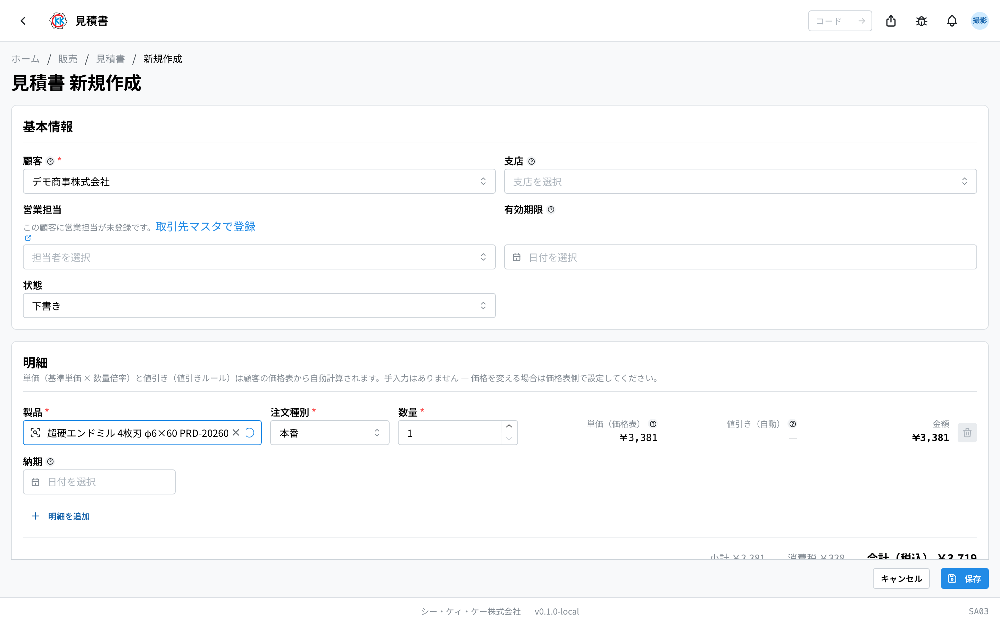
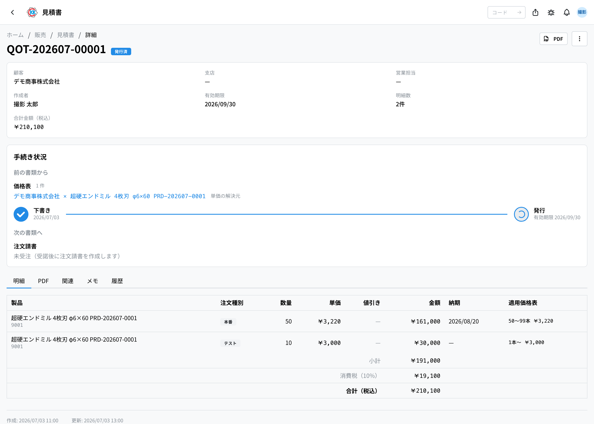
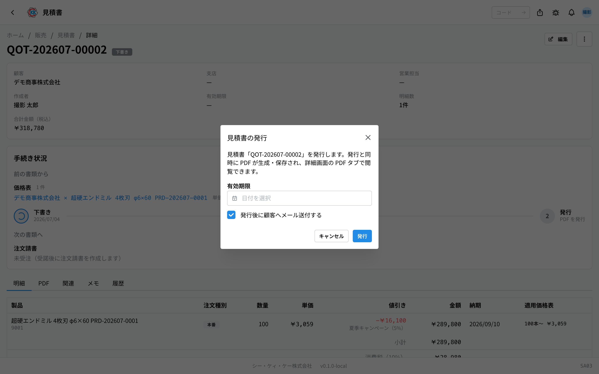

お客様に提出する **見積書** を作り、PDF にして発行するアプリです。操作コードは `SA03` です。

> このアプリが属するフロー … [販売の流れ](/manual/ja/process/sales)

## このアプリでできること

- お客様に出す見積書をつくれます。
- 製品と本数を選ぶだけで、**金額が自動で計算** されます（電卓は不要です）。
- できあがった見積書を **PDF** にして、印刷したりメールで送ったりできます。
- 「まだ検討中」「受注できた」など、見積書の今の状況を記録できます。
- 似た内容の見積書は **複製** して作り直せます。

## 用語（このページで出てくる言葉）

- **明細（めいさい）** … 見積書の中の 1 行のこと。「どの製品を何本」を書きます。
- **注文種別（ちゅうもんしゅべつ）** … 本番・テスト・サンプルなどの区分です。同じ製品でも区分ごとに金額が変わります。
- **価格表** … お客様ごとの製品の値段を、あらかじめ登録しておく台帳です。見積書の金額はここから自動で入ります。
- **下書き / 発行済** … 下書きはまだ社内だけの状態、発行済はお客様に出せる状態です。

## はじめる前に

見積書をつくるには、**そのお客様とその製品の[価格表](/manual/ja/operations/sales/price-list/user)が先に登録されている必要があります**。価格表が無いと、金額が計算できないため保存できません。

まだ価格表が無いときは、先に[価格試算](/manual/ja/operations/sales/trial-estimate/user)で単価を計算し、[価格表](/manual/ja/operations/sales/price-list/user)に登録してください。

## 画面の見かた

アプリを開くと、これまでに作った見積書の一覧が表示されます。

- **見積番号** … `QOT-` で始まる番号です。システムが自動で付けます。
- **状態** … 色つきのバッジで今の状況がわかります。灰色は「下書き」、青は「発行済」、オレンジは「期限切れ」（発行済で有効期限を過ぎたもの）です。
- 上の検索欄に見積番号やお客様の名前を入れると、探している見積書を絞り込めます。
- 行をクリックすると、その見積書の詳しい画面が開きます。

## 見積書をつくる

1. 一覧画面の右上にある「**新規作成**」を押します。
2. 「**顧客**」の欄をクリックして、お客様を選びます。
3. お客様に支店がある場合は「**支店**」も選びます（無ければそのままで大丈夫です）。
4. 「**営業担当**」を確認します。お客様を選ぶと主担当が自動で入るので、必要なら選び直します。
5. 「**有効期限**」に、この見積が有効な期日を入れます（空欄のままでも保存できます）。
6. 明細の行で「**製品**」「**注文種別**」「**数量**」を選びます。
7. 入力すると、**単価・値引き・金額が自動で表示されます**。金額は手で直す必要はありません。
8. 製品ごとに納期が決まっている場合は「**納期**」も入れます。
9. 行を増やしたいときは「**明細を追加**」を押します。
10. 最後に「**保存**」を押します。

保存すると「下書き」として登録され、詳しい画面が開きます。

> 💡 金額はお客様ごとの価格表から自動で入ります。値段を変えたいときは、この画面ではなく[価格表](/manual/ja/operations/sales/price-list/user)のほうを直してください。

> ⚠️ 行に「**価格表なし**」と赤く表示されたときは、そのお客様とその製品の価格表がまだありません。そのままでは保存できないので、先に価格表を登録してください。

## 内容を確認する

保存した見積書の画面には、5 つのタブがあります。

- **明細** … 製品・本数・金額の一覧です。下に小計・消費税・合計が出ます。
- **PDF** … 発行したあとの PDF を見たり、ダウンロードしたりできます。
- **関連** … どの価格表・どの価格試算から金額が入ったかを確認できます。
- **メモ** … この見積書についての社内向けメモを残せます。
- **履歴** … いつ誰が変更したかの記録です。

## 発行する（お客様に出せる状態にする）

1. 見積書の画面の右上「**…**」（点が 3 つのボタン）を押します。
2. 「**発行**」を選びます。
3. 「見積書の発行」という小さな画面が出るので、**有効期限** を確認します。
4. お客様にメールで送りたいときは「**発行後に顧客へメール送付する**」にチェックを入れます。
5. 「**発行**」を押します。

発行すると状態が「**発行済**」に変わり、**PDF が自動で作られます**。

PDF タブを開くと、できあがった見積書を見たり、ダウンロードして印刷したりできます。発行したあとは、右上の「**…**」の「**PDFをダウンロード**」からも保存できます。

## 発行したあとの記録

**お客様の返事を見積書に記録する操作はありません。** 状態は「下書き」と「発行済」の 2 つだけです。

- **注文をいただけたか** … [注文請書](/manual/ja/operations/sales/order-acceptance/user)を作るときにこの見積書を指定すると、見積書の「**手続き状況**」の「**次の書類へ**」にその注文請書が並びます。注文請書があること自体が「受注できた」という記録なので、見積書側で印を付ける必要はありません。
- **お断りされたとき** … 何もしません。注文請書が作られないまま、有効期限が来れば「期限切れ」になります。
- **期限が過ぎたとき** … 手で変えるものではありません。有効期限を過ぎた発行済の見積書は、その日から自動で「**期限切れ**」と表示されます。

> 💡 **発行した見積書は編集できません。** 内容を直したいときは複製して作り直します（下の「似た見積書をつくる」）。出してしまった見積書をあとから書き換えられると、お客様の手元にある紙と食い違うためです。

## 似た見積書をつくる

前に作った見積書とほぼ同じ内容を出すときは、作り直さずに複製できます。

1. コピー元の見積書を開きます。
2. 右上の「**…**」から「**複製**」を押します。
3. 同じ内容の下書きができるので、変えたいところだけ直して保存します。

見積番号は新しい番号が自動で付きます。

## 入力項目

見積書の画面で入力する項目の一覧です。アプリの入力欄の横にある「?」からも、その項目の説明へ直接来られます。

| 項目 | 必須 | 何を入れるか |
|------|------|-------------|
| [顧客](#field-customer) | 必須 | 見積書を出すお客様 |
| [支店](#field-customer-branch) | 任意 | 宛先の支店（登録がある場合） |
| [営業担当](#field-sales-rep) | 任意 | この見積の自社の営業担当 |
| [有効期限](#field-valid-until) | 任意 | 見積が有効な最終日 |
| [状態](#field-status) | — | 見積書のいまの扱い |
| [製品](#field-product) | 必須 | 見積もる製品 |
| [注文種別](#field-order-type) | 必須 | 本番・テストなどの区分 |
| [数量](#field-quantity) | 必須 | 本数 |
| [単価（価格表）](#field-unit-price) | 自動 | 価格表から入る単価 |
| [値引き（自動）](#field-discount) | 自動 | 価格表の値引きルールの結果 |
| [納期](#field-delivery-date) | 任意 | 明細ごとの納入予定日 |
| [備考](#field-notes) | 任意 | 社内向けの補足 |

### 顧客 [#field-customer]

見積書を出すお客様を選びます。**ここで選んだ顧客の価格表から単価が決まる**ため、最初に選んでください。顧客を変えると、すでに入力した明細の単価も選び直しになります。

### 支店 [#field-customer-branch]

宛先の支店を選びます。その顧客に支店が登録されていないときは選べません（空のままで問題ありません）。

### 営業担当 [#field-sales-rep]

この見積を担当する自社の営業です。お客様を選ぶと、そのお客様の主担当が自動で入ります。必要なら、そのお客様の担当として登録されている人の中から選び直せます。

### 有効期限 [#field-valid-until]

この見積が有効な最終日です。**この日を過ぎた発行済の見積書は、一覧でも詳細でも自動的に「期限切れ」と表示されます**（誰かが操作する必要はありません）。空のままにもできます。その場合は期限切れになりません。

### 状態 [#field-status]

見積書のいまの扱いで、**選ぶ欄ではありません**。新しく作ると「下書き」から始まり、「発行」を押すと「発行済」になります。この 2 つだけが記録され、「期限切れ」は有効期限から自動で表示されるものです。

### 製品 [#field-product]

見積もる製品を選びます。選ぶと、顧客・注文種別・数量の組み合わせに合う単価が価格表から自動で入ります。**価格表に無い製品を選ぶと単価が入らず、警告が出ます。**

### 注文種別 [#field-order-type]

本番・テスト・サンプル・その他の区分です。**同じ製品でも種別ごとに価格が違う**ため、実際の注文に合わせて選んでください（サンプルは価格表で単価を 0 に設定して使う運用です）。

### 数量 [#field-quantity]

本数を入れます。価格表で数量の範囲ごとに単価が決まっている場合は、入れた数量に応じて単価が変わります。

### 単価（価格表）[#field-unit-price]

価格表から自動で入る単価です。**手では入力できません。** 金額を変えたいときは、価格表側の基準単価や数量の設定を直してください。

### 値引き（自動）[#field-discount]

価格表の値引きルールに当てはまった場合に、自動で引かれる金額です。こちらも手入力はできません。

### 納期 [#field-delivery-date]

その明細をお客様へ納入する予定日です。明細ごとに指定できます。決まっていなければ空のままにできます。

### 備考 [#field-notes]

社内向けの補足です。見積書の PDF には出ません。

## よくある質問・困ったとき

**Q. 金額の欄に自分で数字を入れられません。**
A. 見積書では金額を手入力できない仕組みです。金額はお客様ごとの[価格表](/manual/ja/operations/sales/price-list/user)から自動で入ります。値段を変えたいときは価格表を直してください。

**Q.「該当する価格表がありません」と出て保存できません。**
A. そのお客様とその製品の価格表がまだ登録されていません。先に[価格試算](/manual/ja/operations/sales/trial-estimate/user)で単価を出し、[価格表](/manual/ja/operations/sales/price-list/user)に登録してから、もう一度お試しください。

**Q. お客様を選び直したら、金額が変わりました。**
A. 正常な動きです。金額はお客様ごとに決まっているため、お客様を変えるとそのお客様の価格表で計算し直されます。

**Q. 有効期限を過ぎた見積書はどうなりますか。**
A. その日から自動で「**期限切れ**」と表示されます。操作は要りません（期限切れかどうかは毎回その場で日付から判断しているので、締切を過ぎた瞬間に正しくなります）。

**Q. 数量を増やしたら単価が下がりました。**
A. 正常な動きです。価格表で「たくさん注文すると 1 本あたりが安くなる」設定になっている場合、数量に応じて単価が変わります。

**Q. 間違えて発行してしまいました。**
A. 発行を取り消す操作はありません。**発行済の見積書は編集もできません。** 右上の「…」から「複製」して正しい内容の見積書を作り、そちらをお客様に出してください。間違えたほうは有効期限が来れば「期限切れ」になります。備考に事情を書いておくと、あとから見た人に伝わります。

**Q. 発行済の見積書に「編集」ボタンがありません。**
A. 仕様です。出した見積書があとから書き換わると、お客様の手元にある紙と食い違うためです。直したいときは複製して作り直してください。

<!-- permissions:start -->
## 必要な権限

この画面を使うには **見積書**（`quote`）の権限が要ります。

| したいこと | 必要な権限 |
| --- | --- |
| 画面を開く・一覧や詳細を見る | 見積書 の 閲覧 |
| 追加・変更・削除する | 見積書 の 作成 / 更新 / 削除 |

見るだけなら「閲覧」で足ります。追加・変更・削除の操作がある画面では、その操作にあたる権限がそれぞれ必要です。

権限は役割（ロール）を通して付きます。足りないときは管理者に相談してください。

権限の全体像は「[権限とロール](../../../permissions)」を参照してください。
<!-- permissions:end -->
