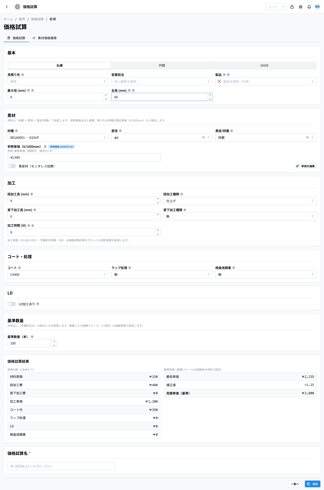
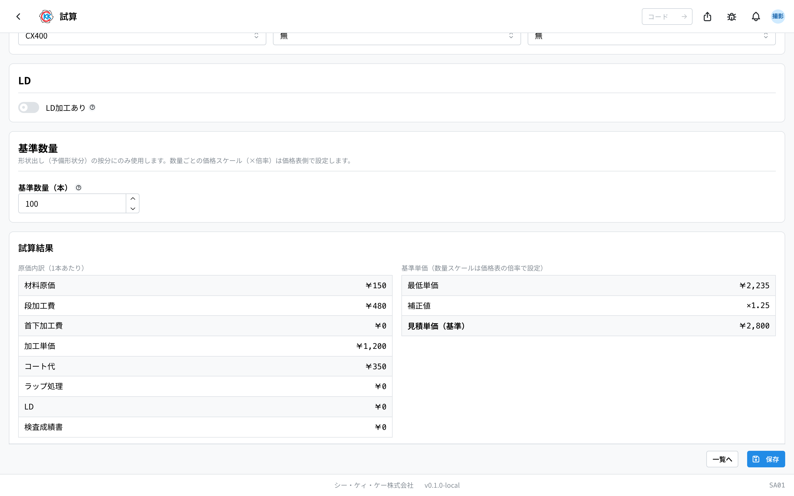
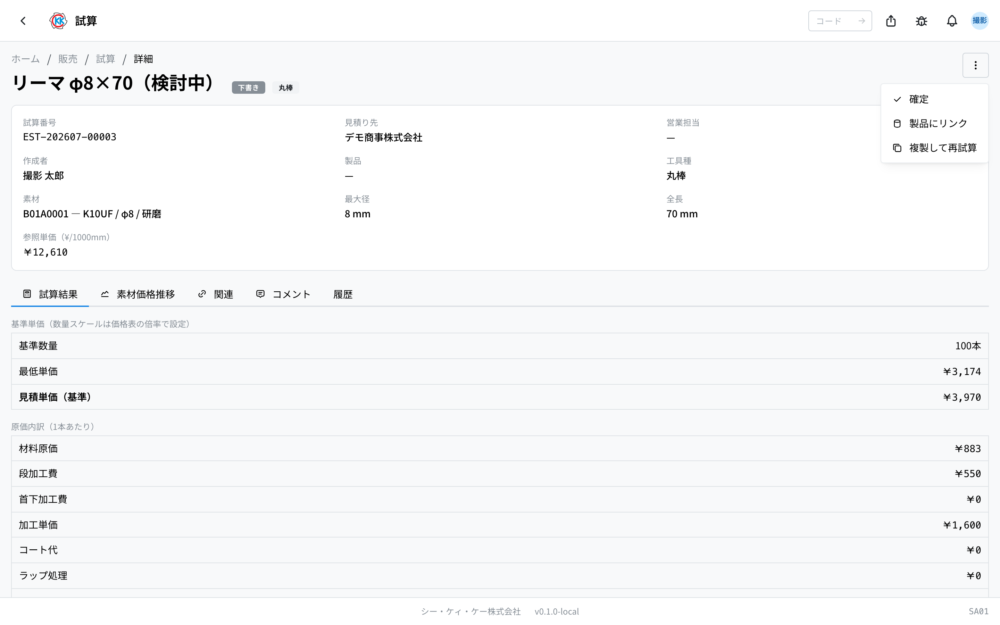
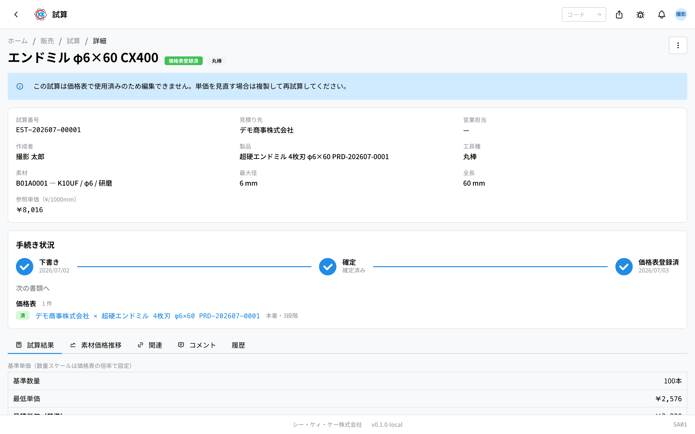
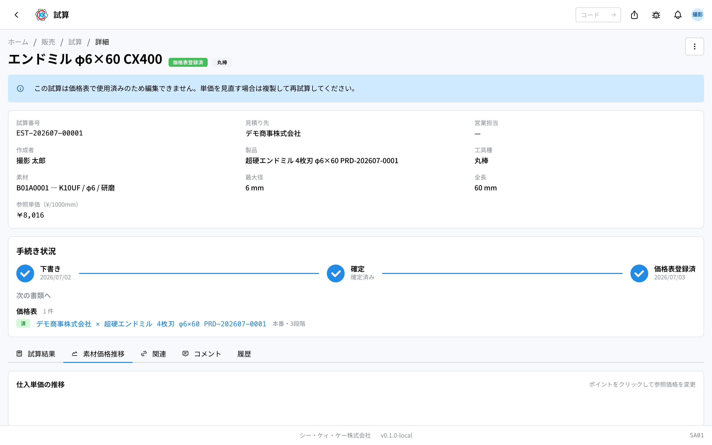

输入材料费和加工条件后，会自动算出这个产品 **一支卖多少钱** 的应用。操作码是 `SA01`。

## 本应用能做什么

- 根据材料费、加工费、涂层费等，**自动算出每支的售价（报价单价）**。
- 材料的价格会根据 **过去买这个材料花了多少钱** 自动带入。
- 可以给算好的内容起个名字保存起来，以后再查看。
- 把保存的试算设为「確定」（确定）后，就可以作为制作[价格表](/manual/zh/operations/sales/price-list/user)时的价格来源。
- 想用相似的条件再算一次时，可以 **复制后重新计算**。

决定新产品价格时，这是最先使用的应用。

## 本页出现的词

- **「価格試算」（试算）** … 根据成本算出「这个产品卖多少钱」的一条记录。
- **「工具種」（工具种类）** … 刀具形状的区分。标准提供 **丸棒（圆棒）/ 円筒（圆筒）/ OH付（带 OH）** 这 3 种。选的区分不同，需要输入的项目也不同。各公司还可以自行增加区分，因此画面上有时会排列 4 种以上。
- **「材種」（材种）** … 材料的种类，由厂商与材质的组合决定。
- **「参照単価」（参考单价）** … 材料每 1000mm 的采购价格，会根据过去的采购实绩自动带入。
- **「見積単価（基準）」（报价单价·基准）** … 本次试算算出的每支售价，会成为价格表的「基準単価」（基准单价）。
- **「下書き」（草稿）/「確定」（确定）/「価格表登録済」（已用于价格表）** … 试算目前的情况。草稿表示只是做好了；确定表示可以用于价格表；已用于价格表表示实际已经在价格表中使用。

## 开始之前

- 需要先定好要计算的 **材料（材種、直径、黒皮/研磨 这 3 项）**。
- 请事先准备好 **加工条件**，例如加工时间、涂层、是否需要检查成绩书等。
- 如果打算把计算结果用在[价格表](/manual/zh/operations/sales/price-list/user)里，请先登记好[产品](/manual/zh/operations/masters/product/user)。试算里没有指定产品的话，在价格表中就选不到。

## 界面怎么看

打开应用后，会显示至今做过的试算列表。

- **「価格試算番号」（试算编号）** … 以 `EST-` 开头的编号，保存后会自动编上。
- **「状態」（状态）** … 用彩色徽章显示目前的情况。灰色是「下書き」（草稿），蓝色是「確定」（确定），绿色是「価格表登録済」（已用于价格表）。
- **「カスタム」（自定义）** … 带橙色徽章的试算，表示材料价格是手动重新输入过的。
- 在上方搜索框里输入试算编号、名称或客户名称即可缩小范围。也可以用右侧的「状態」（状态）、「工具種」（工具种类）筛选。
- 点击某一行，就会打开该试算的详细画面。

## 制作试算

1. 点击列表画面右上角的「**新規作成**」（新建）。
2. 在画面上方排列的刀具形状中选择（标准为「**丸棒**」（圆棒）、「**円筒**」（圆筒）、「**OH付**」（带 OH）。有些公司还会排列其他区分）。
3. 在「**見積り先**」（报价对象）里选择客户（留空也能计算）。
4. 在「**製品**」（产品）里选择对象产品（之后要用于价格表时，请务必选择）。
5. 在「**最大径 (mm)**」（最大直径）和「**全長 (mm)**」（全长）里输入刀具的尺寸。
6. 在「**素材**」（材料）栏中，依次选择「**材種**」（材种）、「**直径**」（直径）、「**黒皮/研磨**」（黑皮／研磨）。
7. 三项都选好后，「**参照単価（¥/1000mm）**」（参考单价）里会自动带入材料价格。
8. 在「**加工**」（加工）栏里，输入台阶加工、颈下加工的长度与种类，以及「**加工時間 (分)**」（加工时间·分钟）。
9. 在「**コート・処理**」（涂层·处理）栏里，选择「**コート**」（涂层）、「**ラップ処理**」（研磨处理）、「**検査成績書**」（检查成绩书）。
10. 有 LD 加工时，打开「**LD加工あり**」（有 LD 加工），并输入部位、外径、刃长。
11. 确认「**基準数量（本）**」（基准数量·支）。一开始是 100 支。
12. 最后在「**価格試算名**」（试算名称）里输入名称（必填）。
13. 点击画面右上角的「**保存**」（保存）。

每输入一项，画面下方的「**価格試算結果**」（试算结果）都会当场重新计算。

- **「原価内訳（1本あたり）」（成本明细·每支）** … 材料成本、台阶加工费、加工单价、涂层费等的明细。
- **「見積単価（基準）」（报价单价·基准）** … 显示在最下方的每支售价。

> 💡 数量多时的折扣（让每支更便宜的设定）不在这个画面设置，而是在[价格表](/manual/zh/operations/sales/price-list/user)里设置。试算只给出每支的基准价格。

## 想改材料价格时

参考单价平时会自动带入，直接使用即可。只有在行情变化等想手动重新输入时，才做下面的操作。

1. 点击参考单价右下方的「**単価を編集**」（编辑单价）。
2. 会出现名为「材料単価のカスタム設定」（材料单价的自定义设置）的确认画面，点击「**カスタム設定する**」（进行自定义设置）。
3. 在参考单价栏里输入数字。
4. 想恢复成自动值时，点击「**ポリシー値に戻す**」（恢复为策略值）。

打开「**素材価格推移**」（材料价格推移）标签页，可以用图表查看过去买这个材料的价格。点击图上的点，也可以直接使用那天的价格。

手动重新输入过的试算，会带上橙色的「**カスタム**」（自定义）徽章。

> ⚠️ 参考单价上出现黄色的「**既定価格**」（默认价格）徽章时，表示该材料还没有采购实绩，计算时使用的是材种里事先登记的标准价格。

## 保存之后与确定

保存后会登记为「**下書き**」（草稿），并打开详细画面。**保存后的试算不能再修改。** 想改内容时，请使用后面说明的「复制后重新试算」。

要让它能用于价格表，请做下面的操作。

1. 点击试算画面右上角的「**…**」（三个点的按钮）。
2. 还没有选产品时，点击「**製品にリンク**」（关联到产品），选好产品后点击「**保存**」（保存）。
3. 再次点击「**…**」，选择「**確定**」（确定）。

确定后状态会变成「**確定**」（确定），画面上方会出现「確定済み」（已确定）的提示。这样在制作[价格表](/manual/zh/operations/sales/price-list/user)时就能选到这份试算了。

## 查看保存的试算

保存后的试算画面有 5 个标签页。

- **「価格試算結果」（试算结果）** … 报价单价与成本明细。保存时的价格会原样保留。
- **「素材価格推移」（材料价格推移）** … 可以用图表查看该材料采购价格的变化。
- **「関連」（关联）** … 使用了这份试算的价格表一览。
- **「コメント」（评论）** … 可以就这份试算发帖交流的讨论串。
- **「履歴」（历史）** … 什么时候、谁做了操作的记录。

## 制作相似的试算（复制后重新试算）

只想稍微改一下条件重新计算时，不用重做，复制即可。

1. 打开作为基础的试算。
2. 从右上角的「**…**」中点击「**複製して再価格試算**」（复制后重新试算）。
3. 会打开内容相同的新输入画面，只改想改的地方。
4. 点击「**保存**」（保存）。

试算名称会自动加上「（再価格試算）」（重新试算），编号会编上新的号码。在列表某一行的「**…**」中也能做同样的操作。

## 输入项

试算画面的输入项一览。项目较多，按**影响哪部分成本**分组排列。应用中输入栏旁边的 **?** 也可直接跳转到对应说明。

| 项目 | 必填 | 填什么 |
|------|------|--------|
| [报价对象](#field-customer) | 选填 | 为谁试算 |
| [产品](#field-product) | 选填 | 试算哪个产品 |
| [最大径 (mm)](#field-max-diameter) | 必填 | 产品的最大直径 |
| [全长 (mm)](#field-length) | 必填 | 产品的长度 |
| [材种](#field-material-type) | 必填 | 使用的材料种类 |
| [直径](#field-diameter) | 必填 | 材料的直径 |
| [黑皮/研磨](#field-surface-finish) | 必填 | 材料的表面状态 |
| [参考单价（¥/1000mm）](#field-reference-price) | 自动 | 由采购实绩得出的材料单价 |
| [材料价格（手动 ¥/支）](#field-manual-material-price) | 选填 | 不使用参考单价时的单价 |
| [黑皮材（无心磨加算）](#field-centerless) | 选填 | 黑皮材的追加加工 |
| [圆筒种类](#field-cylinder-type) | 条件必填 | 圆筒刀具时的种类 |
| [台阶加工长 / 种类](#field-step-machining) | 选填 | 台阶加工的长度与种类 |
| [颈下加工长 / 种类](#field-neck-machining) | 选填 | 颈下加工的长度与种类 |
| [加工时间 (分)](#field-machining-time) | 必填 | 每支的加工时间 |
| [涂层](#field-coating) | 选填 | 涂层的种类 |
| [研磨处理](#field-lapping) | 选填 | 是否进行研磨处理 |
| [检查成绩书](#field-inspection-report) | 选填 | 是否附带检查成绩书 |
| [LD加工 / 部位 / 外径 / 刃长](#field-ld) | 选填 | LD 加工的条件 |
| [基准数量（支）](#field-base-quantity) | 必填 | 按多少支为前提计算 |

### 报价对象 [#field-customer]

为谁进行试算。**留空也可以计算** — 适用于对象尚未确定阶段的概算。

### 产品 [#field-product]

试算哪个产品。关联产品后，**确定后即可作为价格表的基准单价来源**。1 个产品可以有多个试算。

### 最大径 (mm) [#field-max-diameter]

产品的最大直径。可作为选择材料直径时的依据。

### 全长 (mm) [#field-length]

产品的长度。**材料费由长度决定**，此处变动会改变材料成本。

### 材种 [#field-material-type]

使用的材料种类。从已登记的厂商与材质组合中选择。

### 直径 [#field-diameter]

材料的直径。请选择大于产品最大径的规格。

### 黑皮/研磨 [#field-surface-finish]

材料的表面状态。**黑皮较便宜，但可能需要追加无心磨加算。**

### 参考单价（¥/1000mm）[#field-reference-price]

依材种・直径・表面的组合，**由采购实绩自动得出的单价**。没有实绩时使用材种的默认单价。画面上可确认来源于哪笔实绩。

### 材料价格（手动 ¥/支）[#field-manual-material-price]

不使用参考单价、需自行指定单价时填写。**适用于特殊采购或尚无实绩的材料。**

### 黑皮材（无心磨加算）[#field-centerless]

使用黑皮材时的追加加工。勾选后会加算该部分加工费。

### 圆筒种类 [#field-cylinder-type]

刀具种类为圆筒时选择。种类不同，加工费也不同。

### 台阶加工长 / 种类 [#field-step-machining]

台阶加工的长度与种类。费用由两者的组合决定。不进行时留空。

### 颈下加工长 / 种类 [#field-neck-machining]

颈下加工的长度与种类。不进行时同样留空。

### 加工时间 (分) [#field-machining-time]

每支的加工时间。**加工费由该时间计算**，请填写接近实际工序的数值。

### 涂层 [#field-coating]

涂层的种类。选择后会加算相应费用。

### 研磨处理 [#field-lapping]

是否进行研磨处理。

### 检查成绩书 [#field-inspection-report]

是否附带检查成绩书。附带时会加算检查费用。

### LD加工 / 部位 / 外径 (mm) / 刃长 (mm) [#field-ld]

进行 LD 加工时的条件。勾选「有 LD 加工」后即可指定部位・外径・刃长。

### 基准数量（支）[#field-base-quantity]

按多少支为前提进行计算。**每支的费用会随数量变化**（工序准备被分摊），请填写实际预计的数量。

## 常见问题与困扰

**Q. 保存后的试算不能编辑。**
A. 试算的机制是把保存当时的价格作为记录保留下来，所以之后不能修改。请用「**複製して再価格試算**」（复制后重新试算）重新做一份。

**Q. 出现「価格試算名を入力してください」（请输入试算名称），无法保存。**
A. 试算名称是必填项目。请在画面最下方的「価格試算名」（试算名称）里输入一个以后好找的名字。

**Q. 制作价格表时选不到这份试算。**
A. 价格表里能选的只有 **「指定了产品，并且状态为確定（确定）」的试算**。请在试算画面的「**…**」中，依次操作「製品にリンク」（关联到产品）→「確定」（确定）。

**Q. 出现「下書きの価格試算のみ確定できます」（只有草稿试算才能确定）。**
A. 该试算已经确定，或已经用于价格表，不需要再确定一次。

**Q. 出现「価格表で使用済みの価格試算は製品リンクを変更できません」（已用于价格表的试算不能更改产品关联）。**
A. 已经用于价格表的试算（状态为「価格表登録済」）不能修改内容。想用别的产品计算时，请用「複製して再価格試算」（复制后重新试算）重新做一份。

**Q. 参考单价显示「既定価格」（默认价格）。感觉金额和实际不一样。**
A. 该材料还没有采购实绩，所以使用了材种里登记的标准价格。如果知道实际价格，请用「**単価を編集**」（编辑单价）重新输入。

**Q. 选了円筒（圆筒）之后，参考单价栏不见了。**
A. 圆筒的规则是由自己在「**素材価格（手入力 ¥/本）**」（材料价格·手动输入 ¥/支）里输入材料价格。采购实绩仍可在「素材価格推移」（材料价格推移）标签页作为参考查看。

<!-- permissions:start -->
## 所需权限

使用本画面需要 **价格表**（`price_list`）权限。

| 想做的事 | 所需权限 |
| --- | --- |
| 打开画面、查看列表与明细 | 价格表 — 查看 |
| 新增・变更・删除 | 价格表 — 创建 / 更新 / 删除 |

仅查看有「查看」即可。画面中若有新增、变更或删除的操作，则分别需要对应的权限。

权限通过角色授予。若不足，请与管理员联系。

权限的整体说明请参见「[权限与角色](../../../permissions)」。
<!-- permissions:end -->
