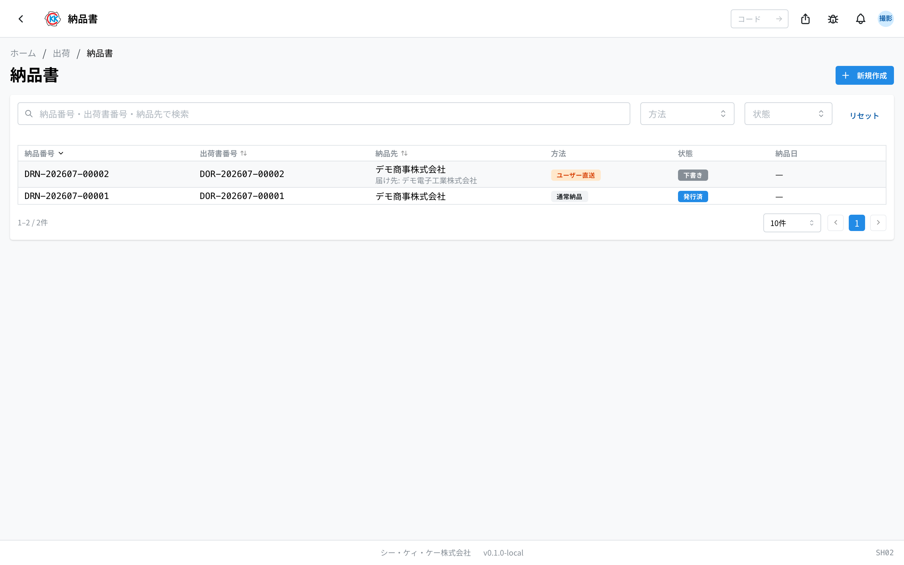
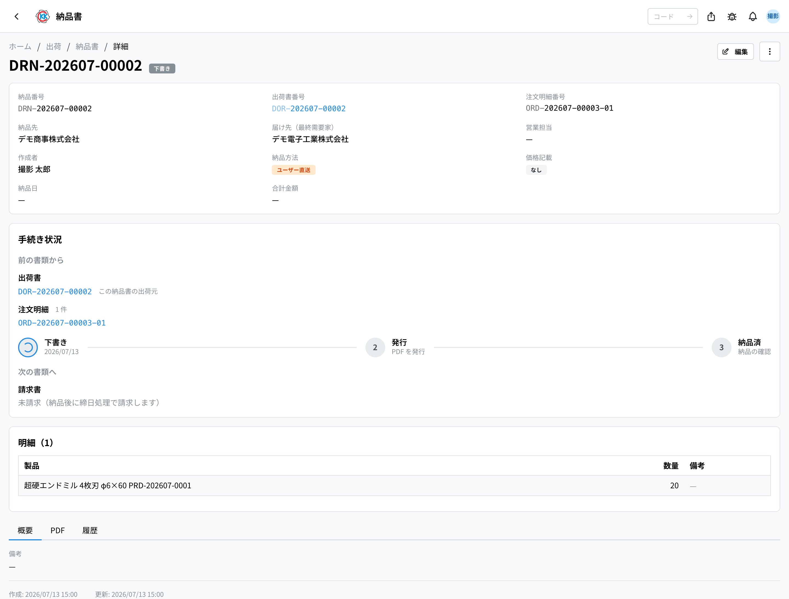
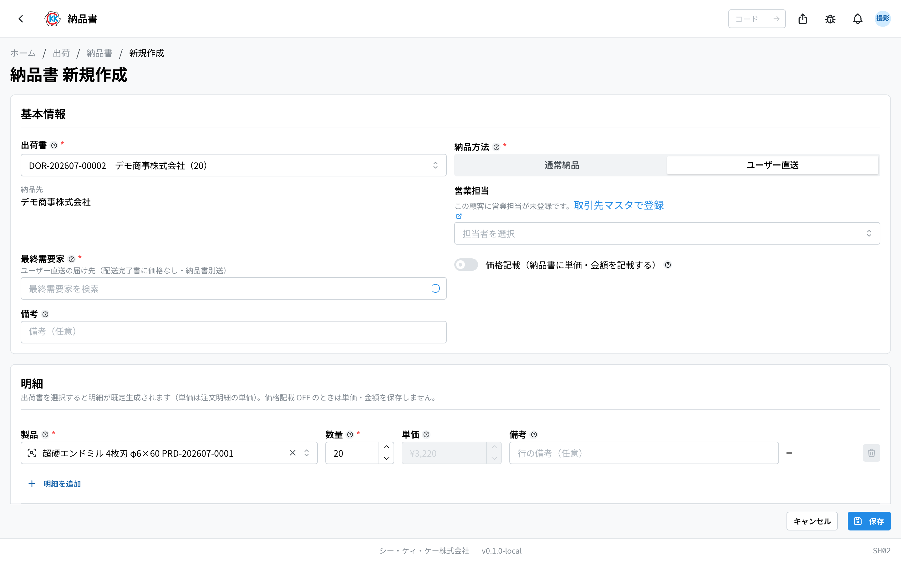
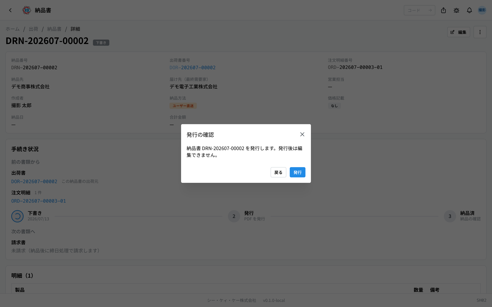
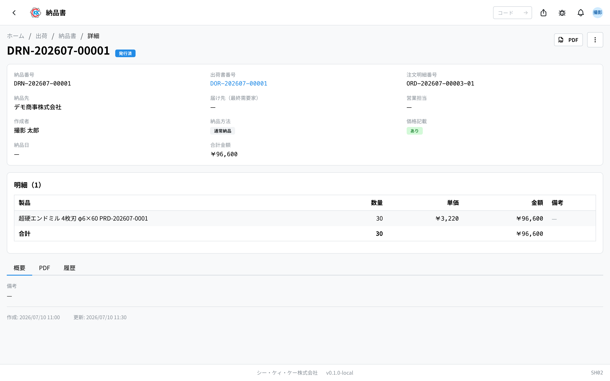

出荷した製品に添えてお届けする **納品書** を確認・編集するアプリです（作成は出荷書の確定で自動的に行われます）。操作コードは `SH02` です。

> ⚠️ このアプリはまだ準備中です。正式に使えるようになるまでに、画面や手順が変わることがあります。

> このアプリが属するフロー … [出荷の流れ](/manual/ja/process/shipping)

## このアプリでできること

- お届け先へ渡す納品書を見たり、下書きのあいだに内容を直したりできます。
- **納品書は自分で作りません** — [出荷書](/manual/ja/operations/shipping/delivery-order/user)を**確定**すると自動で作られます。ユーザー直送は、価格記載なし（最終需要家へ渡す分）と価格記載あり（お客様宛）の **2 通**が同時にできます。
- 金額を **載せる / 載せない** を、下書きのあいだなら切り替えられます。
- 納品書を **PDF** にして、印刷したり同梱したりできます。
- 「発行した」「届いた」といった今の状況を記録できます。

## 用語（このページで出てくる言葉）

- **出荷書** … 何をいくつ送るかを記録した書類です。納品書はこの出荷書が確定したときに自動で作られます。
- **納品先（のうひんさき）** … 納品書の宛先です。通常納品は注文をくださったお客様、ユーザー直送の価格記載なしの 1 通は最終需要家になります。
- **通常納品 / ユーザー直送** … 「通常納品」は注文をくださったお客様へお届けする形、「ユーザー直送」は製品を実際に使う会社へ直接お届けする形です。
- **最終需要家（さいしゅうじゅようか）** … 製品を実際に使う会社のことです。ユーザー直送のときの届け先になります。
- **価格記載（かかくきさい）** … 納品書に単価と金額を載せるかどうかの設定です。

## 画面の見かた

アプリを開くと、これまでに作った納品書の一覧が出ます。

- **納品番号** … `DRN-` で始まる番号です。システムが自動で付けます。
- **方法** … オレンジの「ユーザー直送」は使う会社へ直接お届けする分、灰色の「通常納品」はお客様へお届けする分です。
- **状態** … 灰色は「下書き」、青は「発行済」、緑は「納品済」です。
- 上の検索欄には、納品番号・出荷書番号・納品先や最終需要家の名前を入れて絞り込めます。
- 一覧に出るのは、**自分が所属している拠点から送る納品書** と、**自分が作った納品書** です。
- 行をクリックすると、その納品書の詳しい画面が開きます。

## 納品書ができるまで

納品書は**手で作りません**。[出荷書](/manual/ja/operations/shipping/delivery-order/user)を確定した瞬間に、その出荷書の明細から自動でできます。

- **通常納品** … 価格記載ありの納品書が **1 通**、お客様宛にできます。
- **ユーザー直送** … **2 通**が同時にできます。**価格記載なし**の 1 通は最終需要家（製品を実際に使う会社）宛、**価格記載あり**の 1 通はお客様宛です。**価格記載ありの納品書を最終需要家へ渡さないでください** — 開くとき・印刷するときに、この画面が警告を出します。

できたばかりの納品書は「**下書き**」です。内容を確認し、必要なら発行する前に直してください（下のセクション）。出荷書の画面の「**納品書**」タブからも開けます。

## 下書きのうちに内容を直す

下書きの納品書は「**編集**」から次を直せます — **納品方法・最終需要家・営業担当・価格記載・数量・単価・備考**。**出荷書と納品先（宛先）は直せません**（別の宛先へ送りたいときは、正しい出荷書・注文請書から作り直す必要があります — 管理者にご相談ください）。

金額を載せたくないときは「**価格記載（納品書に単価・金額を記載する）**」のスイッチを切ります。切ると単価の欄が入力できなくなり、保存すると **画面にも PDF にも金額は出ません**。

「最終需要家」が空のまま「ユーザー直送」で保存しようとすると、「**最終需要家を選択してください**」と出ます。

## 発行してお届けする

納品書は「下書き → 発行済 → 納品済」と 3 段階で進みます。操作は画面右上の「**…**」（点が 3 つのボタン）から行います。

### 1. 発行する

1. 納品書の画面で右上の「**…**」を押します。
2. 「**発行**」を選びます。
3. 「発行の確認」が出るので「**発行**」を押します。

発行すると状態が「**発行済**」に変わり、**編集ができなくなります**。

### 2. 届いたら

1. 右上の「**…**」を押します。
2. 「**納品済みにする**」を選びます。
3. 「納品の確認」が出るので「**納品済みにする**」を押します。

その日の日付が **納品日** として記録され、状態が「**納品済**」になります。

なお、この納品書の番号は、あとで作られる[請求書](/manual/ja/operations/billing/invoice/user)の明細に「由来」として表示されます。請求書からこの納品書をすぐ開けるようになります。

## 印刷する（PDF）

PDF を見られるのは **発行したあと** です。下書きのあいだは PDF はまだ作られておらず、「**PDF**」タブには「発行後に PDF を閲覧できます。」と表示されます。

- 発行後は「**PDF**」タブで、画面の中で PDF をそのまま確認できます。作り直したいときは「**再生成**」を押します。
- 画面右上の「**…**」（点が 3 つのボタン）から「**PDFをダウンロード**」を選ぶと、ファイルとして保存できます。印刷はここから行ってください。

> ⚠️ 納品書には削除の操作がありません。いちど作った納品書は消せないので、内容は **下書きのうちに** よく確認してください。

## 入力項目

納品書の画面で入力する項目の一覧です。アプリの入力欄の横にある「?」からも、その項目の説明へ直接来られます。

| 項目 | 必須 | 何を入れるか |
|------|------|-------------|
| [出荷書](#field-delivery-order) | 必須 | もとになる出荷書 |
| [納品方法](#field-delivery-method) | 必須 | 受注元へ納めるか、直送か |
| [納品先](#field-recipient) | 必須 | 納品書の宛先 |
| [最終需要家](#field-end-user) | 任意 | 直送のときの届け先 |
| [営業担当](#field-sales-rep) | 任意 | この納品書の営業担当 |
| [価格記載](#field-include-price) | — | 単価・金額を載せるかどうか |
| [備考](#field-notes) | 任意 | 納品書への補足 |
| [製品](#field-product) | 必須 | 納品する製品 |
| [数量](#field-quantity) | 必須 | 納品する本数 |
| [単価](#field-unit-price) | 任意 | 納品書に載せる単価 |

### 出荷書 [#field-delivery-order]

もとになった出荷書です。表示のみで、変更できません。この出荷書の明細（製品・数量）から納品書ができました。

### 納品方法 [#field-delivery-method]

- **通常** … 受注元へ納品します。納品書を荷物に同梱します
- **ユーザー直送** … 最終需要家へ直接送ります。**納品書は別送**し、価格は載せないのが通常です

出荷書に登録されている注文請書の配送方法から自動で決まります。下書きのうちなら直せます。

### 納品先 [#field-recipient]

納品書の宛先です。表示のみで、変更できません。通常納品はお客様、ユーザー直送の価格記載なしの 1 通は最終需要家になります。

### 最終需要家 [#field-end-user]

直送のときの実際の届け先です。大口のお客様のみ登録されています。出荷書の注文明細から自動で決まります（明細に指定があればそれを、なければ注文請書に登録された会社を使います）。下書きのうちなら選び直せます。

### 営業担当 [#field-sales-rep]

この納品書の営業担当です。出荷書の営業担当がひとりに決まるときはその人が、決まらないときは納品先の主担当が、はじめから入ります。必要なら選び直せます。

### 価格記載 [#field-include-price]

納品書に単価・金額を載せるかどうかです。**ユーザー直送では外すのが通常**です（最終需要家に取引価格を知らせないため）。

### 備考 [#field-notes]

納品書への補足です。**納品書の PDF に出ます** ので、お客様に見せたくない内容は書かないでください。

### 製品 [#field-product]

納品する製品です。出荷書から引き継がれます。

### 数量 [#field-quantity]

納品する本数です。出荷書の数量が初めから入っています。分けて納品するときは、実際に納める数へ直してください。

### 単価 [#field-unit-price]

納品書に載せる単価です。「価格記載」を外している場合は印字されません。

## よくある質問・困ったとき

**Q. 出荷書を確定したのに、納品書ができていません。**
A. 納品書ができるのは「発送」の出荷書だけです。「在庫保管」は請求フロー外なので納品書を作りません。それ以外でできない場合は管理者にご相談ください。

**Q. 納品先をほかの会社に変えたいのですが、選べません。**
A. 納品先は出荷書のもとになった注文明細のお客様から自動で決まるため、この画面では変えられません。届け先が違うときは、正しい注文請書・出荷書から作り直す必要があります。

**Q. 「…は出荷書に含まれていません」と出て保存できません。**
A. 出荷書に無い製品を明細に入れています。その行を消すか、出荷書に入っている製品に選び直してください。

**Q. 「…の数量 60 が出荷数量 50 を超えています」と出て保存できません。**
A. 実際に送った本数より多い数を書いています。数量を出荷書の本数以下に直してください。

**Q. 金額を「載せない」で保存したあと、やっぱり載せたくなりました。**
A. 「下書き」のあいだなら「編集」でスイッチを入れ直せます。ただし単価は保存されていないので、入れ直してください。発行したあとは直せないため、新しく作り直してください。

**Q. 発行してしまったあとで、内容の間違いに気づきました。**
A. 発行を取り消す操作はありません。正しい内容で新しく納品書を作り、間違えたほうはお客様へ渡さないでください。

<!-- permissions:start -->
## 必要な権限

この画面を使うには **納品書**（`delivery_note`）の権限が要ります。

| したいこと | 必要な権限 |
| --- | --- |
| 画面を開く・一覧や詳細を見る | 納品書 の 閲覧 |
| 追加・変更・削除する | 納品書 の 作成 / 更新 / 削除 |

見るだけなら「閲覧」で足ります。追加・変更・削除の操作がある画面では、その操作にあたる権限がそれぞれ必要です。

権限は役割（ロール）を通して付きます。足りないときは管理者に相談してください。

権限の全体像は「[権限とロール](../../../permissions)」を参照してください。
<!-- permissions:end -->
