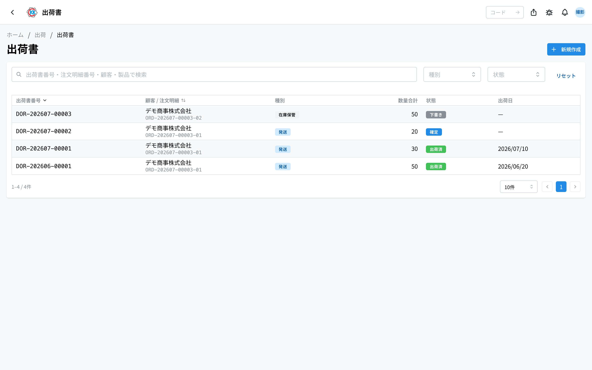
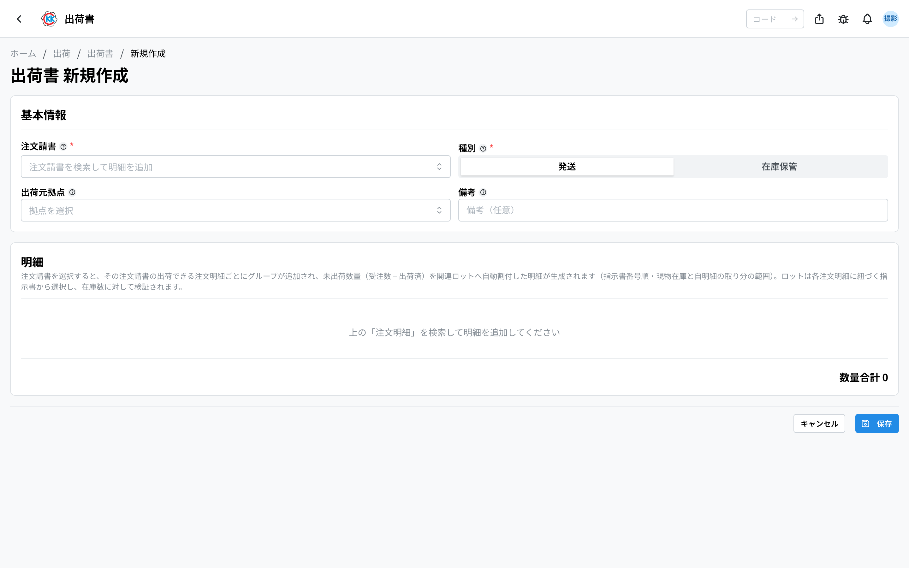
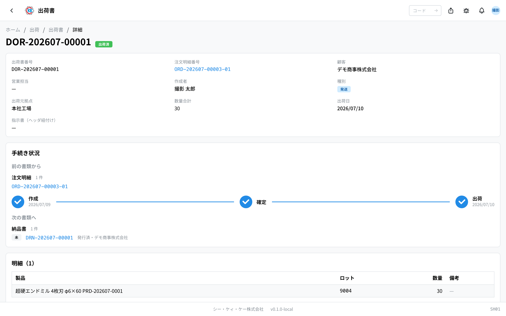
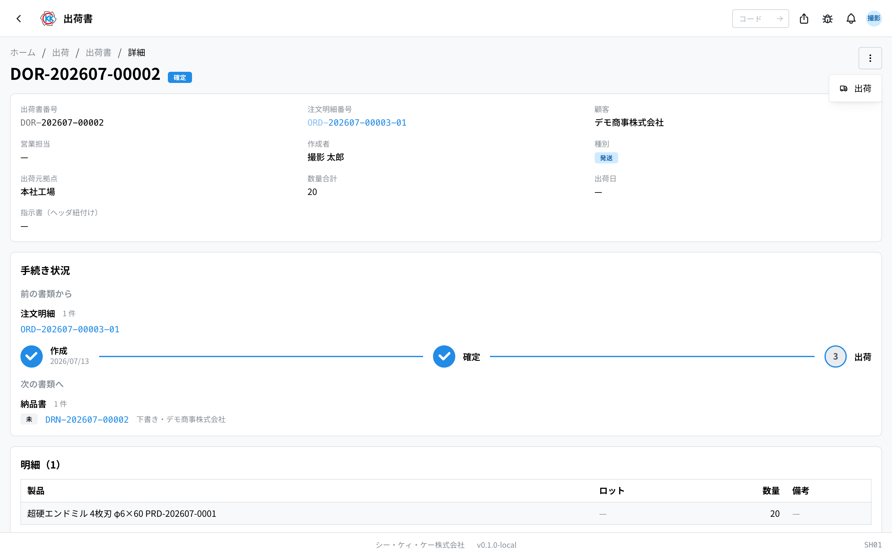
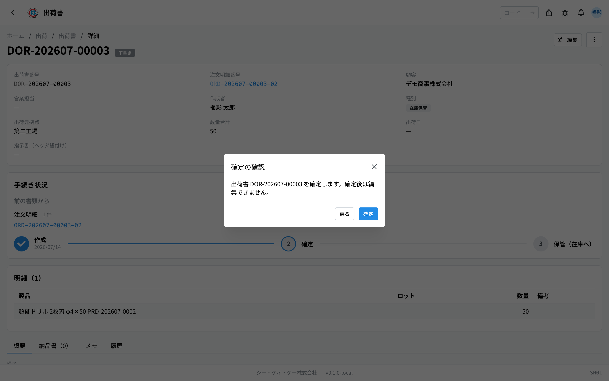

This app creates a **shipping order** (出荷書) — a document that records **what you sent and how many** when finished products go out to a customer. The operation code is `SH01`.

> ⚠️ This app is still being prepared. Screens and steps may change before it is fully released.

## What you can do with this app

- Make a shipping order that lists the products and the number of pieces you are sending.
- Just pick an order acceptance, and **the not-yet-shipped quantities are filled in for you** (no need to type them again).
- When you record a shipment, **the stock goes down automatically**.
- **Confirming** a shipping order **automatically creates** the [delivery note](/manual/en/operations/shipping/delivery-note/user) — you never make one by hand.
- Also record items you keep in-house instead of sending (for example, spare pieces you made).

The shipping order is an important document — it is the source used later when an [invoice](/manual/en/operations/billing/invoice/user) is made.

## Words used on this page

- **注文請書 (order acceptance)** … The document that records "which customer, which product, how many pieces, by when". You pick this when you make a shipping order.
- **注文明細 (order line)** … One order row inside the order acceptance. The shipping order lines are grouped by it.
- **指示書 (work order)** … The document that tells the factory "please make this many of this product". You ship the pieces from work orders that are finished.
- **Lot** … The number given to a batch of products made together. The work order number becomes the lot number.
- **発送 / 在庫保管 (Dispatch / Keep in stock)** … "発送" means the pieces you send to the customer. "在庫保管" means the pieces you keep in-house instead of sending.
- **明細 (line)** … One row inside the shipping order. It says "which product, how many pieces".

## Before you start

- The **注文請書 (order acceptance)** for what you want to ship must already be confirmed (expanded into order lines).
- Check that the products are finished (the [work order](/manual/en/operations/production/work-order/user) is complete). Finished work orders are what gets filled into the lines for you.
- You need shipping permission to make a shipping order or to ship. If you cannot use it, please ask your administrator.

## How to read the screen

When you open the app, you see a list of the shipping orders made so far.

- **出荷書番号 (Shipping order number)** … A number that starts with `DOR-`. The system adds it for you.
- **種別 (Type)** … A blue 「発送」 (Dispatch) means pieces sent to the customer. A grey 「在庫保管」 (Keep in stock) means pieces kept in-house.
- **状態 (Status)** … Grey is 「下書き」 (Draft), blue is 「確定」 (Confirmed), green is 「出荷済」 (Shipped).
- In the search box at the top you can type a shipping order number, a order line number, or a customer name to narrow the list. This box is for **finding shipping orders you have already made**; it is a different box from the one for picking a order line when you make a new shipping order.
- The list shows **shipping orders sent from the site you belong to**.
- Click a row to open the detail screen for that shipping order.

## Making a shipping order

1. Press 「**新規作成**」 (New) at the top right of the list screen.
2. Click the 「**注文請書**」 (Order acceptance) box and pick the order acceptance you want to ship. Inside this box you search by the **customer name, product name, or the customer's order number**.
3. For every shippable order line of that acceptance, **the not-yet-shipped quantity is filled in for you**. The source of the quantity is the **finished output of the connected work orders** (the pieces made for that line), allocated to the lots in number order within the physical stock — never more than what is still needed.
4. In 「**種別**」 (Type), choose 「**発送**」 (Dispatch) or 「**在庫保管**」 (Keep in stock). Normally you leave it as 「発送」.
5. In 「**出荷元拠点**」 (Shipping site), choose where you are sending from.
6. Change the 「**数量**」 (Quantity) on each line to the number of pieces you are really sending. **You cannot enter more than the order remainder (ordered − shipped)** — a red warning appears and saving is blocked.
7. To add a row, press 「**行を追加**」 (Add row). To remove a row, press the trash-can mark at the right of the row.
8. Press 「**保存**」 (Save). If the shipment falls short of the order remainder, or the finished pieces do not cover it, a **「一部出荷の確認」 (partial shipment confirmation)** dialog appears — check it and press 「**一部出荷として保存**」 (save as partial shipment) to save (the rest can go on a later shipping order).

After you save, it is registered as a 「**下書き**」 (Draft) and the detail screen opens.

> 💡 When you pick an order acceptance, each order line group shows its contents (number, customer, product, ship-to, whether it is direct to the end user, **ordered pieces, shipped pieces, finished pieces**). "Finished" is the share of the connected work orders' output allocated to this line. Please check that it is correct before going on.

> ⚠️ The order line cannot be changed after you save. If you picked the wrong one, cancel that shipping order and make a new one.

## Checking the contents

At the top you see the shipping order number, order line number, customer, product, type, shipping site, quantity, and shipping date.

- **数量合計 (Total quantity)** … Shown as "30 / 受注 50", so you can see the pieces being sent next to the pieces that were ordered.
- The 「明細」 (Lines) area below shows the product, lot, quantity, and notes.
- There are four tabs. **概要** (Overview) shows the notes, **納品書** (Delivery notes) shows the delivery notes made from this shipping order, **メモ** (Memo) is a shared internal memo, and **履歴** (History) shows a record of who changed what and when.

## The three stages before shipping

A shipping order moves through three stages: 「下書き」 (Draft) → 「確定」 (Confirmed) → 「出荷済」 (Shipped). You do this from the 「**…**」 button (the three dots) at the top right of the screen.

### 1. Fixing the contents (Confirm)

1. On the shipping order screen, press 「**…**」 at the top right.
2. Choose 「**確定**」 (Confirm).
3. A small window called 「確定の確認」 (Confirm check) appears. Read it and press 「**確定**」 (Confirm).

Once confirmed, **you can no longer edit it**. A dispatch shipping order **automatically gets its delivery note(s)** at confirmation — direct-to-end-user creates **two**: one without prices (for the end user) and one with prices (for the customer). Stock-storage shipping orders don't get one.

### 2. When you have really sent it (Ship)

1. Press 「**…**」 at the top right.
2. Choose 「**出荷**」 (Ship).
3. 「出荷の確認」 (Ship check) appears. Press 「**出荷する**」 (Ship).

When you ship, today's date is recorded as the **出荷日 (shipping date)** and the status becomes 「**出荷済**」 (Shipped). At the same time, the [product stock](/manual/en/operations/production/product-inventory/user) goes down by the pieces you sent, and the order line changes by itself to "一部出荷" (Partly shipped) or "出荷済" (Shipped).

### If you made a mistake (Cancel)

Only while it is a 「下書き」 (Draft) can you remove it, using 「**キャンセル**」 (Cancel) in the 「**…**」 menu at the top right. After it is confirmed, it cannot be removed.

## Keeping pieces in-house instead of sending (Keep in stock)

When you keep pieces in-house instead of sending them to the customer — for example spare pieces you made — choose 「**在庫保管**」 (Keep in stock) in 「**種別**」 (Type).

- When you ship with 「在庫保管」, the products are **added** to the stock at the storing site.
- They are not billed. The status of the order line does not change either.

When you choose 「在庫保管」 in Type, an explanation appears on the screen.

## How the delivery note is made

You never make a delivery note by hand. A dispatch shipping order gets one **automatically as soon as it is confirmed**.

- Normal delivery: **one** priced delivery note.
- Direct to end user: **two** — one without prices (to the end user) and one with prices (to the customer). **Be careful never to hand the priced one to the end user** (the [delivery note](/manual/en/operations/shipping/delivery-note/user) screen warns you before you open or print it).
- Stock-storage shipping orders don't get a delivery note.

The 「**納品書**」 (Delivery notes) tab on the shipping order screen lists the delivery notes made from this shipping order (delivery number, delivery destination, method, status, delivery date).

## Input fields

Every field on the shipping order screen. The **?** next to a field in the app links straight to its description here.

| Field | Required | What to enter |
|-------|----------|---------------|
| [Order acceptance](#field-order-line) | Required | Which order this shipment is for |
| [Type](#field-type) | Required | Dispatch, or stock storage |
| [Shipping plant](#field-plant) | Required | Which plant it leaves from |
| [Notes](#field-notes) | Optional | Notes for the whole shipping order |
| [Product](#field-product) | Required | The product going out |
| [Lot (stock)](#field-lot) | Required | Which production run it comes from |
| [Quantity](#field-quantity) | Required | How many pieces go out |

### Order acceptance [#field-order-line]

Which order this shipment is for, picked as an order acceptance. Choosing it fills in the shippable lines of that acceptance for you. The quantities come from the **finished output of the connected work orders**, within the physical stock and the order remainder.

Multiple order acceptances can be combined into one delivery order only when they share **the same customer, the same ship-to and the same delivery method (normal / direct to user)**. Trying to add one that differs shows the reason on the spot.

### Type [#field-type]

The kind of shipment. **Only dispatch goes on to a delivery note and billing.**

- **Dispatch** — going to the customer; continues to the delivery note and billing
- **Stock storage** — spare production kept in-house; **does not continue to billing**

### Shipping plant [#field-plant]

Which plant it leaves from. This field records, on the documents and in the records, where the shipment went out from — so choose the plant the goods physically leave. When the type is 「在庫保管」 (Keep in stock), **the pieces are kept as this plant's stock**. Note that the stock that falls on a 「発送」 (Dispatch) is not the plant's but that of the lot chosen on each line.

### Notes [#field-notes]

Notes about the shipping order as a whole. Notes about one line go in that line's own notes.

### Product [#field-product]

The product going out. Picking an order acceptance fills it in from that order's products. You can also click the field and search all products to choose a different one.

### Lot (stock) [#field-lot]

Which production run (lot) it comes from. **The lot number is the same as the work order number**, which is how you can trace later which production run went to which customer. You can choose from the lots of the completed work orders made for that order line that still have stock left.

### Quantity [#field-quantity]

How many pieces go out. It cannot exceed the lot's stock, nor the **order remainder (ordered − shipped)**. Saving with less than the order remainder brings up the partial-shipment confirmation. To ship in parts, create separate shipping orders.

## Questions and problems

**Q. In the 「注文請書」 (Order acceptance) box on the new shipping order screen, I search but the order acceptance I want to ship does not appear.**
A. In this box, type the **customer name, product name, or the customer's order number**. If it still does not appear, that order acceptance may not be deployed (confirmed) yet, or its lines may all be 「出荷済」 (Shipped) or cancelled.

**Q. I picked an order acceptance, but hardly any quantities were filled in.**
A. Quantities are filled from the connected work orders' finished output (within physical stock), so a line with no completed work order yet gets a single row with only the quantity (you can tell by 「完成 0」 in the group header). Either make the shipping order again after the products are finished, or pick the lot yourself. Lines already shipped up to the ordered quantity are skipped.

**Q. I get 「受注数を超えています」 (exceeds the ordered quantity) and cannot save.**
A. You are trying to send more pieces than were ordered on the same order line (the group header shows a red 「受注残 N を超えています」). Lower the quantity on this shipping order, or check what has already been shipped.

**Q. I get 「在庫が不足」 (Not enough stock) and cannot ship.**
A. The lot you chose does not have enough stock left for the pieces you want to send. Check the numbers in [product stock](/manual/en/operations/production/product-inventory/user) and try again.

**Q. I made a mistake and want to fix it, but 「編集」 (Edit) does not appear.**
A. You can only edit while it is a 「下書き」 (Draft). After it is confirmed it cannot be fixed, so leave that shipping order as it is and make a new one with the correct contents.

**Q. I shipped, but the order line does not become 「出荷済」 (Shipped).**
A. Check whether the type is 「在庫保管」 (Keep in stock). That type is a record of pieces kept in-house, so the order line status does not change. Also, if you sent only part of the ordered pieces, it becomes 「一部出荷」 (Partly shipped).

<!-- permissions:start -->
## Permissions required

Using this screen requires the **Delivery order** (`delivery_order`) permission.

| What you want to do | Permission needed |
| --- | --- |
| Open the screen, view lists and details | Delivery order — View |
| Add, change or delete | Delivery order — Create / Edit / Delete |

Viewing only needs *View*. Where a screen offers adding, changing or deleting, each of those needs its matching permission.

Permissions come through roles. If something is missing, ask an administrator.

For the whole picture see [Permissions and roles](../../../permissions).
<!-- permissions:end -->
