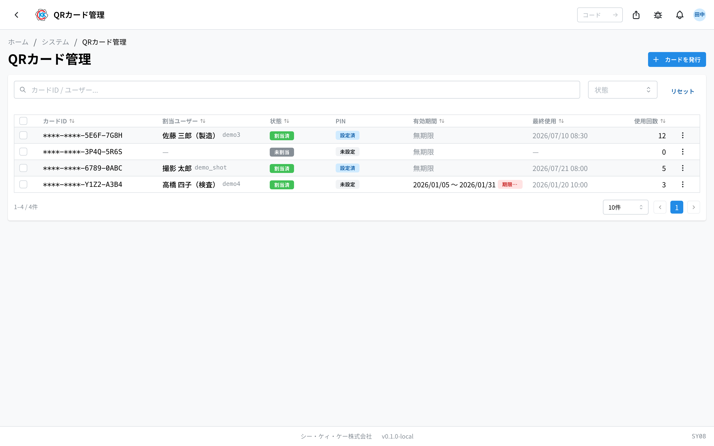
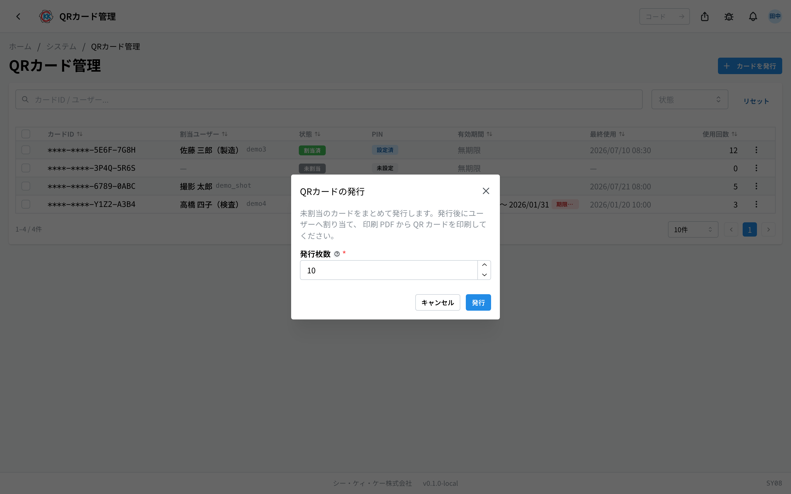
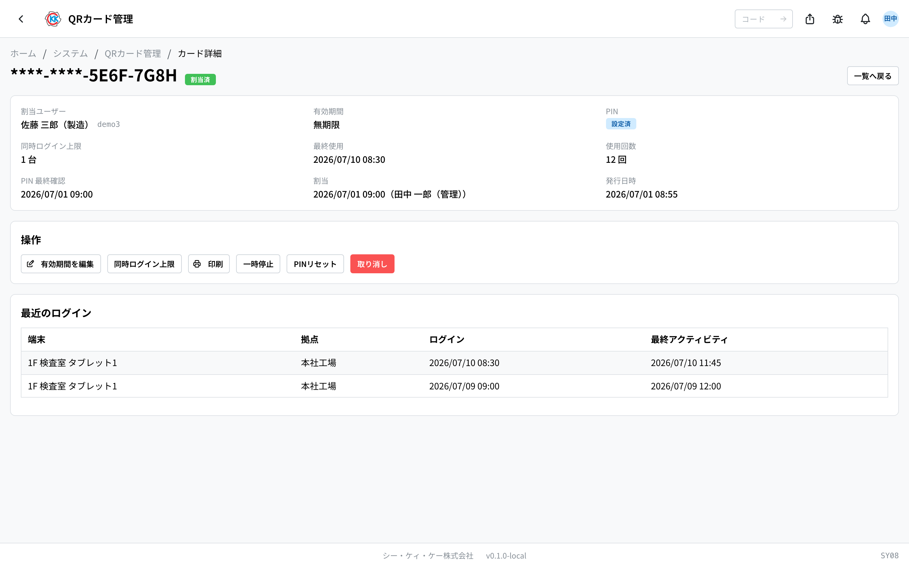

这是一个用来发行 **QR 卡片** 并交给员工的应用。员工用这张卡登录放在工厂里的 **共享平板**。操作代码是 `SY08`。

员工把卡片贴近平板，再输入自己设定的密码即可登录。

## 本应用能做什么

- 可以成批发行 QR 卡片（一次 1〜100 张）。
- 可以把发行好的卡片逐个分配给员工。
- 可以 **打印** 卡片。一张 A4 纸上排列 10 张名片大小的卡片。
- 可以让丢失的卡片 **无法再使用**。
- 可以把忘记密码的人的设定 **清除，让本人重新设定**。
- 也可以制作限定期间的临时卡片（支援人员、实习人员等）。

## 术语（本页出现的词）

- **QR 卡片** … 印有 QR 码的卡片，贴近平板即可登录。
- **PIN（密码）** … 只有本人知道的密码。即使卡片被别人捡到，也不会被随意使用。
- **kiosk 终端** … 指放在工厂里的共享平板。
- **临时卡片** … 指限定了可用期间的卡片。在期间之外无法登录。

## 开始之前

- 使用本应用需要 **kiosk 管理权限**。如果打不开，请咨询系统管理员。
- 只能把卡片发给 **已在本系统登记且处于可用状态的人**。尚未登记的人无法分配。
- 平板一侧也需要准备（在[终端管理](/manual/zh/operations/system/kiosk-device/user)中登记）。

## 如何打开

在主页的「システム」（系统）中点击 **QRカード管理**（QR卡管理）。或者在画面上方的搜索框中输入 `SY08`。

## 画面的看法

打开应用后，会列出已发行的卡片。

- **カードID**（卡片ID）… 用来区分卡片的编号。出于安全考虑，**只显示后 8 位**。
- **割当ユーザー**（分配用户）… 表示这张卡发给了谁。尚未发出的卡片显示「—」。
- **状態**（状态）… 当前情况。共有 4 种：**未割当**（未分配，还没发给任何人）/ **割当済**（已分配，可以使用）/ **一時停止**（暂停，已停用）/ **取り消し**（作废，已无法使用）。
- **PIN** … 本人已设定密码时显示「**設定済**」（已设定），尚未设定时显示「**未設定**」（未设定）。因连续输错而停用时，会以红色显示「**ロック中**」（锁定中）。
- **有効期間**（有效期间）… 没有期限的卡片显示「**無期限**」（无期限）。设定了期间的卡片会显示日期，过期后标记「**期限切れ**」（已过期），尚未开始则标记「**開始前**」（未开始）。
- **最終使用**（最后使用）… 最后一次用于登录的日期和时间。
- **使用回数**（使用次数）… 至今为止登录的次数。

可以用上方的搜索框「**カードID / ユーザー...**」（卡片ID / 用户...）查找。用「**状態**」（状态）筛选，用「**リセット**」（重置）清除筛选条件。点击某一行，就会打开该卡片的详细画面。

## 发行卡片

首先，成批制作还不属于任何人的「空白卡片」。

1. 点击画面右上方的「**カードを発行**」（发行卡片）。
2. 在「**発行枚数**」（发行张数）中输入需要的张数（1〜100 张）。
3. 点击「**発行**」（发行）。

出现「**発行しました**」（已发行）即表示完成。新制作的卡片都会以「**未割当**」（未分配）的状态排列在列表中。

## 把卡片分配给人

1. 在列表中找到「未割当」（未分配）的卡片。
2. 点击该行右端的「**…**」（三个点的按钮）。
3. 选择「**ユーザーに割当**」（分配给用户）。
4. 在「**割当先ユーザー**」（分配对象用户）中选择要发给的人。
5. 点击「**割当**」（分配）。

状态会变为「**割当済**」（已分配）。

> ⚠️ **一个人只能持有 1 张卡片**。无法分配给已经持有卡片的人。更换卡片时，请先把旧卡片设为「取り消し」（作废）。

### 想要限定期间的卡片时

支援人员、实习人员等只在一定期间内使用时，请从卡片的详细画面进行分配。

1. 在列表中点击「未割当」（未分配）卡片所在的行，打开详细画面。
2. 点击「**ユーザーに割当**」（分配给用户）。
3. 选择「**割当先ユーザー**」（分配对象用户）。
4. 输入「**有効開始日**」（有效开始日）和「**有効終了日**」（有效结束日）。留空时，开始日为立即生效，结束日为无期限。
5. 点击「**割当**」（分配）。

结束日 **当天全天** 都可以使用。在期间之外无法登录。

## 打印卡片并交给本人

1. 在列表中，为想打印的卡片左侧的勾选框打勾。可以选择任意张数。
2. 点击画面下方出现的「**選択したカードを印刷**」（打印所选卡片）。
3. 打印页会在另一个标签页中打开。点击右上角的「**印刷**」（打印）。
4. 用 A4 **名片专用纸（10 面）** 打印。也可以用普通 A4 纸打印后自行裁切。

一张纸上会排列 **10 张**（横 2 列 × 纵 5 行）与名片同样大小（91×55mm）的卡片。沿着四角的小十字标记裁切，成品会很整齐。

卡片 **必定按原尺寸（91×55mm）打印**。在打印画面中只需确认 **纸张尺寸为 A4** 即可。纸张上方印有一条浅色的 50mm 刻度，不放心时可以用尺子比一下第一张（正好 50mm 即为原尺寸）。

> 💡 需要用邮件发送或稍后打印时，可以在同一画面点击「**PDFで保存**」（保存为 PDF）。但请注意，**从 PDF 打印时，可能会因 PDF 查看器的设置而略微变小**。用名片专用纸打印时，请直接在此打印页点击「印刷」（打印）。

只想打印 1 张时，请从该行的「**…**」中选择「**印刷**」（打印）。

> 💡 列表中显示的卡片 ID **只显示后 8 位**（前半部分会用「*」隐藏）。打印出的 QR 码中包含全部信息，请妥善保管打印好的卡片。

## 交给员工之后

把打印好的卡片交给本人。之后的手续由本人在平板上完成。

1. 把 QR 码贴近平板。
2. 第一次使用时，当场 **设定自己的密码（PIN）**。
3. 之后，只要贴近卡片并输入密码就可以登录。

密码只有本人知道。**管理员既无法查看密码，也无法代为设定。**

## 帮助遇到问题的人

从卡片所在行的「**…**」中，可以进行以下操作。

- 「**PINロック解除**」（解除PIN锁定）… 用于连续输错密码而被停用的人。点击后立即可以使用。密码保持不变。
- 「**PINリセット**」（重置PIN）… 用于忘记密码的人。当前密码会被清除，本人在下次登录时重新设定。
- 「**一時停止**」（暂停）… 临时停止该卡片的登录。可用「**再開**」（恢复）还原。
- 「**再開**」（恢复）… 让暂停中的卡片重新可以使用。
- 「**取り消し**」（作废）… 让卡片彻底无法使用。

> ⚠️ 「**取り消し**」（作废）**无法撤销**。点击的那一刻，正用该卡片登录中的平板也会当场退出登录。请在卡片丢失、员工离职等情况下使用。

## 卡片的详细画面

点击列表中的行，会打开该张卡片的画面。

上方会显示分配用户、有效期间、PIN、最后使用、使用次数等。「**操作**」（操作）栏中有以下按钮。

- 「**有効期間を編集**」（编辑有效期间）… 可以延长、缩短可用期间，或改回无期限。
- 「**同時ログイン上限**」（同时登录上限）… 决定 1 张卡片可以同时登录几台平板（1〜10 台）。超过上限时，会从最早的终端开始自动退出登录。
- 此外，「印刷」（打印）、「一時停止」（暂停）、「再開」（恢复）、「PINロック解除」（解除PIN锁定）、「PINリセット」（重置PIN）、「取り消し」（作废）也可以在这里操作。

最下方的「**最近のログイン**」（最近的登录）可以确认该卡片在哪台平板上、于何时被使用过。

## 输入项

| 项目 | 必填 | 填什么 |
|------|------|--------|
| [发行张数](#field-count) | 必填 | 一次制作的卡片张数 |
| [分配用户](#field-user) | 必填 | 使用该卡的人 |

### 发行张数 [#field-count]

一次制作的卡片张数。刚制作的卡片**尚不属于任何人**，可先印制，发放时再分配给人。

### 分配用户 [#field-user]

使用该卡的人。分配后，此人即可将卡片贴近现场平板登录。

密码（PIN）不在本画面输入，由本人首次登录时设定。若遗忘，请从卡片详情中**重置**。

遗失的卡片应予以**失效**。失效的卡片贴近平板也无法通过，请重新发行新卡并分配。

## 常见问题・遇到困难时

**Q. 员工把卡片弄丢了。**
A. 请把该卡片设为「**取り消し**」（作废）。然后发行新卡片并分配、打印后交给本人。

**Q. 有人说忘记了密码。**
A. 请点击该卡片的「**PINリセット**」（重置PIN）。本人下次在平板上登录时会设定新的密码。

**Q. PIN 栏中以红色显示「ロック中」（锁定中）。**
A. 密码 **连续输错 5 次** 后，该卡片会有 **15 分钟** 无法使用。经过 15 分钟会自动恢复；如果着急，请点击「**PINロック解除**」（解除PIN锁定）。

**Q. 出现「このユーザーには既に割当済のカードがあります。先に既存カードを取り消してください」（该用户已有已分配的卡片。请先作废现有卡片）。**
A. 该人员已经持有另一张卡片。因为每人最多 1 张，请先把旧卡片设为「**取り消し**」（作废），再分配新卡片。

**Q. 卡片显示「期限切れ」（已过期），员工无法登录。**
A. 该卡片的有效期间已经结束。请在详细画面的「**有効期間を編集**」（编辑有效期间）中延长结束日，或更换为新卡片。

**Q. 分配对象的用户没有出现在选项中。**
A. 该人员可能尚未在系统中登记，或当前处于不可用状态。请在[用户管理](/manual/zh/operations/system/user-management/user)中确认状态。

**Q. 我想把卡片改分配给别人。**
A. 无法变更分配对象。请把当前卡片设为「**取り消し**」（作废），再给该人员分配新的卡片。
