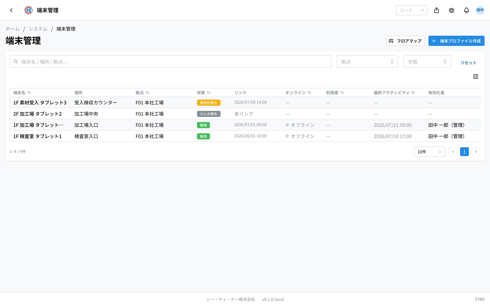
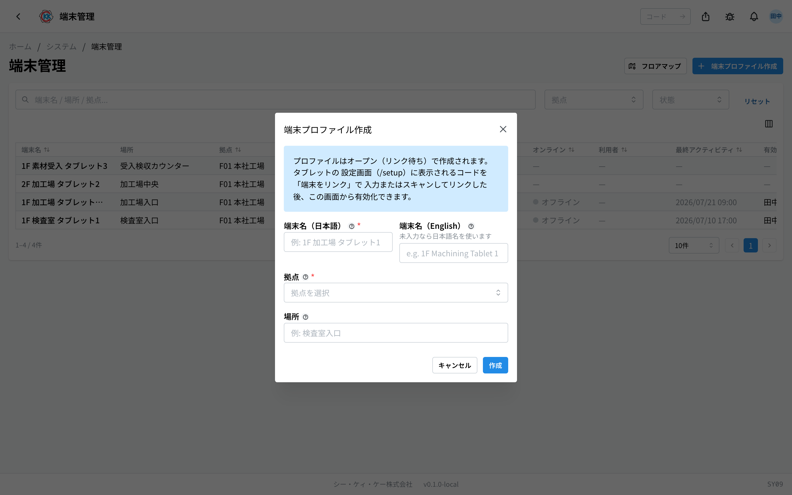
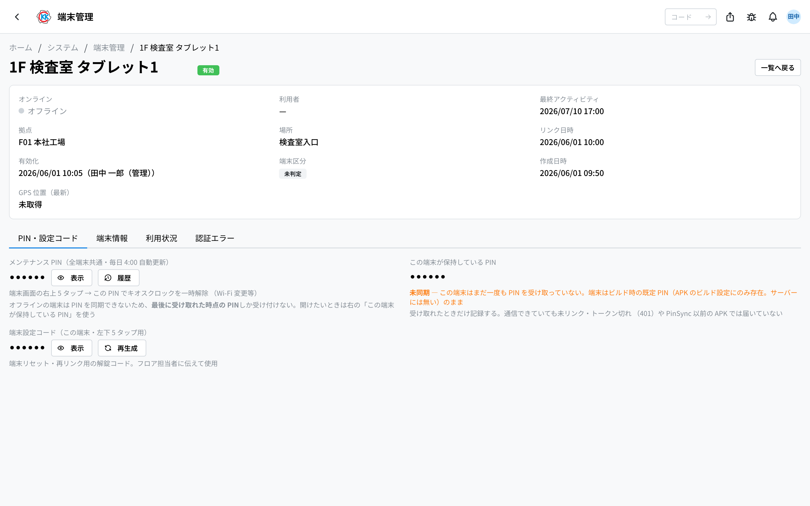
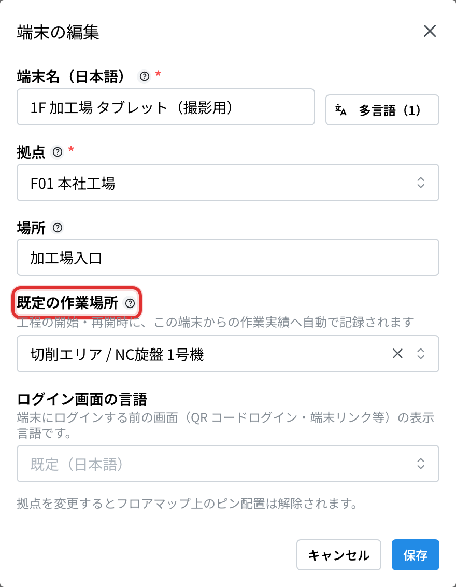
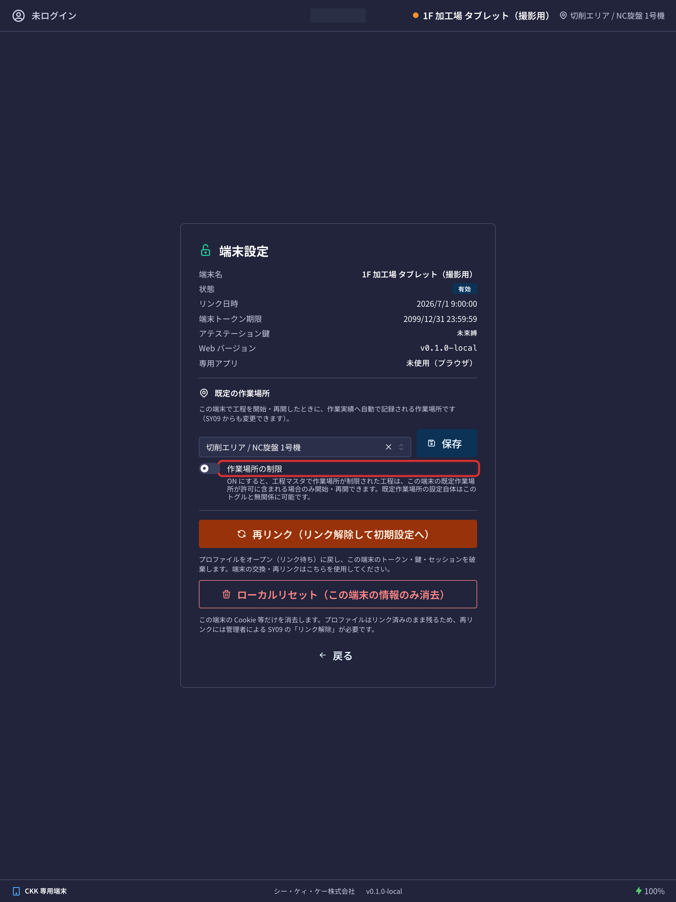

工場に置く **共有のタブレット** を登録して、使えるようにするアプリです。操作コードは `SY09` です。

いまどのタブレットが動いているか、誰が使っているかも、この画面で確認できます。

## このアプリでできること

- 新しいタブレットを登録して、使える状態にできます。
- タブレットの名前・拠点・置き場所を変えられます。
- いまオンラインになっているタブレットと、使っている人を確認できます。
- タブレットの故障・交換に対応できます。
- **フロアマップ**（拠点の見取り図）の上に、タブレットの位置を置けます。
- どのタブレットを誰がいつ使ったかの履歴を見られます。

## 用語（このページで出てくる言葉）

- **共有端末** … 工場に置いてある共有のタブレットのことです。この画面では「端末」と呼びます。
- **端末プロファイル** … 「1 階の検査室に置くタブレット」といった、**置き場所ぶんの登録枠** のことです。先にこの枠を作り、あとから本物のタブレットを結び付けます。
- **リンク** … 登録枠と、本物のタブレットを結び付ける作業のことです。
- **リンクコード** … タブレットの画面に出る 12 文字の合い言葉です。これを使ってリンクします。
- **拠点（きょてん）** … 工場や事業所のことです。

## はじめる前に

- このアプリを使うには **共有端末管理の権限** が必要です。開けない場合は、システム管理者にご相談ください。
- タブレット本体の準備（専用アプリを入れる、ネットワークにつなぐ）は、この画面ではできません。社内の手順書をご覧ください。
- 社員がログインするには、[QRカード管理](/manual/ja/operations/system/kiosk-card/user)でカードを発行しておく必要があります。

## 開き方

ホーム画面の「システム」の中にある **端末管理** を押します。または、画面上の検索欄に `SY09` と入れます。

## 画面の見かた

アプリを開くと、登録されているタブレットが一覧で並びます。

- **端末名** … タブレットに付けた名前です。
- **場所** … 置いてある場所のメモです。
- **拠点** … どの拠点のタブレットかです。
- **状態** … いまの状況です。次の 5 つがあります。
  - **リンク待ち** … 登録枠を作っただけで、まだ本物のタブレットと結び付いていません。
  - **有効化待ち** … タブレットと結び付きました。あとは有効にするだけです。
  - **有効** … 使える状態です。
  - **無効** … 一時的に止めています。元に戻せます。
  - **取り消し** … 完全に使えなくしました。元に戻せません。
- **リンク** … タブレットと結び付いた日時です。まだのときは「**未リンク**」と出ます。
- **オンライン** … いまつながっていれば緑の丸で「**オンライン**」、つながっていなければ灰色の丸で「**オフライン**」と出ます。
- **利用者** … いまそのタブレットにログインしている人です。
- **最終アクティビティ** … 最後に操作された日時です。
- **有効化者** … そのタブレットを使える状態にした人です。

上の検索欄「**端末名 / 場所 / 拠点...**」で探せます。「**拠点**」「**状態**」で絞り込み、「**リセット**」で条件を消せます。行をクリックすると、そのタブレットの詳しい画面が開きます。

## タブレットを登録する

登録は 3 段階です。**先に枠を作り、タブレットと結び付け、最後に使える状態にします。**

### 手順 1 — 登録枠を作る

1. 画面右上の「**端末プロファイル作成**」を押します。
2. 「**端末名**」に分かりやすい名前を入れます（例: 1F 加工 タブレット1）。
3. 「**拠点**」を選びます。
4. 「**場所**」に置き場所のメモを入れます（任意です。例: 検査室入口）。
5. 「**作成**」を押します。

状態が「**リンク待ち**」の行ができます。

### 手順 2 — タブレットと結び付ける

1. タブレット側の設定画面に、**12 文字のコード** と QR コードが表示されます。
2. 一覧で、その枠の行の「**…**」（点が 3 つのボタン）を押します。
3. 「**端末をリンク**」を選びます。
4. 「**リンクコード**」に、タブレットに出ている 12 文字を入れます。
5. または「**タブレットのQRをスキャン**」を押して、タブレットの QR コードをカメラで読み取ります。
6. 「**リンク**」を押します。

状態が「**有効化待ち**」に変わります。

> ⚠️ コードは **10 分間だけ** 有効です。時間が過ぎた場合は、タブレット側でもう一度表示させてください。

### 手順 3 — 使える状態にする

1. その行の「**…**」から「**有効化**」を選びます。
2. 確認の画面が出るので、内容を読んで「**有効化**」を押します。

状態が「**有効**」に変わり、**タブレット側の画面が自動でログイン画面に切り替わります**。これで社員が使えるようになります。

## 名前や置き場所を変える

1. その行の「**…**」から「**編集**」を選びます。
2. 「**端末名**」「**拠点**」「**場所**」を直します。
3. 「**保存**」を押します。

> ⚠️ **拠点を変えると、フロアマップに置いてあったピンが外れます。** 見取り図は拠点ごとに分かれているためです。拠点を変えたあとは、新しい拠点のフロアマップに置き直してください。

## タブレットを交換する・止める

行の「**…**」から、状況に応じて次の操作ができます。

- 「**無効化**」… 一時的に使えなくします。「**再有効化**」で元に戻せます。修理に出すあいだなどに使います。
- 「**再有効化**」… 止めていたタブレットを、また使えるようにします。
- 「**リンク解除**」… タブレットと登録枠の結び付きを外し、「リンク待ち」に戻します。名前・拠点・場所・フロアマップのピンはそのまま残ります。**タブレットを新しい機械に取り替えるときに使います。** 新しいタブレットを同じ枠に結び付け直せます。
- 「**鍵リセット**」… タブレットを初期化したり交換したりしたときに使います。押すと、次にそのタブレットのアプリがつながったときに、あらためて登録し直されます。
- 「**削除**」… まだ結び付けていない（リンク待ちの）登録枠だけ消せます。
- 「**取り消し**」… タブレットを完全に使えなくします。

> ⚠️ 「**取り消し**」は **元に戻せません**。開いているログインもその場で切れます。もう一度使うには、新しい登録枠から作り直しになります。

## タブレットの詳しい画面

一覧の行をクリックすると、そのタブレット 1 台の画面が開きます。

上のほうに、オンライン状態・利用者・拠点・場所・リンク日時などが並びます。

- 「**アテステーション鍵**」… そのタブレットが本物であることを確かめるための、端末ごとの合い言葉のようなものです。まだ決まっていないときは「**未束縛**」と出ます。
- 「**GPS 位置（最新）**」… タブレットから届いたいちばん新しい位置です。届いていないときは「**未取得**」と出ます。

### PIN・設定コード

タブレットを現場で操作するための番号が 2 つあります。どちらも普段は「••••••」と隠れていて、「**表示**」を押すと見られます（60 秒たつと、また隠れます）。

- 「**メンテナンス PIN（全端末共通・毎日 4:00 自動更新）**」… タブレットの画面ロックを一時的に外して自由に使えるようにするための番号です。Wi-Fi の設定を変えるときなどに使います。端末画面の**右上**を 5 回続けてタップすると入力欄が出ます。
- 「**端末設定コード（この端末・左下 5 タップ用）**」… そのタブレット 1 台だけの番号です。端末画面の**左下**を 5 回続けてタップすると端末設定の画面が開き、この番号で解錠します。端末をリセットしたり結び付け直したりするときに使います。「**再生成**」を押すと新しい番号になり、**前の番号は使えなくなります**。

> ⚠️ 「**表示**」を押した操作は記録に残ります。番号は現場の担当者だけに伝え、掲示などはしないでください。

#### 通信が切れているタブレットのメンテナンス PIN

メンテナンス PIN は毎日 4:00 に変わりますが、**タブレットは自分が最後に通信できたときの番号を持ったまま**です。Wi-Fi が切れているタブレットは新しい番号を受け取れないので、今この画面に出ている番号を入れても開きません。

そのときは「**この端末が保持している PIN**」の「**表示**」を押してください。そのタブレットに**最後に渡した番号**が出ます。推測ではなく渡した記録なので、これがそのまま使えます。

その下に「**最終同期**」の時刻が出ます。ここが「**未同期**」になっているタブレットは、まだ一度も番号を受け取れていません。この場合サーバー側に番号はなく、アプリを作ったときに埋め込んだ番号のままなので、アプリのビルド設定を確認してください。「未同期」になる理由は、たとえば次のようなものです。

- タブレットの登録が済んでいない、または端末の有効期限（30 日）が切れている
- 入っているアプリが古く、番号を取りに行く機能（v0.5.3 より前）がない

なお「**履歴**」を押すと、過去の番号が「いつから・いつまで使えたか」と一緒に並びます。端末ごとの記録がない古いタブレットを開けたいときに使ってください。

- 記録は 400 日ぶんです。それより長く止まっていたタブレットは PIN では開かないので、USB で PC につないで解除するか、登録からやり直してください。
- 「**表示**」「**履歴**」を押した操作も記録に残ります。

### 利用の記録

- 「**最近の利用者**」… そのタブレットをよく使っている人と、その回数です。
- 「**利用履歴**」… 誰がいつログインして、いつログアウトしたかの一覧です。まだ使われていないときは「**利用履歴はまだありません**」と出ます。

## フロアマップ（見取り図に置く）

拠点の見取り図の上にタブレットの位置を置いておくと、どこにある機械が動いているか一目で分かります。

1. 一覧画面の右上にある「**フロアマップ**」を押します。
2. 上の「**拠点**」で、見たい拠点を選びます。
3. フロアごとのタブが並ぶので、見たい階を選びます。

ピンの色は、緑がオンライン、灰色がオフラインです。誰かがログインしていると、その人の名前も出ます。ピンをダブルクリックすると、そのタブレットの詳しい画面が開きます。保管場所のピンも、参考として一緒に表示されます。

### 見取り図を編集する

画面上の「**編集モード**」のスイッチを入れると、次のことができます。

- ピンを **ドラッグして動かせます**。手を離すと、その場所が自動で保存されます。
- 右側の「**未配置の端末**」からタブレットをクリックすると、見取り図の中央に置かれます。あとはドラッグで動かします。
- 置いたタブレットを外したいときは、右側の「**配置済み**」の行にあるマークを押します（「**ピンを解除**」）。
- 「**フロアを追加**」で階を増やせます。「**名称変更**」で階の名前を変えられます。
- 「**図面をアップロード**」「**図面を差し替え**」で、見取り図の画像を入れられます（PNG / JPG / WEBP / SVG、10MB まで）。
- 「**フロアを削除**」で階を消せます。ただし、タブレットや保管場所が置いてある階は消せません。先にピンを外してください。

まだ見取り図が無い拠点では「**この拠点にはフロアマップがありません。**」と表示されます。編集モードにして「**フロアを追加**」から作ってください。

## 入力項目

| 項目 | 必須 | 何を入れるか |
|------|------|-------------|
| [端末名（日本語 / English）](#field-name) | 必須 | 一覧やログに出る端末の名前 |
| [拠点](#field-plant) | 必須 | その端末を置く拠点 |
| [場所](#field-location) | 任意 | 拠点の中のどこに置くか |
| [既定の作業場所](#field-default-work-location) | 任意 | この端末からの作業実績に自動で記録される作業場所 |
| [リンクコード](#field-link-code) | 必須 | タブレット側に出ている確認用のコード |

### 端末名（日本語 / English） [#field-name]

一覧・フロアマップ・操作履歴のバッジに出る名前です。「第一工場 入口」のように、**現物を探せる名前**にしてください。日本語と英語の両方を入れます。

### 拠点 [#field-plant]

その端末を置く拠点です。端末は拠点ごとに並びます。

### 場所 [#field-location]

拠点の中での置き場所です。フロアマップにピンを置くと、画面上でも位置がわかります。

### 既定の作業場所 [#field-default-work-location]

この端末で工程を**開始・再開**したときに、作業実績へ自動で記録される作業場所（機械・エリア）です。端末を置いている場所を設定してください。端末の拠点にある作業場所（または拠点指定のないグループの場所）だけが選べます。

- 拠点を変更すると、既定の作業場所はクリアされます（拠点をまたぐ設定は成立しないため）
- タブレット側の**端末設定画面**（画面左下を 5 回タップ → 設定コード）からも変更できます。同じ画面の「**作業場所の制限**」トグルを ON にすると、工程マスタで作業場所が制限された工程は、この端末の既定作業場所が許可に含まれる場合のみ開始・再開できます
- 作業中に別の場所で作業した場合は、工程の実行画面で作業場所の QR コードを読み取ると、その実績の作業場所を上書きできます

タブレット側の端末設定画面はこのような画面です（設定コードを入力すると開きます）:

### リンクコード [#field-link-code]

タブレット側の画面に出ている確認用のコードです。**この画面でまず端末の枠を作り**、次にタブレットに出たコードを読み取る（または打ち込む）ことで、その枠と実機が結び付きます。

- 結び付いていない枠は**有効化できません**
- 端末を入れ替えるときは**リンク解除**します。名前・拠点・ピンはそのまま残り、新しい実機を結び付け直せます

## よくある質問・困ったとき

**Q.「コードが無効か期限切れです。タブレット側で再表示してください」と出ます。**
A. リンクコードは 12 文字で、10 分間だけ有効です。タブレット側でコードを出し直して、もう一度お試しください。

**Q.「オープンな（未リンクの）プロファイルにのみリンクできます」と出ます。**
A. その登録枠には、すでに別のタブレットが結び付いています。新しいタブレットに取り替えたいときは、先に「**リンク解除**」を押してから、もう一度リンクしてください。

**Q. 有効にしたのに、いつまでもオフラインのままです。**
A. タブレットの電源が入っているか、ネットワークにつながっているかを確認してください。表示は少し遅れて反映されることがあります。

**Q. タブレットが壊れたので、新しい機械に取り替えます。**
A. その端末の「**リンク解除**」を押してください。名前・拠点・場所・フロアマップのピンはそのまま残るので、新しいタブレットを同じ枠にリンクし直せます。

**Q. カメラで QR を読み取れません。**
A. 「**カメラを起動できません。カメラ権限と HTTPS 接続を確認してください。**」と出ている場合は、ブラウザにカメラの使用を許可してください。うまくいかないときは、12 文字のコードを手で入力しても登録できます。

**Q. 拠点を変えたら、フロアマップからタブレットが消えました。**
A. 正常な動きです。見取り図は拠点ごとに分かれているため、拠点を変えるとピンが外れます。新しい拠点のフロアマップで置き直してください。

**Q.「リンク済み・有効化済みの端末は削除できません（取り消しを使用してください）」と出ます。**
A. 「削除」で消せるのは、まだタブレットと結び付いていない登録枠だけです。使わなくなったタブレットは「**取り消し**」を使ってください。
