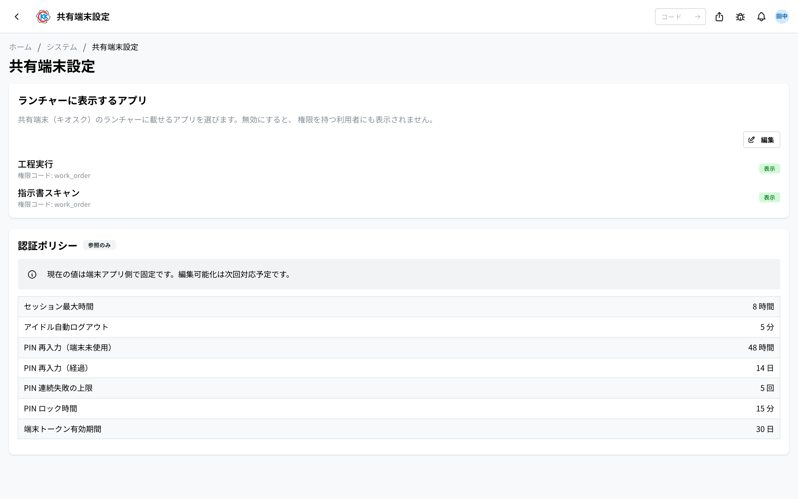

This is the app where you decide which apps appear on the **shared tablets** placed in the factory. Its operation code is `SY0A`.

You can also check the login rules for the tablets here (for example, how many hours until a person is logged out automatically).

## What you can do with this app

- Choose the apps that appear on the tablet home screen, using switches.
- See a list of the rules about logging in to the tablets.
- Use it for things like "hide an app from the factory floor until we are ready to use it".

## Words used on this page

- **Kiosk terminal** … a shared tablet placed in the factory.
- **Launcher** … the screen with the apps lined up on it that appears after you log in to the tablet.
- **PIN** … the secret number a person enters when logging in to the tablet. Only that person knows it.

## Before you start

- You need the **kiosk management permission** to use this app. If you cannot open it, please ask your system administrator.
- The tablets themselves are registered in [Device Management](/manual/en/operations/system/kiosk-device/user), and the cards used to log in are made in [QR Card Management](/manual/en/operations/system/kiosk-card/user).

## How to open it

On the home screen, under 「システム」 (System), press **キオスク設定** (Kiosk Settings). Or type `SY0A` into the search box at the top of the screen.

## How to read the screen

The screen is split into an upper and a lower half.

- The upper half is 「**ランチャーに表示するアプリ**」 (Apps shown on the launcher). This is the only part you can change.
- The lower half is 「**認証ポリシー**」 (Authentication policy). It carries a grey 「**参照のみ**」 (View only) mark, so you can look at it but not change it.

## Choosing the apps that appear on the tablets

1. Find the app you want in 「**ランチャーに表示するアプリ**」.
2. Press the switch on the right to turn it on or off.
3. Press 「**保存**」 (Save).

You are done when 「**保存しました**」 (Saved) and 「**キオスクのアプリ表示設定を更新しました**」 (The kiosk app display settings have been updated) appear.

> ⚠️ If you turn a switch off, **the app also disappears for people who have permission to use it.** You cannot use this to show an app to only some people.

Right now there are 2 apps available on the tablets: 「**工程実行**」 (Step Execution) and 「**指示書スキャン**」 (Work Order Scan). As more apps are added, they will appear in this list.

Under each app name you will see text such as 「**権限コード: work_order**」 (Permission code: work_order). This tells you which permission a person needs in order to use that app. Even if the switch is on, the app will not appear for a person who does not have that permission.

> 💡 Nothing changes until you press 「保存」. Please be careful not to forget it.

## Checking the login rules

「**認証ポリシー**」 (Authentication policy) at the bottom of the screen is a list of the rules for logging in to the tablets. **You cannot change them from this screen** (the screen also says 「現在の値は端末アプリ側で固定です。編集可能化は次回対応予定です。」 — the current values are fixed in the tablet app; making them editable is planned for a future release).

| Item on the screen | Value | What it means |
| --- | --- | --- |
| セッション最大時間 (Maximum session length) | 8 hours | 8 hours after logging in, the person is logged out automatically. |
| アイドル自動ログアウト (Idle auto-logout) | 5 minutes | If nobody touches the tablet for 5 minutes, it logs out automatically. This stops someone else from carrying on under another person's name. |
| PIN 再入力（端末未使用） (PIN re-entry — tablet not used) | 48 hours | If more than 48 hours have passed since the card was last used **on that same tablet**, the card alone is not enough next time — the PIN is also needed. The same applies the first time the card is used on that tablet. |
| PIN 再入力（経過） (PIN re-entry — time elapsed) | 14 days | 14 days after the last time the PIN was entered, it is needed again, even for someone who uses the tablet every day. |
| PIN 連続失敗の上限 (Limit of consecutive PIN failures) | 5 times | If the PIN is entered wrongly 5 times in a row, that card is temporarily stopped. |
| PIN ロック時間 (PIN lock time) | 15 minutes | A stopped card can be used again after 15 minutes. |
| 端末トークン有効期間 (Device token lifetime) | 30 days | How long a tablet stays recognised as a registered device. It is renewed every 30 days. |

The 48 hours and the 14 days above are not two separate triggers. Logging in by holding up the card alone works only when **both** of these are true:

- The card has been used **on that same tablet** within the last 48 hours.
- The PIN was last entered within the last 14 days.

If even one of them is not true, the PIN is asked for. Use is counted **per tablet**, so **the first login on a new tablet always asks for the PIN.**

## Input fields

This screen has no input boxes — switches decide what appears in the shop-floor tablet's app list.

| Control | What happens |
|---------|--------------|
| [App on / off](#field-app-enabled) | Whether it appears in the tablet's app list |

### App on / off [#field-app-enabled]

Turning it off **removes the app from the shop-floor tablet's app list**.

Note that turning it on **does not show it to people without permission**. If someone on the floor cannot see it, check their permission first.

## Questions and problems

**Q. An app does not appear on the tablet.**
A. Please check two things. First, whether the switch on this screen is on. Second, whether that person has permission to use that app (you can check in [User Management](/manual/en/operations/system/user-management/user)). The app appears only when both are true.

**Q. I moved a switch, but nothing changed on the tablet.**
A. You may not have pressed 「**保存**」 (Save). While it has not been pressed, the 「保存」 button stays in a pressable state. Please open this screen again and check.

**Q. I want only certain people to see an app.**
A. You cannot do that on this screen. A switch applies to everyone. Showing different apps to different people is handled by permissions, so please ask your system administrator.

**Q. The 5-minute auto-logout is too short. I want to make it longer.**
A. This cannot be changed at the moment. The value is decided in the tablet app. Please pass your request on to your system administrator.

**Q. A staff member says they are asked for a PIN every time.**
A. The card alone works only when the card has been used **on that same tablet** within the last 48 hours *and* the PIN was entered within the last 14 days. The first login on a new tablet always asks for the PIN, so someone who uses a different tablet from one day to the next will be asked each time. This is a rule that keeps things safe.

**Q. Can I add a new app on this screen?**
A. No. Adding more apps to the tablets requires work by the development team. Please ask your system administrator.

<!-- permissions:start -->
## Permissions required

Using this screen requires the **Kiosk admin** (`kiosk`) permission.

| What you want to do | Permission needed |
| --- | --- |
| Open the screen, view lists and details | Kiosk admin — View |
| Add, change or delete | Kiosk admin — Create / Edit / Delete |

Viewing only needs *View*. Where a screen offers adding, changing or deleting, each of those needs its matching permission.

Permissions come through roles. If something is missing, ask an administrator.

For the whole picture see [Permissions and roles](../../../permissions).
<!-- permissions:end -->
