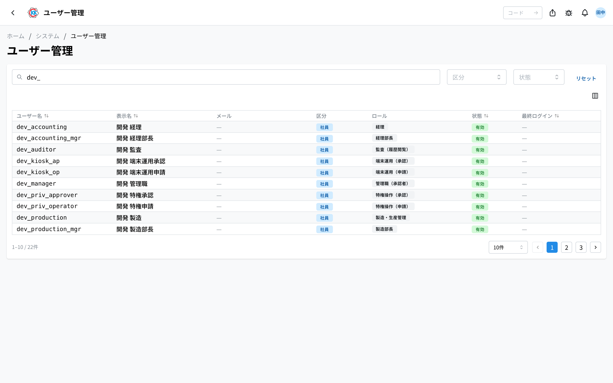
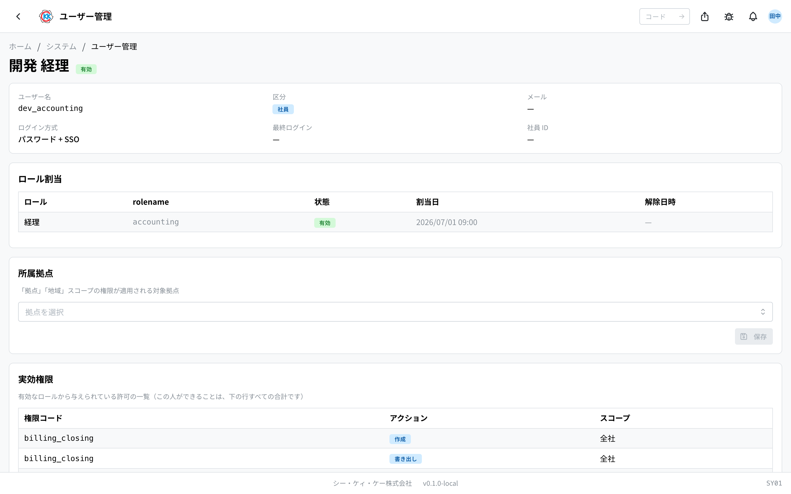

用于查看系统使用者的一览，并确认 **每个人可以做哪些事情** 的应用。操作代码为 `SY01`。

本应用是 **用于查看的应用**。无法在这里添加人员或修改姓名（只有一个例外，请参见后面的「变更 所属拠点（所属据点）」）。

## 本应用能做什么

- 可以用一览的方式查看系统中登记的所有人员。
- 可以用姓名或邮箱地址筛选，找到您要找的人。
- 选择一个人后，可以确认给这个人的 **角色**，以及他 **能做的事情** 的一览。
- 想查明「这个人为什么打不开某个画面」时使用。

## 用语（本页出现的词）

- **ロール（角色）** … 指这个人的职责。像 「営業」（销售）、「工場担当」（工厂负责人）这样成组登记，每个角色决定了可以使用哪些画面。
- **権限（权限）** … 指「可以查看这个画面」「可以保存」这样的许可。它随角色一起给出。
- **拠点（据点）** … 指工厂或营业所。有些人有「只能查看自己据点的数据」这样的规定。
- **区分（类别）** … 指这个人的种类。共有 3 种：**社員**（员工）/ **ゲスト**（访客）/ **システム**（系统 — 不是人，而是系统自身执行的处理）。

## 开始之前

- 打开本应用需要 **系统管理权限**。打不开时，画面上会显示「この操作の権限がありません（system:READ）」（您没有此操作的权限）。请咨询系统管理员。
- 无法在本应用中添加、删除人员或修改姓名。这些由公司内部的统一登录机制管理。

## 打开方式

点击主页「システム」（系统）中的 **ユーザー管理**（用户管理）。或者在画面上方的搜索框中输入 `SY01`。

## 画面的看法

打开应用后，会显示已登记人员的一览。

- **ユーザー名**（用户名）… 登录时使用的 ID。
- **表示名**（显示名）… 画面上显示的姓名。
- **メール**（邮箱）… 已登记的邮箱地址。没有时显示「—」。
- **区分**（类别）… **システム**（系统）/ **社員**（员工）/ **ゲスト**（访客）中的一种。
- **ロール**（角色）… 给这个人的角色。也可能有多个。
- **状態**（状态）… 现在可以登录的人显示「**有効**」（有效），已被停用的人显示「**無効**」（无效）。
- **最終ログイン**（最后登录）… 最后一次登录的日期和时间。一次都没有登录过的人显示「—」。

在上方的搜索框「**ユーザー名 / 表示名 / メール / ロール...**」（用户名 / 显示名 / 邮箱 / 角色...）中输入文字后，只会留下包含这些文字的人。也可以用「**区分**」「**状態**」来筛选。想清除全部条件时，请点击「**リセット**」（重置）。

点击某一行，就会打开这个人的详细画面。

## 确认一个人的内容

在一览中点击某一行，就会打开这个人的画面。上方会排列着基本信息。

- **ユーザー名** / **区分** / **メール** / **最終ログイン** / **社員 ID**（员工 ID）… 与一览中的内容相同。
- **ログイン方式**（登录方式）…「**パスワード + SSO**」（密码 + SSO）表示既可以用本系统的密码登录，也可以用公司内部的统一登录；「**SSO のみ**」（仅 SSO）表示只能用公司内部的统一登录进入。

下面排列着 3 个表。

### ロール割当（角色分配）— 拥有哪些角色

- 「**ロール**」中显示角色的名称，「**状態**」中显示现在是否有效。
- 过去解除的角色也会作为记录保留。「**解除日時**」（解除时间）中填有日期的行，现在是不生效的。
- 什么都没有时，会显示「**ロールが割り当てられていません**」（未分配任何角色）。这个人目前还什么都做不了。

### 所属拠点（所属据点）— 属于哪个据点

- 这个人所属的据点（工厂・营业所）。
- 如果权限带有「只能查看自己据点的部分」这样的规定，而这里是空的，那么 **可查看的数据就是零**。明明给了权限却什么都看不到时，请确认这里。
- 什么都没有时，会显示「**所属拠点がありません**」（没有所属据点）。

### 実効権限（实际生效权限）— 最终能做什么

这是这个人现在实际能做的事情的一览。持有多个角色时，**把全部加在一起，就是这个人能做的事**。同样的行有时会出现两次，这并不是异常。

表格的读法如下。

- 「**権限コード**」（权限代码）… 表示是关于哪个应用的（`quote` 是見積書（报价单），`master` 是マスタ（主数据），`system` 是系统管理，等等）。
- 「**アクション**」（操作）… 表示可以做什么：閲覧（只能查看）、作成（新建）、更新（修改）、削除（删除）、書き出し（导出）、管理（作为管理员的操作）。另外，能否**审批**单据不在这里决定 — 谁能审批由[承認設定](/manual/zh/operations/masters/approval-setting/user)（审批设置，MS0B）中的审批分组决定。
- 「**スコープ**」（范围）… 表示这个许可能到达多远：全社（整个公司）、拠点（只限自己的据点）、地域（只限自己的地区）、自分の担当（只限自己负责的数据）等。据点和地区的情况下，后面会用括号列出对象。

什么都没有时，会显示「**権限がありません**」（没有权限）。

## 变更 所属拠点（所属据点）— 仅限系统管理员

这是本应用中唯一可以改写的项目。只有拥有系统管理权限的人，才会看到选择框和「**保存**」（保存）按钮。

1. 打开想要变更的人的详细画面。
2. 点击「**所属拠点**」栏。
3. 从一览中选择据点。可以选择多个。
4. 想要去掉的据点，再点击一次取消选择。
5. 点击「**保存**」。

显示「**保存しました**」（已保存）「**所属拠点を更新しました**」（已更新所属据点）后即完成。

> ⚠️ 去掉所属据点后，这个人能看到的数据会变少。带有「只限自己据点」规定的画面，有可能会变成空的。

> 💡 选择框中有时会出现带「（無効）」（无效）的据点。这是已经不再使用的据点，但因为仍然分配给这个人，所以会显示出来。

## 输入项

用户的姓名与邮箱**由 Active Directory 导入**，无法在本画面更改。此处输入的仅为所属基地。

| 项目 | 必填 | 填什么 |
|------|------|--------|
| [所属基地](#field-plants) | 选填 | 该用户可处理的基地 |

### 所属基地 [#field-plants]

该用户负责的基地，可多选。

权限的「基地」范围**由与此处所选基地的重合决定**。例如拥有「仅可查看基地内」权限的人，只能看到此处所列基地的数据。若此处为空，基地范围的权限将无法查看任何内容。

仅系统管理员可编辑，其他人只能以徽章形式查看当前所属。

## 常见问题・遇到困难时

**Q. 想添加新入职的人，但没有添加按钮。**
A. 无法从本应用添加人员。人员信息是从公司内部的统一登录机制导入的。请委托系统管理员处理。

**Q. 想变更某个人的角色（ロール）。**
A. 此画面只能确认，无法变更。请委托系统管理员处理。

**Q. 显示「この操作の権限がありません（system:ADMIN）」（您没有此操作的权限），无法保存所属据点。**
A. 只有系统管理员才能变更所属据点。其他人只能查看。请委托系统管理员处理。

**Q. 已经给了角色，但那个人说打不开画面。**
A. 请在那个人的详细画面上查看「**実効権限**」（实际生效权限）中是否有对应的行。如果有行但数据是空的，请再确认「**所属拠点**」是否为空。

**Q.「実効権限」中同一个权限代码出现了 2 行。**
A. 这是正常的。持有 2 个角色，而两边都给出了同样的许可时就会这样。实际能做的事，是两者加在一起的结果。

**Q. 想知道是谁在什么时候变更了这个人的所属据点。**
A. 可以在 [操作历史](/manual/zh/operations/system/activity-log/user) 中确认。所有变更都有记录。

<!-- permissions:start -->
## 所需权限

使用本画面需要 **用户・权限变更**（`user_admin`）权限。

| 想做的事 | 所需权限 |
| --- | --- |
| 打开画面、查看列表与明细 | 用户・权限变更 — 查看 |
| 新增・变更・删除 | 用户・权限变更 — 创建 / 更新 / 删除 |

仅查看有「查看」即可。画面中若有新增、变更或删除的操作，则分别需要对应的权限。

权限通过角色授予。若不足，请与管理员联系。

权限的整体说明请参见「[权限与角色](../../../permissions)」。
<!-- permissions:end -->
