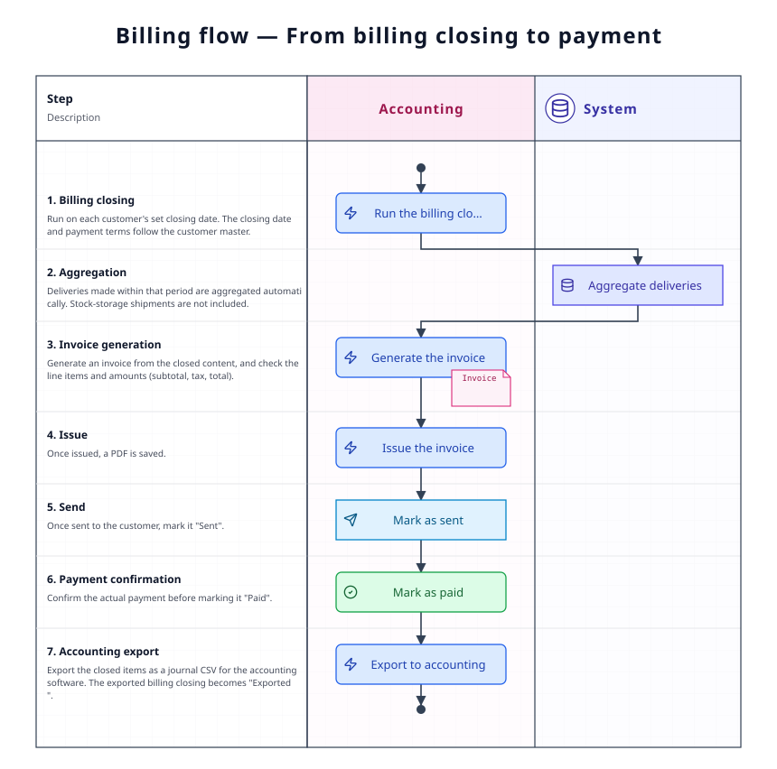

A page covering the flow from closing what has been delivered and making the invoice, through sending it, until payment is recorded. It is where you check "what stage things are at now, and who does what next", and each **document's states**. The basic steps to operate belong to [Standard flow](/manual/en/process/default-flow).

## Overall flow

## Stage-by-stage roles and apps

| Stage | What happens | Role | App used |
|-------|--------------|------|----------|
| 1. Close | Total up what was delivered in the period, at each customer's closing day | Accounting | [Billing closing](/manual/en/operations/billing/billing-closing/user) (`BL02`) |
| 2. Check the content | Check the line items and amounts | Accounting | [Invoice](/manual/en/operations/billing/invoice/user) (`BL01`) |
| 3. Issue | Issue the PDF | Accounting | [Invoice](/manual/en/operations/billing/invoice/user) (`BL01`) |
| 4. Send | Send it to the customer and set it to sent | Accounting | [Invoice](/manual/en/operations/billing/invoice/user) (`BL01`) |
| 5. Record payment | Set it to paid once payment arrives | Accounting | [Invoice](/manual/en/operations/billing/invoice/user) (`BL01`) |
| 6. Hand over to accounting | Export the CSV for 弥生会計 (Yayoi Accounting) | Accounting | [Billing closing](/manual/en/operations/billing/billing-closing/user) (`BL02`) |

## What happens at each stage

### 1. Closing (billing closing)

At the **closing day** set for each customer, total up what was delivered in that period. The closing day and payment terms registered in the [Customer master](/manual/en/operations/masters/business-partner/user) are used. Closing creates an invoice from what was delivered in that period (steps … [Standard flow §11](/manual/en/process/default-flow#stage-11)).

### 2–5. Invoice

Check the line items and amounts (subtotal, tax, total) of the invoice that was created, and issue it. Issuing saves the PDF. Set it to「送付済」(sent) once it has been sent to the customer, and to「支払済」(paid) once payment is confirmed. **These states are money management itself**, so change them only after confirming the actual payment.

### 6. Handing over to accounting

What has been closed can be exported as a CSV for 弥生会計 (Yayoi Accounting). An exported billing closing becomes「エクスポート済」(exported).

## Document states

| Document | How the state moves |
|----------|----------------------|
| Billing closing | Unprocessed → Processed → Exported |
| Invoice | Draft → Issued → Sent → Paid |

## Where things tend to get stuck

**A delivery is missing from the invoice**
Check whether the delivery note is「納品済」(delivered). Also, a delivery order of type「在庫保管」(stock storage) is not subject to billing.

**The closing day is wrong**
Check the customer master's closing day, payment terms and payment day settings. Billing follows those settings.

**The amount differs from what was expected**
The line items come from delivery notes. Check the delivery note's unit price and quantity, and the prices-shown setting.

## Related pages

- Following a single order from start to finish … [Standard flow](/manual/en/process/default-flow)
- How to operate each app and what each field means … **How-to › Billing** on the left
- Previous flow … [Shipping flow](/manual/en/process/shipping)
- Closing day settings per customer … [Customer master](/manual/en/operations/masters/business-partner/user)
