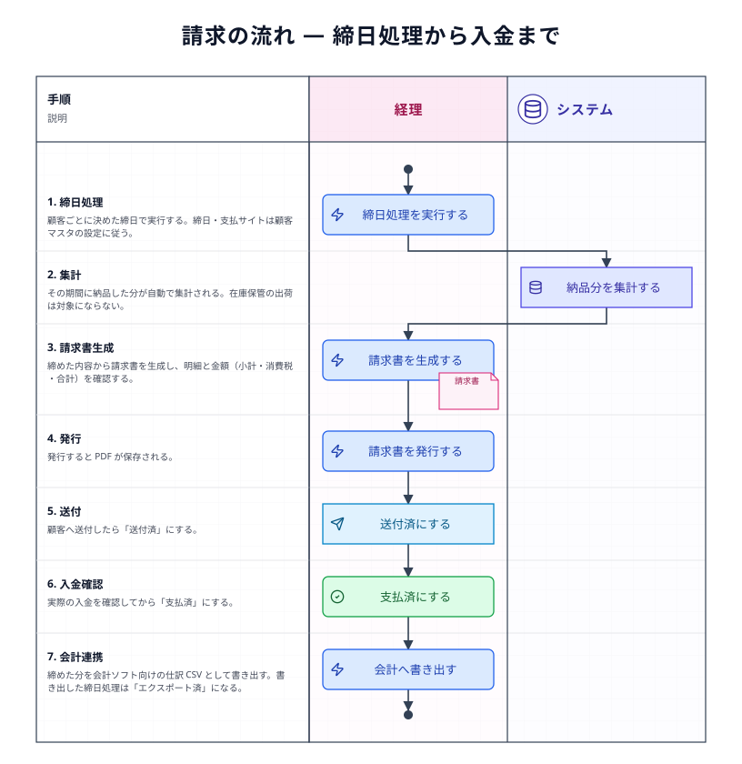
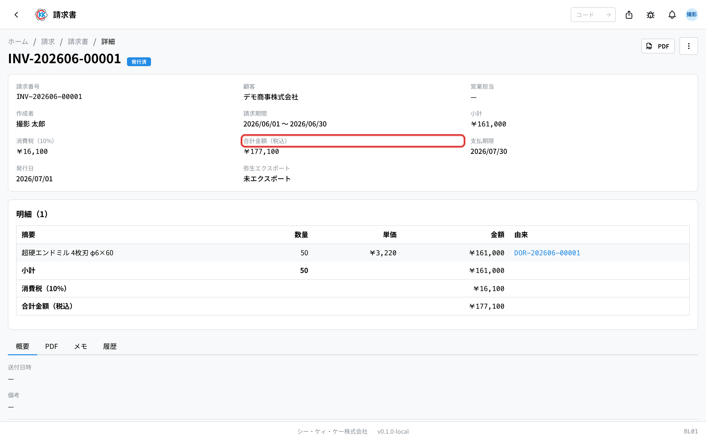
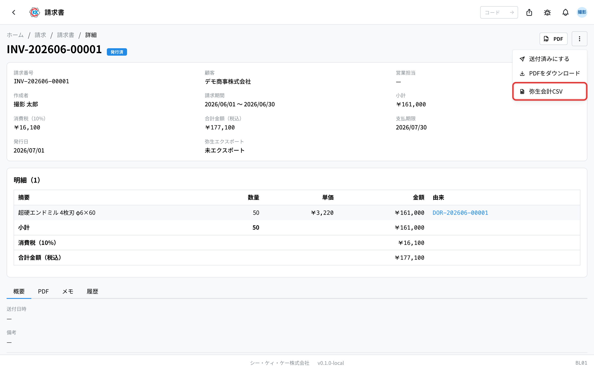

納品した分を締めて請求書を作り、送付して入金を記録するまでの流れをまとめたページである。「いまどの段階で、次に誰が何をするのか」と、各**書類の状態**をここで確認する。基本の操作手順は[標準フロー](/manual/ja/process/default-flow)が持つ。

## 全体の流れ

## 段階ごとの担当とアプリ

| 段階 | 何をするか | 担当 | 使うアプリ |
|------|-----------|------|-----------|
| 1. 締める | 顧客ごとの締日で、その期間の納品分をまとめる | 経理 | [締日処理](/manual/ja/operations/billing/billing-closing/user)（`BL02`） |
| 2. 内容を確認する | 明細と金額を確認する | 経理 | [請求書](/manual/ja/operations/billing/invoice/user)（`BL01`） |
| 3. 発行する | PDF を発行する | 経理 | [請求書](/manual/ja/operations/billing/invoice/user)（`BL01`） |
| 4. 送付する | 顧客へ送り、送付済にする | 経理 | [請求書](/manual/ja/operations/billing/invoice/user)（`BL01`） |
| 5. 入金を記録する | 入金があったら支払済にする | 経理 | [請求書](/manual/ja/operations/billing/invoice/user)（`BL01`） |
| 6. 会計へ渡す | 弥生会計向けの CSV を書き出す | 経理 | [締日処理](/manual/ja/operations/billing/billing-closing/user)（`BL02`） |

## それぞれの段階でおきること

### 1. 締める（締日処理）

顧客ごとに決めた**締日**で、その期間に納品した分をまとめる。締日と支払サイトは[顧客マスタ](/manual/ja/operations/masters/business-partner/user)に登録されているものが使われる。締めると、その期間の納品分から請求書が作られる（操作手順 … [標準フロー §11](/manual/ja/process/default-flow#stage-11)）。

### 2〜5. 請求書

作られた請求書の明細と金額（小計・消費税・合計）を確認し、発行する。発行すると PDF が保存される。顧客へ送ったら「送付済」、入金を確認したら「支払済」にする。**この状態はお金の管理そのもの**であるため、実際の入金を確認してから変える。

### 6. 会計へ渡す

締めた分は、弥生会計向けの CSV として書き出せる。書き出した締日処理は「エクスポート済」になる。

## 書類の状態

| 書類 | 状態の移り変わり |
|------|-----------------|
| 締日処理 | 未処理 → 処理済 → エクスポート済 |
| 請求書 | 下書き → 発行済 → 送付済 → 支払済 |

## 止まりやすいところ

**請求書に出てこない納品がある**
納品書が「納品済」になっているかを確認する。また、出荷書の種別が「在庫保管」のものは請求の対象にならない。

**締日が合わない**
顧客マスタの締日・支払サイト・支払日の設定を確認する。請求はその設定に従う。

**金額が想定と違う**
明細のもとは納品書である。納品書の単価・数量と、価格記載の設定を確認する。

## 関連ページ

- 一つの注文を通しで追う … [標準フロー](/manual/ja/process/default-flow)
- 各アプリの操作と入力欄の意味 … 左の **操作方法 › 請求**
- 前の流れ … [出荷の流れ](/manual/ja/process/shipping)
- 顧客ごとの締日設定 … [顧客マスタ](/manual/ja/operations/masters/business-partner/user)
