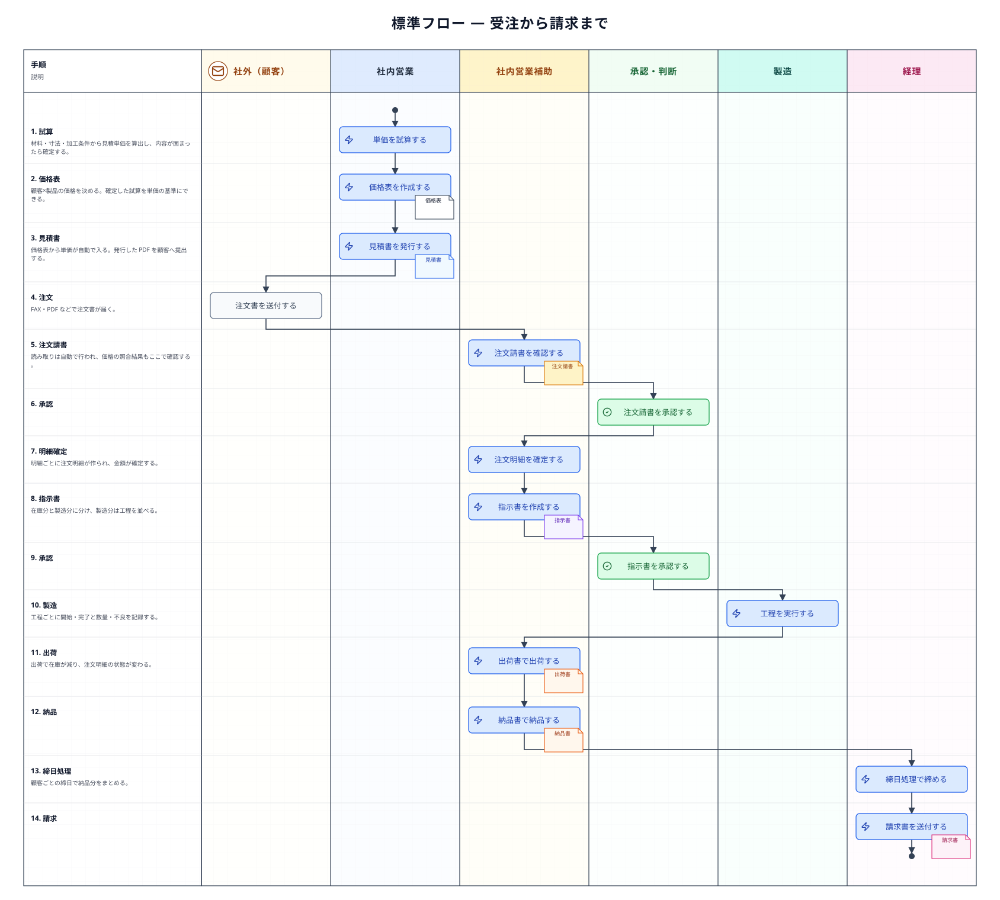
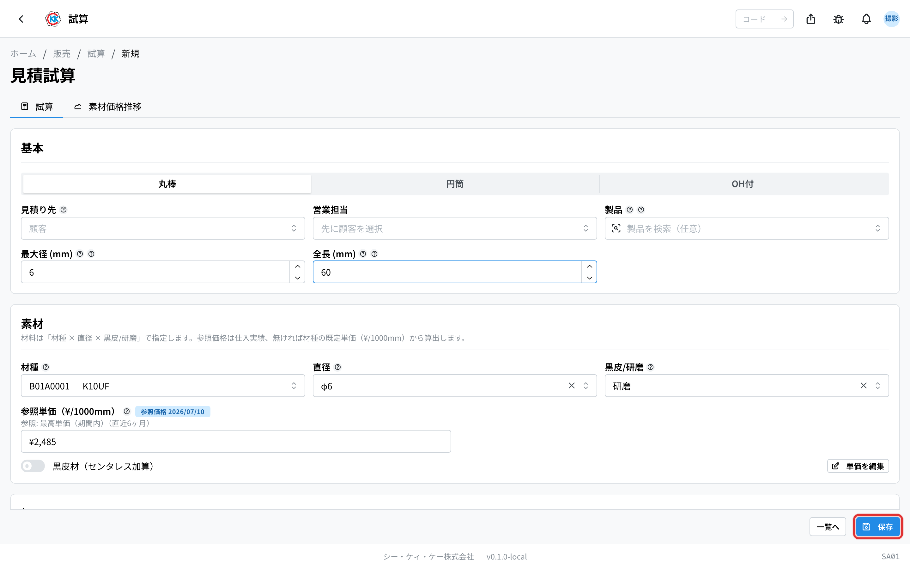
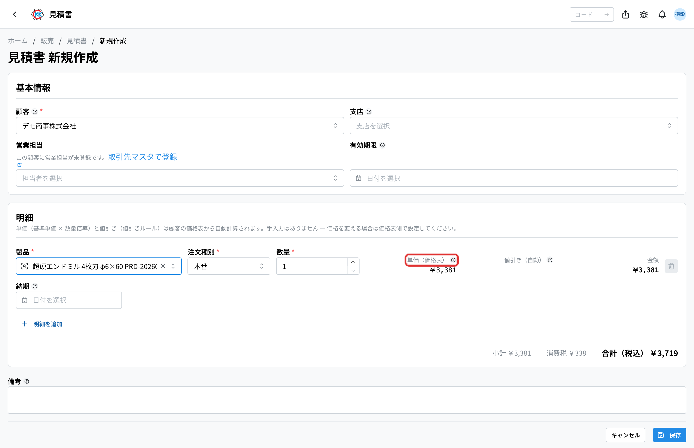
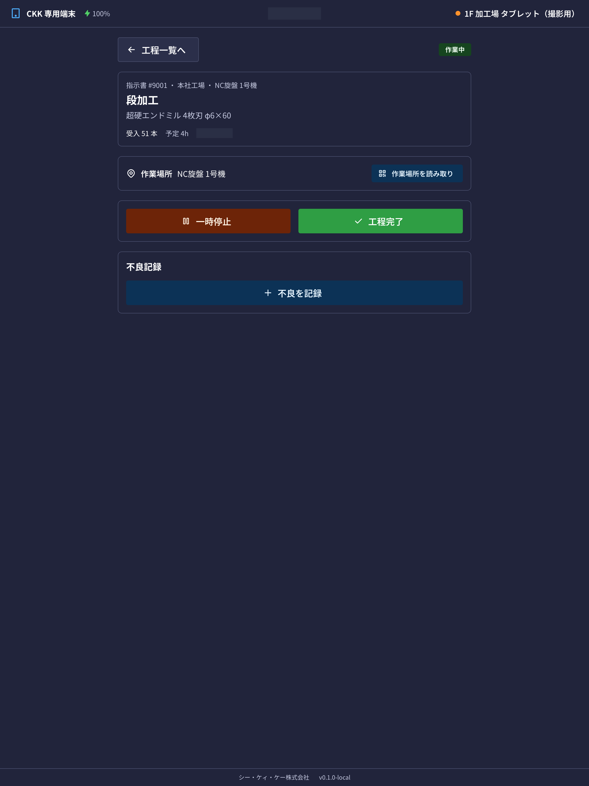
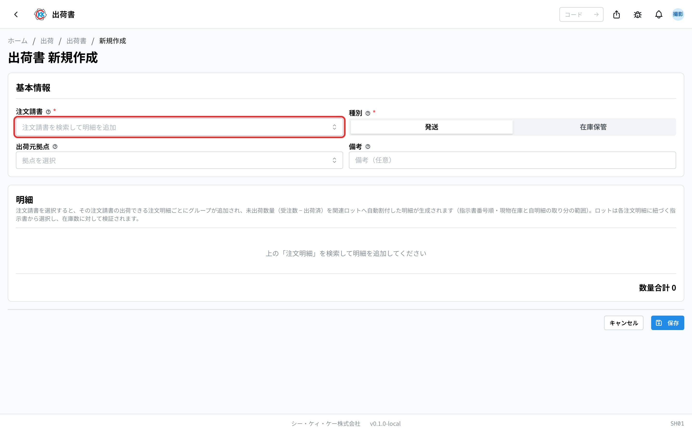
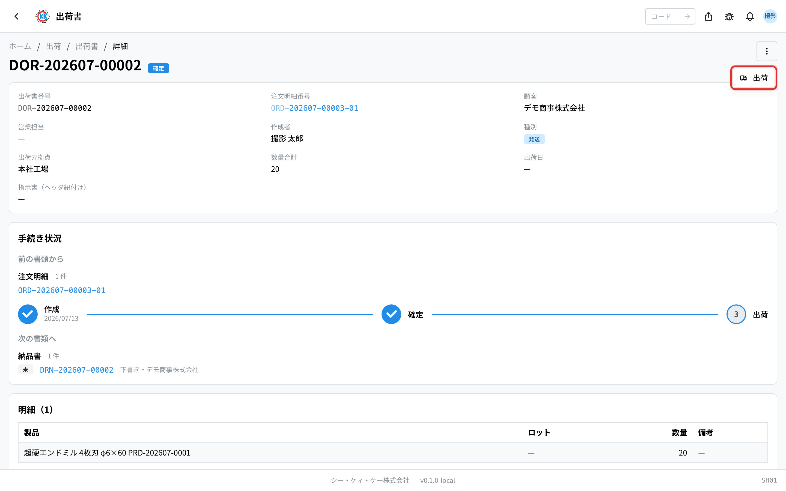
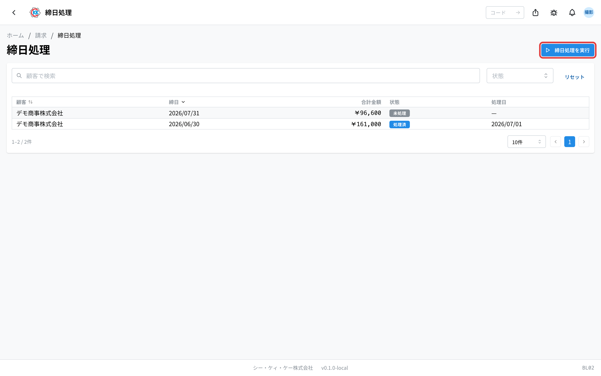
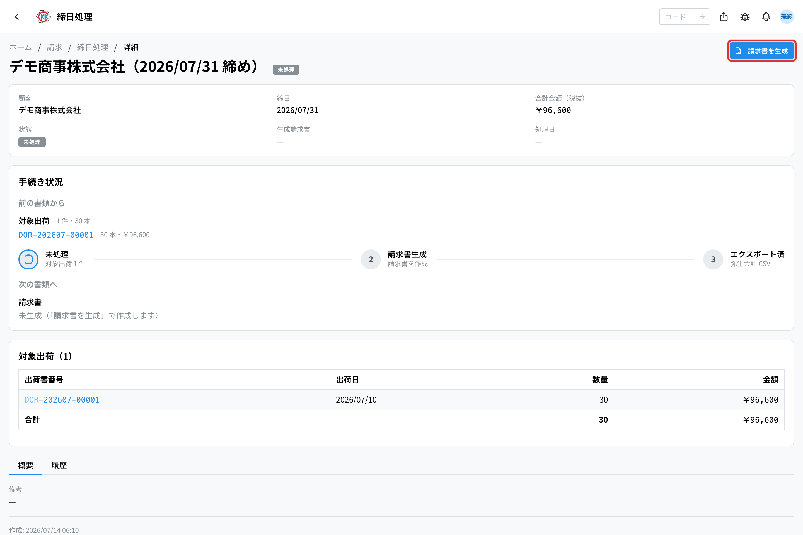
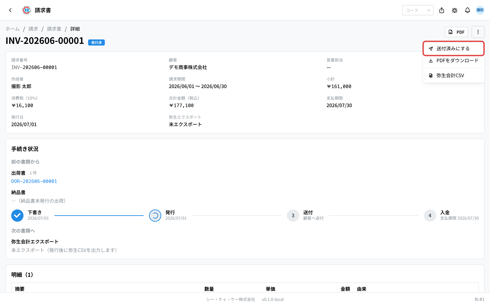

一つの注文が、単価の計算から請求まで進んでいく**標準の流れ**を通しで追うページである。各段階を「操作（だれが・なにを）」と「システムが自動でおこなうこと」に分けて説明する。画像の**赤い枠**は、その段階で押すボタン・確認する欄を示す。

分岐・例外（価格差異、差し戻し、分割入荷など）と各書類の状態の一覧は、分野ごとの流れのページ（[販売](/manual/ja/process/sales)・[購買](/manual/ja/process/purchasing)・[生産](/manual/ja/process/production)・[出荷](/manual/ja/process/shipping)・[請求](/manual/ja/process/billing)）が持つ。各画面の詳しい操作は、それぞれの操作マニュアルを参照する。

## 全体の流れ

## この流れの登場人物

| 担当 | 受け持つ段階 |
|------|-------------|
| 社内営業 | 価格試算・価格表・見積書 |
| 社内営業補助 | 注文請書・注文明細・指示書・出荷書・納品書 |
| 承認者（工場長・部長） | 注文請書の承認・指示書の承認 |
| 製造 | 工程の実行（数量・不良の記録） |
| 経理 | 締日処理・請求書 |

## 1. 価格試算 — 単価のもとを作る [#stage-1]

### 操作（だれが・なにを）

1. [価格試算](/manual/ja/operations/sales/trial-estimate/user)（`SA01`）で製品の材料・寸法・加工の条件を入力し、保存する。

2. 内容が固まったら、操作メニューから「確定」を選ぶ。

### システムが自動でおこなうこと

- 保存すると、価格試算番号（EST-）が自動で付与される。
- 材料構成（材種・直径・黒皮/研磨）を選ぶと、参照単価が仕入実績から自動で入る（実績が無い場合は材種の既定単価が使われる）。
- 確定した価格試算だけが、次の価格表で単価のもとに選べる。

## 2. 価格表 — 顧客ごとの単価を決める [#stage-2]

### 操作（だれが・なにを）

1. [価格表](/manual/ja/operations/sales/price-list/user)（`SA02`）で顧客と製品を選び、確定済みの価格試算を単価のもとに選ぶ（手入力もできる）。
2. 注文種別（本番・テスト・サンプル・その他）ごとの価格と数量の段階を決めて、保存する。

### システムが自動でおこなうこと

- 価格・有効期間が保存され、以後の見積書・注文でこの価格表が参照される。
- 単価のもとに使った価格試算は「価格表登録済」となり、そのままでは編集できなくなる（過去の金額が後から変わらないようにするためである）。

## 3. 見積書 — 顧客に金額を提示する [#stage-3]

### 操作（だれが・なにを）

1. [見積書](/manual/ja/operations/sales/quote/user)（`SA03`）で顧客・製品・数量を入力する。

2. 内容を確認し、操作メニューから「発行」を選ぶ。

### システムが自動でおこなうこと

- 顧客と製品を選ぶと、価格表から単価が自動で入る（数量の段階・値引きも自動で反映される）。
- 保存すると、見積番号（QOT-）が自動で付与される。
- 発行すると PDF が保存され、顧客へ提出できる状態になる。

> 💡 価格表に無い製品は単価が入らず、警告が出る。見積書の前に、価格試算 → 価格表の順で登録しておく必要がある。

## （並行）設計依頼 — 図面が無いとき [#design-request]

図面がまだ無い製品では、この流れと**並行して**設計依頼書を起票する。標準の流れには含まれない任意の段階で、見積の段階でも、受注が決まったあとでも、どちらにも紐づかない単独でも起票できる。分岐と書類の状態は[販売の流れ](/manual/ja/process/sales)が持つ。

### 操作（だれが・なにを）

1. 社内営業（または社内営業補助）が[設計依頼書](/manual/ja/operations/sales/design-request/user)（`SA06`）を起票する。見積書・注文明細・製品マスタの「…」メニューから開くと、参照元が入った状態で始められる。**製品と担当者は必須**である。
2. 内容が固まったら「承認依頼」を押す。承認されると**未着手**（承認済み・着手待ち）になる。
3. 指名された製造の担当者が「着手」を押す。
4. 図面ができたら、依頼の画面の「設計図に登録」から[設計図](/manual/ja/operations/production/design-file/user)（`PD06`）に版として登録し、依頼へ戻って「完了」を押す。**成果物が 1 件も無いと完了できない。**

### システムが自動でおこなうこと

- 保存すると、依頼番号（DSG-）が自動で付与される。
- 製品を選ぶと、**新規**か**改訂**かが自動で決まる（その製品にすでに図面があれば改訂）。改訂のときは変更理由が必須になる。
- 承認が通ると、指名された担当者に「着手してください」の通知が届く。着手すると依頼者へ、完了すると依頼者と見積の営業担当へ通知が届く。
- 設計図に登録すると、そのとき上げたファイルがまとめて 1 つの版（v1・v2 …）になり、[製品マスタ](/manual/ja/operations/masters/product/user)の最新図面が入れ替わる。指示書からその版を指定することもできる。
- 版は「製品 × 受注元」ごとに数える。依頼の受注元がそのまま系列になり、空なら**汎用**（専用の図面が無いお客様の指示書から使われる）。

> 💡 [承認設定](/manual/ja/operations/masters/approval-setting/user)に「設計依頼書」の段が 1 つも無いと、承認依頼を出せない。段の構成はトリガー・依頼区分（新規 / 改訂）・優先度で変えられる。

## 4. 注文請書 — 注文を受け取る [#stage-4]

### 操作（だれが・なにを）

1. 顧客から届いた注文書（FAX・PDF）を[注文請書](/manual/ja/operations/sales/order-acceptance/user)（`SA04`）に取り込み、読み取り結果を確認・修正する。配送方法（通常配送・ユーザー直送）とエンドユーザー（最終需要家）もここで決める。**ユーザー直送でエンドユーザーが未指定のままだと、承認依頼も確定もできない**。顧客が自前の納品書（バーコード印字など）を用意する取引なら「顧客提供の納品書」を付けておく（出荷準備の担当者への目印。下書きのうちだけ変えられる）。
2. 内容が確定したら承認を依頼する。承認者は内容を確認して「承認」する。

### システムが自動でおこなうこと

- 取り込んだ注文書の読み取りが自動で行われ、顧客・製品・数量・価格が下書きに入る。
- 合計金額が自動で計算される。
- 明細の単価は顧客の価格表（顧客 × 製品 × 注文種別 × 数量）から自動で入る。別の単価で受けるときは行ごとに「単価を上書き」を入れる。上書きしていないのに価格表と食い違う行は価格差異として画面に表示される — 直し方は[販売の流れ](/manual/ja/process/sales)を参照する。

## 5. 注文明細の確定 — 受注が確定する [#stage-5]

### 操作（だれが・なにを）

1. 承認された注文請書を開き、「確定」を選ぶ。確認画面で「展開する」を押すと確定する。

### システムが自動でおこなうこと

- 明細ごとに**注文明細**が作られ、枝番付きの番号（ORD-…-NN）が自動で付与される。
- 金額がこの時点の内容で確定する。

## 6. 指示書 — 製造の段取りを決める [#stage-6]

### 操作（だれが・なにを）

1. 注文明細から[指示書](/manual/ja/operations/production/work-order/user)（`PD02`）を作る。在庫から出す分と新しく作る分を分け、製造分は工程を順番に並べる（前回の指示書のコピーもできる）。
2. 保存し、承認を依頼する。

### システムが自動でおこなうこと

- 指示書番号（通し番号）が自動で付与される。この番号はそのままロット番号となり、指示書の帳票には現場で読み取る QR が印字される。
- 在庫から出す分は、その在庫が引き当てられて他の注文に使われなくなる。在庫の見方は[生産の流れ](/manual/ja/process/production)を参照する。

## 7. 承認 — 製造を始めてよいか確認する [#stage-7]

### 操作（だれが・なにを）

1. 承認者が[承認管理](/manual/ja/operations/production/approval/user)（`PD03`）または指示書の画面で内容を確認し、「承認」する。問題があれば「差し戻し」を選ぶ。

### システムが自動でおこなうこと

- 承認を依頼すると指示書が編集できなくなり、承認者に通知が届く。
- 各段の承認が記録され、次の段の承認者へ通知される。
- すべての段が承認されると、製造を開始できる状態になる。

## 8. 製造 — 現場が工程を実行する [#stage-8]

### 操作（だれが・なにを）

1. 現場の担当者が指示書の工程一覧から自分の工程を開き、「開始」する。工程によってはロット/伝票コードの入力が必須で、入れないと開始できない。また、別の指示書とつながっている場合（指示書詳細の「関連指示書」）は、先行する指示書が完了するまで最初の工程を開始できない。

2. 加工が終わったら、受入数・良品数・不良の内訳を入力して「完了」する。

### システムが自動でおこなうこと

- 開始すると、その工程は他の担当者が同時に操作できなくなる（二重実行の防止）。
- 開始〜完了の作業時間と、入力した数量・不良が実績として記録される。
- 最後の工程が完了すると、完成した数が製品在庫に入り、注文への引き当てが確定する。

> 💡 現場の共有タブレットでも同じ操作ができる。指示書の QR を読み取ると、その指示書の工程一覧が開く。

## 9. 出荷書 — 送り出す [#stage-9]

### 操作（だれが・なにを）

1. [出荷書](/manual/ja/operations/shipping/delivery-order/user)（`SH01`）で注文請書を選ぶと、出荷できる注文明細が入る。完成したロットから出荷する数を決めて保存する。複数の注文請書を 1 つの出荷書に載せられるのは、**同一顧客・同一出荷先・同一配送方法**のときだけである。

2. 内容を確認して「確定」し、実際に送り出したら「出荷」にする。

### システムが自動でおこなうこと

- 保存すると、出荷書番号（DOR-）が自動で付与される。
- 出荷にすると在庫が減り、注文明細の状態が「一部出荷」または「出荷済」に変わる。

## 10. 納品書 — 届ける [#stage-10]

### 操作（だれが・なにを）

1. [納品書](/manual/ja/operations/shipping/delivery-note/user)（`SH02`）は**作らない** — 前段で出荷書を「確定」した時点で自動でできている。出荷書の「納品書」タブか納品書アプリの一覧から開き、届け先と価格記載を確かめる。**できた時点で発行済**なので納品書側で直す操作は無い — 間違いがあれば正しい注文請書・出荷書から作り直す。

2. 顧客に届いたら「納品済」にする。

### システムが自動でおこなうこと

- 出荷書の確定と同時に納品書ができ、納品番号（DRN-）が自動で付与される。**在庫保管の出荷書は作らない。**
- 通常配送は顧客宛・価格記載ありの 1 通。**ユーザー直送は 2 通** — 価格記載なしを最終需要家へ、価格記載ありを顧客へ。納品方法・最終需要家は注文請書から引き継がれる。
- 価格記載ありのユーザー直送納品書を開く・ダウンロードするときは確認が挟まる（最終需要家へ渡す事故を防ぐため）。
- 納品書ははじめから発行済で、PDF はすぐに見られる。価格記載なしの納品書は価格の載らない書式になる。

## 11. 請求書 — 締めて請求する [#stage-11]

### 操作（だれが・なにを）

1. [締日処理](/manual/ja/operations/billing/billing-closing/user)（`BL02`）で顧客ごとの締日を選び、「締日処理を実行」する。

2. 締めた内容を確認し、「請求書を生成」する。

3. [請求書](/manual/ja/operations/billing/invoice/user)（`BL01`）を発行して顧客へ送り、「送付済」にする。入金を確認したら「支払済」にする。

### システムが自動でおこなうこと

- 締日処理を実行すると、その期間に納品した分が自動で集計される。
- 請求書を生成すると請求番号（INV-）が自動で付与され、発行で PDF が保存される。
- 締めた分は弥生会計向けの CSV として書き出せる。

## 関連ページ

- 分岐・例外と**書類の状態の一覧** … [販売の流れ](/manual/ja/process/sales) / [購買の流れ](/manual/ja/process/purchasing) / [生産の流れ](/manual/ja/process/production) / [出荷の流れ](/manual/ja/process/shipping) / [請求の流れ](/manual/ja/process/billing)
- 各アプリの操作と入力欄の意味 … 左の **操作方法**
- はじめて使う方 … [スタートマニュアル](/manual/ja/start)
