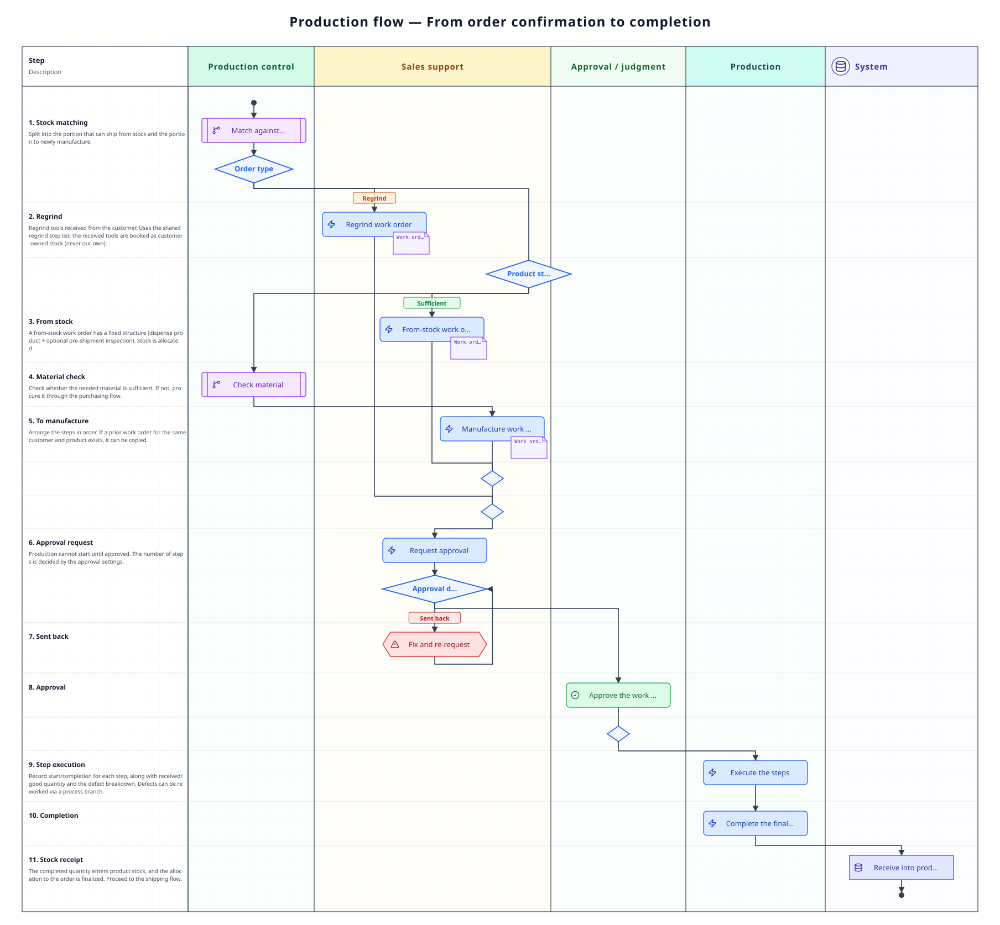

A page covering the flow from a confirmed order, through checking stock, getting approval and running the steps, until it becomes a product ready to ship. It is where you check "what stage things are at now, and who does what next", the **branches** such as stock matching, being sent back and defects, and each **document's states**. The basic steps to operate belong to [Standard flow](/manual/en/process/default-flow).

## Overall flow

## Stage-by-stage roles and apps

| Stage | What happens | Role | App used |
|-------|--------------|------|----------|
| 1. Check product stock | Split into the portion already in stock and the portion to make new | Production control | [Inventory](/manual/en/operations/production/product-inventory/user) (`PD04`) |
| 2. Check material | See whether there is enough material to make it | Production control | [Inventory](/manual/en/operations/production/material-inventory/user) (`PD04`) |
| 3. Make the work order | Split into the stock portion and the manufactured portion (only the manufactured portion has steps lined up) | Sales support | [Work order](/manual/en/operations/production/work-order/user) (`PD02`) |
| 4. Get approval | Pass every step set in approval settings, so that manufacturing can begin | Approver | [Approval management](/manual/en/operations/production/approval/user) (`PD03`) |
| 5. Run the steps | The shop floor records start, completion and quantities | Production | [Work order](/manual/en/operations/production/work-order/user) / shop-floor tablet |
| 6. Complete | Once every step is done, it becomes product stock | Production / production control | [Inventory](/manual/en/operations/production/product-inventory/user) |

## What happens at each stage

### 1–2. Checking stock

First look at product stock and split it into **the portion that can be taken from stock** and **the portion to make new**. For the portion to make, check whether there is enough material; if not, go on to [Purchasing flow](/manual/en/process/purchasing). See [Purchasing flow](/manual/en/process/purchasing) for how semi-finished goods procured from outside are handled.

### 3. Making the work order

Make a work order for each of the stock portion and the manufactured portion. It is the manufactured portion that has its steps lined up in order, and it always begins with **exactly one**「出し・受渡し」(issue / hand-over) step (more than one cannot be chosen). The sequence of steps can be registered as a **process route** per product × ordering customer (business partner), and when making a work order it is chosen automatically in the order: the route whose ordering customer matches → a route not limited to any ordering customer → the first route. **The stock portion has a fixed composition of「製品出し」(product issue) plus an optional「出荷前検査」(pre-shipment inspection)**, and creating it allocates the stock. Shipping itself is not a step; it is managed by [Delivery order](/manual/en/operations/shipping/delivery-order/user). If there is a previous work order for the same ordering customer and product, it can be copied (a warning appears if the content has changed). For each step, decide whether it is done in-house or outsourced; outsourcing it makes it appear in the [Outsource order](/manual/en/operations/purchasing/outsource-order/user) list (steps … [Standard flow §6](/manual/en/process/default-flow#stage-6)).

### 4. Approval

A work order cannot start manufacturing until it is approved. How many approval steps it goes through is decided in [Approval settings](/manual/en/operations/masters/approval-setting/user) (`MS0B`), and it passes the set steps in order. When conditional rules are set, the steps can vary with the work order's content (such as its type or planned quantity). **If it is sent back, fix the content and request approval again** (steps … [Standard flow §7](/manual/en/process/default-flow#stage-7)).

### 5. Running the steps

The shop floor records start and completion for each step. Enter the received quantity and the defects one row at a time — for each row enter the category (semi-finished, scrapped, process branch), the defect type, details and the quantity; the good quantity and the total per category are decided automatically from that list. **It can be paused and resumed**, and work time accumulates per session. Time spent working on several steps at once is apportioned by the number of steps worked simultaneously (two at once means half each). The same operations can be done from the shop-floor tablet (steps … [Standard flow §8](/manual/en/process/default-flow#stage-8)).

**The defect branch** — when defects occur, that portion can be routed to a separate step series (a branch) for rework.

**Changing a branch also needs approval** — adding, changing or removing a branch on an approved or in-progress work order becomes subject to approval when approval settings have a step for「工程フロー変更」(workflow change). With the pre-approval setting, the change is held until approval is granted; with the post-approval setting, it is applied on the spot and approved afterward. If it is sent back under post-approval, the steps do not revert automatically, and a red notice keeps showing on the work order until it is acknowledged.

### 6. Completing

Once every step is done, that work order's product goes into stock, and you can go on to [Shipping flow](/manual/en/process/shipping).

## Document states

| Document | How the state moves |
|----------|----------------------|
| Order line | Draft → Confirmed → In production → Partially shipped → Shipped (can only be cancelled via a request → approval made per order acceptance) |
| Work order | Draft → Pending approval → Approved → In progress → Completed (can be cancelled) |
| Work order approval | Pending approval → Approved (can be sent back). Which step it is on now is shown in Approval management and on the work order screen |
| Step | Not started → In progress → Completed (can be cancelled; while paused it stays in progress) |

## Where things tend to get stuck

**Cannot start a step**
The previous step may not be complete yet, or the work order may not be approved. Check the work order's state and that the previous step is complete. It also cannot be started when a lot/slip code is required for the step and has not been entered, when a preceding work order (the "related work orders" on the work order detail screen) is not complete, or when another user has a session open.

**The work order is not approved**
A different person (group) approves at each step. Check in Approval management which step it is stuck at now.

**Want to see the steps of a completed work order**
Steps can still be opened after completion or cancellation. The button becomes「詳細」(details), and you can look back at actuals and inspection records.

**Cannot complete a step (stuck on defect input)**
The good quantity is calculated automatically from the received quantity and the total of defects, so a quantity mismatch cannot occur. What stops completion is a defect row missing its defect type or details, or the total of defects exceeding the received quantity. Review the defect rows and make sure each row has its category, defect type, details and quantity.

## Related pages

- Following a single order from start to finish … [Standard flow](/manual/en/process/default-flow)
- How to operate each app and what each field means … **How-to › Production** on the left
- Previous flow … [Sales flow](/manual/en/process/sales)
- Next flow … [Shipping flow](/manual/en/process/shipping)
