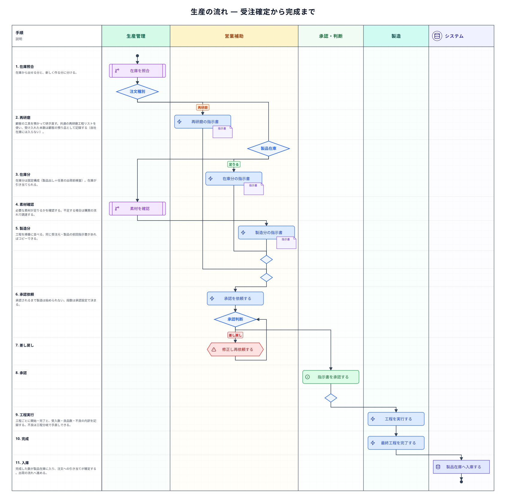
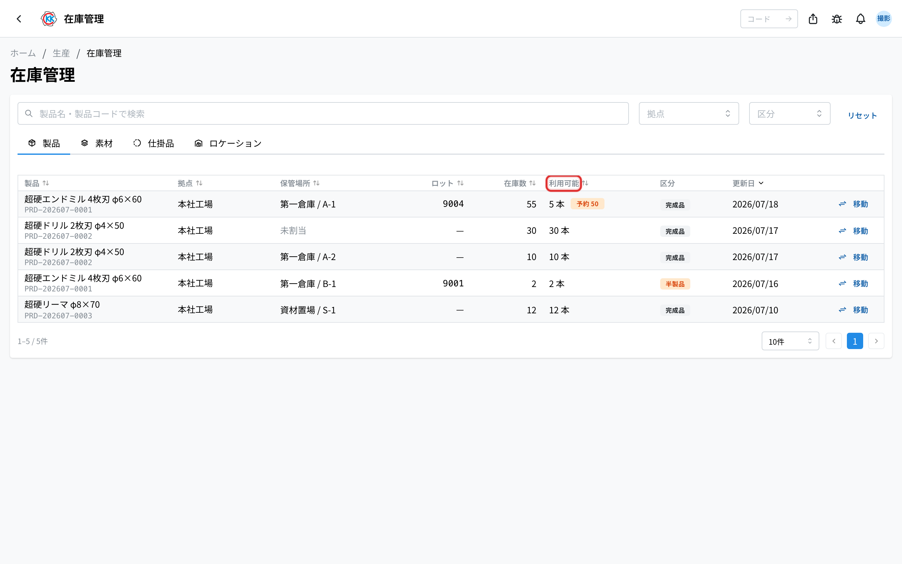
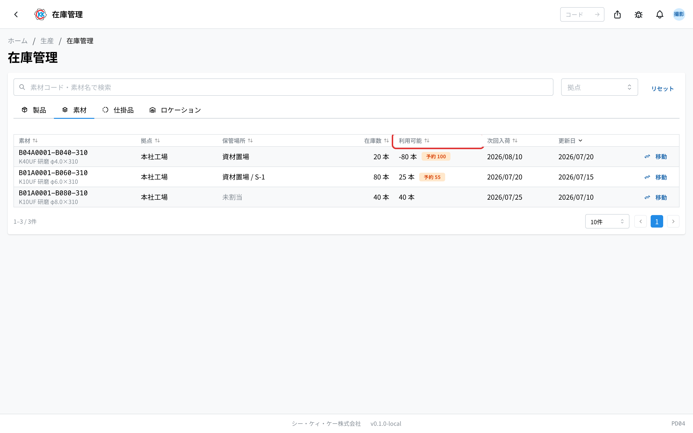
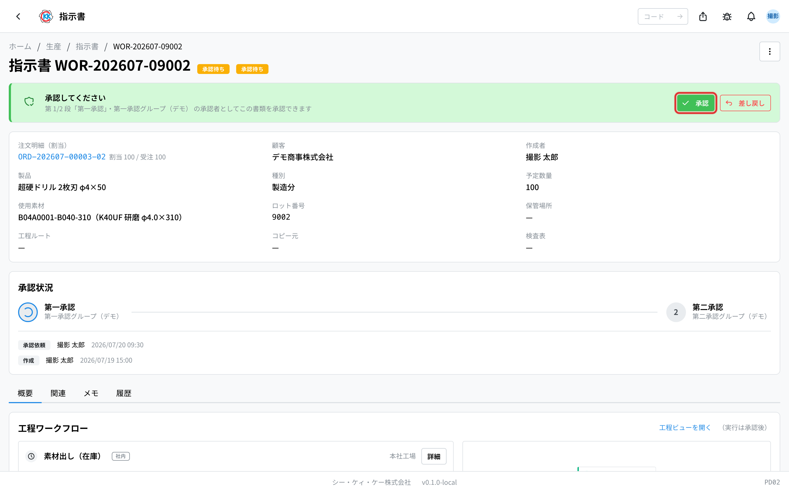
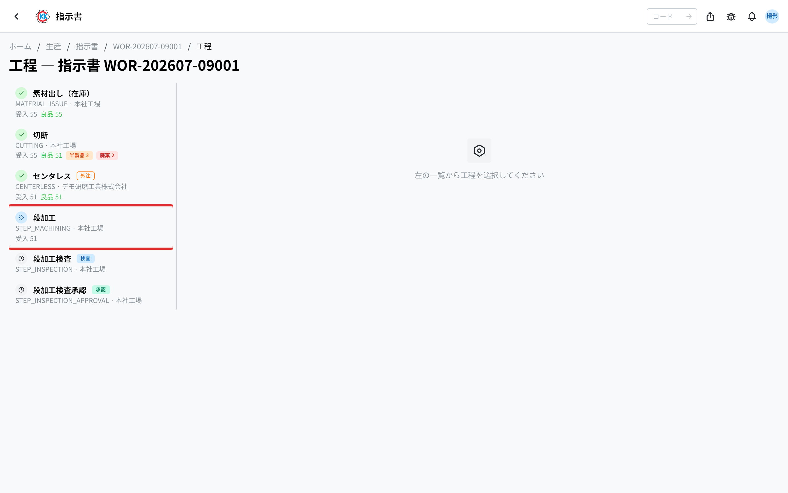
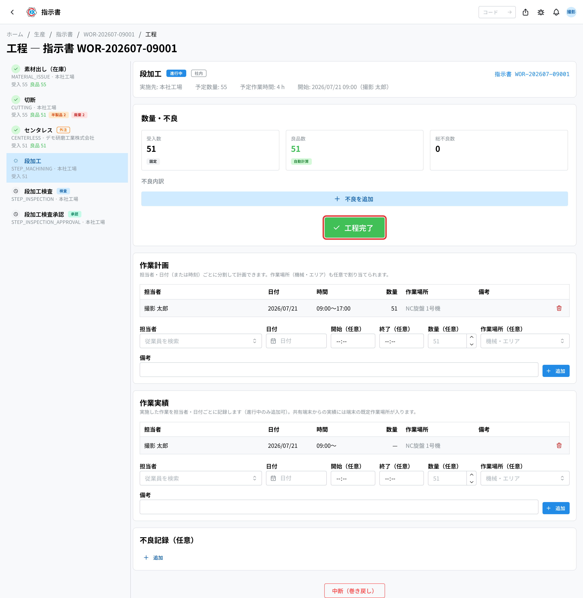
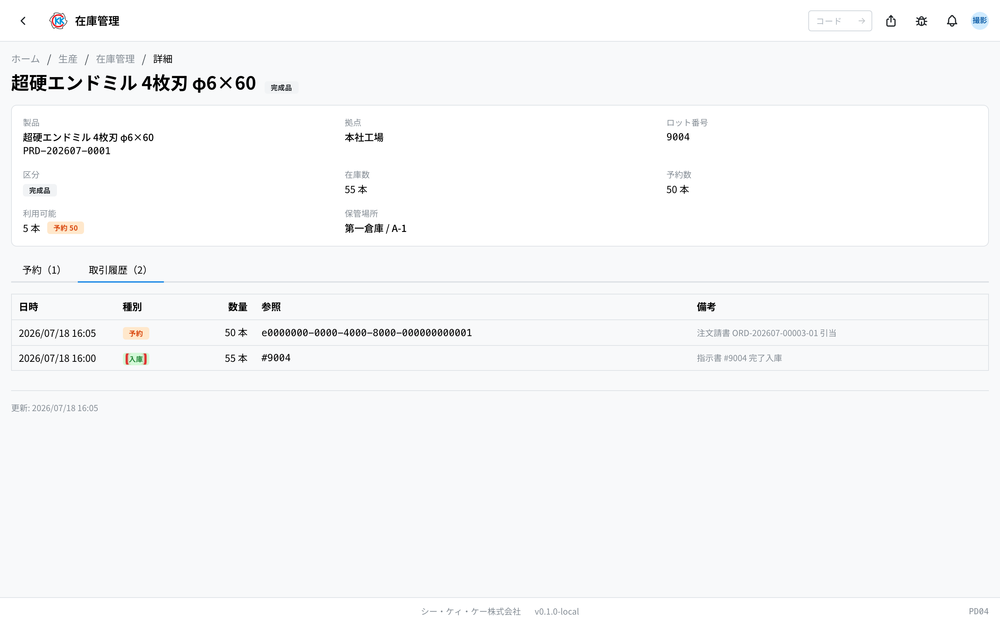

受注が確定してから、在庫を確認し、承認を得て、工程を実行して、出荷できる製品になるまでの流れをまとめたページである。「いまどの段階で、次に誰が何をするのか」と、在庫照合・差し戻し・不良の**分岐**、各**書類の状態**をここで確認する。基本の操作手順は[標準フロー](/manual/ja/process/default-flow)が持つ。

## 全体の流れ

## 段階ごとの担当とアプリ

| 段階 | 何をするか | 担当 | 使うアプリ |
|------|-----------|------|-----------|
| 1. 製品在庫を確認する | すでに在庫がある分と、新しく作る分を分ける | 生産管理 | [在庫管理](/manual/ja/operations/production/product-inventory/user)（`PD04`） |
| 2. 素材を確認する | 作るのに必要な素材が足りるかを見る | 生産管理 | [在庫管理](/manual/ja/operations/production/material-inventory/user)（`PD04`） |
| 3. 指示書を作る | 在庫分・製造分に分ける（工程を並べるのは製造分） | 社内営業補助 | [指示書](/manual/ja/operations/production/work-order/user)（`PD02`） |
| 4. 承認を受ける | 承認設定で決めた段をすべて通し、製造を始められる状態にする | 承認者 | [承認管理](/manual/ja/operations/production/approval/user)（`PD03`） |
| 5. 工程を実行する | 現場が開始・完了と本数を記録する | 製造 | [指示書](/manual/ja/operations/production/work-order/user) / 現場タブレット |
| 6. 完了する | 全工程が終わると製品在庫になる | 製造・生産管理 | [在庫管理](/manual/ja/operations/production/product-inventory/user) |

## それぞれの段階でおきること

### 1〜2. 在庫の確認

まず製品在庫を見て、**在庫から出せる分**と**新しく作る分**に分ける。作る分については素材が足りるかを確認し、足りなければ[購買の流れ](/manual/ja/process/purchasing)へ進む。外部から調達した半製品の扱いは[購買の流れ](/manual/ja/process/purchasing)を参照する。

### 3. 指示書を作る

在庫分と製造分でそれぞれ指示書を作る。工程を順番に並べるのは製造分で、必ず「出し・受渡し」の工程**ちょうど 1 つ**から始まる（複数は選べない）。工程の並びは製品×受注元（取引先）ごとの**工程ルート**として登録でき、指示書を作るときは 受注元が一致するルート → どの受注元にも限定しないルート → 先頭のルート の順で自動で選ばれる。**在庫分は「製品出し」＋任意の「出荷前検査」の固定構成**で、作成すると在庫が引き当てられる。出荷そのものは工程ではなく、[出荷書](/manual/ja/operations/shipping/delivery-order/user)で管理する。同じ受注元・製品で前回の指示書があればコピーできる（内容が変わっている場合は警告が出る）。工程ごとに社内で行うか外注に出すかを決め、外注にすると[外注依頼](/manual/ja/operations/purchasing/outsource-order/user)の一覧に出てくる（操作手順 … [標準フロー §6](/manual/ja/process/default-flow#stage-6)）。

### 4. 承認

指示書は承認されるまで製造を始められない。何段の承認を通るかは[承認設定](/manual/ja/operations/masters/approval-setting/user)（`MS0B`）で決まっており、決められた段を順に通る。条件付きルールを設定している場合は、指示書の内容（種別・予定数量など）によって段の構成が変わることがある。**差し戻された場合は内容を直して、もう一度承認を依頼する**（操作手順 … [標準フロー §7](/manual/ja/process/default-flow#stage-7)）。

### 5. 工程の実行

現場が工程ごとに開始・完了を記録する。受け入れた本数と、不良を 1 行ずつ入力する — 行ごとに 区分（半製品・廃棄・工程分岐）・不良種類・詳細・本数 を入れ、良品数と区分ごとの合計はそのリストから自動で決まる。**一時停止と再開ができ**、作業時間は区切りごとに積み上がる。同時に複数の工程を作業した時間は、同時作業数で按分される（2 つ同時なら半分ずつ）。現場のタブレットからも同じ操作ができる（操作手順 … [標準フロー §8](/manual/ja/process/default-flow#stage-8)）。

**不良の分岐** — 不良が出た場合は、その分を別の工程系列（分岐）へ流して手直しできる。

**分岐の変更にも承認がかかる** — 承認済み・進行中の指示書で分岐を追加・変更・削除すると、承認設定に「工程フロー変更」の段がある場合は承認の対象になる。事前承認の設定では承認が下りるまで変更は保留され、事後承認の設定ではその場で適用してから後で承認を受ける。事後承認で差し戻されても工程は自動では戻らず、確認するまで指示書に赤い注意が出続ける。

### 6. 完了

すべての工程が終わると、その指示書の製品が在庫に入り、[出荷の流れ](/manual/ja/process/shipping)へ進められる。

## 書類の状態

| 書類 | 状態の移り変わり |
|------|-----------------|
| 注文明細 | 下書き → 確定 → 製造中 → 一部出荷 → 出荷済（キャンセルは注文請書ごとの依頼 → 承認でのみ） |
| 指示書 | 下書き → 承認依頼中 → 承認済 → 進行中 → 完了（キャンセルあり） |
| 指示書の承認 | 承認依頼中 → 承認済（差し戻しあり）。いま何段目かは承認管理と指示書の画面に出る |
| 工程 | 未着手 → 進行中 → 完了（キャンセルあり。一時停止中は進行中のまま） |

## 止まりやすいところ

**工程を開始できない**
前の工程がまだ完了していないか、指示書が承認されていない可能性がある。指示書の状態と、前工程の完了を確認する。ほかに、ロット/伝票コードが必須の工程で未入力のとき、先行する指示書（指示書詳細の「関連指示書」）が未完了のとき、別のユーザーがセッション中のときも開始できない。

**指示書が承認されない**
段ごとに承認する人（グループ）が違う。承認管理で、いま何段目で止まっているかを確認する。

**完了した指示書の工程を見たい**
完了・キャンセル後も工程は開ける。ボタンが「詳細」になり、実績や検査記録を見返せる。

**工程を完了できない（不良の入力で止まる）**
良品数は受入数と不良の合計から自動で計算されるので、本数の不一致は起こらない。完了できないのは、不良の行に不良種類または詳細が入っていないか、不良の合計が受入数を超えているときである。不良の行を見直し、行ごとに区分・不良種類・詳細・本数をそろえる。

## 関連ページ

- 一つの注文を通しで追う … [標準フロー](/manual/ja/process/default-flow)
- 各アプリの操作と入力欄の意味 … 左の **操作方法 › 生産**
- 前の流れ … [販売の流れ](/manual/ja/process/sales)
- 次の流れ … [出荷の流れ](/manual/ja/process/shipping)
