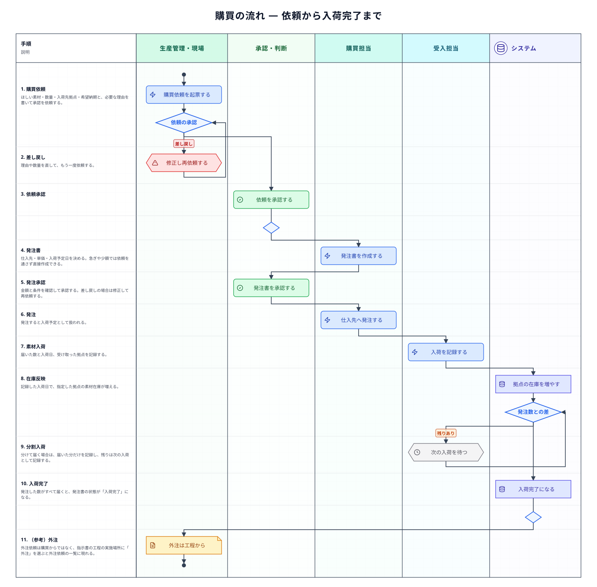
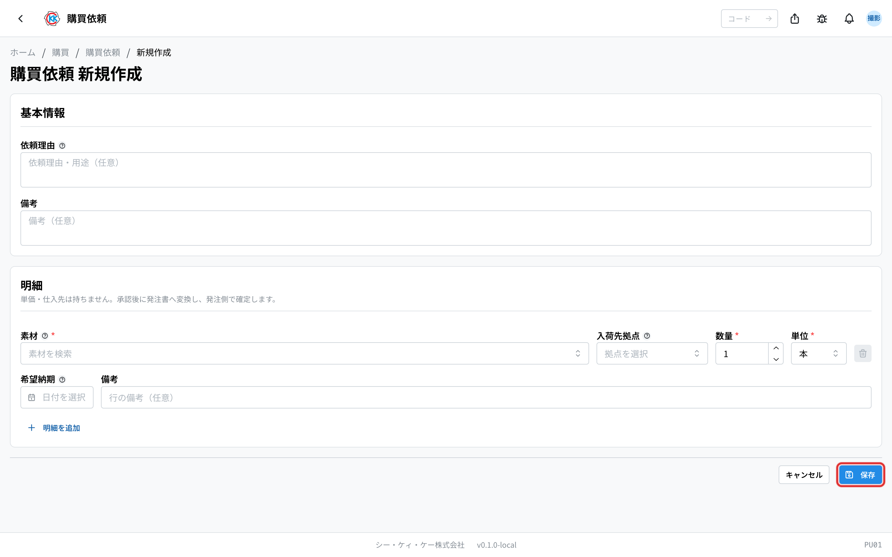
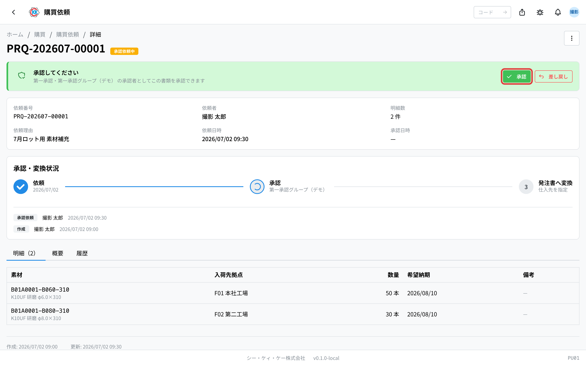
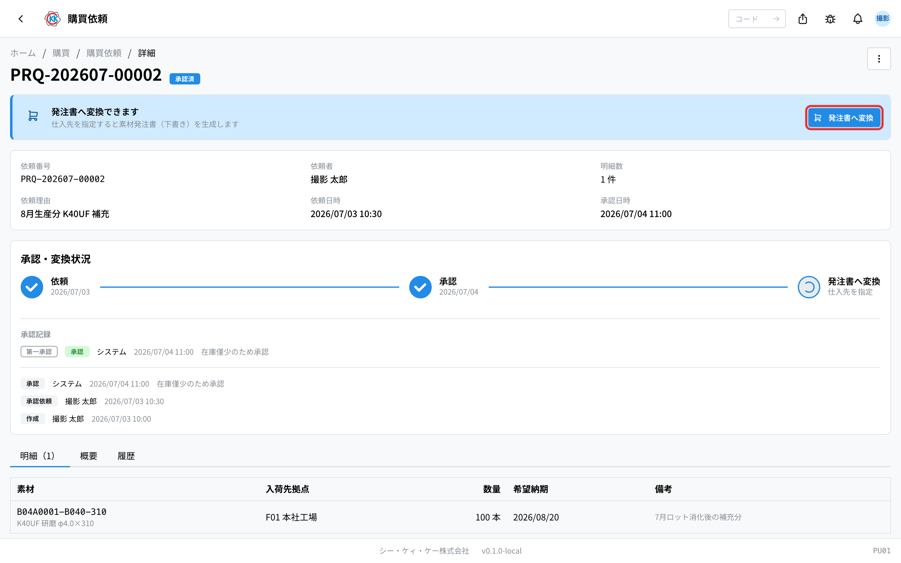
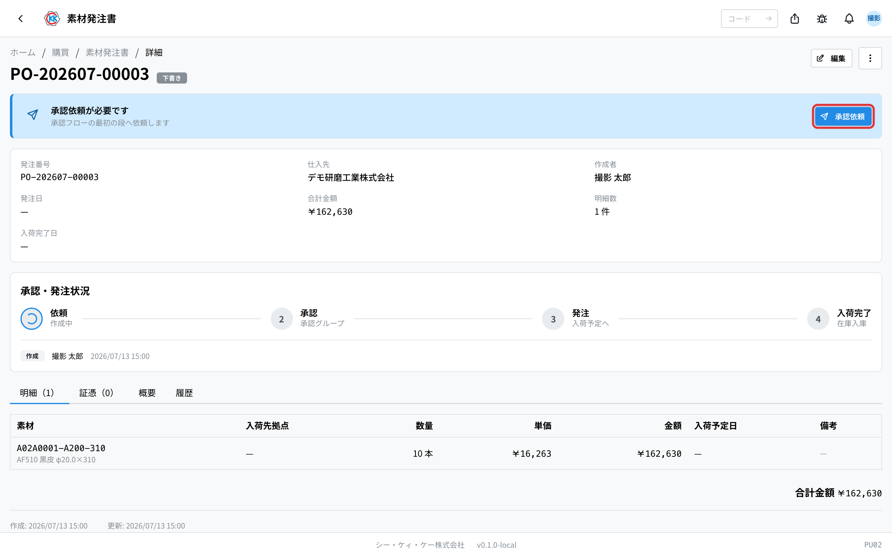
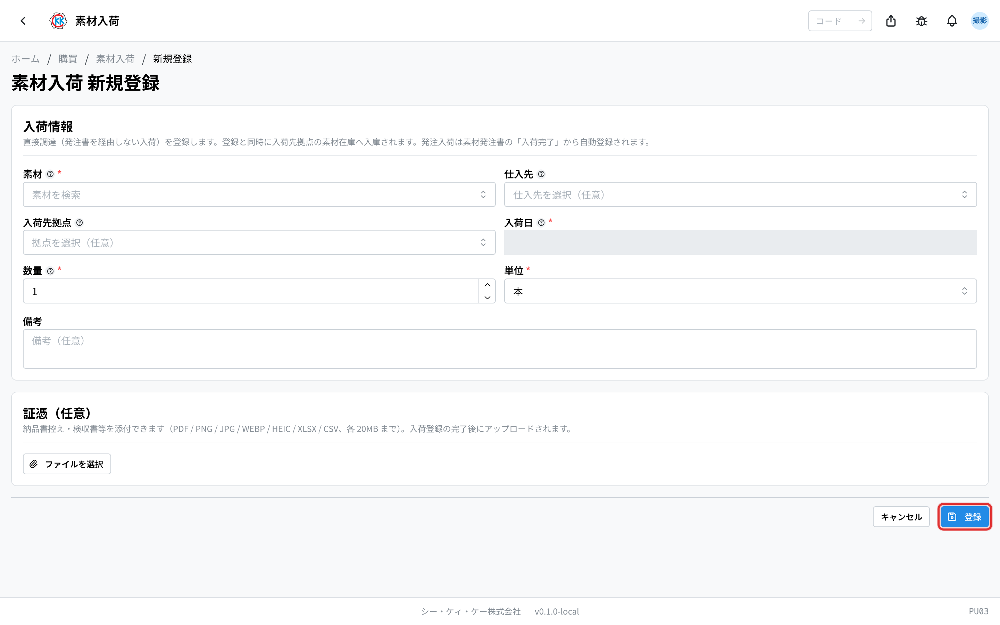
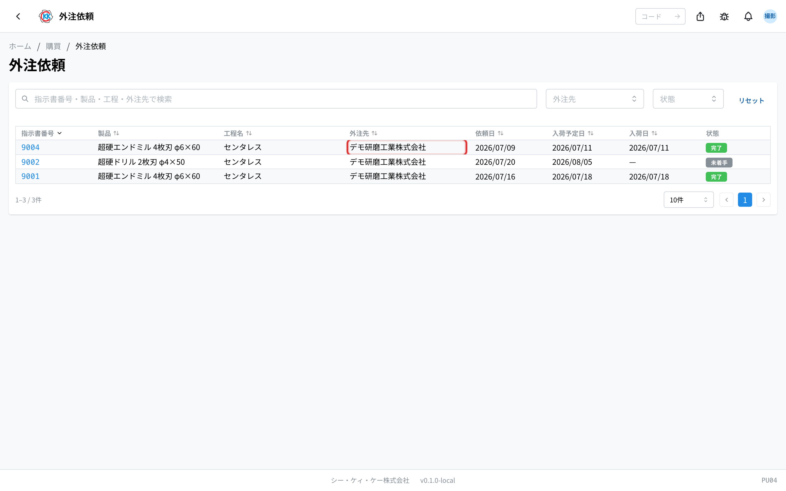

素材が足りないと分かってから、発注して受け取り、在庫として使えるようになるまでの流れをまとめたページである。「いまどの段階で、次に誰が何をするのか」と、承認・分割入荷の**分岐**、各**書類の状態**をここで確認する。

## 全体の流れ

急ぎのときや金額が小さいときは、購買依頼を通さずに**発注書から直接**始めることもできる。外部から調達した半製品は指示書を作らず、素材として受け入れるだけである。

## 段階ごとの担当とアプリ

| 段階 | 何をするか | 担当 | 使うアプリ |
|------|-----------|------|-----------|
| 1. 必要な素材を挙げる | ほしい素材・数量・希望納期と、必要な理由を書く | 生産管理・現場 | [購買依頼](/manual/ja/operations/purchasing/purchase-request/user)（`PU01`） |
| 2. 依頼を承認する | 本当に必要かを見て、承認または差し戻す | 承認者 | [購買依頼](/manual/ja/operations/purchasing/purchase-request/user)（`PU01`） |
| 3. 発注書を作る | 仕入先・単価・入荷予定日を決める | 購買担当 | [素材発注書](/manual/ja/operations/purchasing/purchase-order/user)（`PU02`） |
| 4〜5. 承認して発注する | 金額と条件を見て承認し、仕入先へ発注する | 承認者 → 購買担当 | [素材発注書](/manual/ja/operations/purchasing/purchase-order/user)（`PU02`） |
| 6. 受け取りを記録する | 届いた数と日付を記録する | 受入担当 | [素材入荷](/manual/ja/operations/purchasing/material-receipt/user)（`PU03`） |
| （並行）外注に出す | 加工の一部を外の会社へ出す | 生産管理 | [外注依頼](/manual/ja/operations/purchasing/outsource-order/user)（`PU04`） |

## それぞれの段階でおきること

### 1. 依頼を起票する（購買依頼）

ほしい素材・数量・入荷先の拠点・希望納期を入れ、**なぜ必要なのか**を書いて承認を依頼する。承認する人はその理由で判断するため、どの製品のどの工程で使うのかまで書いてあると早く進む。

### 2. 依頼を承認する

承認者が内容を確認して承認する。**差し戻された場合は、内容を直してもう一度依頼する**。

### 3. 発注書を作る（素材発注書）

承認された依頼から発注書を作る（依頼を通さず直接作ることもできる）。ここで**仕入先・単価・入荷予定日**を決める。単価は後で試算の材料費の参考にも使われるため、実際の取引価格を入れる。

### 4〜5. 発注書を承認し、発注する

金額と条件を確認して承認を依頼する。承認されたら仕入先へ発注し、状態が「発注済」になる。発注した分は入荷予定として扱われる。

### 6. 受け取りを記録する（素材入荷）

届いた素材を記録する。**記録した入荷日で、指定した拠点の在庫が増える。**

**分割入荷の分岐** — 発注した数と違っても構わない。分けて届く場合は、届いた分だけを記録し、残りは次の入荷として記録する。すべて届くと発注書が「入荷完了」になる。

### 外注依頼について

外注は購買依頼や発注書からではなく、**指示書の工程**から生まれる。工程の実施場所に「外注」を選び、外注先を指定すると、[外注依頼](/manual/ja/operations/purchasing/outsource-order/user)の一覧に出てくる。外注依頼の画面は状況を見るための一覧で、そこから新しく外注を作ることはできない。

## 書類の状態

| 書類 | 状態の移り変わり |
|------|-----------------|
| 購買依頼 | 下書き → 承認依頼中 → 承認済 → 発注済（差し戻し・キャンセルあり） |
| 素材発注書 | 下書き → 承認依頼中 → 承認済 → 発注済 → 入荷完了（キャンセルあり） |

## 止まりやすいところ

**依頼が承認されない**
依頼理由が「必要だから」だけになっていないかを確認する。どの製品のどの工程で、いつまでに要るのかが書いてあると判断できる。

**在庫が増えない**
入荷の記録が済んでいない可能性がある。素材入荷で、届いた数と入荷日、受け取った拠点を記録する。

**在庫が別の拠点に入った**
入荷先拠点の選び間違いである。実際に荷物が着いた拠点を選ぶ。

**発注書が「入荷完了」にならない**
発注した数のうち、まだ記録していない分が残っている。分けて届いた場合は、届くたびに入荷を記録する。

## 関連ページ

- 一つの注文を通しで追う … [標準フロー](/manual/ja/process/default-flow)
- 各アプリの操作と入力欄の意味 … 左の **操作方法 › 購買**
- 戻り先の流れ … [生産の流れ](/manual/ja/process/production)（素材不足はここから来る）
- 素材そのものの登録 … [素材マスタ](/manual/ja/operations/masters/material/user)
- 在庫の確認 … [在庫管理](/manual/ja/operations/production/material-inventory/user)
