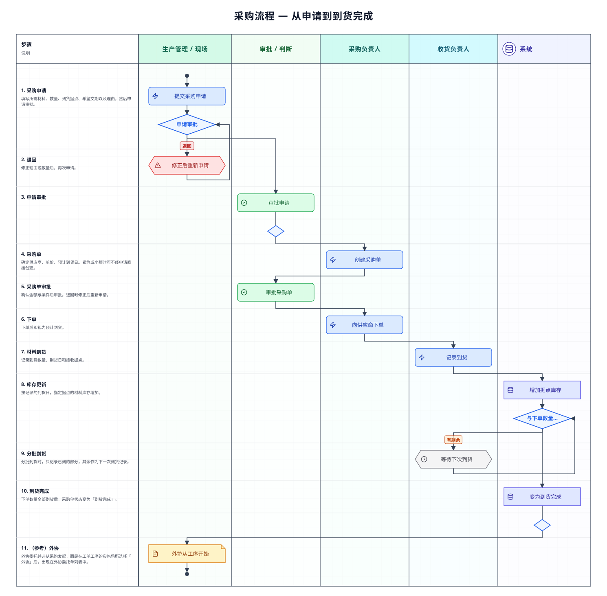

本页整理了从发现材料不足起，经过下单、收货，直到可作为库存使用为止的流程。在这里确认「现在处于哪个阶段、接下来该谁做什么」，以及审批・分批到货的**分支**、各**单据状态**。

## 整体流程

紧急时或金额较小时，也可以不经采购申请，**直接从采购单**开始。从外部采购的半成品不制作工单，只作为材料接收即可。

## 各阶段的负责人与应用

| 阶段 | 做什么 | 负责人 | 使用的应用 |
|------|--------|--------|------------|
| 1. 列出所需材料 | 写明想要的材料・数量・希望交期，以及需要的理由 | 生产管理・现场 | [采购申请](/manual/zh/operations/purchasing/purchase-request/user)（`PU01`） |
| 2. 审批申请 | 判断是否真的需要，批准或退回 | 审批人 | [采购申请](/manual/zh/operations/purchasing/purchase-request/user)（`PU01`） |
| 3. 制作采购单 | 确定供应商・单价・预计到货日 | 采购负责人 | [材料采购单](/manual/zh/operations/purchasing/purchase-order/user)（`PU02`） |
| 4～5. 审批并下单 | 查看金额与条件后批准，向供应商下单 | 审批人 → 采购负责人 | [材料采购单](/manual/zh/operations/purchasing/purchase-order/user)（`PU02`） |
| 6. 记录收货 | 记录到货的数量与日期 | 收货负责人 | [材料到货](/manual/zh/operations/purchasing/material-receipt/user)（`PU03`） |
| （并行）外协 | 把部分加工交给外部公司 | 生产管理 | [外协委托单](/manual/zh/operations/purchasing/outsource-order/user)（`PU04`） |

## 各阶段发生的事

### 1. 起草申请（采购申请）

填入想要的材料・数量・到货据点・希望交期，写明**为什么需要**，然后申请审批。审批人会根据这个理由判断，因此写清楚用于哪个产品的哪道工序，会推进得更快。

### 2. 审批申请

审批人确认内容后批准。**若被退回，需要修改内容后重新申请。**

### 3. 制作采购单（材料采购单）

从已批准的申请制作采购单（也可以不经申请直接制作）。在这里确定**供应商・单价・预计到货日**。单价之后还会用作价格试算中材料费的参考，因此请填入实际的交易价格。

### 4～5. 审批采购单并下单

确认金额与条件后申请审批。批准后向供应商下单，状态变为「発注済」（已下单）。已下单的部分会作为预计到货处理。

### 6. 记录收货（材料到货）

记录到货的材料。**以记录的到货日，指定据点的库存会增加。**

**分批到货分支** —— 与下单数量不一致也没关系。分批到货时，只记录已到货的部分，其余作为下一次到货记录。全部到货后，采购单变为「入荷完了」（已入库）。

### 关于外协委托单

外协不是从采购申请或采购单产生，而是从**工单的工序**产生。把工序的实施场所选为「外协」并指定外协厂商后，就会出现在[外协委托单](/manual/zh/operations/purchasing/outsource-order/user)的一览中。外协委托单画面是用于查看状况的一览，无法从那里新建外协。

## 单据状态

| 单据 | 状态变化 |
|------|----------|
| 采购申请 | 草稿 → 审批中 → 已批准 → 已下单（可能退回・取消） |
| 材料采购单 | 草稿 → 审批中 → 已批准 → 已下单 → 已入库（可能取消） |

## 容易卡住的地方

**申请未获批准**
确认申请理由是否只写了「因为需要」。写明用于哪个产品的哪道工序、何时之前需要，审批人才能判断。

**库存没有增加**
可能还没有记录到货。请在材料到货中记录到货数量、到货日与收货据点。

**库存进入了别的据点**
到货据点选错了。请选择货物实际到达的据点。

**采购单不会变为「入荷完了」（已入库）**
下单数量中还有尚未记录的部分。分批到货时，每次到货都要记录一次。

## 相关页面

- 追踪一笔订单的完整流程 … [标准流程](/manual/zh/process/default-flow)
- 各应用的操作与输入栏含义 … 左侧的 **操作方法 › 采购**
- 返回的流程 … [生产流程](/manual/zh/process/production)（材料不足由此而来）
- 材料本身的登记 … [材料主数据](/manual/zh/operations/masters/material/user)
- 库存的确认 … [库存管理](/manual/zh/operations/production/material-inventory/user)
