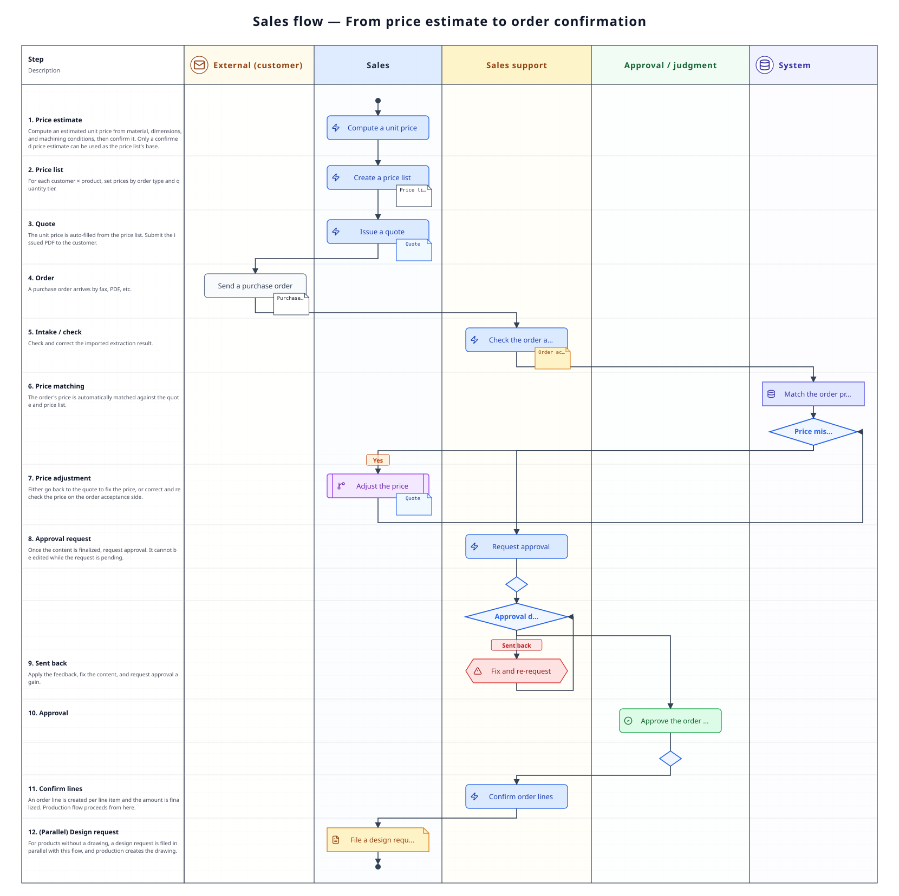

A page covering the flow from setting the unit price to receiving the order and handing it off to manufacturing. It is where you check "what stage things are at now, and who does what next", the **branches** such as price mismatches and being sent back, and each **document's states**. The basic steps to operate belong to [Standard flow](/manual/en/process/default-flow).

## Overall flow

For a product with no drawing, a **design request** is raised **in parallel** with this flow. It can be raised at the quote stage or once the order is taken, or **standalone** with no link to any document.

## Stage-by-stage roles and apps

| Stage | What happens | Role | App used |
|-------|--------------|------|----------|
| 1. Calculate the unit price | Calculate a quoted unit price for the product from material and machining costs | Sales | [Price estimate](/manual/en/operations/sales/trial-estimate/user) (`SA01`) |
| 2. Set the price per customer | Build a price list for a customer × product combination. This is also where you set larger orders to be cheaper | Sales | [Price list](/manual/en/operations/sales/price-list/user) (`SA02`) |
| 3. Send out a quote | Make a quote at the price list's unit price, and give the PDF to the customer | Sales | [Quote](/manual/en/operations/sales/quote/user) (`SA03`) |
| 4. Receive the order | Import the order document from the customer, check the content, and get approval | Sales support | [Order acceptance](/manual/en/operations/sales/order-acceptance/user) (`SA04`) |
| 5. Confirm the order | Confirm the approved order acceptance and make an order line per line item | Sales support | Order lines (`SA05`) |
| 6. Instruct manufacturing | Split into the stock portion and the manufactured portion and make a work order | Sales support | [Work order](/manual/en/operations/production/work-order/user) (`PD02`) |
| (In parallel) No drawing yet | Raise a design request, and once approved, production makes the drawing | Sales / sales support → production | [Design request](/manual/en/operations/sales/design-request/user) (`SA06`) |

## What happens at each stage

### 1. Calculating the unit price (price estimate)

A calculated price estimate is saved as「下書き」(draft); once the content is settled, set it to「確定」(confirmed). **Only a confirmed price estimate can be used as the basis for a unit price on the price list.** A price estimate already used on a price list becomes「価格表登録済」(registered) and cannot be edited as it is — to rework it, duplicate it instead (steps … [Standard flow §1](/manual/en/process/default-flow#stage-1)).

### 2. Setting the price per customer (price list)

One price list is built for a customer × product combination. It can hold a separate price per order type (production, test, sample, other), and the unit price can change by quantity range (steps … [Standard flow §2](/manual/en/process/default-flow#stage-2)).

### 3. Sending out a quote (quote)

Choosing the customer and the product fills in the unit price automatically from the price list. **A product not in the price list gets no unit price and shows a warning** — in that case you must first make a price estimate and a price list. Issuing saves the PDF and puts it in a state ready to give to the customer (steps … [Standard flow §3](/manual/en/process/default-flow#stage-3)).

### 4. Receiving the order (order acceptance)

Importing the order document (fax, PDF) received from the customer runs the reading automatically. Check and correct the results on screen. The delivery method (standard delivery / direct to end user) and the end user are also decided here — **if it is direct to end user and the end user is left unspecified, neither an approval request nor confirmation is possible** (steps … [Standard flow §4](/manual/en/process/default-flow#stage-4)). The delivery method decided here also **decides how the downstream delivery note is created** — confirming a delivery order for direct to end user automatically makes two delivery notes, one without prices shown (to the end user) and one with prices shown (to the customer) ([Shipping flow](/manual/en/process/shipping)). If the customer brings their own delivery note (e.g. with a barcode printed), attaching「顧客提供の納品書」(customer-supplied delivery note) here lets whoever prepares the shipment know.

**The price-mismatch branch** — a line's unit price is **filled in automatically from the price list** and cannot be edited as it is. When you accept a different price — say, the customer's order document states a different unit price — enter「**単価を上書き**」(override the unit price) on that line and decide it yourself. Since this is a deliberate price, it is not treated as a price mismatch and does not hold up the approval request (the approver's screen shows it as "N overridden unit prices").

What remains a **price mismatch** is only a line that "differs from the price list without being overridden" — this comes up when, say, the price list changes after saving. Before going on you must choose one of: go back to the quote and adjust the price, fix the price list, or accept it as an override (a confirmation is required to request approval while a mismatch remains).

**The approval branch** — once the content is confirmed, request approval. It cannot be edited while the request is pending. If it is sent back, fix the content and request again. How many approval steps it goes through is decided by the conditional rules in [Approval settings](/manual/en/operations/masters/approval-setting/user), and the steps can vary with the document's content (such as the total amount, the delivery method, or the assigned site).

### 5–6. Confirming the order and instructing manufacturing (order lines, work order)

Confirming the order acceptance creates an **order line** for each line item. Next, a **work order** is made against that order line. See [Production flow](/manual/en/process/production) for how the stock portion and the manufactured portion are split, and the fixed composition of the stock portion. From a confirmed order acceptance you can also go straight on to **making a delivery order** (steps … [Standard flow §5](/manual/en/process/default-flow#stage-5) / [§6](/manual/en/process/default-flow#stage-6)).

### (In parallel) Design request

For a product with no drawing, a design request is raised at the quote stage, once the order is taken, or **standalone** with no link to either. **Work can only start once it has passed approval** (the steps are decided in [Approval settings](/manual/en/operations/masters/approval-setting/user), and can vary by trigger, request kind and priority). Production makes the drawing, and completing it replaces the product's latest drawing (steps … [Standard flow (in parallel) design request](/manual/en/process/default-flow#design-request)).

Whether it is automatically a **revision** or a **new** one is decided by whether the product already has a drawing; a revision requires a reason for the change.

**The drawing itself belongs to [Drawing](/manual/en/operations/production/design-file/user) (PD06).** The request is a "please make this" — the finished drawing is registered to Drawing as a version (a preview, the drawing data, and reference material bundled together into one version). Versions are counted per "product × ordering customer". A request cannot be completed until at least one deliverable has been registered.

## Document states

| Document | How the state moves |
|----------|----------------------|
| Price estimate | Draft → Confirmed → Registered |
| Quote | Draft → Issued (shown as "expired" automatically once past its valid-until date; whether the order was won is read from whether an order acceptance exists) |
| Order acceptance | Importing → Draft → Pending approval → Approved → Confirmed → Archived / Cancelled (cancelling itself goes through a request → approval) |
| Order line | Draft → Confirmed → In production → Partially shipped → Shipped (can only be cancelled via a request made per order acceptance) |
| Work order | Draft → Pending approval → Approved → In progress → Completed |
| Design request | Draft → Pending approval → Not started → In progress → Completed (sent back if the approval fails; can be cancelled before completion) |

## Where things tend to get stuck

**No unit price on the quote**
The price list has no row for that customer and that product. Build a price estimate, then a price list, then make the quote again.

**Cannot edit a price estimate you want to fix**
A price estimate used on a price list becomes「価格表登録済」(registered) and cannot be edited. Duplicate it and rework it as a new price estimate. This mechanism exists so that the amount on a past quote never changes afterward.

**The order's price differs from the quote**
The mismatch shows on the order acceptance screen. Go back to the quote to adjust the price, then fix the order acceptance's content.

**The order acceptance does not move forward**
Check whether the approval request has completed, or whether the approver has finished approving. If the delivery method is direct to end user but the end user is unspecified, neither the approval request nor confirmation is possible — specify the end user before going on. Once approved, you can move on to the order line and the work order.

**The design request's "request approval" doesn't go through**
[Approval settings](/manual/en/operations/masters/approval-setting/user) has no step at all registered for "Design request". Register a step before raising the request.

**Cannot complete a design request**
The drawing for that request is not yet registered to [Drawing](/manual/en/operations/production/design-file/user). Register it from「設計図に登録」(register to drawing) on the request screen (the product and the ordering customer are filled in from the request).

## Related pages

- Following a single order from start to finish … [Standard flow](/manual/en/process/default-flow)
- How to operate each app and what each field means … **How-to › Sales** on the left
- Next flow … [Production flow](/manual/en/process/production)
- New to the system … [Getting started](/manual/en/start)
