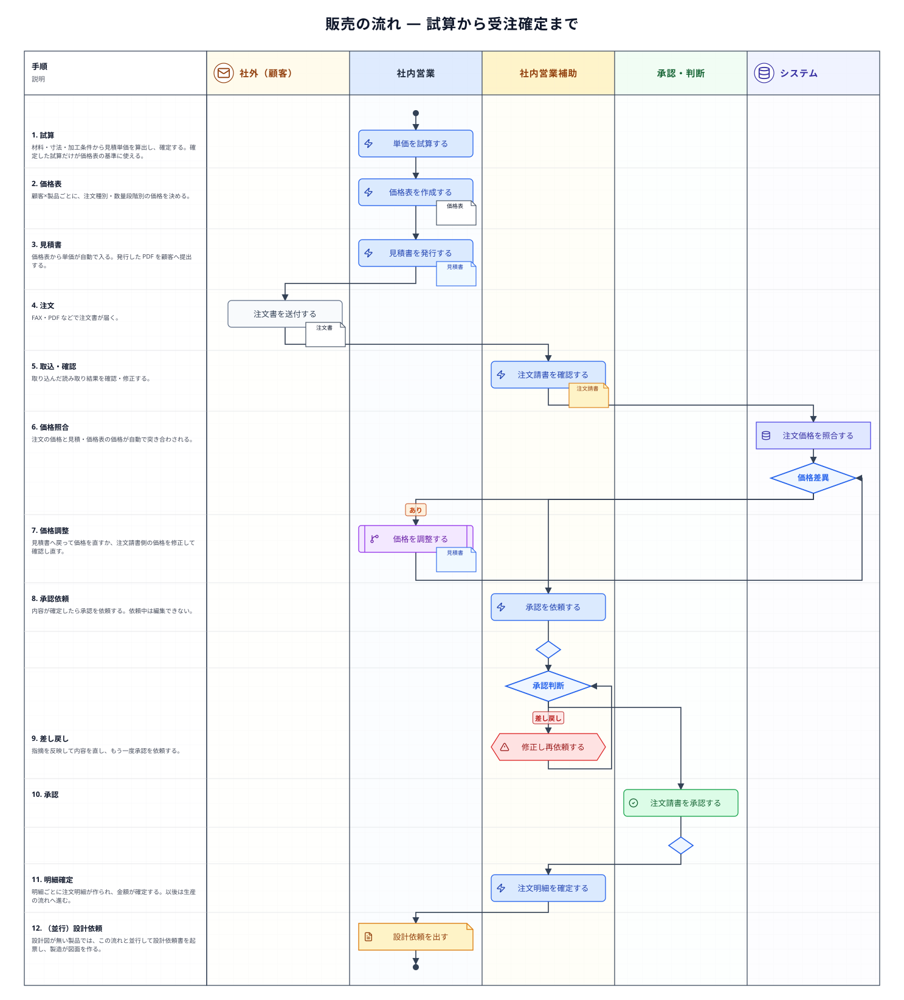
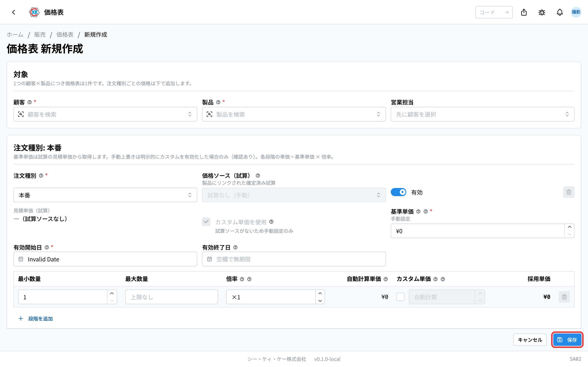
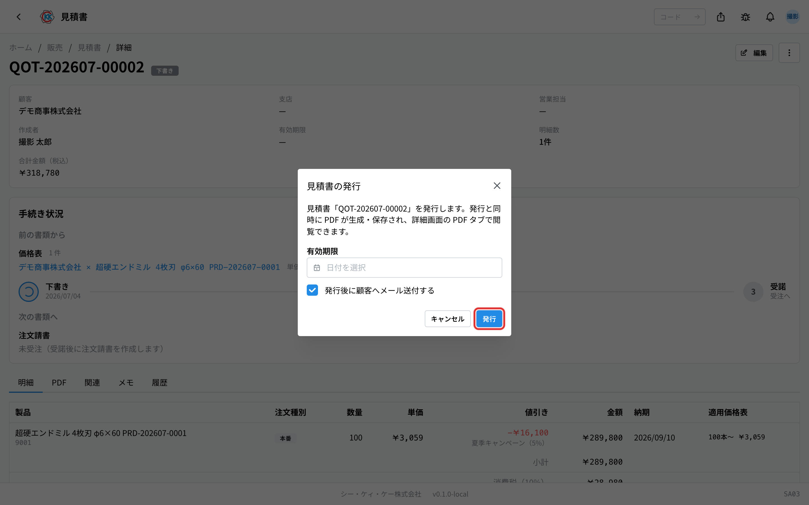
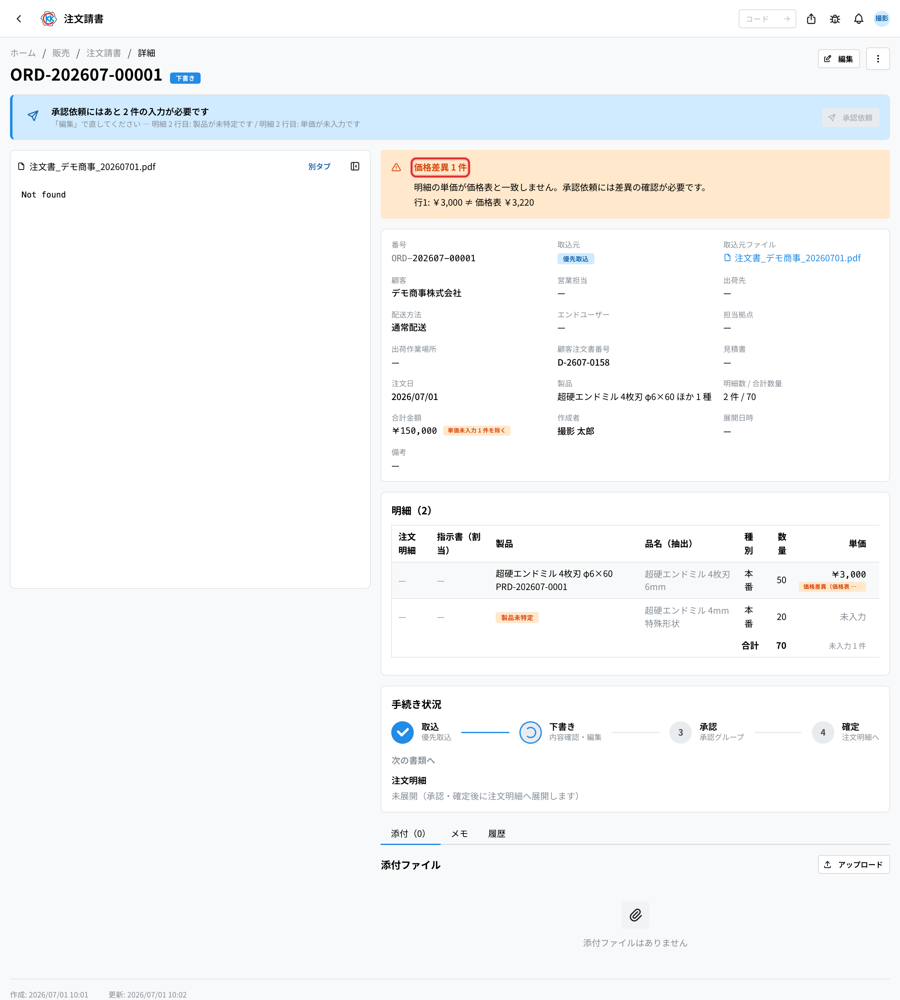
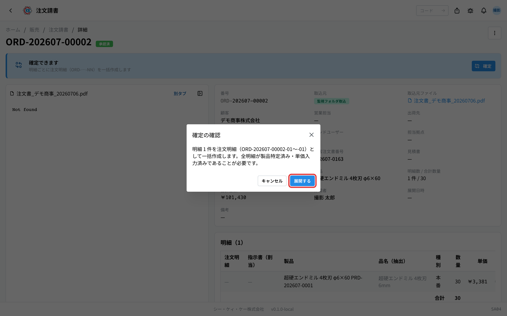
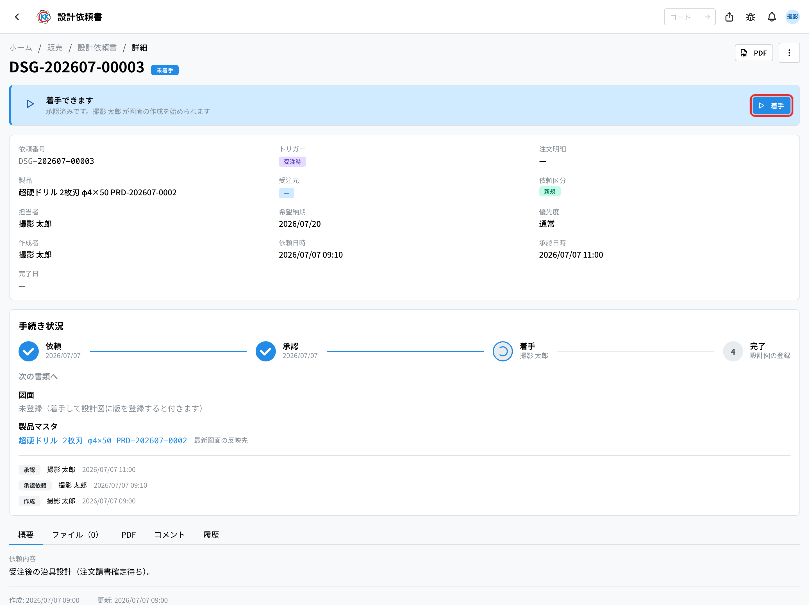

単価を決めてから注文を受け、製造の指示に渡すまでの流れをまとめたページである。「いまどの段階で、次に誰が何をするのか」と、価格差異・差し戻しなどの**分岐**、各**書類の状態**をここで確認する。基本の操作手順は[標準フロー](/manual/ja/process/default-flow)が持つ。

## 全体の流れ

設計図が無い製品では、この流れと並行して**設計依頼書**を起票する。見積時・受注時のほか、どの書類にも紐づかない**単独**の起票もできる。

## 段階ごとの担当とアプリ

| 段階 | 何をするか | 担当 | 使うアプリ |
|------|-----------|------|-----------|
| 1. 単価を計算する | 材料費や加工費から、その製品の見積単価を計算する | 社内営業 | [試算](/manual/ja/operations/sales/trial-estimate/user)（`SA01`） |
| 2. 顧客ごとの価格を決める | 顧客と製品の組み合わせで価格表を作る。数量が多いほど安くする設定もここで決める | 社内営業 | [価格表](/manual/ja/operations/sales/price-list/user)（`SA02`） |
| 3. 見積書を出す | 価格表の単価で見積書を作り、PDF を顧客へ提出する | 社内営業 | [見積書](/manual/ja/operations/sales/quote/user)（`SA03`） |
| 4. 注文を受ける | 顧客から届いた注文書を取り込み、内容を確認して承認を得る | 社内営業補助 | [注文請書](/manual/ja/operations/sales/order-acceptance/user)（`SA04`） |
| 5. 受注を確定する | 承認された注文請書を確定し、明細ごとに注文明細を作る | 社内営業補助 | 注文明細（`SA05`） |
| 6. 製造を指示する | 在庫分と製造分に分けて指示書を作る | 社内営業補助 | [指示書](/manual/ja/operations/production/work-order/user)（`PD02`） |
| （並行）設計図が無いとき | 設計依頼書を起票し、承認を経て製造が図面を作る | 社内営業 / 社内営業補助 → 製造 | [設計依頼書](/manual/ja/operations/sales/design-request/user)（`SA06`） |

## それぞれの段階でおきること

### 1. 単価を計算する（試算）

計算した試算は「下書き」で保存し、内容が固まったら「確定」にする。**確定した試算だけが価格表の単価のもとに使える**。一度価格表で使った試算は「価格表登録済」となり、そのままでは編集できない — 作り直す場合は複製する（操作手順 … [標準フロー §1](/manual/ja/process/default-flow#stage-1)）。

### 2. 顧客ごとの価格を決める（価格表）

顧客と製品の組み合わせで 1 つの価格表を作る。注文種別（本番・テスト・サンプル・その他）ごとに価格を分けて持て、数量の範囲ごとに単価を変えられる（操作手順 … [標準フロー §2](/manual/ja/process/default-flow#stage-2)）。

### 3. 見積書を出す（見積書）

顧客と製品を選ぶと、価格表から単価が自動で入る。**価格表に無い製品は単価が入らず、警告が出る** — その場合は先に試算と価格表を作る必要がある。発行すると PDF が保存され、顧客へ提出できる状態になる（操作手順 … [標準フロー §3](/manual/ja/process/default-flow#stage-3)）。

### 4. 注文を受ける（注文請書）

顧客から届いた注文書（FAX・PDF）を取り込むと、読み取りが自動で行われる。その結果を画面で確認・修正する。配送方法（通常配送・ユーザー直送）とエンドユーザー（最終需要家）もここで決める — **ユーザー直送でエンドユーザーが未指定のままだと、承認依頼も確定もできない**（操作手順 … [標準フロー §4](/manual/ja/process/default-flow#stage-4)）。

**価格差異の分岐** — 注文の価格と見積・価格表の価格は自動で突き合わされ、違いがあると画面に表示される。見積書へ戻って価格を調整するか、注文請書側の価格を修正してから先へ進める。

**承認の分岐** — 内容が確定したら承認を依頼する。依頼中は編集できない。差し戻された場合は内容を直して再依頼する。何段の承認を通るかは[承認設定](/manual/ja/operations/masters/approval-setting/user)の条件付きルールで決まっており、書類の内容（合計金額・配送方法・担当拠点など）によって段の構成が変わることがある。

### 5〜6. 受注の確定と製造の指示（注文明細・指示書）

注文請書を確定すると、明細ごとに**注文明細**が作られる。続いて、その注文明細に対して**指示書**を作る。在庫分・製造分の分け方と在庫分の固定構成は[生産の流れ](/manual/ja/process/production)を参照する。確定した注文請書からは、そのまま**出荷書の作成**へも進める（操作手順 … [標準フロー §5](/manual/ja/process/default-flow#stage-5)・[§6](/manual/ja/process/default-flow#stage-6)）。

### （並行）設計依頼

設計図が無い製品では、見積時・受注時のいずれか、またはどちらにも紐づかない**単独**で設計依頼書を起票する。**承認を通ってはじめて着手できる**（段の構成は[承認設定](/manual/ja/operations/masters/approval-setting/user)で決まり、トリガー・依頼区分・優先度で変えられる）。製造が図面を作り、完了すると製品の最新図面が入れ替わる（操作手順 … [標準フロー（並行）設計依頼](/manual/ja/process/default-flow#design-request)）。

製品にすでに図面があれば**改訂**、無ければ**新規**が自動で決まり、改訂では変更理由が要る。完了で上げたファイルは、プレビュー用・図面データ・参考資料をまとめて 1 つの版になる。

## 書類の状態

| 書類 | 状態の移り変わり |
|------|-----------------|
| 試算 | 下書き → 確定 → 価格表登録済 |
| 見積書 | 下書き → 発行済 → 受諾済 / 却下 / 期限切れ |
| 注文請書 | 取込中 → 下書き → 承認依頼中 → 承認済 → 確定済 → アーカイブ / キャンセル（キャンセルは依頼 → 承認で確定） |
| 注文明細 | 下書き → 確定 → 製造中 → 一部出荷 → 出荷済（キャンセルは注文請書ごとの依頼でのみ） |
| 指示書 | 下書き → 承認待ち → 承認済 → 進行中 → 完了 |
| 設計依頼書 | 下書き → 承認依頼中 → 未着手 → 進行中 → 完了（承認で差し戻されると差し戻し。完了前はキャンセルできる） |

## 止まりやすいところ

**見積書で単価が入らない**
価格表にその顧客・製品の行が無い。試算 → 価格表の順に作ってから、もう一度見積書を作る。

**試算を直したいのに編集できない**
価格表で使った試算は「価格表登録済」となり、編集できない。複製して新しい試算として作り直す。過去の見積の金額が後から変わらないようにするためのしくみである。

**注文の価格が見積と違う**
注文請書の画面で差異が分かる。見積書へ戻って価格を調整してから、注文請書の内容を直す。

**注文請書が次に進まない**
承認依頼が完了しているか、承認者の承認が済んでいるかを確認する。配送方法がユーザー直送なのにエンドユーザーが未指定の場合も、承認依頼・確定ができない — エンドユーザーを指定してから進める。承認済みになると注文明細・指示書へ進められる。

**設計依頼の「承認依頼」が通らない**
[承認設定](/manual/ja/operations/masters/approval-setting/user)に「設計依頼書」の段が 1 つも登録されていない。段を登録してから依頼を出す。

**設計依頼を完了できない**
図面ファイルが 1 つも添付されていない。添付できるのは**承認済み〜完了前**（未着手・進行中）のあいだだけなので、下書きのうちには入れられない。

## 関連ページ

- 一つの注文を通しで追う … [標準フロー](/manual/ja/process/default-flow)
- 各アプリの操作と入力欄の意味 … 左の **操作方法 › 販売**
- 次の流れ … [生産の流れ](/manual/ja/process/production)
- はじめて使う方 … [スタートマニュアル](/manual/ja/start)
