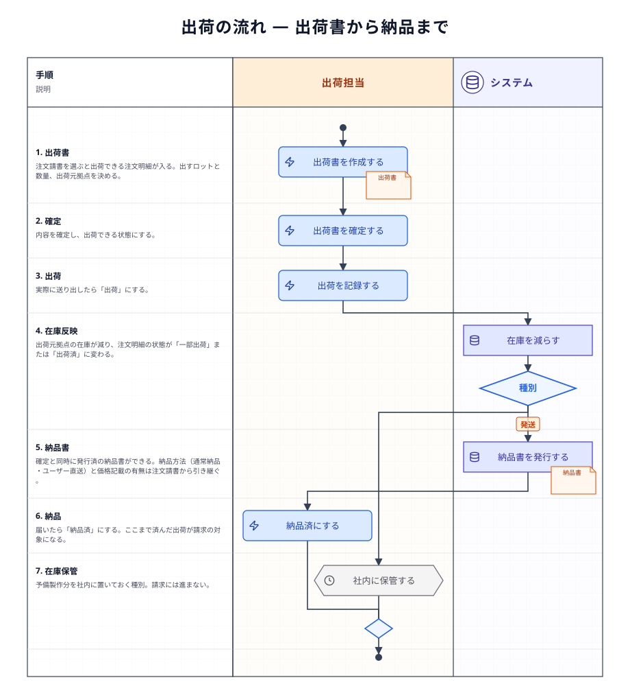
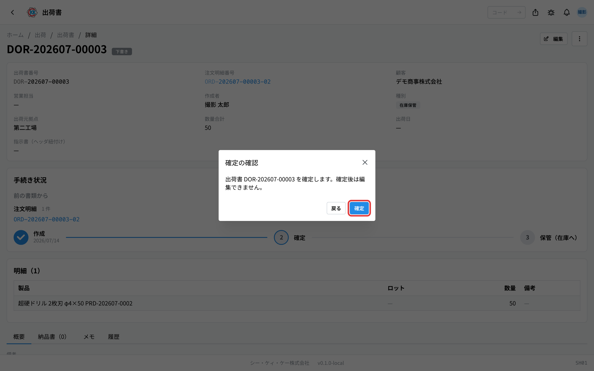
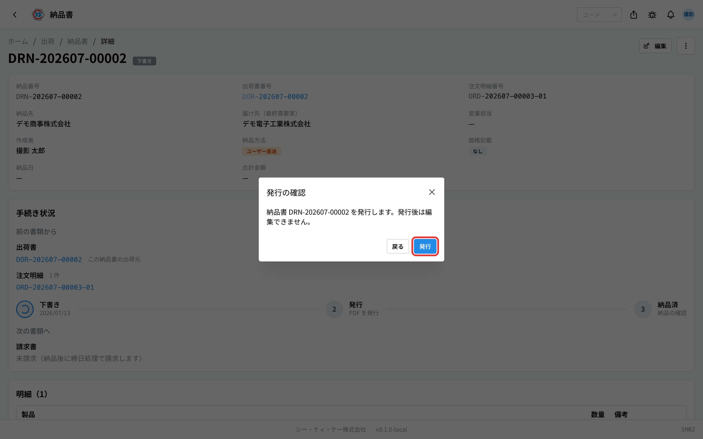
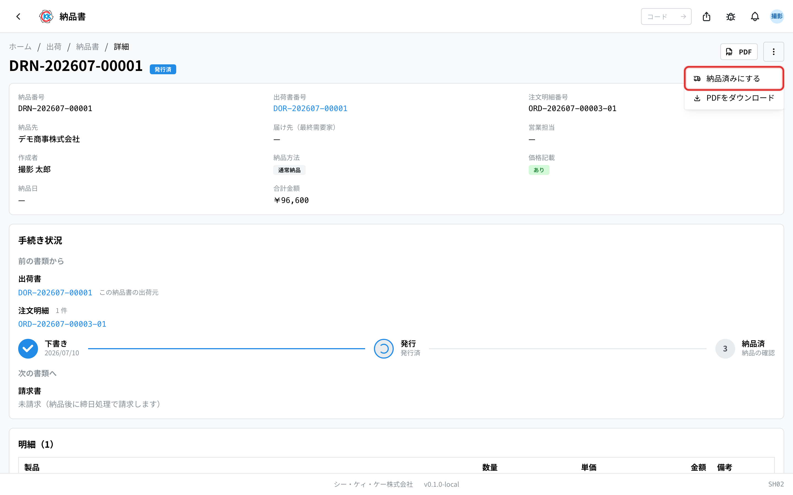

できあがった製品を送り出し、納品書を発行して届けるまでの流れをまとめたページである。「いまどの段階で、次に誰が何をするのか」と、発送／在庫保管の**分岐**、各**書類の状態**をここで確認する。基本の操作手順は[標準フロー](/manual/ja/process/default-flow)が持つ。

## 全体の流れ

## 段階ごとの担当とアプリ

| 段階 | 何をするか | 担当 | 使うアプリ |
|------|-----------|------|-----------|
| 1. 出荷書を作る | 注文請書を選び、出す明細とロットを決める | 出荷担当 | [出荷書](/manual/ja/operations/shipping/delivery-order/user)（`SH01`） |
| 2. 確定する | 内容を確定する。**納品書はここで自動でできる** | 出荷担当 | [出荷書](/manual/ja/operations/shipping/delivery-order/user)（`SH01`） |
| 3. 出荷する | 実際に送り出す。在庫が減る | 出荷担当 | [出荷書](/manual/ja/operations/shipping/delivery-order/user)（`SH01`） |
| 4. 納品書を確認する | 自動でできた納品書の中身（届け先・価格記載）を確かめ、必要なら下書きのうちに直す | 出荷担当 | [納品書](/manual/ja/operations/shipping/delivery-note/user)（`SH02`） |
| 5. 発行・納品 | PDF を発行し、届いたら納品済にする | 出荷担当 | [納品書](/manual/ja/operations/shipping/delivery-note/user)（`SH02`） |

## それぞれの段階でおきること

### 1〜3. 出荷書

**注文請書**を選ぶと、出荷できる注文明細が明細ごとのまとまりで入り、数量は指示書の完成数から自動で入る。出す**ロット**はまとまりごとに選べる。ロットは指示書の番号と同じもので、どの製造分を出したかがこれで残る。出荷元の拠点も選ぶ（**その拠点の在庫が減る**）。受注の残りを超える出荷はできず、残りに満たないときは「一部出荷」の確認が出る。複数の注文請書の明細を 1 つの出荷書に載せられるのは、**同一顧客・同一出荷先・同一配送方法**のときだけである — 条件の合わない組み合わせを選ぶと、その場で理由が表示される（操作手順 … [標準フロー §9](/manual/ja/process/default-flow#stage-9)）。

**種別の分岐** — 種別は 2 つある。

- **発送** … 顧客へ送るもの。納品書・請求へ進む
- **在庫保管** … 予備に作った分を社内に置いておくもの。請求には進まない

確定してから出荷すると、在庫が減り、注文明細の状態が「一部出荷」または「出荷済」に変わる。

### 4〜5. 納品書

**納品書は作らない — 出荷書を確定した時点で自動でできている。** 何通できるかは注文請書の配送方法で決まる。

- **通常配送** … 顧客宛・価格記載ありの **1 通**
- **ユーザー直送** … **2 通 1 組**。価格記載**なし**を最終需要家（現物に同梱して渡す相手）へ、価格記載**あり**を顧客（請求関係のある相手）へ

直送で 2 通に分けるのは、価格の付いた書類が最終需要家の手に渡る経路そのものを作らないためである。価格記載ありの直送納品書を開く・ダウンロードするときは確認が挟まり、画面上部にも警告が出る。**在庫保管の出荷書は納品書を作らない**（請求フロー外のため）。

届け先（最終需要家）は注文請書のエンドユーザー欄から決まる（注文請書側でユーザー直送を選ぶとエンドユーザーは必須である）。1 つの出荷書に束ねられるのは**同じエンドユーザー**の注文明細だけで、これは自動作成が届け先を 1 件に決められるようにするための条件でもある。

できた納品書は「下書き」なので、**発行する前なら**納品方法・最終需要家・価格記載・数量・単価・備考を直せる（出荷書と納品先は変えられない）。発行すると PDF が保存される。届いたら「納品済」にする。ここまでが済んだ出荷が、[請求の流れ](/manual/ja/process/billing)の対象になる（操作手順 … [標準フロー §10](/manual/ja/process/default-flow#stage-10)）。

## 書類の状態

| 書類 | 状態の移り変わり |
|------|-----------------|
| 出荷書 | 下書き → 確定 → 出荷済 |
| 納品書 | 下書き → 発行済 → 納品済 |

## 止まりやすいところ

**別の注文請書の明細を同じ出荷書に載せられない**
1 つの出荷書に束ねられるのは、同一顧客・同一出荷先・同一配送方法の注文明細だけである。条件の合わない分は、別の出荷書に分けて作る。

**出したいロットが選べない**
その製品の在庫が、選んだ出荷元拠点に無い可能性がある。拠点を確認するか、[在庫管理](/manual/ja/operations/production/product-inventory/user)で在庫のある拠点を調べる。

**在庫が減らない**
出荷書が「確定」までで止まっていないかを確認する。在庫は出荷の記録で減る。

**納品書に金額を出したくない**
下書きのうちに納品書の「価格記載」を外す。ユーザー直送では、金額なしの 1 通が最終需要家宛に自動でできているので、通常はそちらを渡す。

**納品書ができていない**
出荷書を確定したかを確認する（納品書は確定と同時にできる）。種別が「在庫保管」の出荷書は納品書を作らない。

**請求に出てこない**
納品まで済んでいない、または出荷書の種別が「在庫保管」になっている可能性がある。

## 関連ページ

- 一つの注文を通しで追う … [標準フロー](/manual/ja/process/default-flow)
- 各アプリの操作と入力欄の意味 … 左の **操作方法 › 出荷**
- 前の流れ … [生産の流れ](/manual/ja/process/production)
- 次の流れ … [請求の流れ](/manual/ja/process/billing)
