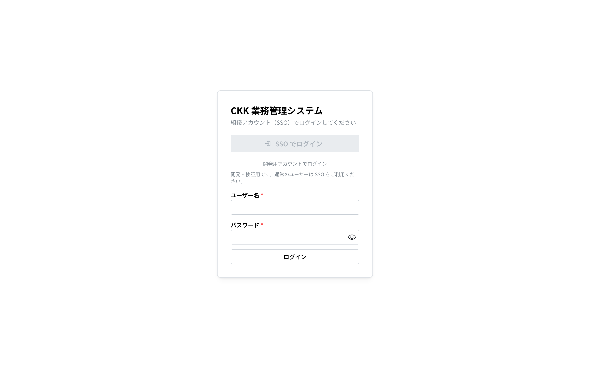
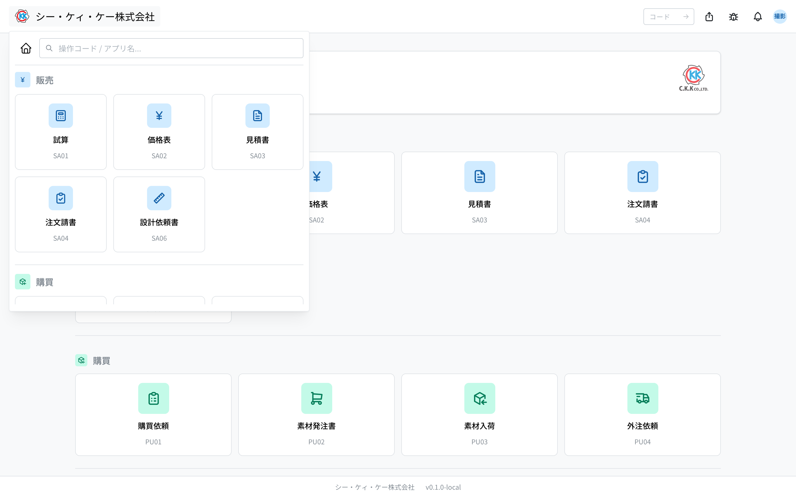
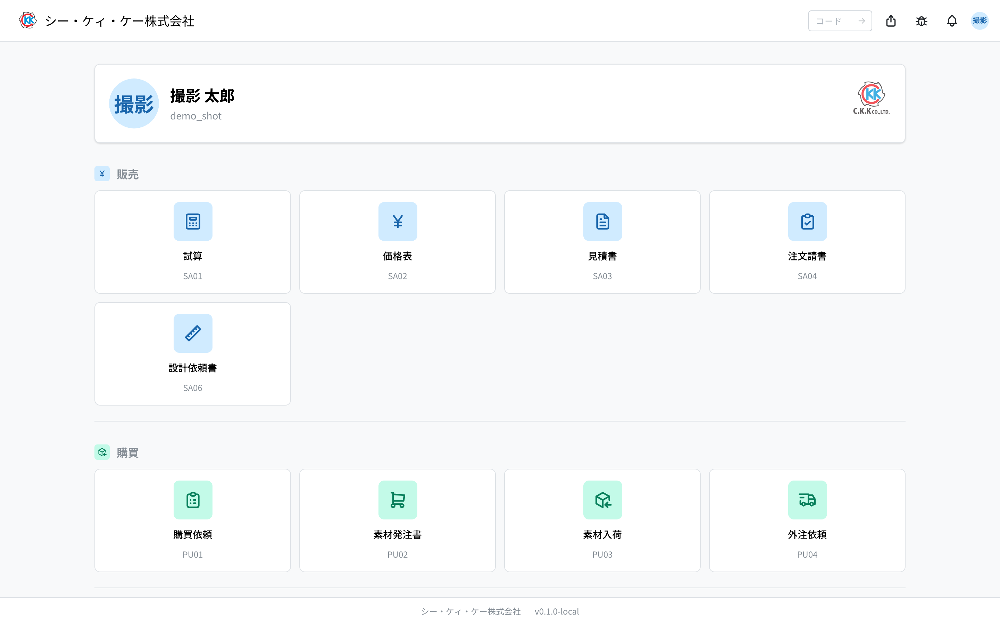

欢迎使用 CKK 业务管理系统。本页面向 **首次使用的用户**。专业术语在末尾的“术语表”中说明。

## 本系统是什么

一个将报价、接单、制造、出货、开票统一起来的公司内部系统。您将从三个销售应用开始使用：**试算、价格表、报价单**。

- **试算** … 根据成本计算“这个产品制造需要多少钱”。
- **价格表** … 按客户登记销售单价的台账。
- **报价单** … 制作提交给客户的报价单；单价会从价格表自动填入。

三者按顺序连接：**试算 → 价格表 → 报价单**（见“4. 销售流程”）。

## 1. 登录

1. 在浏览器中打开公司内部门户网址。
2. 用 **SSO（公司账号）** 按钮登录。开发用账号可点击登录页底部的“用开发账号登录”按钮，在展开的输入栏中使用。
3. 登录后，点击右上角的圆形头像，确认姓名与所属部门是否正确。

## 2. 界面说明

- 点击 **左上角 Logo** → 打开应用启动器（应用列表）。
- **中间搜索框** … 输入应用名称或“操作码”（如 `SA01`）并按回车即可直接跳转。
- **右上角铃铛** … 通知。**头像** … 个人资料、通知设置、主页设置、显示设置、退出登录。
- **主页** … 按类别显示可用应用（在主页设置中选择“自定义（按分组）”后，会改为按自建分组排列）。无权限的应用不会显示；此外，不同环境（正式 / 开发）公开的应用也不同。

## 3. 操作码（界面编号）

每个界面都有 4 位编号。记住后可从搜索框快速跳转。

- `SA01` 试算 / `SA02` 价格表 / `SA03` 报价单
- `MS01` 业务伙伴 / `MS0B` 审批设置

## 4. 销售流程（先掌握这些）

销售按 **试算 → 价格表 → 报价单 → 订单请书** 的顺序推进。
各环节由谁负责、使用哪个应用，请参见
[销售流程](/manual/zh/process/sales)。
想通盘了解从接单到请款的整体流程，请阅读
[标准流程](/manual/zh/process/default-flow)。

- 计算单价 … [试算](/manual/zh/operations/sales/trial-estimate/user)（`SA01`）
- 确定客户价格 … [价格表](/manual/zh/operations/sales/price-list/user)（`SA02`）
- 出具报价单 … [报价单](/manual/zh/operations/sales/quote/user)（`SA03`）

各应用的详细操作与输入栏的含义，请从左侧的 **操作方法** 打开。

## 5. 遇到问题时

- **找不到界面** … 可能是权限不足，请联系管理员。
- **收到通知** … 可从右上角铃铛查看内容。
- **修改自己的设置** … 全部集中在右上角头像菜单中：“个人资料”可更改通知邮箱与密码，“主页设置”可更改收藏应用与显示方式，“显示设置”可更改界面语言、日期/时间格式与时区（参见[用户设置手册](/manual/zh/user-settings)）。

## 术语表

- **试算** … 根据成本计算销售单价；报价的前期准备。
- **参考单价 / 采购实绩** … 材料的采购价格（过去的采购记录）。试算的材料费根据该实绩价格自动计算。
- **工具种类** … 产品类型。默认有 圆棒、圆筒、带OH 三种（管理员可以添加），不同类型的输入项与计算式不同。
- **批量（Lot）** … 一起制造的数量批次。数量越大，单件单价越低。
- **订单类型** … 正式、测试、样品（金额为 0）、其他。同一产品可按类型区分价格。
- **备料 / 成型** … 加工前的准备费用，按数量分摊到单件。
- **确定 / 草稿** … 草稿（编辑中）→ 确定（内容固定）。确定后的试算可在创建价格表时选择。
