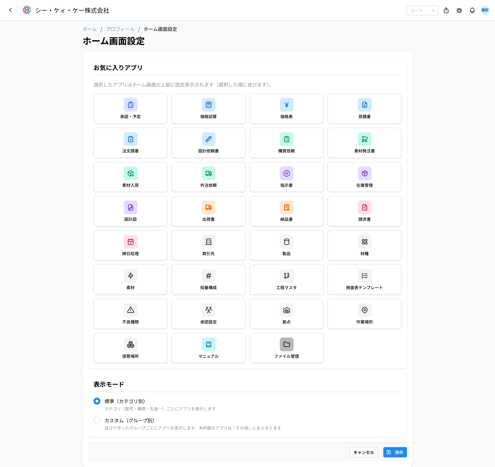

自分のアカウントに関する設定です。右上のアバターメニュー →「プロフィール」/「通知設定」/「ホーム画面設定」/「表示設定」から開きます。

> 💡 自分用の設定はすべてこのアバターメニューにまとまっています。ホーム画面には設定のボタンはありません。

## プロフィール

- **表示名・ユーザー名**：社内ディレクトリ（AD）と同期されます。変更は情報システム部門へ依頼してください。プロフィール画面にはこのほか、アカウントの種別・最終ログインが表示されます（所属はヘッダーのアバターメニューにのみ表示されます）。
- **承認グループ**：自分が入っている承認グループが表示されます。書類の承認ができるかどうかは、ここに出るグループで決まります。グループの変更は管理者へ依頼してください。
- **メールアドレス（通知宛先）**：通知を受け取るメールアドレスを設定します。空欄の場合、メール通知は送信されません。

### プロフィール写真

- プロフィール画面の「写真を設定」（設定済みの場合は「変更」）から、自分の写真をアップロードできます。画像を選ぶと正方形に切り抜く画面が開くので、位置と大きさを合わせて保存します。
- 保存した写真は大小 2 つのサイズで保存され、ヘッダーのアイコンのほか、一覧や履歴の小さなアイコンにも同じ写真が使われます。
- 写真は社内ディレクトリ（AD）からは取得されません。このシステム内で設定します。ごみ箱ボタンで削除でき、削除すると名前のイニシャル表示に戻ります。

## パスワード

- ログインに SSO を使う場合、パスワードは社内アカウント側で管理します。
- システム内アカウントのパスワードを変更する場合は「プロフィール → パスワード変更」から行います。現在のパスワードと新しいパスワード（2 回）を入力します。

## 通知

- **アプリ内通知**：ヘッダーのベルに届きます。「すべて既読」でまとめて既読にできます。
- **メール通知**：プロフィールのメールアドレス宛に送られます。
- **プッシュ通知**：「プロフィール → 通知設定」でデバイスごとに有効化すると、ロック画面・デスクトップに通知が届きます。
- **チャネルの切り替え**：「プロフィール → 通知設定」の上部に「メール通知」「プッシュ通知」のオン / オフのスイッチがあります。メール通知をオフにすると、承認依頼などのメールは届かなくなります。

## プッシュ通知の有効化（デバイス別）

- **Chrome / Edge（パソコン）**：「プロフィール → 通知設定」→「このデバイスで有効化」を押し、ブラウザの通知許可で「許可」を選びます。
- **Android（Chrome）**：同じ手順で有効化できます。「アプリをインストール」ボタンが表示された場合は、インストールするとホーム画面から起動できます（任意）。OS 側の設定で Chrome の通知が許可されている必要があります。
- **iPhone / iPad（iOS 16.4 以降）**：Safari のタブからは有効化できません。Safari の共有ボタン →「ホーム画面に追加」でアプリを追加し、ホーム画面の「CKK」アイコンから開き直してから「このデバイスで有効化」を押します。
- 通知を誤ってブロックした場合は、ブラウザのサイト設定で通知を「許可」に戻してから再度有効化してください。

## 登録デバイス

- 「プロフィール → 通知設定」の「登録デバイス」で、プッシュ通知を有効にしたデバイスの一覧を確認・削除できます。使わなくなった端末は削除してください。

## ホーム画面設定

アバターメニューの「ホーム画面設定」で、ホーム画面の並びを自分用にカスタマイズできます。

- **お気に入りアプリ** … カードをクリックして選ぶと、ホーム画面の最上部に「お気に入り」としてまとめて表示されます。選んだ順が表示順になります。
- **表示モード** … 「標準（カテゴリ別）」と「カスタム（グループ別）」を切り替えられます。カスタムでは自分で作ったグループごとにアプリが並び、どのグループにも入れていないアプリは「その他」にまとまります。
- **カスタムグループ** … 「新しいグループ」にグループ名を入れて追加します。グループごとに 名前の変更・上へ移動 / 下へ移動・グループを削除 ができ、所属させるアプリを選べます（1 つのアプリが入れるグループは 1 つまで。別のグループに入っているアプリは選べません）。

## 表示設定

アバターメニューの「**表示設定**」で、画面の言語・日時の見え方・文字の大きさを変えられます。設定は**自分だけ**に適用されます（言語と日時は Web と工場のタブレット（共有端末）で共通、文字の大きさ・太さは Web だけです）。

- **言語** … 日本語 / English / 中文 から選びます。
- **日付の形式** … `2026/03/05` / `2026-03-05` / `05/03/2026` / `03/05/2026` から選びます。
- **時刻の形式** … 24時間（14:30）または 12時間（2:30 PM）。
- **タイムゾーン** … 日時をどの地域の時刻で表示するかです。海外拠点や出張先で使うときに合わせます。選択肢にはその地域の**現在時刻**が添えてあるので、日本との時差がその場で分かります。
- **文字の大きさ** … 最小 / 小 / 標準 / 大 / 最大 の 5 段です。真ん中の「標準」がこれまでの大きさで、変えると**画面全体**の文字と余白が一緒に大きく（小さく）なります。選択肢は**その段の大きさで**書いてあるので、押す前に見え方の見当がつきます。
- **文字を太くする** … 本文の文字を 1 段太くします。もともと太い見出しや強調はそのままです。

選ぶとすぐ下の「**プレビュー**」に反映されるので、保存する前に見え方を確かめられます。**文字の大きさと太さは画面全体にその場で反映されます**（一覧やボタンまで含めて読みやすいかを確かめるためです）。保存すると、一覧・詳細・履歴など**日時が出るところ全部**に反映されます。

> 💡 **タイムゾーンを変えても、記録されている時刻そのものは変わりません。** 同じ出来事を、どの地域の時計で読むかが変わるだけです。

> 💡 **保存せずに画面を離れると、文字の大きさは元に戻ります。** 試してから決められます。携帯など横幅の狭い端末で文字を大きくすると、画面上部の操作コード入力欄は場所を譲って消えます（同じ検索は左上のロゴから開くアプリ一覧の中にあります）。

### まだ日本語のままの画面があります

言語を English / 中文 にしても、**翻訳がまだの画面は日本語で表示されます**（不具合ではありません）。いまは右上のメニュー・通知パネル・この表示設定の画面が切り替わります。日付・時刻・タイムゾーンの設定は最初からすべての画面に効きます。

### 帳票（PDF）はこの設定に従いません

見積書・納品書・請求書などの PDF は、**誰が開いても同じ日本時間・同じ書式**で印字されます。出来上がった書類の日付が読む人によって変わってしまわないようにするためです。

## マニュアルの言語

- このマニュアル（/manual）は右上の言語リンクで日本語 / English / 中文 を切り替えられます。アプリ本体の言語は上の「表示設定」で変えます。
