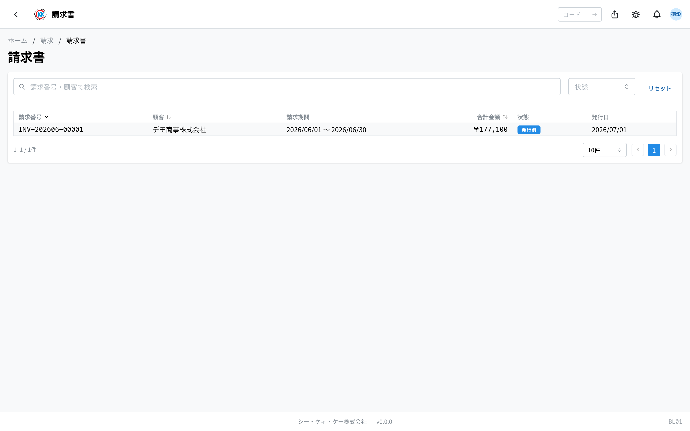
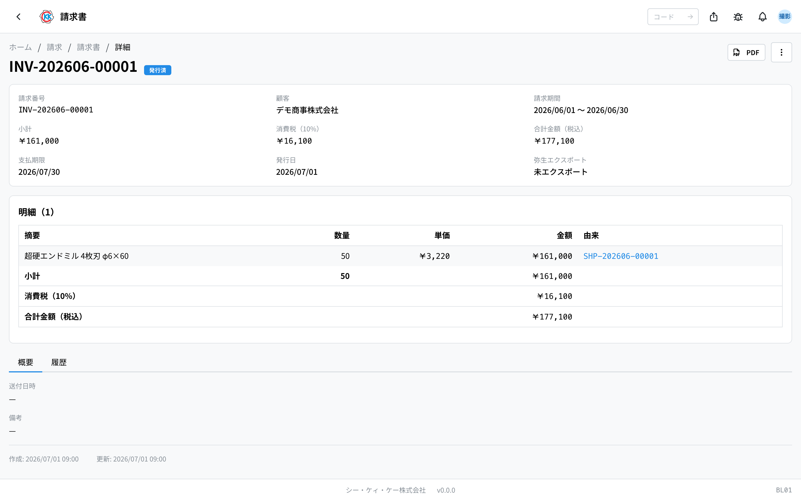

操作コード **BL01**。締日処理から生成された請求書（INV-YYYYMM-NNNNN）の発行・送付・入金を管理し、PDF と弥生会計 CSV を出力します。

> このアプリは現在 **開発環境（dev）のみ** で公開されています。本番公開までに画面や手順が変わる場合があります。

## このアプリでできること

顧客への **請求書** を管理します。請求書はこの画面では手入力で新規作成せず、**[締日処理](/manual/ja/apps/billing-closing/user)（BL02）の「請求書を生成」** で自動的に作成されます。明細は出荷済みの[出荷書](/manual/ja/apps/shipping-order/user)から作られます。

- 明細には由来の出荷書番号・[納品書](/manual/ja/apps/delivery-note/user)番号がリンク表示され、元の書類をすぐ確認できます。
- 消費税は[顧客](/manual/ja/masters/customer/user)マスタの税区分から自動計算されます（課税 10% / 軽減税率 8% / 非課税 0%）。
- 支払期限は「締日 + 顧客の支払サイト（未設定時は 30 日）」で自動設定されます。
- 操作には請求書の権限（invoice）が必要です。

## 詳細画面の見方

- 上部に請求番号・顧客（＋支店）・請求期間・小計・消費税・合計金額（税込）・支払期限・発行日・弥生エクスポート日時が表示されます。
- 明細テーブルには摘要（製品名＋ロット）・数量・単価・金額と、由来の出荷書・納品書リンクが並びます。
- 「履歴」タブで操作履歴を確認できます。
- 画面の消費税欄のラベルは「消費税（10%）」と固定表記ですが、実際の税額は顧客マスタの税区分（10% / 8% / 0%）で計算された金額です。

## 状態と操作

操作は詳細画面右上のメニューから行います。状態は順に進み、編集画面はありません。

- **下書き（DRAFT）**：生成直後の状態です。内容を確認したら **発行** します（発行日は当日で記録）。
- **発行済（ISSUED）**：お客様へ送ったら **送付済みにする** を押します。
- **送付済（SENT）**：入金を確認したら **入金済みにする** を押します。
- **支払済（PAID）**：完了状態です。

## PDF・弥生会計 CSV

- **PDF** ボタンで請求書 PDF を出力できます。
- メニューの **弥生会計CSV** で、弥生会計 Next に取り込める仕訳 CSV（借方: 売掛金 / 貸方: 売上高・仮受消費税、UTF-8 BOM 付き）をダウンロードできます。
- エクスポートすると日時が記録され、詳細画面の「弥生エクスポート」欄に表示されます。
- CSV エクスポートには締日処理のエクスポート権限（billing_closing の EXPORT）が必要です。

## 一覧・検索

- 請求番号・顧客で検索でき、状態で絞り込めます。
- 行をクリックすると詳細画面へ移動します。
