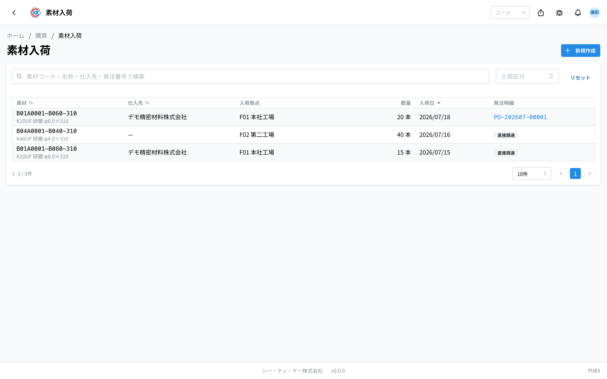
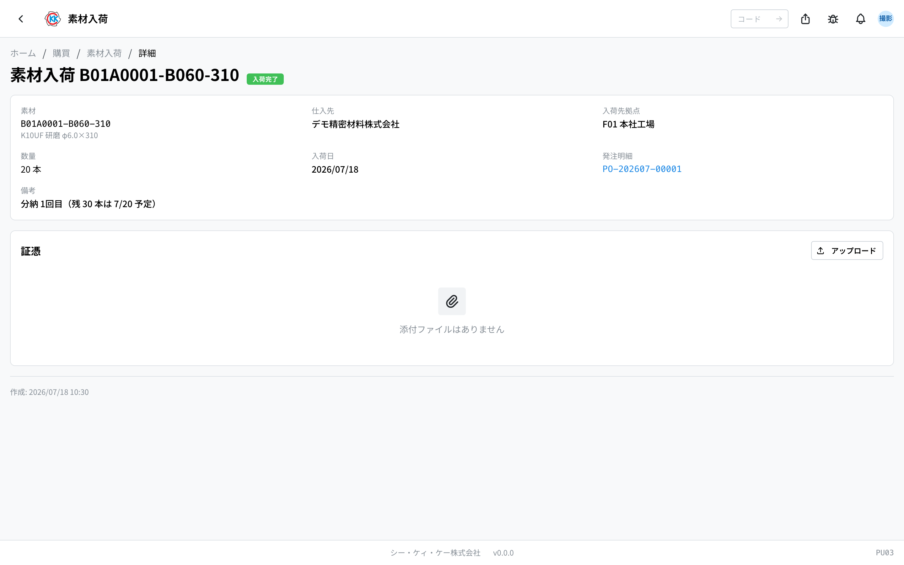

操作コード **PU03**。素材が拠点に届いたことを記録し、素材在庫へ入庫するアプリです。

> このアプリは現在 **開発環境（dev）のみ** で公開されています。本番公開までに画面や手順が変わる場合があります。

## このアプリでできること

素材の入荷記録の台帳です。入荷には 2 種類あります。

- **発注入荷** — [素材発注書（PU02）](/manual/ja/apps/purchase-order/user)の「入荷完了」操作から **自動で** 登録される入荷。一覧では発注番号（PO-…）へのリンクが表示されます。
- **直接調達** — 発注書を経由せずに調達した素材の入荷。このアプリの「新規登録」で手入力します。

どちらの場合も、登録と同時に入荷先拠点の素材在庫（[在庫管理 PD04](/manual/ja/apps/material-inventory/user)）へ入庫（数量の加算）されます。登録には素材入荷の権限が必要です。

## 新規登録（直接調達）

1. 一覧右上の「新規登録」を開きます。
2. **素材** を検索して選びます（必須）。[素材マスタ](/manual/ja/masters/material/user)に登録済みの素材から選択します。
3. **仕入先** と **入荷先拠点** は任意です。拠点を選ぶと、その拠点の素材在庫へ入庫されます。
4. **入荷日**（既定は今日）と **数量・単位** を入力します。
5. 必要なら **証憑**（納品書控え・検収書など。PDF / PNG / JPG / WEBP / HEIC / XLSX / CSV、各 20MB まで）を選択し、「登録」を押します。証憑は登録完了後にアップロードされます。

登録すると詳細画面へ移動します。

## 詳細画面

- 素材・仕入先・入荷先拠点・数量・入荷日・発注明細（発注入荷の場合は素材発注書へのリンク、直接調達の場合はバッジ表示）を確認できます。
- 入荷は在庫へ入庫済みの **確定記録** のため、編集・削除はできません。
- **証憑** はいつでも追加・削除できます。

## 一覧・検索

- 列：素材（コード＋名称）/ 仕入先 / 入荷拠点 / 数量 / 入荷日 / 発注明細（発注番号 または 直接調達）。
- 検索（素材コード・名称・仕入先・発注番号）と **入荷区分**（発注入荷 / 直接調達）で絞り込めます。
- 行をクリックすると詳細画面へ移動します。

## よくある質問

**発注した素材の入荷もここで登録しますか？** — いいえ。発注入荷は素材発注書（PU02）の「入荷完了」から自動で登録されます。このアプリで手入力するのは直接調達のみです。

**分納（部分入荷）したいときは？** — 素材発注書の「入荷完了」は残数量をまとめて入荷にします。分けて届いた分は、このアプリの直接登録で補ってください。

**登録内容を間違えました** — 入荷記録の修正機能はありません。在庫数量に影響するため、登録前に数量・拠点をよく確認してください。
